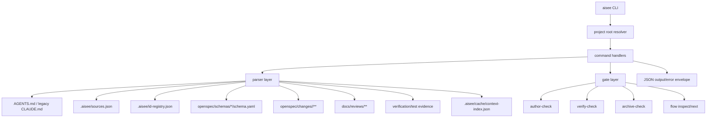

# feat: 完整设计 Aisee CLI

## Summary

本计划把 Aisee CLI 收口为 Aisee、OpenSpec、Compound Engineering 之间的上下文总线：它解析项目规则、Aisee sources、ID registry、OpenSpec schema/change artifacts、source-map、review/test/verification 记录，并以稳定 JSON 输出给 skill 和工程执行阶段消费。

CLI 不生成业务规范、不替代 OpenSpec 状态机、不创建第二份事实源。它负责查询、检查、索引、初始化编排和阶段门禁，让后续 `aisee:flow`、`aisee:change-author`、`aisee:implementation-bridge`、`aisee:verify`、`aisee:archive-guard` 能拿到一致的机器上下文。

## Problem Frame

当前 `src/aisee_cli/__main__.py` 已有 CLI 骨架，并实现了 `id`、`trace`、`change inspect`、`change author-check`、`gaps`、`context pack` 的基础链路。但 `doctor`、`bootstrap`、`sources`、`index`、`flow` 仍是 planned scaffold，`get <id>` 尚不存在，verify/archive 前的门禁仍主要由 skill 文本承担。

这会带来三个问题：

- skill 需要重复读文档并自行推断阶段，容易产生事实漂移。
- `ce-work` 能否准确执行，依赖 context pack 是否足够完整，但当前缺少 sources/index/get 支撑。
- schema 已覆盖 app 与 device，但 CLI 解析仍需要进一步 schema-aware，不能把 app artifacts 硬编码到所有场景。

## Scope Boundaries

In scope:

- 完整设计 CLI 命令面、JSON 契约、模块边界、数据流、测试策略和分阶段实现顺序。
- 覆盖 app/software 主线，并预留 device/hardware/embedded schema-aware 扩展。
- 保留已实现命令的兼容性，并定义新增命令如何复用现有 `context_pack`、`id_registry`、`author_check` 能力。
- 明确哪些能力是 V1 必须落地，哪些是后续增强。

Out of scope:

- 本计划不直接实现 CLI 代码。
- 不让 CLI 自动生成 SRS、UI content、architecture、OpenSpec specs 或 tasks。
- 不让 CLI 自动执行 `openspec archive`、提交代码、创建 PR 或替代 CE skills。
- 不引入数据库、后台服务或图数据库；`.aisee/cache/context-index.json` 仍是可删除缓存。

## Requirements

### Fact Sources

- R1. CLI 必须把 Markdown、OpenSpec artifacts、`.aisee/id-registry.json`、`.aisee/sources.json`、`source-map.md` 作为事实源；`.aisee/cache/context-index.json` 只能是可重建缓存。
- R2. CLI JSON 输出必须区分 `facts.parsed`、`facts.derived` 和 `generated`；默认不得生成 AI 摘要。
- R3. CLI 必须优先读取 `AGENTS.md`，`CLAUDE.md` 只能作为 legacy fallback 暴露。
- R4. CLI 必须 schema-aware：artifact 列表、DAG、apply/verify/archive 约束来自当前 change schema，不硬编码 app 或 device 模板。

### Query and Traceability

- R5. CLI 必须支持 `aisee sources` 管理和检查 change 外部产物来源。
- R6. CLI 必须支持 `aisee index --json` 生成可删除缓存，并能发现断链、重复 ID、无效路径和 parser 置信度问题。
- R7. CLI 必须支持 `aisee get <id> --json`，返回 ID 的 registry entry、原文位置、所属文档、相关 change、上下游 ID、代码路径和测试路径。
- R8. CLI 必须保持 `aisee trace <id> --json`，并在后续实现中复用 index/get 的定位结果，避免全仓自由猜测关系。

### Change Workflow

- R9. CLI 必须保持 `aisee change inspect <change> --json` 和 `aisee change author-check <change> --json`，作为 change authoring 前后的机器检查入口。
- R10. CLI 必须保持 `aisee context pack --change <change> --for <target> --json` 以当前 change 为唯一入口，支持 `ce-work`、`aisee-verify`、`ce-doc-review`、`ce-code-review`。
- R11. CLI 必须新增 verify/archive 机器门禁，让 `aisee:verify` 与 `aisee:archive-guard` 读取已有事实和 evidence，而不是各自重新推断。
- R12. CLI 必须支持 `aisee flow` 查询 workflow stage、blocking items、recommended gates 和 guardrails，但不负责拆 change 或生成 artifacts。

### Setup and Operations

- R13. CLI 必须支持 `aisee doctor --json`，只检查项目结构、OpenSpec、schema pack、sources、ID registry、AGENTS、基础命令可用性，不修改文件。
- R14. CLI 必须支持 `aisee bootstrap --plan --json`，输出初始化计划；任何 `--apply` 能力必须有显式确认边界并保持幂等。
- R15. CLI 必须支持 schema pack 的检查和安装编排，唯一模板源仍是 `skills/aisee-schema-pack/assets/schema-pack/`。
- R16. CLI 必须提供稳定错误 envelope、退出码约定和 `--fail-on-blocker` 选项，方便 CI、hooks 和 skill 使用。

### Compatibility and Tests

- R17. 已有命令与测试行为不能回退：`id reserve/activate/deprecate/check`、`trace`、`gaps`、`change inspect`、`author-check`、`context pack` 仍需通过。
- R18. 每个新增命令必须有最小 pytest 覆盖，包括 tmp project、缺文件、无效 JSON、schema-aware app/device 两类样例。
- R19. CLI 文档和 skill 引用必须同步到 `AGENTS.md` 优先、OpenSpec 为事实源、CE plan 只按需细化并回写 `tasks.md/source-map.md` 的边界。

## Key Technical Decisions

- KTD1. 统一 CLI 输出 envelope：检查类命令返回 `status`、`summary`、`issues`、`meta`，查询类命令返回 `status`、`data/facts/relations`、`issues`、`meta`。这样 skill 不需要为每个命令定制错误解析。
- KTD2. 默认直接解析事实源，index 只做缓存：`context pack`、`get`、`trace` 可以使用 cache 加速，但必须能在 cache 缺失时直接从 Markdown/OpenSpec/registry/sources 解析。
- KTD3. 用 schema artifact DAG 驱动 change 解析：`schema.yaml` 是 artifacts、requires、apply/archive tracks 的入口，CLI 不把 `ui-contract.md`、`hardware-contract.md` 等当成固定全局字段。
- KTD4. `aisee get` 和 `aisee trace` 共用 lookup 层：`get` 聚焦单个 ID 的事实摘录，`trace` 聚焦上下游关系，避免两套扫描规则漂移。
- KTD5. verify/archive 分成两个 gate：`change verify-check` 判断实现后证据和一致性，`change archive-check` 判断是否具备 `openspec archive` 条件；二者都不执行 archive。
- KTD6. `doctor/bootstrap/schema` 属于 setup/admin 面，不进入每个 change 的主流程；`flow` 只读这些结果并推荐下一步。
- KTD7. device/hardware 支持通过 ID 类型、schema artifacts 和 parser adapters 扩展，不为硬件另起一套独立 CLI。
- KTD8. 检查命令默认 exit 0 并在 JSON 中表达 `blocked/risk/ok`；命令参数、文件损坏、解析失败等不可恢复错误 exit 2；CI 场景用 `--fail-on-blocker` 返回非 0。

## High-Level Technical Design

### Module Layout

- `src/aisee_cli/__main__.py`: argparse entrypoint，只做参数解析、root resolve、handler dispatch。
- `src/aisee_cli/output.py`: JSON envelope、summary、issue、exit code、`--fail-on-blocker` 规则。
- `src/aisee_cli/project.py`: project root、AGENTS/CLAUDE、OpenSpec config、schema path 解析。
- `src/aisee_cli/sources.py`: `.aisee/sources.json` 读写、校验、路径存在性、template/parser 约束。
- `src/aisee_cli/index.py`: cache builder、source scanner、heading/line/hash locator、断链检查。
- `src/aisee_cli/lookup.py`: `get`、`trace` 共用的 ID 定位与关系提取。
- `src/aisee_cli/change.py`: `inspect`、artifact DAG、schema-aware artifact summary。
- `src/aisee_cli/context_pack.py`: 保留现有 context pack 契约，逐步改为复用 project/sources/index/lookup。
- `src/aisee_cli/author_check.py`: 保留现有 authoring preflight，逐步复用 change/context helpers。
- `src/aisee_cli/change_checks.py`: `verify-check`、`archive-check` 的 gate 规则。
- `src/aisee_cli/doctor.py`: 只读环境和项目健康检查。
- `src/aisee_cli/bootstrap.py`: 初始化 plan/apply 编排，不直接隐藏高影响修改。
- `src/aisee_cli/schema_pack.py`: schema pack list/check/install wrapper，复用 `skills/aisee-schema-pack/scripts/setup-schemas.js` 的事实源。
- `src/aisee_cli/flow.py`: workflow stage 推导、blocking/recommended gates。

### Command Surface

| 命令 | 定位 | 写入文件 | V1 |
| --- | --- | --- | --- |
| `aisee doctor --json` | 项目和工具健康检查 | 否 | 是 |
| `aisee bootstrap --plan --json` | 初始化计划 | 否 | 是 |
| `aisee bootstrap --apply` | 幂等初始化执行 | 是 | 后续 |
| `aisee sources list/check/add/remove --json` | 上游来源登记 | add/remove 写 `.aisee/sources.json` | 是 |
| `aisee index --json` | 建立可重建缓存 | `.aisee/cache/context-index.json` | 是 |
| `aisee get <id> --json` | ID 精准查询 | 否 | 是 |
| `aisee trace <id> --json` | ID 关系追踪 | 否 | 已有，增强 |
| `aisee id next/reserve/activate/deprecate/check --json` | ID 生命周期 | registry 写命令会写入 | 已有，增强 |
| `aisee change inspect <change> --json` | change 事实解析 | 否 | 已有，增强 |
| `aisee change author-check <change> --json` | authoring 门禁 | 否 | 已有，增强 |
| `aisee change verify-check <change> --json` | 实现后验证门禁 | 否 | 是 |
| `aisee change archive-check <change> --json` | archive 前门禁 | 否 | 是 |
| `aisee context pack --change <change> --for <target> --json` | skill/CE 最小上下文 | 否 | 已有，增强 |
| `aisee gaps --change <change> --json` | 断链和缺口摘要 | 否 | 已有，增强 |
| `aisee flow inspect/next --json` | workflow 状态和下一步 | 否 | 是 |
| `aisee schemas list/check/install --json` | schema pack 编排 | install 写 `openspec/schemas/` | 是 |

## Implementation Units

- U1. CLI output 与 project helpers
  - Files: `src/aisee_cli/__main__.py`, `src/aisee_cli/output.py`, `src/aisee_cli/project.py`, `tests/test_cli_output.py`
  - Work: 抽出统一 JSON envelope、issue summary、exit code、root resolve、AGENTS 优先规则。
  - Done when: 现有命令输出结构兼容，新增 helper 有单测，错误场景仍返回机器可解析 JSON。

- U2. Sources registry
  - Files: `src/aisee_cli/sources.py`, `src/aisee_cli/__main__.py`, `tests/test_sources.py`, `references/context-pack-contract.md`
  - Work: 实现 `sources list/check/add/remove`，支持 versioned `.aisee/sources.json`，检查路径、scope、type、template、parser。
  - Done when: 缺 sources、无效 JSON、路径不存在、重复 source、合法 app/device source 均有测试。

- U3. Context index cache
  - Files: `src/aisee_cli/index.py`, `src/aisee_cli/__main__.py`, `tests/test_index.py`
  - Work: 实现 `aisee index --json`，扫描 registry/sources/OpenSpec changes/specs/reviews/evidence，输出 `.aisee/cache/context-index.json`。
  - Done when: cache 可删除重建，输出含 source hash/line/heading/ID occurrences，且不会被 context pack 当成事实源。

- U4. ID lookup and get
  - Files: `src/aisee_cli/lookup.py`, `src/aisee_cli/id_registry.py`, `src/aisee_cli/__main__.py`, `tests/test_lookup.py`, `tests/test_id_registry.py`
  - Work: 实现 `aisee get <id> --json`，增强 `trace` 使用 lookup 定位、line range、owner、relations。
  - Done when: registered/unregistered/reserved/deprecated ID、change 内 ID、docs source ID 都能返回稳定结构。

- U5. Schema-aware change parsing
  - Files: `src/aisee_cli/change.py`, `src/aisee_cli/context_pack.py`, `src/aisee_cli/author_check.py`, `tests/test_change_inspect.py`, `tests/test_context_pack.py`
  - Work: 把 schema、artifact DAG、artifact parsing 从 `context_pack.py` 中拆出，支持 app/device/docsite/quick-fix 等 schema。
  - Done when: `change inspect` 对 app 与 device fixture 都不丢 artifact，未知 artifact 不报错而以 schema metadata 暴露。

- U6. Gate checks for author/verify/archive
  - Files: `src/aisee_cli/change_checks.py`, `src/aisee_cli/author_check.py`, `src/aisee_cli/context_pack.py`, `tests/test_change_checks.py`
  - Work: 保持 `author-check`，新增 `verify-check` 与 `archive-check`。verify 检查 validate/review/test/verification evidence；archive 检查 tasks 完成、P0/P1 处理、validate 通过、无 blocker gap。
  - Done when: `aisee:verify` 和 `aisee:archive-guard` 可只读 CLI JSON 给出结论，不需要重新扫描全仓。

- U7. Context pack v1.1
  - Files: `src/aisee_cli/context_pack.py`, `references/context-pack-contract.md`, `tests/test_context_pack.py`
  - Work: 让 context pack 复用 sources/index/lookup/change helpers，补齐 `ce-doc-review`、`ce-code-review` target 差异和 evidence 字段。
  - Done when: `ce-work` pack 仍只输出当前 change allowed paths；`aisee-verify` pack 有 review/test/evidence/check groups；默认 `generated` 为 null。

- U8. Doctor, bootstrap, schema pack
  - Files: `src/aisee_cli/doctor.py`, `src/aisee_cli/bootstrap.py`, `src/aisee_cli/schema_pack.py`, `src/aisee_cli/__main__.py`, `tests/test_doctor_bootstrap_schema.py`
  - Work: 实现只读 doctor、bootstrap plan、schema list/check/install 编排。`install` 复用 schema pack 唯一模板源。
  - Done when: 新项目、缺 OpenSpec、缺 AGENTS、缺 schema、已安装 schema 四类场景都有 JSON 检查结果。

- U9. Flow state
  - Files: `src/aisee_cli/flow.py`, `src/aisee_cli/__main__.py`, `tests/test_flow.py`, `skills/aisee-flow/SKILL.md`
  - Work: 实现 `flow inspect` 和 `flow next`，基于 doctor/sources/index/change checks 推导 stage、blocking、recommended gates。
  - Done when: `uninitialized`、`context-ready`、`change-authored`、`implementation-ready`、`archive-ready` 至少有 fixture 覆盖。

- U10. Documentation and skill alignment
  - Files: `docs/architecture/aisee-cli-context-and-id-registry.md`, `docs/architecture/aisee-openspec-compound-integration.md`, `references/context-pack-contract.md`, `references/id-policy.md`, `skills/aisee-flow/SKILL.md`, `skills/aisee-implementation-bridge/SKILL.md`, `skills/aisee-verify/SKILL.md`, `skills/aisee-archive-guard/SKILL.md`
  - Work: 同步最终命令面、JSON 契约、verify/archive gate、AGENTS 优先、schema-aware、facts/cache 边界。
  - Done when: docs/skills 不再引用 planned scaffold 命令作为已实现能力，也不把 cache 或 CE plan 写成事实源。

## Acceptance Examples

- AE1. App change implementation handoff
  - Given `openspec/changes/add-auth` 使用 `aisee-app-spec-driven`
  - When 运行 `aisee context pack --change add-auth --for ce-work --json`
  - Then JSON 只包含当前 change 的 read order、scope、traceability、tasks、allowed code/test paths、guardrails，不复制完整 SRS/UI/architecture。

- AE2. Device change inspect
  - Given `openspec/changes/add-sampling` 使用 `aisee-device-spec-driven`
  - When 运行 `aisee change inspect add-sampling --json`
  - Then artifacts 来自 schema，包括 hardware/firmware/runtime/verification contracts；不要求存在 app 的 `ui-contract.md`。

- AE3. ID lookup
  - Given `.aisee/id-registry.json` 中有 `auth:FR-001`，并且 source-map、spec、tasks 引用了该 ID
  - When 运行 `aisee get auth:FR-001 --json`
  - Then 返回 registry entry、owner document、line/heading、related changes、produced specs/tasks、code/test paths 和 issues。

- AE4. Archive guard
  - Given change 的 tasks 未全部完成或 P1 code review finding 未处理
  - When 运行 `aisee change archive-check <change> --json --fail-on-blocker`
  - Then JSON `status` 为 `blocked`，包含 blocker issues，命令返回非 0，不执行 `openspec archive`。

## Test Strategy

- Unit tests:
  - `tests/test_sources.py`: sources registry 读写和校验。
  - `tests/test_index.py`: cache 构建、ID occurrence、line/heading/hash。
  - `tests/test_lookup.py`: `get` 与 `trace` 共用 lookup。
  - `tests/test_change_inspect.py`: app/device schema-aware artifact parsing。
  - `tests/test_change_checks.py`: author/verify/archive gate。
  - `tests/test_doctor_bootstrap_schema.py`: doctor/bootstrap/schema pack。
  - `tests/test_flow.py`: workflow stage 推导。

- Regression tests:
  - `tests/test_context_pack.py`: 保持 `ce-work`、`aisee-verify` context pack 当前行为，并补 target 差异。
  - `tests/test_id_registry.py`: 保持 ID reserve/activate/deprecate/check/trace 当前行为。

- CLI integration tests:
  - 使用 tmp project 和 `subprocess.run([sys.executable, "-m", "aisee_cli.__main__", ...])`，沿用现有测试模式。
  - 每个写命令测试实际文件变化；每个只读命令测试不会写入除 cache 外的文件。
  - 对 `--fail-on-blocker` 单独测试退出码。

## Risks & Dependencies

- Parser 复杂度风险：Markdown 模板必须保持结构化，CLI 不能自由理解任意文档。缓解方式是 template-aware parser、固定 heading、frontmatter、ID marker 和 source-map 约定。
- 命令面膨胀风险：新增命令必须复用 shared parser/lookup/gate 层，避免 `__main__.py` 继续堆业务逻辑。
- schema 漂移风险：schema pack 模板源只保留 `skills/aisee-schema-pack/assets/schema-pack/`，CLI 安装到 `openspec/schemas/` 时要能检查版本和模板缺失。
- device 支持风险：硬件/嵌入式证据类型更多，V1 先保证 schema-aware 和 ID 类型不阻塞，深度 HIL/生产测试解析可后续扩展。
- CE 边界风险：`ce-plan` 只能作为按需细化器，CLI 不应把 CE plan 文档纳入长期事实源；结论必须回写 `tasks.md` 或 `source-map.md`。

## Sources / Research

- `src/aisee_cli/__main__.py`: 当前 CLI 命令面和 planned scaffold。
- `src/aisee_cli/context_pack.py`: 当前 context pack、schema/artifact/gaps/read_order 解析基础。
- `src/aisee_cli/id_registry.py`: 当前 ID lifecycle、check、trace 实现。
- `src/aisee_cli/author_check.py`: 当前 change authoring preflight。
- `tests/test_context_pack.py`: 当前 context pack 和 CLI subprocess 测试模式。
- `tests/test_id_registry.py`: 当前 ID 命令回归测试模式。
- `references/context-pack-contract.md`: context pack 字段级契约和事实源边界。
- `docs/architecture/aisee-cli-context-and-id-registry.md`: CLI 上下文索引、ID registry、workflow 设计基础。
- `docs/architecture/aisee-openspec-compound-integration.md`: Aisee/OpenSpec/CE 分层与 CLI 作为上下文总线的边界。
- `skills/aisee-schema-pack/assets/schema-pack/`: schema pack 唯一模板源。
