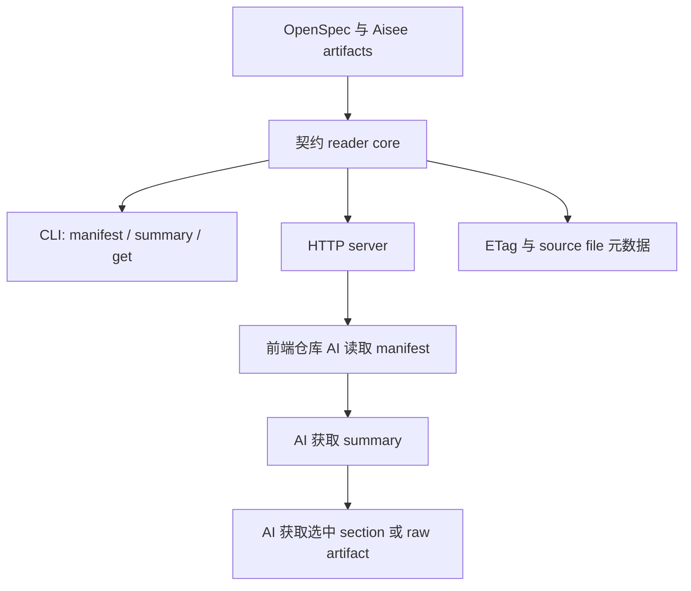
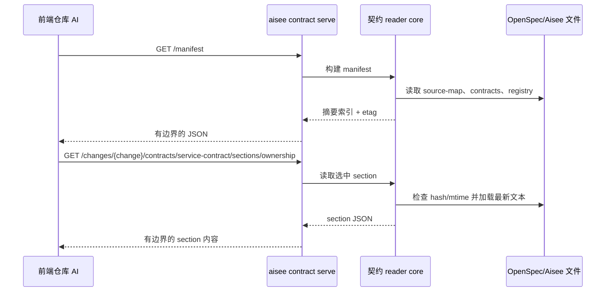

# feat: 新增契约上下文服务

## 摘要

为前后端跨仓库协作新增一层轻量的 Aisee 契约上下文能力。本轮计划先强化契约类 artifact 模板，再增加只读 CLI 读取能力，最后把同一套读取能力包装为支持热加载的 HTTP 服务，并采用 manifest 优先、按 section 分块获取的上下文策略。

---

## 问题背景

Aisee 当前已经覆盖需求澄清、UI 内容规格、架构上下文、OpenSpec change 编写、实现交接、验证和归档守卫。下一阶段的协作缺口主要出现在前端和后端分离为两个仓库时：前端仓库中的 AI 需要可靠发现和读取后端的权威接口契约，但不应该把完整接口文档复制进自己的上下文。

这个服务不能变成 mock server、API gateway 或第二套事实源。它只应该从 OpenSpec/Aisee artifacts 中派生只读契约上下文，让另一个仓库的 AI 能够逐步获取最小且有用的内容切片。

---

## 需求

**契约归属与同步**

- R1. App schema 模板必须记录权威契约来源、提供方仓库、消费方仓库、同步模式、冲突规则，以及可选的机器可读契约路径。
- R2. `source-map.md` 继续作为路由和可追踪性中心；契约同步元数据必须能从其中解析出来，不能只隐藏在自然语言描述中。
- R3. `service-contract.md` 必须区分面向人的契约说明和可选机器可读 artifacts，例如 OpenAPI、事件契约、Webhook 规格或 proto 文件。
- R4. `ui-contract.md` 继续描述前端数据需求，但不能成为 API 事实源。
- R5. 当前后端分仓适用时，`tasks.md` 必须能表达提供方实现、消费方接入、生成 SDK/mock/client 使用情况，以及契约测试证据。

**契约读取 CLI**

- R6. `aisee contract manifest --json` 必须返回有边界的项目/change/contract 索引，适合作为另一个仓库 AI 的第一跳读取内容。
- R7. `aisee contract summary --change <change> --json` 必须返回契约摘要和 section 索引，不能直接输出原始完整 artifact。
- R8. `aisee contract get --change <change> --artifact <artifact> --section <section> --json` 必须返回单个有边界的 section，并包含 `etag`、`source_files` 和截断元数据。
- R9. 原始 artifact 访问必须通过显式 flag 或 endpoint 触发，确保默认读取保持小上下文。

**HTTP 服务**

- R10. `aisee contract serve` 必须通过只读 HTTP endpoint 暴露契约读取能力，默认监听 `127.0.0.1`。
- R11. 局域网暴露必须显式使用 `--host 0.0.0.0`，并清晰提示本地契约 artifacts 正在被暴露。
- R12. 响应必须基于当前文件的 mtime/content hash 热加载，不能依赖长期驻留的旧文档副本。
- R13. 所有列表和详情响应都必须支持有边界的上下文读取，包括 `max_chars`、summary-first 输出和 section 级下钻。

**验证与打包**

- R14. 当 `service-contract.md` 为必需 artifact 但缺少 owner/provider/consumer/sync 元数据时，`aisee change verify-check` 应提示契约同步缺口。
- R15. Package assets 必须保持同步，确保安装后的 wheel 包含更新后的模板和契约服务说明。
- R16. 测试必须覆盖解析器行为、CLI 行为、HTTP endpoint、热加载、最大长度截断和 package asset 同步。

---

## 关键技术决策

- KTD1. **权威契约来源优先：** 后端仓库、独立契约仓库或前端拥有的 BFF 都可以成为显式契约 owner。前端 UI 数据需求是契约输入之一，但默认不是接口事实源。
- KTD2. **先 reader core，后 server：** 先实现 `aisee contract manifest/summary/get`，再让 HTTP 服务成为同一套 reader 函数的薄包装，避免 CLI 和 server 重复解析逻辑。
- KTD3. **优先使用 Python 标准库 HTTP：** 本地契约服务 endpoint 较少、只读、以 JSON 为主，本轮不引入 Web 框架依赖。
- KTD4. **v1 采用惰性热加载，不引入 watcher：** 每次请求时检查源文件 mtime/hash 并按需重建轻量索引，比引入文件 watcher 更简单、更可移植。
- KTD5. **section 优先控制上下文预算：** 默认响应只返回 manifest、摘要、section 索引和选中的 section。原始 Markdown/YAML 只能通过显式 raw 读取。
- KTD6. **schema 仍以 app artifacts 为边界：** 本轮不为每种机器可读格式增加重量级顶层 schema artifact。`contracts/openapi.yaml`、`contracts/events.yaml`、`contracts/webhooks.yaml` 和 `contracts/proto/*.proto` 作为 `source-map.md` 与 `service-contract.md` 中的附加契约路径跟踪。

---

## 高层技术设计

---

## 范围边界

本轮包含：

- 强化 app schema 模板，显式表达契约归属、provider/consumer 角色、同步模式和机器可读契约跟踪。
- 增加契约 reader CLI 命令和 JSON 输出契约。
- 增加只读 HTTP 包装层，支持惰性热加载、有边界响应和 manifest-first 发现。
- 增加必要的 parser 和 verify 检查，用于发现契约同步缺口。
- 保持 package assets 同步，确保 wheel 安装后可用。

后续再做：

- 基于 OpenAPI 的完整 mock server 生成。
- 生成 SDK/client 的生命周期管理。
- 超出保守默认值之外的认证能力；如果实现成本很小，可考虑可选 local token。
- 契约摘要的持久化缓存文件。
- 交付文档生成，例如部署指南、用户手册、API reference、数据字典、验收报告和测试报告。
- `--watch` 等文件 watcher 模式；v1 使用惰性热加载。

明确不做：

- 把权威 API 归属移动到前端页面文档。
- 在 OpenSpec/Aisee artifacts 之外创建第二套契约事实源。
- 暴露源码、环境文件、密钥或完整仓库搜索结果。

---

## 实施单元

### U1. 强化契约类 artifact 模板

- **目标：** 让前后端分仓协作在 app schema artifacts 中显式可见。
- **覆盖需求：** R1、R2、R3、R4、R5、R15。
- **依赖：** 无。
- **文件：**
  - `skills/aisee-schema-pack/assets/schema-pack/aisee-app-spec-driven/schema.yaml`
  - `skills/aisee-schema-pack/assets/schema-pack/aisee-app-spec-driven/templates/source-map.md`
  - `skills/aisee-schema-pack/assets/schema-pack/aisee-app-spec-driven/templates/service-contract.md`
  - `skills/aisee-schema-pack/assets/schema-pack/aisee-app-spec-driven/templates/ui-contract.md`
  - `skills/aisee-schema-pack/assets/schema-pack/aisee-app-spec-driven/templates/tasks.md`
  - `scripts/sync_package_assets.py`
  - `src/aisee_plugin_assets/**`
  - `tests/test_skill_eval_schema.py`
  - `tests/test_plugin_packaging.py`
- **做法：** 在 `source-map.md` 增加可解析的契约归属与同步表，再在 `service-contract.md` 中复用相同的 owner/provider/consumer 语义。`ui-contract.md` 仍聚焦数据需求，并增加后端能力状态列或说明。`tasks.md` 增加可选的 provider/consumer/contract-test 任务示例，但不让每个 change 都变重。
- **遵循模式：** 现有 app schema 的 optional artifact 语言，以及 `scripts/sync_package_assets.py` 中的 package asset 同步流程。
- **测试场景：**
  - 执行同步脚本后，package assets 中包含更新后的 app schema 模板。
  - `tests/test_plugin_packaging.py` 仍能证明安装资产中的 schema pack fallback 可用。
  - `tests/test_skill_eval_schema.py` 在模板调整后仍接受现有 skill eval JSON 文件。
- **验证：** App schema 仍可安装和检查；更新后的 package assets 与源模板内容一致。

### U2. 解析契约归属与同步元数据

- **目标：** 扩展 source-map 解析，让契约归属和同步细节成为结构化 JSON。
- **覆盖需求：** R2、R14、R16。
- **依赖：** U1。
- **文件：**
  - `src/aisee_cli/source_map.py`
  - `src/aisee_cli/context_pack.py`
  - `tests/test_source_map.py`
  - `tests/test_context_pack.py`
- **做法：** 增加 `Contract Ownership / Sync` 表的提取逻辑，同时保持现有表格兼容。支持 `contract_owner`、`canonical_source`、`provider_repo`、`consumer_repo`、`sync_mode`、`conflict_rule`、`machine_readable_contract` 和 `version_ref` 等行。把解析结果暴露到 `facts.parsed.source_map` 以及派生契约检查中。
- **遵循模式：** `src/aisee_cli/source_map.py` 中已有的 `extract_artifact_applicability`、`extract_implementation_paths` 和 normalization helpers。
- **测试场景：**
  - 带 ownership 表的结构化 source-map 可以返回 owner/provider/consumer/sync 行。
  - 不含 ownership 表的旧 source-map 仍能解析，且不阻塞。
  - Context pack 暴露解析后的契约同步元数据，不意外破坏现有 `ce-work` 输出形状。
- **验证：** 现有 source-map 测试通过，新增契约同步测试证明解析向后兼容。

### U3. 增加契约 reader core 和 CLI 命令

- **目标：** 提供非 HTTP 的 manifest-first 与 section 级契约读取能力。
- **覆盖需求：** R6、R7、R8、R9、R12、R13、R16。
- **依赖：** U2。
- **文件：**
  - `src/aisee_cli/contract.py`
  - `src/aisee_cli/__main__.py`
  - `src/aisee_cli/output.py`
  - `tests/test_contract_context.py`
  - `tests/test_cli_errors.py`
- **做法：** 新增 reader 模块，用于发现 active changes、读取 change artifacts、根据源文件内容计算 `etag`，并按标准化 heading 提取 Markdown sections。增加 `manifest`、`summary` 和 `get` CLI 子命令。按需支持 `--change`、`--artifact`、`--section`、`--max-chars`、`--raw` 和 `--json`。
- **遵循模式：** `build_context_pack` 的 project/change 发现逻辑、`src/aisee_cli/source_map.py` 中类似 `parse_sections` 的 helper，以及 `src/aisee_cli/__main__.py` 中现有 JSON 错误处理。
- **测试场景：**
  - Manifest 能从包含 `service-contract.md` 的 fixture 中列出 active changes 和 contract endpoints。
  - Summary 返回 section 索引和有边界摘要，不返回原始完整 artifact。
  - Get 返回选中的 ownership 或 capability section，并带上 source file metadata 和 etag。
  - `--max-chars` 能截断内容并报告截断元数据。
  - change 不存在、artifact 不存在、section 不存在时返回稳定 issue code 的 JSON 错误。
- **验证：** CLI 命令输出确定性 JSON，且不需要启动 HTTP server。

### U4. 增加只读 HTTP 契约服务

- **目标：** 通过可局域网暴露但默认保守的本地服务，把契约 reader 提供给另一个仓库中的 AI。
- **覆盖需求：** R10、R11、R12、R13、R16。
- **依赖：** U3。
- **文件：**
  - `src/aisee_cli/contract_server.py`
  - `src/aisee_cli/__main__.py`
  - `tests/test_contract_server.py`
  - `tests/test_cli_errors.py`
- **做法：** 实现 `aisee contract serve --host 127.0.0.1 --port <port>`，endpoint 只读并复用 contract reader。默认 host 保持本机访问。如果 host 是 `0.0.0.0`，在启动输出或 server metadata 中包含警告。路由保持小而明确。
- **Endpoint 形状：**
  - `GET /health`
  - `GET /manifest`
  - `GET /changes`
  - `GET /changes/{change}/summary`
  - `GET /changes/{change}/contracts`
  - `GET /changes/{change}/contracts/{artifact}`
  - `GET /changes/{change}/contracts/{artifact}/sections`
  - `GET /changes/{change}/contracts/{artifact}/sections/{section}`
  - `GET /changes/{change}/artifacts/{artifact}/raw`
  - `GET /ids/{id}`
  - `GET /trace/{id}`
- **遵循模式：** 现有 `print_json` 输出形状，以及 `src/aisee_cli/lookup.py` 中的 lookup helpers。
- **测试场景：**
  - Server 使用临时端口返回 health 和 manifest。
  - Summary endpoint 在不重启 server 的情况下反映文件变化。
  - Section endpoint 支持 `max_chars`。
  - Raw endpoint 必须通过显式 raw 路径访问，且默认 summary 内容中不会出现完整 raw。
  - 未知 endpoint 返回带稳定 issue code 的 JSON 404。
- **验证：** HTTP 测试只在本机运行，不打开真实局域网监听；不引入新运行时依赖。

### U5. 增加契约验证检查

- **目标：** 让 verify/archive 守卫能够识别前后端契约同步缺口。
- **覆盖需求：** R14、R16。
- **依赖：** U2、U3。
- **文件：**
  - `src/aisee_cli/change_checks.py`
  - `src/aisee_cli/context_pack.py`
  - `tests/test_change_checks.py`
  - `tests/test_context_pack.py`
- **做法：** 当 `service-contract.md` 为 Required=yes 时，扩展派生契约检查，读取解析后的 ownership/sync 元数据。缺少 owner/canonical source/provider/sync mode 时，在 verify 阶段作为风险提示。归属矛盾或格式错误导致无法实现交接时，作为 blocker。Required=no 行为保持不变。
- **遵循模式：** `na_artifact_issues`、`summarize_contract_checks`，以及 `src/aisee_cli/change_checks.py` 中现有 blocker/risk 分层。
- **测试场景：**
  - 必需 service contract 缺少 ownership 元数据时产生 verify warning。
  - 必需 service contract 包含 canonical source/provider/consumer/sync mode 时通过契约同步检查。
  - Required=no 的 service contract 不产生 ownership warning。
  - 表格值格式错误时输出 parse 或 verify issue，不崩溃。
- **验证：** `aisee change verify-check <change> --json` 能给出可执行的契约同步发现。

### U6. 更新文档和 package assets

- **目标：** 记录新的契约服务工作流，并保持安装资源可用。
- **覆盖需求：** R11、R13、R15。
- **依赖：** U1、U3、U4。
- **文件：**
  - `README.md`
  - `README.en.md`
  - `docs/architecture/aisee-cli-context-and-id-registry.md`
  - `docs/architecture/aisee-openspec-compound-integration.md`
  - `src/aisee_plugin_assets/**`
  - `tests/test_plugin_packaging.py`
- **做法：** 增加 `aisee contract manifest`、`aisee contract get` 和 `aisee contract serve` 的简洁用例。明确服务边界：只读、manifest-first、默认 localhost、显式局域网暴露、不是 mock server、不暴露源码。模板和文档调整后执行 package asset sync。
- **遵循模式：** 现有 README CLI reference 和 package asset packaging tests。
- **测试场景：**
  - 同步后 package assets 包含更新后的模板和文档。
  - Wheel build 仍包含 markdown templates、JavaScript hooks 等 package data。
  - README 示例只引用已经实现的命令。
- **验证：** Package build 和隔离安装后，仍可安装 schema 并导出 plugin。

---

## 系统影响

- App schema 会更明确地支持跨仓库契约，但应继续兼容缺少 ownership metadata 的既有 changes。
- Context pack 和 verify 输出会增加新的结构化 contract 字段；下游消费者应能容忍新增字段。
- HTTP 服务会引入一个本地网络面。由于 OpenSpec artifacts 可能包含私有业务细节，默认值和文档必须保守。
- 模板变更后必须同步 package assets，否则安装用户会看到旧行为。

---

## 风险与依赖

- **上下文膨胀风险：** 原始 artifacts 可能很大。Reader 和 server 必须默认输出摘要，并要求显式 raw 访问。
- **安全与隐私风险：** 局域网服务可能暴露本地契约文档。默认监听 localhost，并在 `0.0.0.0` 时警告。
- **解析脆弱性：** Markdown 表格格式可能变化。新的 ownership parser 应宽容且向后兼容。
- **打包资产陈旧：** 模板变更必须同步到 `src/aisee_plugin_assets`；测试应能捕获 package data 缺失。
- **范围膨胀：** Mock server、SDK 生成、交付文档和 watcher mode 都有价值，但不属于本轮。

---

## 文档与运维说明

- 同步更新中英文 README 示例。
- 明确 `aisee contract serve` 不是 mock backend，也不替代 OpenAPI。
- 记录推荐跨仓库流程：后端仓库或契约仓库启动 contract server；前端仓库 AI 先读 `/manifest`，再获取 summary 和选定 sections。
- 保持当前 OpenSpec 边界：权威契约 artifacts 仍在 OpenSpec/Aisee 文件中，不在 HTTP 服务内存中。

---

## 来源与依据

- `skills/aisee-schema-pack/assets/schema-pack/aisee-app-spec-driven/schema.yaml` 已定义可选的 `ui-contract.md`、`service-contract.md` 和 `data-model.md`。
- `skills/aisee-schema-pack/assets/schema-pack/aisee-app-spec-driven/templates/source-map.md` 适合承载可解析的契约归属和同步路由。
- `src/aisee_cli/source_map.py` 已支持结构化 Markdown 表格解析，可扩展契约归属解析。
- `src/aisee_cli/context_pack.py` 已能构建面向目标的 JSON context，并汇总 contract artifacts。
- `src/aisee_cli/change_checks.py` 已区分 verify/archive 的 blockers 与 risks。
- `src/aisee_cli/__main__.py` 使用 argparse 子命令和稳定 JSON 错误输出。
- `tests/test_source_map.py`、`tests/test_context_pack.py` 和 `tests/test_change_checks.py` 可作为 parser、context 和 gate 测试模式参考。
