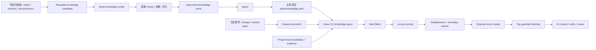
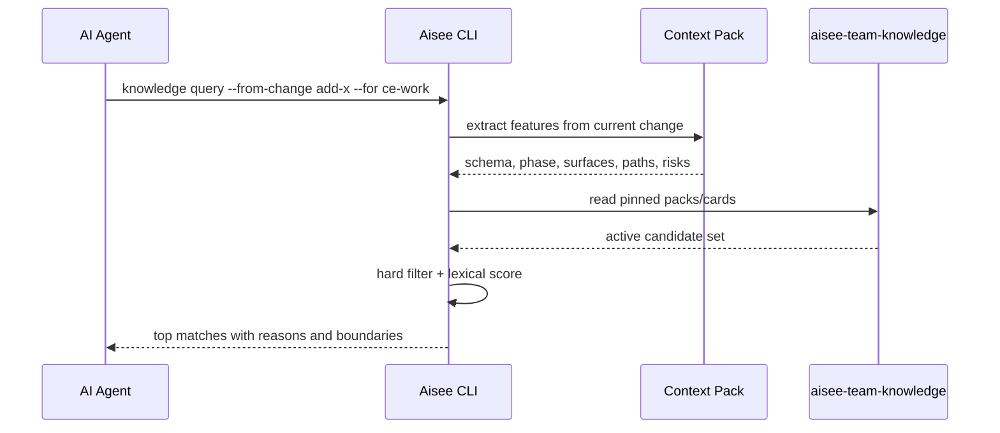

# feat: 设计团队知识守卫检索

## 摘要

本计划为 Aisee 增加一套团队级知识复用方案：通过独立 `aisee-team-knowledge` 仓库维护经审查的 knowledge cards 和 packs，再由 Aisee CLI 基于当前项目、schema、phase、surface、路径和风险信号做特征召回，向 AI 返回少量 action-oriented guardrails。

第一阶段只落协议、文档、`aisee:reflect` candidate 对齐和 `aisee:knowledge-curate` 人工审查工作流；第二阶段增加本地 CLI 检索、项目内候选知识与 team knowledge 去重；第三阶段才考虑 context pack 注入、可重建索引、向量 rerank 或 MCP。该能力不替代 OpenSpec、不复制 `docs/solutions/`，也不把共享知识变成新的规范事实源。

---

## 问题背景

当前 Aisee 已经能沉淀项目内 `aisee/docs/reflect/`、`aisee/memory/` 和 Compound 生成的 `docs/solutions/`。这些资产能帮助当前项目少犯错，但跨项目复用仍没有明确机制：

- 原始 memory、reflect 和 solutions 太项目化，直接复制到其他项目会污染上下文。
- 新项目可能没有历史 change，因此不能依赖 change name 或 change ID 召回。
- AI 需要的是当前任务相关的少量 guardrails，不是完整知识库问答。
- 向量检索可以提高召回，但如果没有结构化过滤，误召回会让 AI 强行套用不适用经验。

因此需要一个类似简版 Context7 的团队内部知识检索层，但它的目标不是通用问答，而是 **Knowledge Guardrail Retrieval**：根据当前任务特征返回少量已审查、带边界、可解释的行动提醒。

---

## 范围边界

本计划包含：

- 定义独立 `aisee-team-knowledge` 仓库的定位、目录和 review 流程。
- 定义 knowledge card / pack 协议和字段语义。
- 调整 `aisee:reflect` 的 reusable knowledge candidate 输出，使其接近 team knowledge card。
- 设计 Aisee CLI 的最小 `knowledge` 命令族。
- 设计基于特征的召回，不基于 change ID 召回。
- 设计 `aisee:knowledge-curate`，负责把项目内候选经验批量审查、去敏、泛化并准备进入 team knowledge。
- 设计项目内 reflect/solution evidence 与 team knowledge active card 的去重和优先级规则。
- 明确所有 skill 和 AI 上下文注入都通过 Aisee CLI 查询 knowledge，不直接扫描 team knowledge 仓库正文。
- 明确 team knowledge 仓库的 parse contract：CLI 按需读取 pack manifest、card metadata 和少量命中 card，不做无边界全仓库扫描。
- 设计 context pack 中可选的 `knowledge.matches` 输出。
- 定义可重建 lexical index 和可选 vector index 的边界。

本计划不包含：

- 直接实现独立 `aisee-team-knowledge` 仓库。
- 自动 push、自动 merge 或为每张 card 创建独立 PR 分支。
- 第一阶段实现 `aisee knowledge promote-batch` 自动化命令。
- 直接实现 MCP server。
- 直接接入外部向量数据库、托管服务或外部 RAG 后端。
- 把 `docs/solutions/`、`aisee/memory/` 或 reflect 文档整库复制到业务项目。
- 让 knowledge card 覆盖 OpenSpec specs、tasks、contracts 或 source-map。
- 把 knowledge retrieval 做成通用知识问答。

---

## 需求

### 知识事实源

- R1. Team knowledge 的事实源必须是 Git 仓库中的 card / pack 文件，不是向量库、缓存或 AI 生成摘要。
- R2. 业务项目只能 pin team knowledge repo、ref 和 packs，不能默认复制完整知识仓库。
- R3. Knowledge card 可以记录来源 change / solution / reflect / review / test evidence，但不能归属于某个 change。
- R4. Knowledge retrieval 必须是 feature-based，不是 change-id-based；`--from-change` 只表示从当前 change 提取特征。

### Card 与 Pack 协议

- R5. Card 必须包含 `id`、`title`、`status`、`applies_to`、`trigger`、`recommended_action`、`boundaries`、`evidence`。
- R6. Card 必须支持 `status: candidate | active | deprecated`；只有 active card 默认参与业务项目检索。
- R7. Card 必须支持去敏检查，避免泄露 secrets、客户信息、私有 URL、生产凭据或项目私密路径。
- R8. Pack 必须声明包含的 cards、适用项目类型、默认 max matches、禁用项和版本。

### 检索与注入

- R9. 检索必须先做硬过滤：status、pack、schema、phase、surface、stack、risk type。
- R10. 通过硬过滤后，才允许 lexical scoring；vector rerank 只能作为后续可选层。
- R11. 每条召回结果必须包含 `match_reason` 和 `boundaries`，让 AI 知道为什么出现、什么时候不要套用。
- R12. 默认最多注入 3 条 matches；安全、权限、架构类知识宁可少召回，不做宽召回。
- R13. 如果 card boundary 与当前 context 冲突，必须过滤或降权，并在 explain 输出中说明。

### CLI 与 Context Pack

- R14. Aisee CLI 应支持读取项目级 `aisee/knowledge.yaml`，解析 team knowledge repo/ref/packs/retrieval 配置。
- R15. Aisee CLI 应支持 `aisee knowledge query --from-change <change> --for <target> --json`，从 context pack 或 change metadata 提取检索特征。
- R16. Aisee CLI 应支持直接特征查询，用于没有 OpenSpec change 的场景。
- R17. `aisee context pack` 可以可选携带 `knowledge.matches`，但默认输出必须保持小上下文。
- R18. CLI JSON 输出必须标记 knowledge 来源、pack ref、match score、match reason 和是否来自缓存。
- R19. CLI 默认读取顺序必须是 `aisee/knowledge.yaml` -> pack manifest -> card metadata/frontmatter -> 命中 card 摘要；只有 explain/debug 或用户显式请求时才读取完整 card 正文。
- R20. Team knowledge repo 必须提供机器可读入口，避免 CLI 递归扫描 `docs/**`、`reviews/**`、`drafts/**` 或任意 Markdown。

### Reflect 和 Compound 边界

- R21. `aisee:reflect` 生成的 reusable knowledge candidate 应接近 card 协议，但仍是候选，不自动进入 team knowledge。
- R22. `ce-compound` 继续记录具体工程问题 solution；team knowledge card 可以引用 solution 作为 evidence，但不复制 solution 正文。
- R23. `ce-compound-refresh` 继续维护 `docs/solutions/`；team knowledge refresh 是后续独立流程，不混入 Compound refresh。

### Curation、批量提交与去重

- R24. `aisee:knowledge-curate` 负责批量审查项目内候选知识，执行去敏、泛化、去重、边界补全和 evidence 检查；`aisee:reflect` 不直接写入 team knowledge。
- R25. Team knowledge 提交策略默认是周期性 batch PR：积累 3-10 条真实可复用候选后一次审查和提交；只有安全、高风险或阻断类经验才考虑单独 PR。
- R26. 检索输出必须处理项目内候选知识与 team knowledge 的重复：OpenSpec/current change facts 最高优先级，project-local evidence 作为本地上下文，team active card 作为经审查 guardrail。
- R27. 如果 project-local candidate 与 active team card 重叠，默认只注入 team card；如果项目内证据更新或更具体，应在 explain 中提示 stale candidate，而不是重复注入两份知识。
- R28. Skill、context pack target 和 AI 提示必须通过 `aisee knowledge query` 获取知识 matches；不要直接读取或扫描 `knowledge/cards/**/*.md` 作为上下文。

---

## 关键技术决策

- KTD1. **独立仓库承载共享知识：** 使用 `aisee-team-knowledge` 作为团队级知识事实源，业务项目只 pin repo/ref/packs。这样避免把共享经验散落到每个项目，也避免让业务项目承担知识库维护。
- KTD2. **Card 是事实源，索引是缓存：** `knowledge/cards/**/*.md|yaml` 和 `knowledge/packs/*.yaml` 是事实源；`indexes/lexical-index.json` 和 `indexes/vector-index/` 都是可删除、可重建缓存。
- KTD3. **特征召回，不按 change ID 召回：** `--from-change <change>` 只用于提取 schema、phase、surface、paths、risk signals 和 artifact types；不会用 change name 查询历史 change。
- KTD4. **先过滤后检索：** 先用 `applies_to` 和 pack/status 做硬过滤，再对 `title`、`trigger`、`problem`、`recommended_action` 做 lexical scoring；vector rerank 只作用于已过滤候选。
- KTD5. **输出 guardrails，不输出长文：** 检索结果默认只返回 title、reason、recommended_action、boundaries 和 source，不返回完整 card 正文。
- KTD6. **Context pack 注入必须可控：** `aisee context pack` 只在显式配置或 flag 打开时包含 knowledge matches；并且默认最多 top 3。
- KTD7. **MCP 后置：** 第一版先用 CLI + Git 仓库。MCP 可以后续包装 `resolve_pack`、`query_knowledge`、`get_card`、`explain_match`，不改变底层事实源。
- KTD8. **向量库后置且可选：** 向量库只做本地或团队可重建 index，不做事实源；没有 vector 依赖时 lexical search 必须可用。
- KTD9. **Curation 独立成 skill：** `aisee:reflect` 只产出项目内候选；`aisee:knowledge-curate` 才负责把一批候选审查为可进入 team knowledge 的 card draft。
- KTD10. **批量 PR 优先：** 不为每条知识创建独立分支。默认按周、版本或会话阶段积累候选，批量 review 后提交一个 PR，降低维护成本。
- KTD11. **检索由 CLI 收口：** Skill 不直接扫描 team knowledge 仓库；CLI 负责读取配置、解析 packs/cards、抽取项目特征、硬过滤、评分、去重、边界检查、top N 和 explain。
- KTD12. **项目内知识与 team knowledge 分层：** OpenSpec/current change 是规范事实源；project-local reflect/solution 是本地证据；team active card 是复用 guardrail。重复时输出去重说明。
- KTD13. **外部 RAG 后置：** 本计划暂不评估外部知识库项目。后续如果接入，也只能作为 card 索引和 rerank 后端，不能成为事实源。
- KTD14. **按需读取：** CLI 第一阶段只读取 pack manifest 和 card frontmatter/metadata；只有通过 pack/status/applies_to 硬过滤并进入 top candidates 后，才读取 card 摘要或正文片段。
- KTD15. **语义匹配有边界：** semantic matching 只能作用于已过滤候选集，用于 rerank 或补充 match reason；不得绕过 pack、status、phase、surface、stack、risk type 直接全库召回。

---

## 高层技术设计





---

## 推荐 team knowledge 仓库结构

```text
aisee-team-knowledge/
  AGENTS.md
  README.md
  knowledge/
    cards/
      frontend/
      backend/
      cli/
      openspec/
      security/
      testing/
    packs/
      web-app.yaml
      backend-service.yaml
      openspec.yaml
      aisee-plugin.yaml
    deprecated/
  schemas/
    knowledge-card.schema.json
    knowledge-pack.schema.json
  docs/
    authoring-guide.md
    review-policy.md
```

业务项目配置：

```yaml
repo: git@github.com:org/aisee-team-knowledge.git # placeholder; real repo comes from project config
ref: v0.1.0
packs:
  - web-app
  - openspec
retrieval:
  max_cards: 3
  vector: optional
```

---

## 初始 Card 协议草案

```yaml
id: cli-json-output-stability
title: CLI JSON 输出必须保持字段稳定
status: active
applies_to:
  stacks: [python]
  frameworks: []
  phases: [implementation, review, verify]
  schemas: []
  surfaces: [cli, json-output]
  risk_types: [public-contract]
trigger:
  - 新增或修改 public CLI command
  - 修改 JSON 输出字段、错误 envelope 或退出码
recommended_action:
  - 保持新增字段向后兼容
  - 补充 CLI contract test
  - 不要把人类提示文本混入机器 JSON 字段
boundaries:
  - 不适用于仅面向人类的非 JSON 日志输出
evidence:
  - type: solution
    repo: aisee-plugin
    path: docs/solutions/cli/json-output-stability.md
```

---

## 实施单元

### U1. 定义 knowledge card / pack 协议

**目标：** 建立 team knowledge 的文件级事实源协议，先把格式和边界稳定下来。

**覆盖需求：** R1、R2、R3、R5、R6、R7、R8、R19、R20。

**依赖：** 无。

**文件：**

- `references/knowledge-card-contract.md`
- `docs/architecture/aisee-team-knowledge.md`
- `docs/best-practices.md`
- `docs/best-practices.en.md`
- `tests/test_plugin_packaging.py`

**做法：** 新增 knowledge card contract，定义 card、pack、status、applies_to、trigger、boundaries、evidence、sensitive information check 和 index/cache 边界。在 architecture 文档中说明独立仓库定位、目录、review policy 和项目配置文件 `aisee/knowledge.yaml`。

同时定义 repo parse contract：

- CLI 入口只允许是项目 `aisee/knowledge.yaml` 和 team repo `knowledge/packs/*.yaml`。
- Pack 必须显式列出 card ids 或 card glob，CLI 不从任意目录推断有效知识。
- Card 必须提供机器可读 frontmatter；CLI 可只读 frontmatter 完成硬过滤和初筛。
- `docs/**`、`reviews/**`、`drafts/**`、`deprecated/**` 不参与默认检索，除非 pack 显式声明并通过 status 过滤。
- `indexes/**` 是可重建缓存；缺失时 CLI 必须能退回 pack/card 按需读取。

**测试场景：**

- Package assets 仍能包含新增 `references/*.md` 和 `docs/architecture/*.md`。
- README / docs 链接指向存在文件。
- 文档明确 card 是事实源、index/vector 是缓存。
- 文档明确 CLI parse contract、允许目录、禁止默认扫描目录和按需读取顺序。

**验证：** 打包测试通过，文档链接可解析，且没有把 knowledge 说成 OpenSpec baseline 或项目 memory。

### U2. 对齐 `aisee:reflect` reusable candidate 输出

**目标：** 让 reflect 生成的候选卡片能被人工 review 后复制或迁移到 `aisee-team-knowledge`。

**覆盖需求：** R21、R22、R23。

**依赖：** U1。

**文件：**

- `skills/aisee-reflect/SKILL.md`
- `skills/aisee-reflect/references/knowledge-candidates.md`
- `skills/aisee-reflect/references/output-templates.md`
- `src/aisee_plugin_assets/skills/aisee-reflect/**`
- `tests/test_plugin_packaging.py`

**做法：** 将 reflect candidate 模板字段对齐 `knowledge-card-contract.md`，补充 `status: candidate`、`applies_to`、`trigger`、`recommended_action`、`boundaries`、`evidence`、`sensitive_information_check`。保留 reflect 候选区定位，不自动写入 team repo。

**测试场景：**

- 同步 package assets 后，源 skill 和 package skill 都包含新模板字段。
- 简单 reflect 场景仍只需读取 `workflow.md`，不强制读取长模板。
- 具体工程问题场景仍建议 `ce-compound`，不复制 solution 正文。

**验证：** 打包测试通过，reflect 说明中没有把 reusable candidate 提升为 active card。

### U3. 创建 `aisee:knowledge-curate` skill

**目标：** 把项目内候选知识批量审查为可提交到 `aisee-team-knowledge` 的 card draft，但不自动 push、merge 或创建远程 PR。

**覆盖需求：** R7、R21、R22、R23、R24、R25、R26、R27、R28。

**依赖：** U1、U2。

**文件：**

- `skills/aisee-knowledge-curate/SKILL.md`
- `skills/aisee-knowledge-curate/references/workflow.md`
- `skills/aisee-knowledge-curate/references/batch-review-template.md`
- `src/aisee_plugin_assets/skills/aisee-knowledge-curate/**`
- `tests/test_plugin_packaging.py`

**做法：** 新增轻量 skill：读取项目内 reflect candidates、相关 solution frontmatter 和 evidence 摘要，按主题聚类，过滤项目私有内容，合并重复候选，输出 batch review report 和 card draft。V1 只生成审查结论和草稿；写入 team knowledge worktree、创建分支、提交 PR 必须等用户明确给出仓库路径和授权，自动化命令后置。

**测试场景：**

- Package assets 包含新 skill 和 references。
- `SKILL.md` 保持精简，长流程放入 references。
- 文档明确不直接复制 solution 正文，不自动提交 team repo。
- Batch review 模板包含去敏、泛化、evidence、boundary、重复项合并和 stale candidate 标记。

**验证：** 打包测试通过，skill 文档不会把 candidate 说成 active card，也不会建议 agent 绕过 CLI 直接读取 team knowledge。

### U4. 增加 knowledge 配置与本地读取模块

**目标：** 让业务项目可以声明 pinned team knowledge repo/ref/packs，并由 CLI 只读解析。

**覆盖需求：** R2、R8、R14、R18、R19、R20、R28。

**依赖：** U1。

**文件：**

- `src/aisee_cli/knowledge.py`
- `src/aisee_cli/__main__.py`
- `src/aisee_cli/output.py`
- `tests/test_knowledge_config.py`
- `tests/test_cli_errors.py`

**做法：** 新增 `aisee knowledge inspect --json`，读取 `aisee/knowledge.yaml`，解析 repo/ref/packs/retrieval，并检查本地 checkout 或 configured path。V1 可以先支持本地路径和 vendored fixture，不自动 clone 远程仓库；远程安装命令后置。

**测试场景：**

- 没有 `aisee/knowledge.yaml` 时返回 `status: missing`，不报不可恢复错误。
- 配置本地 path 和 packs 时返回可用 pack 列表。
- ref、pack 不存在或 YAML 无效时返回稳定 issue code。
- Pack 未声明的 card 不参与默认读取。
- `docs/**`、`reviews/**`、`drafts/**` 下的 Markdown 不被默认扫描。
- `retrieval.max_cards` 超出范围时返回 risk 或配置错误。

**验证：** CLI 输出稳定 JSON；不会修改业务项目文件。

### U5. 实现 feature extraction 与直接查询

**目标：** 支持不依赖 OpenSpec change 的特征查询，并提供后续 `--from-change` 的公共匹配核心。

**覆盖需求：** R4、R9、R10、R11、R12、R13、R16、R18、R19、R20、R26、R27、R28。

**依赖：** U4。

**文件：**

- `src/aisee_cli/knowledge.py`
- `src/aisee_cli/__main__.py`
- `tests/test_knowledge_query.py`

**做法：** 增加 `aisee knowledge query --phase <phase> --surface <surface> --schema <schema> --stack <stack> --query <text> --json`。实现 hard filters、lexical scoring、semantic rerank hook、project-local/team deduplication、boundary conflict 降权或过滤、top N 截断和 `match_reason` 输出。语义匹配只作用于硬过滤后的候选集；默认返回摘要，不读取完整 card 正文。

**测试场景：**

- phase/surface/schema 命中时召回对应 active card。
- status=candidate/deprecated 默认不召回。
- boundary 与当前 surface 冲突时过滤。
- project-local candidate 与 active team card 重叠时只返回 team card，并在 `dedupe` 中解释。
- project-local evidence 比 active team card 更新或更具体时，返回 team card，同时在 explain 中标记 possible stale candidate。
- semantic matching 不允许召回未通过 pack/status/applies_to 硬过滤的 card。
- 默认 query 不读取完整 card 正文；debug/explain 模式可按需读取命中 card 的正文片段。
- `max_cards=3` 时只返回 top 3。
- query 为空但 hard filters 足够时仍可返回高置信 guardrails。

**验证：** 搜索结果包含 `id`、`title`、`match_reason`、`recommended_action`、`boundaries`、`source`、`dedupe`，且不返回完整 card 正文。

### U6. 实现 `--from-change` 特征提取

**目标：** 从当前 OpenSpec change / context pack 中提取检索特征，而不是按 change ID 搜索。

**覆盖需求：** R4、R9、R11、R15、R18、R19、R20、R26、R27、R28。

**依赖：** U5。

**文件：**

- `src/aisee_cli/knowledge.py`
- `src/aisee_cli/context_pack.py`
- `src/aisee_cli/change.py`
- `tests/test_knowledge_from_change.py`
- `tests/test_context_pack.py`

**做法：** 增加 `aisee knowledge query --from-change <change> --for <target> --json`。内部调用或复用 context pack parsing，提取 schema、target phase、artifact types、code paths、test paths、surfaces 和 risk signals。Surfaces 可由路径、artifact、contract ownership、schema 和 target 推导，例如 `cli`、`http-service`、`contract`、`source-map`、`path-read`、`security`。

**测试场景：**

- app schema change 中包含 `service-contract.md` 和 CLI 路径时，能提取 `contract`、`cli` surfaces。
- quick-fix change 没有 source-map 时，仍能从 problem/solution/tasks 中显式路径提取最小特征。
- change 名称变化但特征相同，召回结果一致。
- 无法提取有效特征时返回空 matches 和 explain，不硬猜。

**验证：** 输出明确写出 `feature_source: from-change`，并说明 `change` 只作为特征来源。

### U7. 设计 context pack 可选 knowledge 注入

**目标：** 让实现、verify、review 阶段可选获得少量知识 guardrails。

**覆盖需求：** R11、R12、R17、R18、R19、R20、R26、R27、R28。

**依赖：** U6。

**文件：**

- `references/context-pack-contract.md`
- `references/context-pack-targets.md`
- `src/aisee_cli/context_pack.py`
- `tests/test_context_pack.py`
- `tests/test_knowledge_from_change.py`

**做法：** 在 context pack contract 中新增可选 `knowledge` 字段。默认不包含，或仅在项目配置开启 / CLI flag 打开时包含。输出只包含 matches 摘要，不包含完整 card 正文。

**建议输出：**

```json
{
  "knowledge": {
    "enabled": true,
    "source": "aisee-team-knowledge@v0.1.0",
    "matches": [
      {
        "id": "cli-json-output-stability",
        "title": "CLI JSON 输出必须保持字段稳定",
        "match_reason": "current change touches public CLI JSON output",
        "recommended_action": ["补充 CLI contract test"],
        "boundaries": ["不适用于非 JSON 日志输出"]
      }
    ]
  }
}
```

**测试场景：**

- 默认 context pack 不包含 knowledge 或明确 `enabled=false`。
- 启用 knowledge 后最多返回配置的 max cards。
- knowledge matches 不改变 `facts.parsed` 或 `facts.derived`，只作为 guardrails。
- knowledge matches 包含 dedupe/explain 摘要，避免 project-local 和 team knowledge 重复注入。
- card boundary conflict 不进入 context pack。

**验证：** context pack consumers 不因 knowledge 字段缺失或为空而失败。

### U8. 增加可重建 lexical index，预留 vector rerank

**目标：** 提升本地检索效率，但保持 index 非事实源。

**覆盖需求：** R1、R9、R10、R12、R13、R18、R19、R20。

**依赖：** U5。

**文件：**

- `src/aisee_cli/knowledge.py`
- `src/aisee_cli/index.py`
- `tests/test_knowledge_index.py`
- `docs/architecture/aisee-team-knowledge.md`

**做法：** 增加 `aisee knowledge index --json` 构建本地可重建 `aisee/cache/knowledge-index.json`，包含 card metadata、tokens、source hashes 和 pack refs。Vector index 只在文档中定义为后续可选 rerank，不在本轮引入依赖。

**测试场景：**

- index 缺失时 query 能直接读 card 文件。
- index 存在且 hash 匹配时 query 使用缓存但结果一致。
- card 文件变更后 index 被标记 stale 或重建。
- cache JSON 标记 `cache_is_fact_source: false`。

**验证：** 删除 cache 后检索仍可用。

---

## 风险与缓解

- **误召回导致 AI 套用错误经验。** 通过 hard filters、boundaries、max matches、match reason 和安全类低召回策略缓解。
- **知识仓库变成第二套规范。** 通过 card contract 强制定位为 guardrail，并禁止覆盖 OpenSpec artifacts。
- **跨项目泄露敏感信息。** 通过 candidate 去敏检查、review policy、禁止原始 solution 复制缓解。
- **分支和 PR 数量膨胀。** 默认采用 batch review 和 batch PR，避免一条知识一个分支。
- **项目内知识与 team knowledge 重复注入。** 通过 CLI 统一检索、优先级规则、dedupe explanation 和 stale candidate 标记缓解。
- **Agent 绕过 CLI 直接读知识库。** 在 skill、context pack target 和 docs 中明确 knowledge retrieval 必须走 CLI，由 CLI 做过滤、去重和边界检查。
- **CLI 复杂度过早上升。** 分阶段推进：协议和文档先行，本地 CLI 后置，MCP/vector 再后置。
- **Context pack 变大。** 默认不注入 knowledge；启用时只注入 top N 摘要。

---

## 延后工作

- 独立 `aisee-team-knowledge` 仓库 scaffold 和发布流程。
- `aisee knowledge install` 从 Git repo 拉取 / 更新 pack。
- `aisee knowledge promote-batch` 自动把已确认 card draft 写入 team knowledge worktree、创建批量分支并准备 PR。
- `aisee-knowledge-mcp`，暴露 `resolve_pack`、`query_knowledge`、`get_card`、`explain_match`。
- 本地或远程 vector index，作为 hard filters 后的 rerank 层。
- 外部 RAG 后端接入。即使后续接入，也只能服务于 card 索引、召回或 rerank，不能替代 Git card 事实源。
- Team knowledge refresh / deprecation workflow。
- 与 `aisee:verify`、`aisee:archive-guard` 更深集成，例如命中安全 card 时要求额外 evidence。

---

## 验证策略

实施时按层验证：

- 文档协议层：链接存在、package assets 同步、字段命名一致。
- CLI 配置层：无配置、坏配置、合法配置、缺 pack、缺 card 的 JSON 输出稳定。
- 检索层：hard filters、lexical scoring、boundaries、max cards、status filtering。
- 去重层：project-local candidate 与 team active card 重叠时只注入一份，并输出 dedupe explanation。
- From-change 层：同特征不同 change 名称的召回一致。
- Context pack 层：knowledge matches 可选、可缺省、不会污染 facts。

计划执行完成后，应覆盖以下测试套件和结果：

- Package asset 同步测试证明新增 references / architecture docs 被正确打包。
- Knowledge config 测试证明无配置、坏配置、合法配置和缺 pack 场景都有稳定 JSON。
- Knowledge query 测试证明 hard filters、lexical scoring、boundaries、max cards 和 status filtering 正确。
- Knowledge dedupe 测试证明 project-local 候选和 team active card 不会重复进入 AI 上下文。
- From-change 测试证明同特征不同 change 名称的召回一致，且无法提取特征时不会硬猜。
- Context pack 测试证明 knowledge matches 可选、可缺省、不会污染 `facts.parsed` 或 `facts.derived`。
- 全量测试通过，确保现有 CLI、contract、source-map、ID registry 和 plugin packaging 没有回归。
