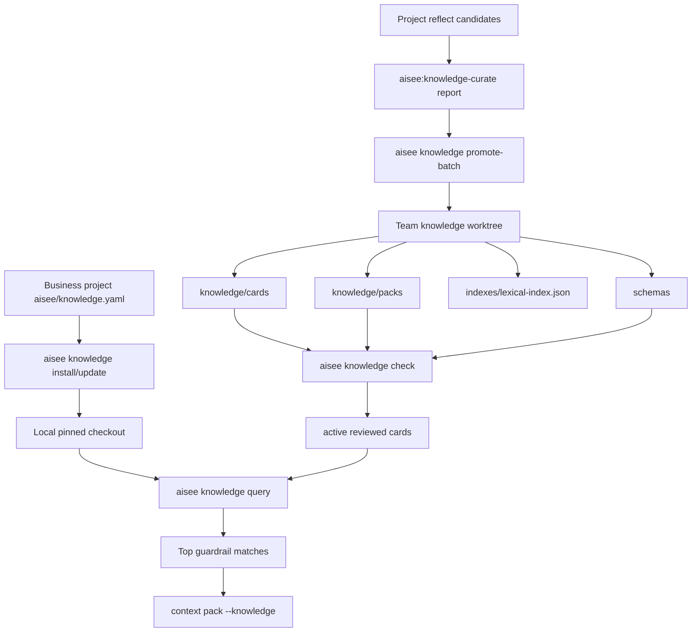

# feat: Team knowledge system design

## Summary

本计划补齐 team knowledge 从“本地 guardrail retrieval dogfood”到“可初始化、可校验、可同步、可沉淀、可维护”的整体系统设计。已有 `aisee knowledge inspect/query/index` 和 `context pack --knowledge` 继续作为检索核心，本计划围绕独立知识仓库 scaffold、card/pack schema、install/update、promote-batch、team repo 索引和文档化生命周期展开。

---

## Problem Frame

当前仓库已经实现了项目侧 team knowledge 检索闭环：业务项目可通过 `aisee/knowledge.yaml` pin 本地 team knowledge path 和 packs，CLI 可读取 pack/card metadata、执行硬过滤、词法打分、去重，并可把 matches 注入 context pack。缺口在系统边界之外：还没有可复用的独立 `aisee-team-knowledge` 仓库骨架、schema 校验、同步流程、候选知识提升流程、team repo 生命周期治理和稳定文档。

这导致 team knowledge 只能靠临时 fixture 或人工目录结构 dogfood。下一阶段应保持“Git card/pack 是事实源、cache/index 可删除重建、OpenSpec 不被替代”的原则，同时补齐端到端操作入口。

---

## Requirements

- R1. 提供可生成或复制的独立 `aisee-team-knowledge` 仓库 scaffold，包含 cards、packs、schemas、docs、indexes 的推荐结构。
- R2. 为 knowledge card 和 pack 提供机器可校验 schema，并让 CLI 能报告缺字段、非法 status、非法 glob、重复 ID、deprecated 链接等问题。
- R3. 保持业务项目只通过 `aisee/knowledge.yaml` pin repo/ref/path/packs；team knowledge 不能复制 OpenSpec、tasks、contracts、source-map 或项目 memory。
- R4. 提供 `aisee knowledge install/update` 或等价命令，支持把已声明 repo/ref 同步到本地 path，同时默认避免覆盖用户未提交改动。
- R5. 提供 `aisee knowledge promote-batch` 或等价人工提交辅助，把 `aisee:knowledge-curate` 产出的 draft 批量写入 team knowledge worktree，但不自动 commit、push 或 PR。
- R6. 扩展 `aisee knowledge index` 的边界说明，让项目侧 `aisee/cache/knowledge-index.json` 和 team repo `indexes/lexical-index.json` 都明确是可重建缓存，不是事实源。
- R7. 强化 `candidate -> active -> deprecated` 生命周期，查询默认只返回 active cards，deprecated cards 可作为 explain/debug 信息和替代关系。
- R8. 保持所有 AI skill 和 context pack 调用通过 CLI 查询，不允许直接递归扫描 `knowledge/cards/**/*.md` 注入上下文。
- R9. 文档必须给出作者、reviewer、业务项目使用者三类角色的最小工作流。
- R10. 所有新增命令保持稳定 JSON 输出，包含 `status`、`issues`、`summary`、`meta.command`，写入命令必须明确 `meta.writes` 或等价字段。

---

## Scope Boundaries

本计划覆盖 team knowledge 的整体产品化骨架，不重写已有 retrieval 算法，不把 semantic/vector rerank 作为本轮必需实现，也不实现 MCP server。独立 team knowledge 仓库可以先作为可导出的 scaffold 或 fixture 存在于本插件包内；真正远程 Git 托管、CI 发布和组织级权限策略可以后置。

### Deferred to Follow-Up Work

- MCP 包装：`resolve_pack`、`query_knowledge`、`get_card`、`explain_match`。
- 向量索引和 semantic rerank；即使后续加入，也只能作用于硬过滤后的候选集。
- 自动创建 GitHub/Linear issue、PR、merge 或 release。
- 组织级 review 权限、CODEOWNERS 和远程 CI 模板。
- 安全类 card 的强制 evidence gate 和 archive/verify 深度联动。

---

## Key Technical Decisions

- KTD1. **新增 scaffold 资产而不是把知识库混入业务项目：** team knowledge 是独立仓库形态，插件只提供模板和校验工具。业务项目仍只 pin `aisee/knowledge.yaml`，避免共享知识污染项目事实源。
- KTD2. **CLI 命令收口生命周期操作：** install、update、check、promote-batch 都放在 `aisee knowledge` 命令族下，复用现有 JSON 输出、路径解析和 issue 汇总模式。
- KTD3. **schema 校验优先于自动修复：** card/pack 的事实源是人审 Git 文件。CLI 可以输出修复建议，但不应自动推断缺失的 `applies_to`、`boundaries` 或 `recommended_action`。
- KTD4. **promote-batch 只写 worktree 草稿：** 命令可从 curation report 生成 card 文件和 pack 更新，但不自动 commit、push 或 PR，符合当前 skill 对写入 team repo 必须授权的边界。
- KTD5. **索引分层：** 业务项目的 `aisee/cache/knowledge-index.json` 服务于当前项目查询；team repo 的 `indexes/lexical-index.json` 服务于仓库自检和加速。两者都必须标记 `cache_is_fact_source: false`。
- KTD6. **生命周期状态保守召回：** `candidate` 和 `deprecated` 默认不参与业务项目检索。`deprecated_by` 只用于 explain/debug、check 和迁移提示。
- KTD7. **先完成本地 Git 流程，再考虑外部服务：** 本轮不引入外部依赖，保持 `PyYAML` 之外无新运行时依赖，避免把稳定性问题转移到网络服务或向量库。

---

## High-Level Technical Design



---

## Output Structure

本计划预计新增或扩展以下结构，具体文件名可在实施时按现有模块拆分：

```text
src/aisee_plugin_assets/team-knowledge/
  README.md
  AGENTS.md
  knowledge/
    cards/
    packs/
  schemas/
    knowledge-card.schema.json
    knowledge-pack.schema.json
  docs/
    authoring-guide.md
    review-policy.md
tests/fixtures/team-knowledge/
tests/test_knowledge_scaffold.py
tests/test_knowledge_schema.py
tests/test_knowledge_install_update.py
tests/test_knowledge_promote_batch.py
tests/test_knowledge_lifecycle.py
```

---

## Implementation Units

### U1. Team knowledge scaffold assets

- **Goal:** 增加可复制的独立 `aisee-team-knowledge` scaffold，作为初始化、文档和测试 fixture 的共同来源。
- **Requirements:** R1, R3, R9.
- **Dependencies:** None.
- **Files:** `src/aisee_plugin_assets/team-knowledge/README.md`, `src/aisee_plugin_assets/team-knowledge/AGENTS.md`, `src/aisee_plugin_assets/team-knowledge/knowledge/packs/web-app.yaml`, `src/aisee_plugin_assets/team-knowledge/knowledge/packs/openspec.yaml`, `src/aisee_plugin_assets/team-knowledge/knowledge/cards/cli/cli-json-output-stability.md`, `src/aisee_plugin_assets/team-knowledge/docs/authoring-guide.md`, `src/aisee_plugin_assets/team-knowledge/docs/review-policy.md`, `tests/fixtures/team-knowledge/README.md`, `tests/test_plugin_packaging.py`.
- **Approach:** 将 scaffold 放在 packaged assets 下，供 CLI 复制；测试 fixture 可复用同一结构或使用最小复制版本。README 明确 facts source 只有 `knowledge/cards/**` 和 `knowledge/packs/**`，`indexes/**` 是缓存。
- **Patterns to follow:** `src/aisee_plugin_assets/skills/aisee-schema-pack/assets/schema-pack`, `src/aisee_cli/assets.py`, `tests/test_plugin_packaging.py`.
- **Test scenarios:** 
  - 插件安装态下能定位 packaged scaffold assets。
  - scaffold 包含至少一个 active card 和一个 pack，`aisee knowledge inspect` 可读取 fixture。
  - scaffold 文档不包含项目私有路径或 OpenSpec artifact 复制内容。
- **Verification:** 打包资产测试证明 scaffold 能随 wheel 分发，且不会破坏现有 plugin export。

### U2. Card and pack schema validation

- **Goal:** 为 card/pack 定义 JSON schema 或等价校验规则，并接入 `aisee knowledge check`。
- **Requirements:** R2, R7, R10.
- **Dependencies:** U1.
- **Files:** `src/aisee_plugin_assets/team-knowledge/schemas/knowledge-card.schema.json`, `src/aisee_plugin_assets/team-knowledge/schemas/knowledge-pack.schema.json`, `src/aisee_cli/knowledge.py`, `src/aisee_cli/__main__.py`, `tests/test_knowledge_schema.py`, `tests/test_knowledge_config.py`.
- **Approach:** 先实现轻量 Python 校验，不引入 `jsonschema` 依赖；schema 文件作为文档化 contract 和未来工具输入。CLI 校验包括 required fields、status、`applies_to` shape、pack card refs、glob 安全、disabled card、duplicate IDs、deprecated replacement 可解析。
- **Patterns to follow:** `src/aisee_cli/sources.py` 的 validate/report 形态，`src/aisee_cli/id_registry.py` 的 lifecycle 校验。
- **Test scenarios:**
  - 缺少 `recommended_action` 的 active card 输出 risk 且不参与 query。
  - pack 引用不存在 card 输出 `KNOWLEDGE_CARD_MISSING`。
  - 重复 card ID 输出 blocker 或 risk，并说明路径。
  - `deprecated` card 缺少 `deprecated_by` 时 check 输出风险，但 query 不返回它。
  - 非相对 `card_globs` 被拒绝且无 traceback。
- **Verification:** `aisee knowledge check --json` 对 scaffold 返回 `ok`，对坏 fixture 返回稳定 issues。

### U3. Knowledge scaffold/init command

- **Goal:** 增加 `aisee knowledge scaffold` 或 `aisee knowledge init-repo`，把 packaged scaffold 写入目标目录。
- **Requirements:** R1, R3, R10.
- **Dependencies:** U1, U2.
- **Files:** `src/aisee_cli/knowledge.py`, `src/aisee_cli/__main__.py`, `src/aisee_cli/assets.py`, `tests/test_knowledge_scaffold.py`, `README.md`, `docs/team-knowledge.md`.
- **Approach:** 命令默认写到用户指定 `--dest`，如果目标存在则拒绝，除非显式 `--force`。输出包含写入文件列表、目标路径、是否覆盖和后续 check 提示。不要自动修改业务项目 `aisee/knowledge.yaml`，除非后续单独设计 `--configure-project`。
- **Patterns to follow:** `aisee plugin export --target ... --dest ...`, `aisee schemas install --force`.
- **Test scenarios:**
  - 空目录生成完整 scaffold。
  - 已存在目录且未传 `--force` 时返回错误，不部分写入。
  - 传 `--force` 时重建目标目录，并在 JSON 中标记 writes。
  - 生成后运行 `aisee knowledge check --team-path <dest>` 返回 `ok`。
- **Verification:** 用户可以通过一条命令创建本地 team repo 初稿，并立即被现有 inspect/query 读取。

### U4. Install and update pinned team knowledge

- **Goal:** 增加 `aisee knowledge install` 和 `aisee knowledge update`，从 `aisee/knowledge.yaml` 的 repo/ref/path 同步本地 checkout。
- **Requirements:** R3, R4, R10.
- **Dependencies:** U2.
- **Files:** `src/aisee_cli/knowledge.py`, `src/aisee_cli/__main__.py`, `tests/test_knowledge_install_update.py`, `docs/team-knowledge.md`, `README.md`.
- **Approach:** V1 支持 Git CLI 存在时 clone/fetch/checkout；repo 缺失或 path 已存在非 Git 目录时输出 risk/blocker。更新前检查 worktree 是否 dirty，默认拒绝覆盖，提供显式 `--allow-dirty` 或 `--force` 的设计但实施时应谨慎。无网络或无 Git 时清晰返回限制，不降级为静默成功。
- **Patterns to follow:** `aisee openspec ensure` 的外部命令错误处理，`scripts/smoke_release.py` 的 command result 检查风格。
- **Test scenarios:**
  - 缺少 `aisee/knowledge.yaml` 时 install 输出 missing config。
  - 配置只有本地 path 且 path 存在时 install 不写入，只 inspect。
  - 使用本地 bare/file repo fixture 可 clone 到配置 path。
  - dirty checkout update 默认拒绝，并保留用户文件。
  - ref 不存在时返回 blocker，包含 repo/ref/path。
- **Verification:** install/update 不会误删用户工作区，且所有失败模式有稳定 JSON。

### U5. Promote batch from curated drafts

- **Goal:** 增加 `aisee knowledge promote-batch`，把 curation report 中的 card drafts 写入 team knowledge worktree，并按需更新 pack。
- **Requirements:** R5, R7, R9, R10.
- **Dependencies:** U2, U3.
- **Files:** `src/aisee_cli/knowledge.py`, `src/aisee_cli/__main__.py`, `skills/aisee-knowledge-curate/SKILL.md`, `skills/aisee-knowledge-curate/references/workflow.md`, `tests/test_knowledge_promote_batch.py`, `docs/team-knowledge.md`.
- **Approach:** 输入为 `--curation <path>` 和 `--team-path <path>`。命令只接受明确 `Card Draft` YAML 或 batch review template 中的 `Draft Cards`，写入 `status: candidate` card；若用户传 `--activate`，仍需 schema check 通过并输出显式状态转换。pack 更新应要求 `--pack <id>`，避免猜测投放范围。
- **Patterns to follow:** `parse_project_candidate` 对 fenced YAML 的解析，`sources add/remove` 的幂等写入模式。
- **Test scenarios:**
  - 单个 draft 写入 `knowledge/cards/<category>/<id>.md`，重复执行不产生重复 card。
  - 缺少 required fields 的 draft 被拒绝，不写半成品。
  - 指定 pack 后 card ID 加入 pack，已存在则 changed=false。
  - curation report 含 rejected/deduped 候选时不写入。
  - 命令不执行 commit、push 或 PR，并在 JSON 中标记 `writes: true` 和 `git_actions: false`。
- **Verification:** 人工授权后的 batch promotion 有可审查 diff，仍需用户后续自己 commit/PR。

### U6. Lifecycle and deprecation support

- **Goal:** 明确 candidate、active、deprecated 的状态转换，并让 CLI check/query/index 都按该生命周期工作。
- **Requirements:** R2, R6, R7.
- **Dependencies:** U2, U5.
- **Files:** `src/aisee_cli/knowledge.py`, `references/knowledge-card-contract.md`, `docs/architecture/aisee-team-knowledge.md`, `tests/test_knowledge_lifecycle.py`, `tests/test_knowledge_query.py`, `tests/test_knowledge_index.py`.
- **Approach:** 默认 query 只返回 active；check 校验 deprecated replacement；index 记录所有 declared cards 的 status 和 replacement，但项目 context pack 只注入 active matches。未来 refresh 可基于 index 识别 stale cards，本轮只输出 explain。
- **Patterns to follow:** `id_registry.py` 中 inactive reference 的 severity 分级。
- **Test scenarios:**
  - candidate card 在 pack 中也不被 query 返回。
  - deprecated card 不被 query 返回，但 `--debug` 或 check 能看到替代关系。
  - active card 指向 deprecated card 时 check 输出风险。
  - `deprecated_by` 指向不存在 card 时 check 输出风险。
- **Verification:** 生命周期规则不会扩大召回范围，且维护者能看到迁移提示。

### U7. Team and project knowledge indexing

- **Goal:** 整理项目侧 cache 和 team repo lexical index 的职责，扩展 `aisee knowledge index` 支持 team path 或明确拆分命令。
- **Requirements:** R6, R8, R10.
- **Dependencies:** U2, U6.
- **Files:** `src/aisee_cli/knowledge.py`, `src/aisee_cli/paths.py`, `tests/test_knowledge_index.py`, `docs/architecture/aisee-team-knowledge.md`, `references/knowledge-card-contract.md`.
- **Approach:** 保持现有 `aisee/cache/knowledge-index.json` 兼容。新增可选 `--team-path` 或 `--scope team` 生成 `indexes/lexical-index.json`，内容包含 card IDs、status、tokens、hash、pack membership、generated_at 和 `cache_is_fact_source: false`。query 仍必须能在 index 缺失时直接读 pack/card。
- **Patterns to follow:** `src/aisee_cli/index.py` 的 hash/token/cache 输出结构，当前 `build_knowledge_index`。
- **Test scenarios:**
  - 项目侧 index 路径仍为 `aisee/cache/knowledge-index.json`。
  - team scope index 路径为 `indexes/lexical-index.json`。
  - 删除 index 后 query 结果不变。
  - 修改 card 后 index hash 改变，check 可提示 stale 或建议重建。
- **Verification:** 两类 index 均被文档标记为 cache，不能成为事实源。

### U8. Documentation and workflow hardening

- **Goal:** 将作者、reviewer、业务项目使用者的工作流写清楚，并同步中英文或至少保持中文主文档完整。
- **Requirements:** R8, R9, R10.
- **Dependencies:** U1-U7.
- **Files:** `docs/team-knowledge.md`, `docs/team-knowledge.en.md`, `docs/architecture/aisee-team-knowledge.md`, `references/knowledge-card-contract.md`, `README.md`, `CONTRIBUTING.md`, `skills/aisee-knowledge-curate/SKILL.md`.
- **Approach:** 更新文档的“当前可用能力”和“稳定前缺口”，把已补齐命令从缺口移动到使用流程。强调写入 team repo 需要用户授权，CLI 只做本地 worktree 写入辅助，不自动 PR。
- **Patterns to follow:** 现有 `docs/team-knowledge.md` 的定位边界，`README.md` CLI Reference。
- **Test scenarios:**
  - README CLI Reference 包含新增命令。
  - docs 中不再声称已实现功能仍未实现。
  - package asset 同步后 `src/aisee_plugin_assets/docs/architecture/aisee-team-knowledge.md` 与源文档一致。
- **Verification:** 文档能支持一次从 scaffold 到 query 到 promote 的手动 dogfood。

---

## System-Wide Impact

该工作会扩大 `aisee knowledge` 命令族，从只读/缓存生成扩展到本地写入操作。实现时必须保持写入边界清晰，避免 install/update/promote-batch 意外覆盖用户 worktree。插件打包也会新增非 skill 的 packaged assets，需确认 `pyproject.toml` package-data 已覆盖这些文件。

---

## Risks and Dependencies

- **Git 操作误覆盖用户更改：** install/update 默认拒绝 dirty checkout，所有 destructive 操作必须有显式 flag。
- **promote-batch 泄露项目私密信息：** 命令只能消费 curate report 中的 draft，并保留 sensitive information checklist；不从任意 Markdown 推断 card。
- **schema 校验过严导致已有 cards 难迁移：** check 可以先输出 risk，只有破坏 parse 或重复 ID 这类问题设为 blocker。
- **命令族膨胀：** 新命令应复用 `knowledge.py` 内部 helpers，但当模块过大时在实施阶段可拆出 `knowledge_lifecycle.py` 或 `knowledge_repo.py`。
- **scaffold 与源码资产漂移：** 需要测试 packaged assets 可用，并在 release smoke 中覆盖基础 inspect/export。

---

## Sources and Research

- Existing retrieval plan: `docs/plans/2026-06-05-002-feat-team-knowledge-guardrail-retrieval-plan.md`.
- Public usage docs: `docs/team-knowledge.md`, `README.md`.
- Architecture boundary: `docs/architecture/aisee-team-knowledge.md`, `references/knowledge-card-contract.md`.
- Current CLI implementation: `src/aisee_cli/knowledge.py`, `src/aisee_cli/__main__.py`, `src/aisee_cli/index.py`, `src/aisee_cli/paths.py`.
- Current tests: `tests/test_knowledge_config.py`, `tests/test_knowledge_query.py`, `tests/test_knowledge_from_change.py`, `tests/test_knowledge_index.py`, `tests/test_plugin_packaging.py`.
- Curation workflow: `skills/aisee-knowledge-curate/SKILL.md`, `skills/aisee-knowledge-curate/references/workflow.md`.

External research was skipped because this plan is governed by repository-local architecture and existing Aisee/OpenSpec boundary decisions.

---

## Verification Strategy

实施完成后至少运行以下验证层：

- Knowledge schema/check tests：覆盖合法 scaffold、缺字段、重复 ID、非法 glob、deprecated replacement。
- Knowledge lifecycle tests：覆盖 candidate、active、deprecated 默认召回规则。
- Knowledge scaffold tests：覆盖生成、拒绝覆盖、force 重建、packaged assets 可定位。
- Knowledge install/update tests：覆盖 missing config、本地 path、Git clone、dirty checkout、bad ref。
- Knowledge promote-batch tests：覆盖 draft 写入、pack 更新、重复幂等、拒绝坏 draft、不执行 Git 远程动作。
- Existing retrieval tests：确保 `inspect/query/index/from-change/context pack --knowledge` 不回归。
- Packaging tests：确保新增 scaffold/schema/docs 被 wheel package-data 收录。
