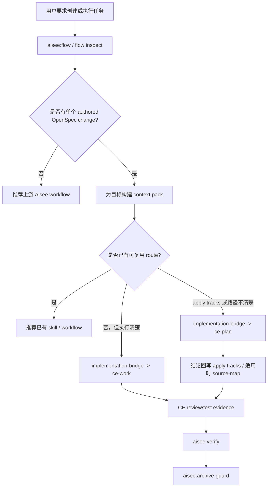

# feat: 增加可复用工作流优先路由门禁

## Summary

本计划为任务创建和任务执行增加“复用优先”门禁。Aisee 在建议新任务、新子代理或新执行路径前，应先检查已有 workflow stage、schema apply tracks、context pack、可用 skill、项目规则和已有证据。

---

## Problem Frame

项目已经形成了可复用的 Aisee 工作流、schema-aware context pack、Compound Engineering bridge、skill 职责边界和生命周期测试。如果缺少显式复用门禁，agent 容易重复创建已有路径、设计与 CE 重叠的审查角色，或绕过 `aisee:flow`、`aisee:implementation-bridge`、`aisee:verify`、`aisee:archive-guard` 和 Compound handoff 规则重新试错。

---

## Requirements

- R1. 创建任务前必须先识别当前 workflow stage，并优先给出已有 Aisee / Compound skill 入口。
- R2. 执行交接必须优先使用 `aisee context pack --change <change> --for ce-work --json` 和现有 `requires_ce_plan` 信号，再决定是否建议 `ce-plan`。
- R3. Verify 和 archive guard 必须消费已有 CE review/test evidence 与 domain contracts，不得复刻 CE code review、CE test 或 CE execution agent。
- R4. 接口、界面、硬件、固件、安全、验证等 domain checks 应作为 schema-aware check lenses，而不是新的通用子代理。
- R5. 复用建议不得创建新的长期事实源；长期结论仍回写当前 OpenSpec artifacts、schema apply tracks、适用时的 `source-map.md` 或 evidence 文件。
- R6. CLI 和 skill 测试必须覆盖 app/source-map schema 与轻量 schema 的复用优先路由，避免把 app-only 假设套到所有 schema。
- R7. 如定义 Aisee reviewer role，只能覆盖 OpenSpec / schema / evidence 一致性审查，不得替代 CE 的执行、代码审查、测试、PR 或复盘职责。

---

## Key Technical Decisions

- KTD1. 扩展现有路由面，而不是新增编排器：`aisee:flow`、`context_pack.py` 和 `aisee:implementation-bridge` 已经决定 stage、allowed paths 和是否需要 `ce-plan`，复用优先逻辑应落在这些入口。
- KTD2. 把 reusable workflows 当作路由提示，不当作事实源：候选项可从当前 schema、`tool_checks.py`、skill 可用性、context pack target 和项目规则推导，但不能变成平行 registry 或任务清单。
- KTD3. 保持 Compound Engineering 的执行与 review 消费方角色：Aisee 可以推荐 CE skill 并消费 CE evidence，但不得复制 `ce-work`、`ce-code-review`、`ce-test-*`、PR、CI 或 solution 沉淀职责。
- KTD4. Domain review 归属于 schema contracts：接口、UI、硬件、固件、安全和验证检查应挂到当前 schema artifacts、verify checks 和 archive checks 下，而不是升级为新的万能 agent。
- KTD5. 优先提供机器可读 CLI 信号：docs 和 SKILL 文件解释规则，`context_pack.py` 和 `flow.py` 暴露结构化输出，让 agent 稳定遵守。

---

## High-Level Technical Design

该图是路由契约。实现时应保留单 change 入口，不应在当前 workflow stage 未允许时进行自由的全项目搜索。

---

## Scope Boundaries

- In scope: 任务创建、执行交接、verify/archive guard 和 context pack 输出中的复用优先路由提示。
- In scope: 防止新增 Aisee subagent 或 check module 与 Compound Engineering 职责重叠的文档和测试。
- In scope: 定义少量 Aisee reviewer role 的职责边界，用于 change、spec 和 implementation evidence 的一致性审查。
- Out of scope: 实现新的 subagent runtime、自动启动 CE review/test agent、修改 Compound Engineering plugin 内部。
- Out of scope: 创建新的 workflow registry、任务数据库，或 OpenSpec artifacts / 项目 references 之外的长期计划事实源。

---

## Implementation Units

### U1. Document the reuse-first routing contract

- **Goal:** 在架构和 bridge references 中明确复用优先行为，让后续 skill 和 agent 在创建新路径前先检查已有 workflow assets。
- **Requirements:** R1, R3, R4, R5.
- **Dependencies:** None.
- **Files:** `docs/architecture/aisee-openspec-compound-integration.md`, `references/compound-bridge.md`, `references/context-pack-targets.md`, `src/aisee_plugin_assets/docs/architecture/aisee-openspec-compound-integration.md`, `src/aisee_plugin_assets/references/compound-bridge.md`, `src/aisee_plugin_assets/references/context-pack-targets.md`.
- **Approach:** 在现有 Context Pack 和 Compound handoff 章节附近增加简短“reuse-first routing”规则。定义新任务或执行建议必须先检查 `aisee:flow`、context pack targets、schema apply tracks 和 CE skill 可用性。
- **Patterns to follow:** `references/compound-bridge.md` 中的职责边界语言，以及 `references/context-pack-targets.md` 中的 target-specific 规则。
- **Test scenarios:** Test expectation: none -- documentation-only unit，通过 packaged asset 同步校验覆盖。
- **Verification:** repo 源文件与 packaged asset 副本包含同一规则，且所有引用路径均为 repo-relative。

### U2. Expose reusable workflow candidates in context packs

- **Goal:** 在 context pack 中加入结构化复用提示，让执行消费者能看到何时应使用已有 workflow 或 skill，而不是发明新路径。
- **Requirements:** R1, R2, R5, R6.
- **Dependencies:** U1.
- **Files:** `src/aisee_cli/context_pack.py`, `tests/test_context_pack.py`, `tests/test_lifecycle_dogfood.py`.
- **Approach:** 在 `ce-work` 的 `facts.derived.execution` 下增加紧凑字段，例如 `reusable_workflow_candidates`，由 schema status、task state、implementation references、gaps 和 Compound skill checks 推导。保留现有 `requires_ce_plan` 与 `ce_plan_reason` 语义。
- **Patterns to follow:** `src/aisee_cli/context_pack.py` 现有 `execution.allowed_paths`、`execution.forbidden_scope`、`requires_ce_plan` 和 schema-aware source-map 处理。
- **Test scenarios:** app/source-map change 路径清楚时，断言 candidates 包含 `aisee:implementation-bridge` 和 `ce-work`，且 `requires_ce_plan=false`。执行路径缺失或 tasks 过粗时，断言 candidates 包含带原因的 `ce-plan`，且不扩大 `allowed_paths`。quick-fix schema 下，断言不要求 `source-map.md`，并继续优先使用 schema artifact 中的路径。
- **Verification:** context pack JSON 对既有消费者保持向后兼容，只增加可选 derived hints。

### U3. Make flow recommendations reuse-first

- **Goal:** 让 `aisee flow inspect/next` 在推荐新规划或执行路径前，优先推荐已有可复用 workflow。
- **Requirements:** R1, R2, R5, R6.
- **Dependencies:** U2.
- **Files:** `src/aisee_cli/flow.py`, `tests/test_doctor_flow_schema.py`, `tests/test_lifecycle_dogfood.py`.
- **Approach:** 将 context pack 的 reusable candidates 接入 `recommended_path` 或新的 advisory 字段，同时保持现有 stage 判定。author/gaps blocked 仍回到 artifact 修复，implementation-ready 仍通过 `aisee:implementation-bridge`，只有执行不清楚时才包含 `ce-plan`。
- **Patterns to follow:** `src/aisee_cli/flow.py` 现有 `required_commands`、`guardrails` 和 `relevant_implementation_gaps` 行为。
- **Test scenarios:** archive-ready fixture 不应从 `openspec archive` 回退。implementation-ready 且路径清楚时，`ce-work` 仍是执行消费方。执行不清楚时，flow 推荐 `aisee:implementation-bridge` 和 `ce-plan`，但不创建新的任务事实源。
- **Verification:** flow 输出继续阻止跳步执行，并在不改变现有 fixture lifecycle status 的前提下增加复用提示。

### U4. Update skill guardrails for creation and execution prompts

- **Goal:** 让相关 Aisee skills 在建议新任务结构、review agent 或执行计划前，先检查项目已有 workflow 与 skill route。
- **Requirements:** R1, R2, R3, R4, R5.
- **Dependencies:** U1, U2, U3.
- **Files:** `skills/aisee-flow/SKILL.md`, `skills/aisee-implementation-bridge/SKILL.md`, `skills/aisee-verify/SKILL.md`, `skills/aisee-archive-guard/SKILL.md`, matching files under `src/aisee_plugin_assets/skills/`.
- **Approach:** 在相关 skill 中增加精简规则：引入新 workflow 前先复用 `aisee:flow`、`context pack`、`tool_checks.py` 和 CE bridge。明确 domain checks 是 schema-aware lenses，Tier 2 review recommendation 需要用户授权后才可启动可用 CE 或 harness review 能力。
- **Patterns to follow:** 各 skill 现有“职责 / 不负责 / 输入入口”结构。
- **Test scenarios:** 新增或更新 skill eval：用户要求新增接口/UI/硬件审查 agent 时，期望输出路由到已有 Aisee reviewer role 或 domain lens，而不是创建与 CE 重叠的 agent。
- **Verification:** SKILL.md 保持精简，长规则保留在 references，packaged asset 副本同步。

### U5. Add tests for Compound skill availability and reuse fallback

- **Goal:** 验证复用优先路由在 Compound Engineering 完整、部分安装和缺失时都能工作，且不绑定单一 runtime。
- **Requirements:** R1, R2, R3, R6.
- **Dependencies:** U2, U3.
- **Files:** `src/aisee_cli/tool_checks.py`, `tests/test_tool_checks.py`, `tests/test_doctor_flow_schema.py`.
- **Approach:** 复用现有 `check_compound_plugin()` 输出 CE skill 可用性与缺失项。flow/context 输出在能力存在时推荐已安装能力，能力缺失时明确限制。
- **Patterns to follow:** `tests/test_tool_checks.py` 现有 `AISEE_COMPOUND_SKILLS_DIR` fixture 设置。
- **Test scenarios:** 全部 CE skills 存在时，reuse candidates 可按需包含 `ce-plan`、`ce-work`、`ce-doc-review` 和 `ce-code-review`。只有 `ce-work` 存在时，缺失的 `ce-plan` 被报告为 limitation，而不是被新的 Aisee planner 静默替代。没有 CE skills 时，Aisee 仍输出本地 guardrails，且不声称已有 CE evidence。
- **Verification:** Tool checks 保持 agent-runtime agnostic，正常 Aisee 测试不强制安装 Compound Engineering。

### U6. Synchronize packaged assets and run focused verification

- **Goal:** 保持 source skill/reference 与 packaged plugin assets 同步，并用聚焦测试验证 workflow contract。
- **Requirements:** R5, R6.
- **Dependencies:** U1, U4.
- **Files:** `scripts/sync_package_assets.py`, `tests/test_plugin_packaging.py`, changed files under `src/aisee_plugin_assets/`.
- **Approach:** source 改动后沿用现有 package asset sync 模式，再验证 packaged metadata 和 skill assets 已包含复用优先规则。
- **Patterns to follow:** `tests/test_plugin_packaging.py` 中现有 package mirroring 测试。
- **Test scenarios:** packaged skill/reference 文件在 sync 后包含更新的 reuse-first 章节。无关 project-local skills 不 shadow packaged assets。plugin inspect 仍列出同一组 Aisee skills。
- **Verification:** 聚焦运行 context pack、flow、tool checks、lifecycle fixture、skill eval schema 和 plugin packaging 测试。

### U7. Define Aisee reviewer roles without overlapping CE

- **Goal:** 明确定义三个 Aisee 规范一致性 reviewer role：`aisee-change-architect`、`aisee-spec-reviewer`、`aisee-implementation-reviewer`。
- **Requirements:** R3, R4, R5, R7.
- **Dependencies:** U1, U4.
- **Files:** `docs/architecture/aisee-openspec-compound-integration.md`, `references/compound-bridge.md`, `skills/aisee-flow/SKILL.md`, `skills/aisee-verify/SKILL.md`, matching files under `src/aisee_plugin_assets/`.
- **Approach:** 在架构文档中保留三个 reviewer role，并写清它们只产出结构化审查结论。`aisee-change-architect` 审查 change 边界、依赖、粒度和可独立交付性；`aisee-spec-reviewer` 审查 schema artifacts、contracts、source-map、tasks 是否完整一致可验证；`aisee-implementation-reviewer` 比对实现、tasks、source-map/spec 和 evidence 是否可进入 verify/archive。三者均不得改代码、跑测试、提交 PR、解决 CI 或替代 CE review/test。
- **Patterns to follow:** `docs/architecture/aisee-openspec-compound-integration.md` 已有“如果 agent 指专职子代理，建议只新增三个”章节，以及 `skills/aisee-verify/SKILL.md` 的 Review Recommendation 边界。
- **Test scenarios:** skill eval 覆盖两类提示：用户要求新增接口/UI/硬件审查 agent 时，应回答为 domain lens 而非新 agent；用户要求 Aisee 规范一致性 reviewer 时，应只返回三个 reviewer role 及其只读职责。
- **Verification:** reviewer role 定义不引入 runtime、自动调用或 CE 替代职责，且 packaged asset 副本同步。

---

## Risks & Dependencies

- **Risk:** 路由文字过多会让 skill 变成另一个万能编排器。Mitigation: skill edits 保持精简，长期规则放入 references。
- **Risk:** 结构化复用提示可能被误当事实源。Mitigation: 将其放在 derived execution/advisory 字段，并明确它只是 routing hint。
- **Risk:** Flow recommendation 可能影响 archive-ready 或 verified 生命周期状态。Mitigation: 保留现有 stage ordering，并覆盖 `tests/test_lifecycle_dogfood.py`。
- **Risk:** Reviewer role 名称可能被误解为可执行子代理。Mitigation: 文档和 skill 中统一声明它们是只读一致性审查角色，runtime 与自动调用不在本计划范围内。
- **Dependency:** Compound Engineering skill 可用性保持可选；`tool_checks.py` 应报告限制，而不是把 CE 变成硬依赖。

---

## Sources & Research

- `skills/aisee-flow/SKILL.md` 定义现有 workflow gatekeeper，并已负责在 Aisee/OpenSpec/CE stage 之间路由模糊状态。
- `skills/aisee-implementation-bridge/SKILL.md` 定义何时适合使用 `ce-plan`，并要求结论回写当前 schema apply tracks。
- `skills/aisee-verify/SKILL.md` 和 `skills/aisee-archive-guard/SKILL.md` 已经消费 CE evidence，并避免替代 CE review/test。
- `references/context-pack-targets.md` 定义 `requires_ce_plan`、`ce_plan_reason`、`allowed_paths` 和 target-specific guardrails。
- `src/aisee_cli/context_pack.py` 与 `src/aisee_cli/flow.py` 已经提供本计划要扩展的结构化路由面。
- `tests/test_context_pack.py`、`tests/test_lifecycle_dogfood.py` 和 `tests/test_tool_checks.py` 覆盖需要保持的现有契约。
