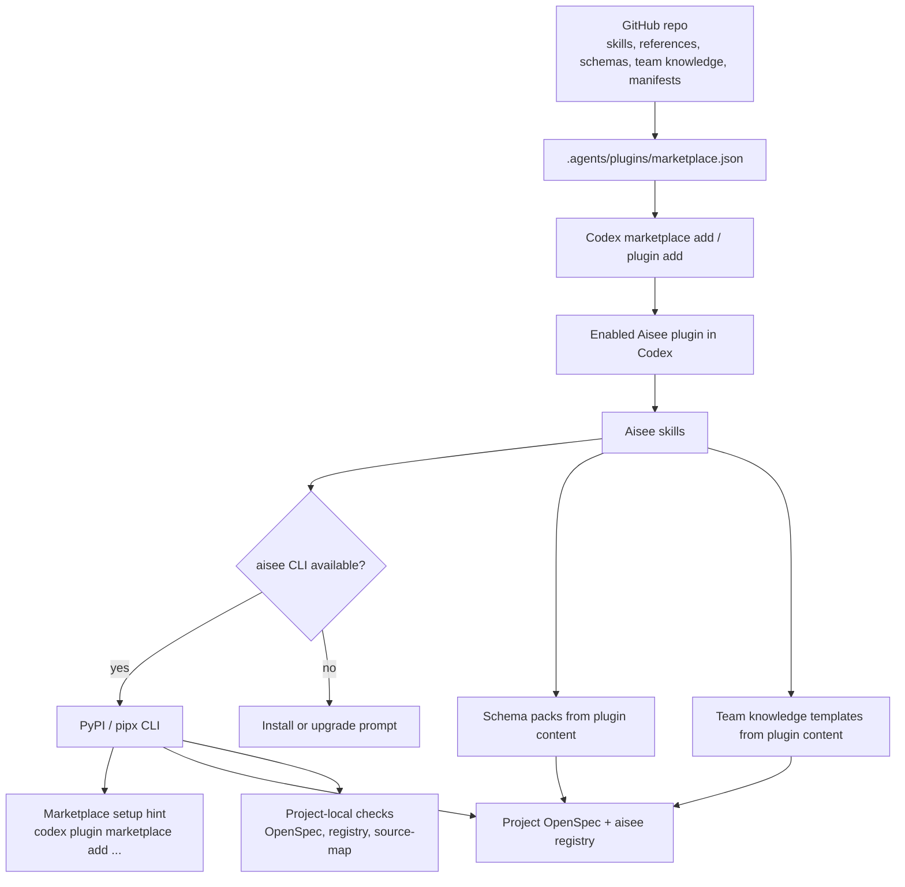

# refactor: 将 GitHub Marketplace 作为 Aisee 插件内容源

## 摘要

本计划将 Aisee 迁移到单一插件内容源：GitHub 仓库和 Codex marketplace listing 负责 skills、references、schema packs 和 plugin manifests，PyPI 只分发 CLI 和项目内命令行工具。

迁移必须分阶段完成。在 CLI asset 命令收缩、Codex marketplace 安装检查和文档更新完成前，现有 CLI 工作流不能被直接破坏。

---

## 问题背景

Aisee 现在通过两条渠道分发同一份插件内容：仓库里的 `skills/` 和 `references/` 会被同步到 `src/aisee_plugin_assets/` 并打进 wheel；同时 GitHub 仓库也包含 Codex 可以加载的插件文件。这会形成两份内容，后续容易出现版本漂移和发布后漏改。

目标模型是：用户通过 GitHub-backed Codex marketplace 安装插件；skill 需要 CLI 支持时，先检查 `aisee` 是否已安装，缺失时提示用户通过 PyPI / pipx 安装。CLI 不应长期携带另一份完整 skills 和 references。

---

## 需求

- R1. GitHub 仓库必须提供 Codex-compatible marketplace entry，让 Codex 能直接从 `AISEE-LAB/aisee-plugin` 添加并安装 `aisee-plugin`。
- R2. 仓库必须成为插件内容的单一事实源，包括 `skills/`、`references/`、schema packs、team knowledge templates、`.codex-plugin/plugin.json` 和 marketplace listing metadata。
- R3. PyPI 包必须保留 `aisee` CLI，但不再打包或管理 skills、references、schema packs、team knowledge templates 和 plugin metadata。
- R4. 依赖 CLI 的 skills 必须能检测缺失或过旧的 `aisee` executable，并给出明确安装或升级提示。
- R5. 当前依赖 packaged assets 的 CLI 命令必须收缩为项目内检查/解析能力，或返回清晰 deprecation/blocker，不能继续分发或安装已移除的 wheel 内容。
- R6. 现有用户必须有分阶段迁移路径，在完整移除 wheel assets 前先更新兼容文档和测试。
- R7. 发布检查必须能同时证明 slim PyPI package 可作为 CLI 工作，并证明 GitHub marketplace plugin 可通过 Codex 安装。
- R8. 不再符合新边界、且没有迁移价值的无关 CLI 命令必须从 CLI surface 中删除；仍有用户迁移风险的命令先保留 deprecation/blocker，再按兼容策略移除。
- R9. CLI 在检测到插件内容缺失、旧内容分发命令被调用或 doctor 发现未安装 Codex marketplace plugin 时，必须提示如何添加 marketplace，但不能代替 Codex 执行安装。
- R10. Installed CLI 不能把任意业务项目中的 `skills/`、`references/` 或 schema pack 目录当成 Aisee 插件内容源；source checkout assets 只允许用于本仓库开发、显式测试或显式 dev override。
- R11. 删除 CLI 命令前必须按公开程度分类：已出现在 README/docs/tests/compatibility policy 的命令先 deprecate/blocker；只有未公开、无测试、无迁移价值的命令才直接从 argparse surface 删除。

---

## 关键技术决策

- KTD1. **GitHub marketplace 是插件内容源：** `skills/`、`references/`、schema pack templates、team knowledge templates 和 runtime manifests 留在仓库，由 Codex 管理 cloned snapshots、cache paths 和 enabled state。
- KTD2. **PyPI 只做 CLI 工具：** 迁移完成后 wheel 不再嵌入第二份完整插件内容。PyPI 继续负责 `aisee` 命令可用性、版本报告、JSON tooling 和项目本地 OpenSpec 操作。
- KTD3. **不写 Codex cache 目录：** Aisee 不复制文件到 Codex-managed plugin cache 或 temporary marketplace paths。Codex CLI 负责 marketplace registration、plugin installation、cache refresh 和 enablement。
- KTD4. **CLI 不再解析插件内容资产：** CLI 中依赖 assets 的命令应迁移为项目内状态检查、显式 deprecation，或由 skill/marketplace 工作流处理。缺失资源时输出结构化 JSON issues，而不是导入 `aisee_plugin_assets`。
- KTD5. **本地 export 只作为迁移能力保留：** `aisee plugin export` 可以在迁移期继续支持本地开发和非 Codex runtimes，但在 GitHub marketplace 安装成为主路径后应标记为 deprecated 或重新定义。
- KTD6. **Schema packs 完全归插件内容源：** schema packs 属于 GitHub marketplace plugin，不属于 CLI 管理范围。`aisee schemas install` 应迁移为 deprecated，或被项目内 schema 状态检查命令替代。
- KTD7. **Team knowledge 初始化由插件工作流引导：** team knowledge 模板、默认结构和 authoring guide 属于插件内容。CLI 可以保留 `knowledge config/check/index/promote/install/update` 等项目内或外部知识库操作，但不能从 wheel scaffold 默认模板。
- KTD8. **命令面先盘点再删除：** 删除范围只覆盖内容分发或旧打包模型专用命令。项目内事实源、registry、context pack、contract、ID、flow、doctor 等 CLI 能力继续保留，避免把“瘦身 PyPI 包”误做成“削弱项目内工具”。
- KTD9. **CLI 只提示 marketplace 安装：** CLI 可以在 JSON `issues`、`summary` 或 text fallback 中给出 `codex plugin marketplace add AISEE-LAB/aisee-plugin --ref main` 和 `codex plugin add aisee-plugin@aisee-plugin` 这类操作建议，但不写 Codex 配置、cache 或 marketplace state。
- KTD10. **Source checkout assets 不是运行时 fallback：** 开发期可以从本仓库源码读取 plugin assets 以支持测试，但 installed CLI 不扫描任意项目目录寻找 Aisee assets。需要插件内容时，默认输出 marketplace setup hint。
- KTD11. **兼容文档先于破坏性移除：** 在移除 wheel assets 或删除公开命令前，先更新 README、compatibility policy、release 文档和迁移提示，保证用户看到的说明早于行为破坏。

---

## 高层技术设计

设计边界是内容分发和 CLI 执行分离。Codex 负责插件安装和 schema/skill 内容分发；用户安装 CLI 后，Aisee CLI 只负责项目本地命令行操作。

---

## 范围边界

- 范围内：Codex marketplace listing、CLI asset 命令收缩、skill CLI preflight、package-data slimming、测试、release smoke checks 和文档。
- 范围内：为当前使用 `src/aisee_plugin_assets/` 的命令提供分阶段兼容迁移。
- 范围内：盘点 CLI command surface，直接删除不再使用且不属于项目内工具边界的命令，并同步 README、CLI help 和测试。
- 范围内：更新或标注旧文档和旧计划中的 wheel asset 分发假设，避免后续执行继续引用已废弃的 packaged assets 模型。
- 范围内：在破坏性行为落地前先完成用户可见的迁移说明、兼容策略和 release 操作说明。
- 后续再做：Claude 和 Cursor 的 marketplace-native 分发，除非它们的 metadata 变化是保持当前 export 行为一致所必需。
- 后续再做：Aisee CLI 内部自动管理 GitHub repository checkout。第一阶段不让 CLI 管理插件内容。
- 范围外：改变 OpenSpec baseline 语义、team knowledge card 语义或 Compound Engineering skill 职责边界。
- 范围外：让 CLI 自动 clone 或初始化默认 team knowledge 内容。第一阶段由插件 skill 引导用户选择 team knowledge 来源，再由 CLI 写入项目配置或执行外部知识库同步。

---

## 实施单元

### U1. 添加 Codex Marketplace Listing

- **目标：** 让仓库本身可以作为 Codex marketplace source 安装，不依赖本地生成的 marketplace。
- **需求：** R1, R2.
- **依赖：** 无。
- **文件：** `.agents/plugins/marketplace.json`, `.codex-plugin/plugin.json`, `tests/test_plugin_marketplace.py`, `docs/plugin-marketplace.md`, `docs/plugin-marketplace.en.md`.
- **做法：** 添加 repository-local Codex marketplace 文件，指向仓库 plugin root。保留 `.codex-plugin/plugin.json` 作为 plugin manifest，并确保版本继续与 `pyproject.toml` 同步。
- **参考模式：** `docs/plugin-marketplace.md` 中已有 Codex marketplace 示例、当前 `.codex-plugin/plugin.json`、`tests/test_plugin_packaging.py`。
- **测试场景：**
  - marketplace JSON 可以解析，并声明 `aisee-plugin`，source path 指向仓库 plugin root。
  - marketplace listing 的 category 和 installation policy 符合 Coding plugin 预期。
  - plugin manifest 仍可被发现，且 `skills` 指向 `./skills/`。
  - 当 `.agents/plugins/marketplace.json`、`.codex-plugin/plugin.json` 和 `pyproject.toml` 版本漂移时，版本检查失败。
- **验证：** 在干净环境中，Codex 可以从 GitHub marketplace source list 并 install 该插件。

### U2. 收缩 CLI Asset 依赖

- **目标：** 移除 CLI 对 packaged plugin assets 的运行时依赖，将相关命令收缩为项目内检查或明确 deprecation/blocker。
- **需求：** R3, R5, R6, R9, R10.
- **依赖：** U1.
- **文件：** `src/aisee_cli/assets.py`, `src/aisee_cli/output.py`, `src/aisee_cli/project.py`, `tests/test_asset_resolution.py`, `tests/test_plugin_packaging.py`, `tests/test_schema_pack_examples.py`.
- **做法：** 将 `aisee_cli.assets` 从“定位 package assets”的模块改为“报告资产相关命令状态”的模块。进入 slim package 阶段后，不再 fallback 到 package data；需要插件内容时返回 structured blocker，提示通过 GitHub marketplace 获取。source checkout assets 只能在本仓库开发上下文、显式测试 fixture 或显式 dev override 下使用，installed CLI 不能扫描任意业务项目目录作为插件内容源。
- **参考模式：** `resolve_asset_root`, `resolve_schema_pack_dir`, `rel` 和现有 JSON issue summary。
- **测试场景：**
  - source checkout 中的 assets 可用于开发期测试，但不作为 installed CLI 的默认 fallback。
  - 只有自定义 skills 的无关项目不会 shadow Aisee assets。
  - 业务项目即使存在 `skills/aisee-srs` 或 schema-like 目录，也不会被 installed CLI 误判为 Aisee 插件内容源。
  - 没有插件内容的普通项目，对 asset-dependent commands 返回 JSON blocker 或 deprecation response。
  - 错误响应包含稳定 issue code、PyPI / pipx CLI 安装提示、Codex marketplace 添加提示，且不包含绝对路径。
- **验证：** 在 source checkout 和 no-asset project 两种上下文中，asset-dependent commands 都输出确定的 JSON，且 installed CLI 不需要 packaged assets。

### U3. 删除或废弃 CLI 的内容分发命令

- **目标：** 让 plugin、schema 和 scaffold 类命令不再承担内容分发职责；没有迁移价值的命令直接删除，有兼容风险的命令先返回 deprecation/blocker。
- **需求：** R3, R5, R7, R8, R9, R11.
- **依赖：** U2.
- **文件：** `src/aisee_cli/plugin_assets.py`, `src/aisee_cli/schema_pack.py`, `src/aisee_cli/knowledge.py`, `src/aisee_cli/__main__.py`, `tests/test_cli_command_surface.py`, `tests/test_plugin_packaging.py`, `tests/test_schema_pack_examples.py`, `tests/test_knowledge_config.py`.
- **做法：** 先建立命令盘点表，把 CLI command surface 分成三类：保留的项目内命令、迁移期 deprecation/blocker 命令、直接删除的无关命令。删除前检查 README、docs、compatibility policy、tests 和 release notes：公开过或测试覆盖过的命令先返回 deprecation/blocker，只有未公开、无测试、无迁移价值的命令才直接删除。将 `plugin inspect`、`plugin path`、`plugin export`、`schemas list`、`schemas check`、`schemas install` 和 team knowledge scaffold 分类处理：内容分发类命令标记 deprecated/blocker 或删除；项目状态检查类命令保留并只读取项目目录。`schemas install` 不再从 CLI 安装 schema packs，改由 marketplace-installed plugin 的 skill 指引用户使用插件内容完成。`knowledge scaffold` 不再从 packaged assets 复制默认模板，改为 deprecated/blocker，或重定义为只初始化 `aisee/knowledge.yaml` / `.aisee/knowledge.yaml` 这类项目配置。
- **参考模式：** 现有 `status_from_issues`、`summarize_issues` envelope，以及 `schema_pack.py` 的 install result 结构。
- **测试场景：**
  - `aisee --help` 和 subcommand help 不再展示已删除的无关命令。
  - 已在 README/docs/tests 中出现过的命令不会直接消失；它们先返回稳定 JSON deprecation/blocker。
  - `schemas list` 不再列出 wheel 内 schema packs；如保留，应只报告项目已安装 schemas 或返回迁移提示。
  - `schemas install` 返回 deprecated/blocker response，说明 schema packs 由插件内容提供。
  - `plugin inspect` 不再报告 packaged asset root；它应报告 CLI-only 状态和 marketplace 安装提示。
  - `plugin export` 返回 deprecation/blocker response，说明 Codex 应通过 GitHub marketplace 安装插件。
  - `knowledge scaffold` 不再创建模板目录；若用户需要默认模板，应提示通过 marketplace-installed plugin workflow 获取。
  - 旧内容分发命令的 blocker response 给出 marketplace 添加命令，但不尝试执行 Codex 安装。
  - `knowledge config/check/index/promote/install/update` 仍可操作项目内配置或外部 team knowledge repo，但不能依赖 wheel 内模板。
  - 保留命令清单覆盖 `doctor`、`bootstrap`、`openspec ensure`、`sources`、`change`、`context pack`、`knowledge query/index/check/install/update/promote-batch`、`contract`、`id`、`flow`、`gaps`、`trace` 和 `get`，证明它们仍属于项目内工具边界。
- **验证：** 即使行为从 fallback 改成显式 source，CLI JSON contracts 仍保持 `status`、`issues`、`summary` 和 `meta` 字段稳定。

### U4. 添加 Marketplace Setup Hint 和 Doctor 检测

- **目标：** 让 CLI 能在不写 Codex 状态的前提下，提示用户如何添加 Codex marketplace 和安装 Aisee plugin。
- **需求：** R4, R9, R10.
- **依赖：** U1, U2.
- **文件：** `src/aisee_cli/doctor.py`, `src/aisee_cli/tool_checks.py`, `src/aisee_cli/output.py`, `tests/test_doctor_flow_schema.py`, `tests/test_tool_checks.py`, `tests/test_marketplace_hints.py`.
- **做法：** 增加只读 marketplace 检查能力：优先通过 Codex CLI/config 的只读信息判断 Aisee marketplace/plugin 是否可见；无法可靠判断时返回 `unknown` 而不是 blocker。`doctor`、asset blocker 和旧内容分发命令复用同一组 setup hints，输出建议命令，但不执行 `codex plugin marketplace add`、不写 `~/.codex/config.toml`、不访问 Codex cache。
- **参考模式：** `check_compound_plugin`、`check_openspec_cli`、`issue(...)`、`status_from_issues(...)`。
- **测试场景：**
  - `aisee doctor --json` 在未检测到 marketplace plugin 时包含稳定 issue code 和 setup hint。
  - Codex CLI 不存在或检测失败时，doctor 返回 `unknown/info`，不把项目判为 blocker。
  - setup hint 同时包含 marketplace add 和 plugin add，但明确这些命令需要用户自行执行。
  - 检查逻辑不读取或写入 Codex cache 中的插件内容。
- **验证：** doctor 输出能帮助 PyPI-only 用户找到 GitHub marketplace 安装路径，同时保持 CLI-only 安装可用。

### U5. 增加 Skill-Level CLI Preflight

- **目标：** marketplace-installed skills 在需要 `aisee` 时，能引导用户安装或升级 CLI。
- **需求：** R4, R6.
- **依赖：** U1.
- **文件：** `skills/aisee-srs/SKILL.md`, `skills/aisee-architecture/SKILL.md`, `skills/aisee-ui-content/SKILL.md`, `skills/aisee-schema-pack/SKILL.md`, `skills/aisee-knowledge-curate/SKILL.md`, `skills/aisee-implementation-bridge/SKILL.md`, `skills/aisee-verify/SKILL.md`, `skills/aisee-archive-guard/SKILL.md`, `skills/aisee-flow/SKILL.md`, `tests/test_skill_cli_preflight.py`.
- **做法：** 在依赖 CLI 的 skills 中引入一条简短共享 preflight 规则：调用 CLI 命令前检查 `aisee` 是否可用；缺失时停止并提供 PyPI / pipx 安装说明。规则保持精简，避免膨胀 `SKILL.md`。
- **参考模式：** 当前 skills 只命名必要命令，不嵌入长脚本。
- **测试场景：**
  - 所有调用 `aisee` 的 skill 都包含共享 preflight 引用或规则。
  - 不依赖 CLI 的 skills 不被强行添加 preflight。
  - 安装提示提到 PyPI / pipx，但不声称 plugin marketplace installation 会安装 CLI。
  - team knowledge 初始化流程由 skill 说明模板来源，并在需要 CLI 写配置或检查时执行 missing-CLI preflight。
- **验证：** 审查者能快速确认所有 CLI-dependent skills 具备一致的 missing-CLI 行为。

### U6. 迁移前更新文档和兼容策略

- **目标：** 在破坏性移除 wheel assets 或公开命令前，先向用户和维护者明确新的分发契约。
- **需求：** R1, R2, R3, R4, R6, R8, R9, R11.
- **依赖：** U1, U2, U3, U4.
- **文件：** `README.md`, `README.en.md`, `docs/plugin-marketplace.md`, `docs/plugin-marketplace.en.md`, `docs/compatibility-policy.md`, `docs/compatibility-policy.en.md`, `docs/schema-packs.md`, `docs/team-knowledge.md`, `docs/team-knowledge.en.md`, `docs/workflow.md`, `docs/workflow.en.md`, `docs/release.md`.
- **做法：** 将安装指引改为 GitHub marketplace 负责插件内容、PyPI / pipx 负责 CLI。更新 compatibility policy，说明插件内容源是 GitHub，CLI 不再管理 skills、references、schema packs 或 team knowledge templates。同步删除 README 和 docs 中已移除命令的使用示例，只保留仍有效的项目内 CLI 命令和 marketplace 安装说明。
- **参考模式：** 当前中英文 README/doc 结构和 compatibility policy 分节方式。
- **测试场景：**
  - README 明确 marketplace installation 不会安装 CLI。
  - README 明确 PyPI installation 不会安装重复 skills。
  - README 和 plugin marketplace 文档给出 Codex marketplace 添加命令，并说明 CLI 只会提示这些命令，不会自动写 Codex 配置。
  - README 不再推荐已删除的 `plugin export`、`schemas install` 或 `knowledge scaffold` 内容分发流程。
  - Schema pack 文档说明 schema packs 归插件内容源，CLI 不再负责安装。
  - Team knowledge 文档说明默认模板由插件工作流提供，CLI 只负责项目配置、检查、索引、提升和外部知识库同步。
  - CLI reference 或 docs 中的命令清单与 `aisee --help` 输出一致。
- **验证：** 文档不再把 PyPI wheel assets 描述为默认插件内容源，并且在 package slimming 前已给出迁移说明。

### U7. 瘦身 PyPI Package

- **目标：** 在 CLI 命令不再依赖 packaged assets 后，从 wheel 中移除重复插件内容。
- **需求：** R2, R3, R6, R7.
- **依赖：** U2, U3, U4, U5, U6.
- **文件：** `pyproject.toml`, `src/aisee_plugin_assets/__init__.py`, `scripts/sync_package_assets.py`, `scripts/check_versions.py`, `scripts/smoke_release.py`, `tests/test_version_consistency.py`, `tests/test_plugin_packaging.py`, `CHANGELOG.md`.
- **做法：** 从 wheel packaging 中移除完整 `aisee_plugin_assets` package data；如果某些 imports 仍需要兼容 module，则只保留最小 metadata。废弃或收窄 `scripts/sync_package_assets.py`，让 release 不再 mirror skills 到 `src/aisee_plugin_assets/`。
- **参考模式：** `scripts/check_versions.py` 的版本同步检查，以及 `scripts/smoke_release.py` 的 release smoke 结构。
- **测试场景：**
  - 构建后的 wheel 包含 CLI modules，但不包含完整 `skills/`、`references/`、schema pack trees 或 team knowledge templates。
  - `aisee --version`、项目本地命令和 non-asset commands 在 installed wheel 中仍可工作。
  - 被删除的内容分发命令不再出现在 installed CLI help 中。
  - asset-dependent commands 返回结构化 blockers 或 deprecation responses。
  - Release smoke 不再假设 `plugin export` 可以从 package data 工作。
- **验证：** wheel contents 和大小证明 PyPI 不再重复 skills，同时 CLI smoke checks 通过。

### U8. 增加 Release 和 Codex Marketplace 验证

- **目标：** 确保未来 release 同时验证两条分发渠道。
- **需求：** R1, R7, R9.
- **依赖：** U1, U6, U7.
- **文件：** `.github/workflows/ci.yml`, `.github/workflows/publish-pypi.yml`, `scripts/smoke_release.py`, `tests/test_plugin_marketplace.py`, `docs/release.md`.
- **做法：** 将 release verification 拆成 CLI package checks 和 marketplace plugin checks。PyPI 路径验证 CLI 安装和 JSON command contracts；marketplace 路径在 Codex CLI 可用时验证 repository plugin metadata 和 Codex installability。
- **参考模式：** 当前 CI matrix、publish workflow 和 release smoke checks。
- **测试场景：**
  - CI 不依赖 Codex 安装也能验证 marketplace JSON 和 plugin manifest。
  - 可选 smoke verification 在 Codex CLI 可用时执行 marketplace add/list/install。
  - Publish PyPI workflow 不再假设 packaged assets 存在。
  - Release smoke 验证 CLI-only wheel 输出 marketplace setup hint，而不是 packaged asset path。
  - Release notes 明确说明分发契约变化。
- **验证：** 一次 release 能分别证明 CLI 和 marketplace 健康。

---

## 系统影响

这次迁移会改变公开分发契约。当前依赖 `pipx install aisee-plugin` 后直接运行 `aisee plugin export` 或在非仓库项目中运行 `aisee schemas install --all` 的用户，需要改用 GitHub marketplace 安装插件内容。

这也会影响 release governance：版本同步仍需覆盖 marketplace metadata 和 CLI version，但不再需要把每个 skill mirror 到 `src/aisee_plugin_assets/`。

---

## 风险与依赖

- **Codex marketplace path 风险：** Codex marketplace source path handling 必须接受当前仓库布局。缓解方式是在移除 package assets 前做真实 Codex marketplace add/list/install smoke。
- **CLI command regression 风险：** asset-dependent commands 当前假设 packaged fallback。缓解方式是在删除 package data 前先引入显式 blocker responses。
- **Command deletion 误删风险：** 部分命令虽然不分发插件内容，但仍是项目内 OpenSpec、registry、context、knowledge 查询或 contract 工具。缓解方式是先建立 command surface 分类测试，再删除内容分发专用命令。
- **Source checkout shadowing 风险：** 任意业务项目可能存在 `skills/` 或 schema-like 目录。缓解方式是 installed CLI 默认不把 cwd 作为 Aisee plugin asset root，只有本仓库开发或显式 dev override 才启用 source assets。
- **Marketplace detection 不稳定风险：** Codex CLI、配置路径或 marketplace schema 可能变化。缓解方式是 doctor 检测失败时返回 `unknown/info` 和 setup hint，不把它升级成项目 blocker。
- **Schema pack availability 风险：** schema packs 当前嵌套在 `skills/aisee-schema-pack/assets/schema-pack`。缓解方式是将 schema packs 视为 plugin content，并通过 marketplace-installed plugin 暴露给 agent workflow。
- **Team knowledge initialization 风险：** `knowledge scaffold` 当前依赖 packaged assets。缓解方式是在移除 wheel assets 前先把 scaffold 迁移为配置初始化、外部知识库同步，或明确 blocker response。
- **用户迁移风险：** 现有 PyPI-only 用户可能不理解变化。缓解方式是分阶段迁移，并明确文档化 GitHub marketplace 和 CLI install 是两个步骤。
- **Cross-runtime 风险：** Claude 和 Cursor metadata 可能仍依赖 local export。缓解方式是在 Codex marketplace 分发验证完成前保留 local export 迁移能力。

---

## 验收示例

- AE1. 给定用户已在 Codex 中添加 GitHub marketplace，当用户安装 `aisee-plugin` 时，Codex 从 repository plugin content 加载 skills，而不是从 PyPI wheel 加载。
- AE2. 给定 marketplace-installed Aisee skill 需要 CLI 支持且 `aisee` 缺失，当 skill 启动时，它会停止并提示用户通过 PyPI / pipx 安装 CLI。
- AE3. 给定用户在项目里运行 `aisee schemas list`，当安装的是 slim wheel 时，命令只报告项目已安装 schema 状态或返回迁移提示，且不会寻找 packaged schema packs。
- AE4. 给定用户需要安装 Aisee schema packs，当插件已通过 GitHub marketplace 安装时，agent workflow 从插件内容中读取 schema packs，而不是通过 CLI 从 PyPI wheel 安装。
- AE5. 给定 release wheel 已构建，当检查 package contents 时，完整 skills 和 references 不存在，但 CLI modules 仍可安装。
- AE6. 给定用户需要初始化 team knowledge，当插件已通过 GitHub marketplace 安装时，agent workflow 从插件内容中读取模板或引导外部知识库来源；CLI 只写项目配置或执行检查，不从 PyPI wheel 复制模板。
- AE7. 给定 slim CLI 安装完成，当用户查看 `aisee --help` 和 README 命令示例时，已删除的内容分发命令不会出现，保留的项目内命令仍可运行并输出稳定 JSON。
- AE8. 给定用户只安装了 PyPI CLI 且没有安装 Codex marketplace plugin，当运行 `aisee doctor --json` 或调用旧内容分发命令时，输出包含 marketplace 添加建议，但不会修改 Codex 本地状态。
- AE9. 给定普通业务项目包含自定义 `skills/` 或 schema-like 目录，当运行 installed CLI 时，它不会把这些目录当成 Aisee plugin content，也不会从中安装 schema 或导出 plugin。
- AE10. 给定某个旧命令已在 README/docs/tests 中公开过，当它不再符合新分发模型时，它先返回稳定 JSON deprecation/blocker；只有未公开、无测试、无迁移价值的命令才从 help 中删除。

---

## 文档和运维说明

第一个改变 wheel assets 的 release 应在 release notes 中把本迁移标为 distribution contract change。文档需要明确区分：

- Codex plugin content 通过 GitHub marketplace 安装。
- Aisee CLI 通过 PyPI / pipx 安装。
- Marketplace installation 不代表 CLI 已安装。
- 迁移完成后，CLI installation 不代表 wheel 内包含 bundled plugin content 或 schema packs。
- Team knowledge 默认模板不由 CLI wheel 提供；项目只保存配置、索引和用户选择的知识库路径。
- README、docs 和 CLI help 必须同时反映命令删除结果，避免用户按旧命令执行。
- CLI blocker/doctor 输出可以提示 Codex marketplace 添加命令，但必须明确这是用户需要执行的安装步骤。

---

## 来源和调研

- `src/aisee_cli/assets.py` 当前会在 source checkout assets 和 `aisee_plugin_assets` packaged fallback 之间选择。
- `src/aisee_cli/schema_pack.py` 当前从 resolved asset directory 安装 schema packs。
- `src/aisee_cli/plugin_assets.py` 当前从 resolved asset root 导出 skills 和 references。
- `src/aisee_cli/knowledge.py` 当前从 packaged assets scaffold team knowledge。
- `tests/test_plugin_packaging.py` 当前断言 package asset fallback 和 plugin export 行为。
- `docs/plugin-marketplace.md` 当前把 PyPI / pipx 描述为安装 CLI 加默认资源。
- `README.md`、`README.en.md`、`docs/team-knowledge.md`、`docs/workflow.md` 和历史计划仍有 `schemas install`、`knowledge scaffold` 或 wheel assets 相关旧表述，本计划实施时需要统一改写或标注为已被新分发模型取代。
- 本地 Codex CLI help 显示 marketplace sources 通过 `codex plugin marketplace add` 添加，plugin installation 由 `codex plugin add` 管理。
