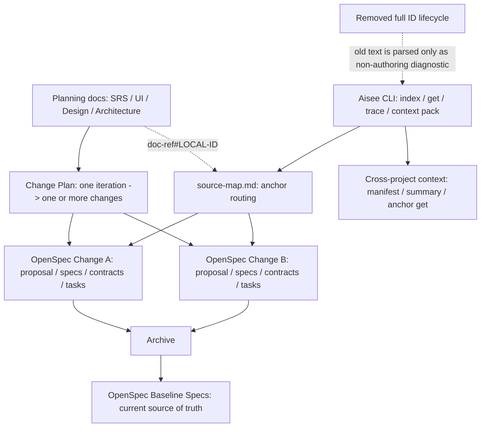

# refactor: 按敏捷模型重构 Aisee 规划文档与锚点 ID

## Summary

本计划把 Aisee 的前置文档链路调整为敏捷迭代模型：SRS、UI Content、Design、Architecture 等只作为版本 / 迭代级规划输入，`aisee:change-plan` 将其拆成 one or more OpenSpec changes，OpenSpec change artifacts 承载本次详细规格和验收承诺，archive 后由 baseline specs 接管当前事实。

同时将 ID 体系从“全局需求对象生命周期”调整为唯一正式的“文档锚点编码”模型，降低阅读负担，并让 CLI 能通过 `doc-ref#LOCAL-ID` 精准读取片段而非全量读取文档。旧 full ID 规则不再作为 authoring、schema 或 CLI lifecycle 规则保留。

---

## Problem Frame

当前主链路已经强调 OpenSpec 是 baseline 事实源，但前置 skill 仍容易被理解成完整且长期维护的事实文档，尤其是 SRS、UI Content、Design Spec 和 Architecture。V1、V2、V3 连续迭代时，如果继续原地修改旧 SRS/UI/Architecture，前置文档会和 OpenSpec baseline 形成平行事实源。

现有 ID registry 偏向项目级稳定对象身份，例如 `auth:FR-001`。这种模型能跨文档追踪，但会把 SRS/UI Content 与 ID 生命周期强绑定，并迫使读者在规划文档中阅读长 ID。当前插件仍处于优化迭代，不存在需要保护的旧项目迁移包袱，因此目标不是长期维护两套规则，而是把正式规则收敛到文档内短 ID，例如 `FR-001`、`PAGE-001`，跨文档由 `doc-ref#local-id`、source-map、index 和跨项目上下文 CLI 解析。

当前工作区已有 3 个讨论阶段误改文件：`plugins/aisee-plugin/skills/aisee-srs/SKILL.md`、`plugins/aisee-plugin/skills/aisee-srs/references/workflow.md`、`plugins/aisee-plugin/skills/aisee-ui-content/SKILL.md`。实施前必须先审查这些 diff，按本计划重写或回滚，不能把它们直接当最终方案。

---

## Requirements

**敏捷文档边界**

- R1. 所有 OpenSpec 前置文档必须明确是 planning input、brief、delta、inventory 或 evidence，不得默认成为 OpenSpec baseline 或长期系统事实源。
- R2. SRS、UI Content、Architecture、Design Spec、Design Assets 和 Change Plan 必须支持 V1/V2/V3 迭代语义，默认从 baseline specs、active changes 和当前迭代输入出发生成 delta。
- R3. 小范围、边界明确、低风险工作必须允许跳过 SRS/UI/Architecture 等前置文档，直接进入合适的 OpenSpec change 或轻量 schema。
- R4. Change Plan 必须表达“一个版本 / 迭代可拆成 one or more OpenSpec changes”，且每个 change 都是可独立交付、验证和 archive 的最小单元。

**OpenSpec 承接**

- R5. Change Author 必须把前置材料提升为当前 change 的 proposal、spec delta、contracts、tasks 和 source-map，而不是复制整份前置文档。
- R6. Schema Pack 必须按风险和 change 类型选择制品重量，app schema 的按需 artifacts 只在 Required=yes 时展开。
- R7. Spec Migrate 只能从当前可验证系统行为建立 baseline，历史 SRS/PRD/UI 文档只能作为线索，不能单独写入 baseline。
- R8. Flow、Implementation Bridge、Verify 和 Archive Guard 必须围绕当前 change 与 source-map 锚点闭合，不绕过 current change 全仓库扩展范围。

**锚点 ID 与 CLI**

- R9. 文档内允许使用短 ID，例如 `FR-001`、`PAGE-001`、`DEC-001`；唯一性由文档路径或文档别名加 local ID 保证。
- R10. 跨文档引用必须有规范形式，例如 `aisee/docs/requirements/2026-06-09-v2-auth-login-srs-delta.md#FR-001` 或 alias 形式 `srs:v2-auth-login#FR-001`。
- R11. CLI 必须以文档锚点引用作为主输入；旧 `aisee id reserve/activate/deprecate` lifecycle 命令合同必须从正式命令面移除，不得标记为 deprecated 后继续作为可用路径，也不得迁移为另一套 lifecycle。
- R12. `source-map.md`、context pack、`aisee get`、`aisee trace`、verify/archive checks 必须能检查锚点是否存在、是否断链、是否被当前 change artifacts 处理。
- R13. ID registry 不再作为事实源承载需求对象生命周期；如保留 `id-registry.json` 文件名，只能重定义为可重建的文档锚点索引或 alias index，业务生命周期以 OpenSpec change 和 baseline 为准。
- R17. 新生成的 skill 输出、schema templates、examples 和 docs 不得再要求 `aisee id reserve/activate/deprecate` 或 `scope:TYPE-001` full ID。
- R18. 跨项目上下文 CLI 必须能按 manifest-first 方式暴露当前项目的 change、contract、anchor 和 baseline context，供其他项目只读消费。
- R19. 跨项目上下文服务必须只暴露被 OpenSpec artifacts/source-map/anchor refs 显式纳入的内容，不提供全仓库搜索或敏感信息出口。

**兼容与验证**

- R14. 现有 tests 和 sample changes 中的 `scope:TYPE-001` 引用必须被迁移为 anchor refs；旧 full ID 不再作为正式输出或测试主路径。
- R15. 文档、skill、CLI、schema samples 和测试必须同步更新，避免出现新旧 ID 语义混用但无解释。
- R16. 计划实施完成后，关键链路必须通过单元测试和至少一个 fixture lifecycle 场景验证。

---

## Key Technical Decisions

- KTD1. **采用单一正式 ID 模型**：新 authoring 只使用 `doc-ref#LOCAL-ID`，文档内只显示 `LOCAL-ID`。`scope:TYPE-001` 不再作为正式规则、schema 字段或 CLI lifecycle 输入出现。
- KTD2. **把前置文档统一命名为 planning docs**：SRS、UI Content、Design Spec、Architecture 和 Change Plan 都不直接宣称为事实源；只有 OpenSpec change artifacts 和 archive 后的 baseline specs 承载规范事实。
- KTD3. **source-map 成为锚点路由中心**：当前 change 所需的上游规划内容通过 source-map 的 `Ref` 字段引用锚点；Implementation Bridge 和 context pack 只读取这些锚点附近内容。
- KTD4. **registry 转为锚点索引或废弃对象**：`aisee/registry/id-registry.json` 不再承载需求生命周期。实施时二选一：重定义为 anchor/alias index，或废弃并由 `aisee index` 可重建缓存和 source-map refs 承担解析；不得继续保留 reserve/activate/deprecate 生命周期，也不得以 deprecated 命令形式继续暴露旧写入路径。
- KTD5. **schema templates 必须同步切换**：source-map、app/device schema examples、skill ID rules 和 docs 必须同时从 full ID 切换到 anchor refs，避免出现 skill 说短 ID、schema template 仍要求完整 ID 的冲突。
- KTD6. **计划文档不直接修复误改**：当前 3 个 modified skill 文件属于讨论阶段误改。实施单元必须先审查并按最终规则重写或回滚这些修改，避免把半成品文案混入正式变更。
- KTD7. **跨项目上下文走只读 CLI/HTTP 边界**：跨项目消费只能通过 manifest、summary、section/anchor get 这类有界接口，不能让消费方直接扫描 provider 仓库。

---

## High-Level Technical Design



新的读取路径应优先从当前 change 出发：`source-map.md` 指向 `doc-ref#LOCAL-ID`，CLI 解析文档锚点并返回对应 heading/line/hash/context，context pack 再把最小上下文交给 implementation/verify/review。跨项目消费者只能通过 manifest-first 的上下文 CLI/HTTP 读取这些受控片段。历史 SRS/UI/Architecture 可以被读取为来源证据，但不再作为当前事实源推导实现范围。

---

## Implementation Units

### U1. 统一敏捷模型与前置文档命名规则

- **Goal:** 更新全局 workflow、best practices 和前置 skill 的职责边界，明确所有 OpenSpec 前置产物都是版本 / 迭代级 planning docs，并澄清 Aisee reviewer role 不是已实现 subagent runtime。
- **Requirements:** R1, R2, R3, R4, R15
- **Dependencies:** 无
- **Files:** `docs/workflow.md`, `docs/workflow.en.md`, `docs/best-practices.md`, `docs/best-practices.en.md`, `docs/ai_coding_openspec_schema_guidelines_v2.md`, `plugins/aisee-plugin/skills/aisee-srs/SKILL.md`, `plugins/aisee-plugin/skills/aisee-srs/references/workflow.md`, `plugins/aisee-plugin/skills/aisee-ui-content/SKILL.md`, `plugins/aisee-plugin/skills/aisee-ui-content/references/workflow.md`, `plugins/aisee-plugin/skills/aisee-architecture/SKILL.md`, `plugins/aisee-plugin/skills/aisee-design-spec/SKILL.md`, `plugins/aisee-plugin/skills/aisee-design-assets/SKILL.md`
- **Approach:** 将 SRS 定义为 PRD-like 版本总纲，UI Content 定义为页面内容蓝图，Architecture 定义为 architecture brief/delta，Design Spec 定义为 design spec/delta，Design Assets 定义为 evidence/candidates/briefs。所有文档保存路径和推荐文件名应包含日期、版本/迭代、scope、doc type，例如 `2026-06-09-v2-auth-login-srs-delta.md`。同时在 workflow / best-practices 中明确 `aisee-change-architect`、`aisee-spec-reviewer`、`aisee-implementation-reviewer` 当前是只读 reviewer role / review lens，不是自动启动的 subagent。
- **Patterns to follow:** `docs/workflow.md` 已有“前置文档不是 OpenSpec baseline”的表达；`docs/best-practices.en.md` 已有“Do Not Let Upfront Documents Replace Change Artifacts”。
- **Test scenarios:** Test expectation: none -- 本单元只调整文档和 skill 规则；验证通过文档审查和 U7 的 eval/schema 检查覆盖。
- **Verification:** 文档中不再出现“design-spec 是设计规范事实源”这类无条件长期事实源表述；所有前置 skill 都能回答何时生成 full brief、delta、inventory，何时跳过；reviewer role 文案不承诺已存在 subagent runtime。

### U2. 强化 change-plan、change-author、schema-pack、spec-migrate 的承接边界

- **Goal:** 让 OpenSpec 内部承接清楚区分 planning docs、change artifacts、baseline specs，防止复制前置材料或把历史规划写入 baseline。
- **Requirements:** R4, R5, R6, R7, R15
- **Dependencies:** U1
- **Files:** `plugins/aisee-plugin/skills/aisee-change-plan/SKILL.md`, `plugins/aisee-plugin/skills/aisee-change-plan/references/input-boundary-rules.md`, `plugins/aisee-plugin/skills/aisee-change-plan/references/change-boundary-algorithm.md`, `plugins/aisee-plugin/skills/aisee-change-plan/references/output-template.md`, `plugins/aisee-plugin/skills/aisee-change-author/SKILL.md`, `plugins/aisee-plugin/skills/aisee-change-author/references/authoring-rules.md`, `plugins/aisee-plugin/skills/aisee-schema-pack/SKILL.md`, `docs/schema-packs.md`, `plugins/aisee-plugin/skills/aisee-spec-migrate/SKILL.md`, `plugins/aisee-plugin/skills/aisee-spec-migrate/references/workflow.md`
- **Approach:** `change-plan` 明确输出 iteration goal、source planning docs、candidate changes、dependency/parallelism 和 source-map seed；`change-author` 明确只处理单个 change 并把相关片段提升为当前 artifacts；`schema-pack` 强调按风险选择 schema 与 Required=yes 按需展开；`spec-migrate` 强调历史规划文档只能作为线索，baseline 只来自已验证当前行为。
- **Patterns to follow:** `plugins/aisee-plugin/skills/aisee-change-plan/SKILL.md` 已有“不把 SRS 模块名、页面类型、技术层当 change”的保护规则；`plugins/aisee-plugin/skills/aisee-spec-migrate/SKILL.md` 已有“低可信度推断不能写入 baseline”的事实源边界。
- **Test scenarios:** Test expectation: none -- 本单元主要是 skill/reference 文档变更；U7 负责 eval/schema 风险检查。
- **Verification:** 示例链路应能表达 `SRS/UI/Architecture -> change-plan -> one or more OpenSpec changes -> archive -> baseline`，且不要求所有 changes 使用 app schema。

### U3. 设计文档锚点引用模型并废弃旧 full ID authoring

- **Goal:** 定义 `doc-ref#LOCAL-ID` 的语法、解析规则和 alias 规则，并将旧 full ID authoring 从新文档和 schema templates 中移除。
- **Requirements:** R9, R10, R11, R13, R14, R17
- **Dependencies:** U1
- **Files:** `plugins/aisee-plugin/references/id-policy.md`, `docs/architecture/aisee-cli-context-and-id-registry.md`, `docs/best-practices.md`, `docs/best-practices.en.md`, `src/aisee_cli/id_registry.py`, `src/aisee_cli/index.py`, `src/aisee_cli/lookup.py`, `tests/test_id_registry.py`, `tests/test_cli_context_bus.py`
- **Approach:** 在 policy 中定义 local ID、canonical anchor ref 和 alias ref 三个正式概念。新文档只生成 local ID，跨文档只使用 repo-relative path 或 alias 加 local ID。CLI 层新增解析器时应避免把 `#heading` 普通 Markdown 链接误判为 Aisee anchor，优先要求 `TYPE-001` 这类 local ID 形态。移除 `aisee id reserve/activate/deprecate` 的正式规则和命令合同；anchor/alias index 如需命令，应使用新的语义命名，不复用旧 lifecycle 命名。
- **CLI impact:** `aisee id` 命令组整体移出正式 CLI 合同；如未来需要检查 anchor 或 alias，应使用 `aisee index`、`aisee get <anchor-ref>`、`aisee trace <anchor-ref>` 或新的 anchor/alias 语义命令，不复用旧 ID lifecycle 命名。`aisee get`、`aisee trace` 的主参数从 full ID 改为 anchor ref；`aisee index` 输出从 full ID occurrence 转为 document/local-id/anchor occurrence；HTTP context endpoint 不再暴露 `/ids/<full-id>` 作为正式接口，改为 anchor-aware get/trace 能力。
- **Technical design:** Directional grammar only, not implementation specification:
  ```text
  local-id       = TYPE "-" number
  path-anchor    = repo-relative-path "#" local-id
  alias-anchor   = source-kind ":" slug "#" local-id
  accepted-ref   = path-anchor | alias-anchor
  ```
- **Patterns to follow:** `src/aisee_cli/id_registry.py` 是需要移除或重定义的旧 lifecycle 实现；`src/aisee_cli/index.py` 当前负责扫描文档、heading、ID occurrence 和 hash，更接近新模型。
- **Test scenarios:**
  - `tests/test_id_registry.py`: 删除或重写旧 `reserve/activate/deprecate` lifecycle 测试；新增 anchor/alias index 检查测试。
  - `tests/test_cli_context_bus.py`: 新主路径改为 anchor ref；旧 `auth:FR-001` 不再作为 `aisee get/trace` 成功路径。
  - 新增 anchor 解析测试：给定 `docs/requirements/v2-auth.md#FR-001`，CLI 返回该文件中 `FR-001` 所在 heading、line 和 hash。
  - 新增 alias 解析测试：给定 sources/alias 映射 `srs:v2-auth-login`，`aisee get srs:v2-auth-login#FR-001 --json` 解析到对应文档。
- **Verification:** 新 authoring 文档和 schema templates 不再出现“正式 ID 必须来自 id-registry”的规则；anchor ref JSON 输出包含 `reference_type`, `document`, `local_id`, `source`, `references`, `issues` 等可扩展字段。

### U4. 扩展 source-map、index、get/trace 和 context pack 的锚点能力

- **Goal:** 让 source-map 和 context pack 支持 upstream anchor refs，并基于当前 change 精准读取规划文档片段。
- **Requirements:** R10, R11, R12, R13, R14, R16, R17
- **Dependencies:** U3
- **Files:** `plugins/aisee-plugin/references/source-map-contract.md`, `plugins/aisee-plugin/skills/aisee-change-plan/references/source-map-rules.md`, `src/aisee_cli/source_map.py`, `src/aisee_cli/index.py`, `src/aisee_cli/lookup.py`, `src/aisee_cli/context_pack.py`, `tests/test_source_map.py`, `tests/test_context_pack.py`, `tests/test_cli_context_bus.py`
- **Approach:** 在 source-map 的 Upstream Sources / Trace 表中只使用 `Ref` 字段承载 anchor ref，移除旧 `ID` 字段，避免双重引用规则。`source_map.py` 解析 anchor refs；`index.py` 为每个 local ID occurrence 记录 path、heading、line、hash 和 related refs；`lookup.py` 让 `aisee get/trace` 以 anchor ref 为主输入；`context_pack.py` 在 traceability 中返回 upstream refs、resolved anchors 和 unresolved anchors。
- **Patterns to follow:** `src/aisee_cli/source_map.py` 当前已有 structured table + metadata fallback 模型；`src/aisee_cli/context_pack.py` 已有 `facts.derived.traceability` 和 `read_order`。
- **Test scenarios:**
  - `tests/test_source_map.py`: source-map 的 Trace 表仅包含 `Ref` 字段和 `docs/requirements/v2-auth.md#FR-001` 时，anchor 被解析为 document/local-id，而不是 full ID。
  - `tests/test_context_pack.py`: app schema change 中 source-map 指向 anchor ref 时，context pack 的 `read_order` 只包含对应文档和当前 change artifacts。
  - `tests/test_cli_context_bus.py`: `aisee trace docs/requirements/v2-auth.md#FR-001 --json` 返回关联 change、相关 PAGE anchor 和候选代码/测试路径。
  - 错误路径测试：source-map 引用不存在文档或不存在 local ID 时，输出 risk/blocker issue，不静默 fallback 为全文读取。
- **Verification:** context pack 不因 anchor ref 缺失而崩溃；缺失锚点进入 gaps/issue，完整锚点能出现在 `facts.derived.traceability`。

### U4b. 扩展跨项目上下文 CLI 与只读服务

- **Goal:** 让其他项目能通过 CLI/HTTP 读取当前项目已纳入 OpenSpec/source-map 的上下文片段，包括 contracts、anchor refs、change summaries 和 baseline references。
- **Requirements:** R18, R19
- **Dependencies:** U4
- **Files:** `src/aisee_cli/contract.py`, `src/aisee_cli/contract_server.py`, `src/aisee_cli/__main__.py`, `docs/workflow.md`, `docs/workflow.en.md`, `docs/best-practices.md`, `docs/best-practices.en.md`, `tests/test_contract_context.py`, `tests/test_contract_server.py`
- **Approach:** 扩展现有 `aisee contract manifest/summary/get/serve`，让 manifest 暴露 anchor-capable context entries，并增加按 anchor ref 获取受控片段的 endpoint 或 CLI 子命令。跨项目 consumer 先读 manifest，再按 change/contract/anchor 获取 section，不允许 provider 暴露全仓库搜索。
- **Patterns to follow:** `src/aisee_cli/contract.py` 已有 manifest-first 合同摘要；`src/aisee_cli/contract_server.py` 已有 `/manifest`、`/changes/<change>/summary`、`/ids/<id>` 和 `/trace/<id>` 入口。
- **Test scenarios:**
  - `tests/test_contract_context.py`: manifest 返回 change contracts 之外，还返回 anchor context capabilities 和可用 endpoints。
  - `tests/test_contract_server.py`: HTTP endpoint 能读取 URL-encoded anchor ref，并返回片段内容、etag、source_files 和 truncation metadata。
  - 安全测试：跨项目 context endpoint 拒绝未被 manifest/source-map 暴露的任意路径读取。
- **Verification:** 跨项目上下文服务只能返回 OpenSpec/source-map/anchor 明确引用的内容；LAN warning 和 max_chars 限制保持有效。

### U5. 调整 flow、implementation-bridge、verify、archive-guard 的门禁语义

- **Goal:** 让第三优先级流程工具围绕当前 change 和锚点闭合，不要求所有前置 ID 都是全局 active，并避免把 reviewer role 误表达为自动执行的 subagent。
- **Requirements:** R8, R12, R13, R16
- **Dependencies:** U4
- **Files:** `plugins/aisee-plugin/skills/aisee-flow/SKILL.md`, `plugins/aisee-plugin/skills/aisee-implementation-bridge/SKILL.md`, `plugins/aisee-plugin/skills/aisee-verify/SKILL.md`, `plugins/aisee-plugin/skills/aisee-archive-guard/SKILL.md`, `src/aisee_cli/flow.py`, `src/aisee_cli/change_checks.py`, `src/aisee_cli/author_check.py`, `tests/test_doctor_flow_schema.py`, `tests/test_change_checks.py`, `tests/test_lifecycle_dogfood.py`
- **Approach:** `flow` 判断是否已有可定位 planning anchors，而不是强制全局 ID 完备；`implementation-bridge` 只消费 context pack resolved anchors；`verify/archive-guard` 检查 anchor 是否解析、source-map 是否覆盖、artifacts/tasks/evidence 是否闭合。移除旧 full ID inactive/removed 门禁；如果扫描到旧 full ID 文本，只作为非 authoring 诊断提示。`aisee:verify` 只能建议或消费只读 reviewer role 的结构化结论，不得声称会自动启动 `aisee-change-architect`、`aisee-spec-reviewer` 或 `aisee-implementation-reviewer`。
- **Patterns to follow:** `plugins/aisee-plugin/skills/aisee-implementation-bridge/SKILL.md` 已要求只能通过当前 change 获取上下文；`src/aisee_cli/change_checks.py` 已以 context pack 为基础构建 verify/archive checks。
- **Test scenarios:**
  - `tests/test_change_checks.py`: 只有 anchor refs、没有 id-registry 的 source-map 不应触发 `ID_UNREGISTERED_REFERENCE` blocker，但缺失 anchor 应触发明确 issue。
  - `tests/test_doctor_flow_schema.py`: flow inspect 能在存在 planning docs + change-plan 但未创建 change 时推荐 change-plan 或 change-author 的正确下一步。
  - `tests/test_lifecycle_dogfood.py`: full lifecycle fixture 迁移为 anchor ref 路径，不再依赖 full ID。
- **Verification:** verify/archive 输出区分 `full_id_registry` 问题和 `anchor_resolution` 问题，不把 local ID 当全局 registry 缺失处理。

### U6. 更新 schema samples、fixtures 和 evals

- **Goal:** 用样例固定新模型，避免只改规则没有可执行证据。
- **Requirements:** R14, R15, R16, R17
- **Dependencies:** U1, U2, U3, U4, U5
- **Files:** `plugins/aisee-plugin/skills/aisee-schema-pack/assets/schema-pack/aisee-app-spec-driven/templates/source-map.md`, `plugins/aisee-plugin/skills/aisee-schema-pack/assets/schema-pack/aisee-device-spec-driven/templates/source-map.md`, `plugins/aisee-plugin/skills/aisee-schema-pack/assets/schema-pack/aisee-app-spec-driven/examples/add-passwordless-login/source-map.md`, `tests/fixtures/scenarios/app-full-lifecycle/aisee/docs/requirements/auth-srs.md`, `tests/fixtures/scenarios/app-full-lifecycle/aisee/docs/ui-content/auth-ui.md`, `tests/fixtures/scenarios/app-full-lifecycle/openspec/changes/add-passwordless-login/source-map.md`, `plugins/aisee-plugin/skills/aisee-srs/evals/evals.json`, `plugins/aisee-plugin/skills/aisee-ui-content/evals/evals.json`, `plugins/aisee-plugin/skills/aisee-change-plan/evals/evals.json`
- **Approach:** 将 schema source-map templates、app/device examples 和 lifecycle fixtures 从 full ID 改为 anchor ref。模板中只用 `Ref` 字段示范 anchor ref，并移除 `ID` 字段和“完整 ID 必须来自 registry”的正式要求。
- **Patterns to follow:** `tests/fixtures/scenarios/app-full-lifecycle/` 已覆盖 app lifecycle；`plugins/aisee-plugin/skills/aisee-schema-pack/assets/schema-pack/aisee-app-spec-driven/examples/add-passwordless-login/` 是 schema sample change。
- **Test scenarios:**
  - schema sample check 继续通过。
  - skill eval 中出现 V2/V3 迭代输入时，预期输出为 delta 或 change-plan，而非全量重写。
  - app full lifecycle fixture 覆盖 local ID + anchor ref 追踪。
- **Verification:** sample source-map 不复制前置文档正文，且能表达 artifact Required=yes/no 与 anchor refs。

### U7. 执行测试、文档审查和兼容验证

- **Goal:** 验证计划改动没有破坏 CLI JSON 合同、schema sample、context pack 和生命周期 fixture。
- **Requirements:** R14, R15, R16, R18, R19
- **Dependencies:** U1, U2, U3, U4, U4b, U5, U6
- **Files:** `tests/test_id_registry.py`, `tests/test_cli_context_bus.py`, `tests/test_source_map.py`, `tests/test_context_pack.py`, `tests/test_change_checks.py`, `tests/test_doctor_flow_schema.py`, `tests/test_lifecycle_dogfood.py`, `tests/test_schema_pack_examples.py`, `tests/test_skill_eval_schema.py`, `tests/test_contract_context.py`, `tests/test_contract_server.py`, `docs/reviews/`
- **Approach:** 先跑 ID/source-map/context pack 的窄测试，再跑 lifecycle/schema sample/eval schema 相关测试。由于本次触及 CLI parser、schema templates 和 skill policy，完成后建议做一次 Tier 2 code review 或至少本地重点自审，并把结论写入 `docs/reviews/`。
- **Patterns to follow:** `docs/reviews/2026-06-03-darwin-skill-audit.md` 展示了 skill 审查报告结构；测试文件已按 CLI 子系统拆分。
- **Test scenarios:**
  - 旧 full ID lifecycle tests 删除或重写，确保新正式路径不依赖 id-registry。
  - Anchor ref 新增 tests 覆盖 path-anchor、alias-anchor、missing document、missing local ID。
  - Context pack tests 覆盖 anchor-based read order 和 unresolved anchor gaps。
  - Change checks tests 覆盖 verify/archive 对 anchor resolution 的风险/阻断判定。
  - Cross-project context tests 覆盖 manifest-first、anchor get、路径越界拒绝和 max_chars 截断。
  - Skill eval schema tests 保证新增 eval 字段或期望没有破坏 eval 文件格式。
- **Verification:** 关键测试集通过；如无法跑全量测试，至少记录未跑原因和剩余风险。

---

## Scope Boundaries

- 本计划包含 CLI 锚点引用能力、registry/index/source-map/context pack 调整、跨项目上下文 CLI、skill 文档重写、schema templates、fixtures 和 tests。
- 本计划要求新 authoring 规则移除 full ID lifecycle，并删除 `reserve/activate/deprecate` lifecycle 命令合同；不再把旧命令标注 deprecated 后保留为正式入口。
- 本计划不实现 OpenSpec CLI 本身的 schema 或 archive 逻辑变更。
- 本计划不实现新的 subagent runtime；三个 Aisee reviewer 仅作为只读一致性审查 role / review lens 做命名与契约澄清。
- 本计划不重构硬件 `hw:*` 链路；硬件链路后续应单独套用同一敏捷模型。
- 当前 3 个 modified skill 文件不视为已完成工作；实施时必须先按最终设计审查并处理。

### Deferred to Follow-Up Work

- 将 `hw:srs`、`hw:architecture`、`hw:change-plan` 合并或迁移到统一 device-domain reference。
- 如未来需要真实 subagent，再单独设计 `aisee-change-architect`、`aisee-spec-reviewer`、`aisee-implementation-reviewer` 的输入 contract、输出 schema、evidence 写入和 CE 边界。
- 如未来需要支持真实旧项目，再提供自动迁移命令，把前置文档 full ID 批量转换为 local ID + anchor refs。
- 为跨项目上下文服务增加认证、访问控制或 allowlist；当前仅规划本地/受控 LAN 只读能力。

---

## Risks & Dependencies

- **破坏性变更风险：** 移除 full ID lifecycle 会影响现有测试和样例。当前没有旧项目需要保护，缓解方式是同步迁移 tests/templates/fixtures，并移除旧 lifecycle 命令合同。
- **语义漂移风险：** 如果只改 skill 文案，不改 CLI/context pack，agent 仍可能全量读取前置文档。缓解方式是 U4/U5 将 anchor resolution 纳入上下文包和门禁。
- **source-map 表格膨胀风险：** anchor ref 如果混在旧 ID 字段中会难读。缓解方式是用 `Ref` 字段作为唯一正式跨文档引用字段。
- **跨项目暴露风险：** context service 可能泄露未纳入 change 的文件。缓解方式是 manifest-first、source-map/anchor allowlist、max_chars 和路径越界拒绝。
- **误改残留风险：** 讨论阶段已有 3 个 modified 文件。缓解方式是 U1 实施前先审查 diff，按最终方案重写或回滚。
- **审查风险：** 本次触及 CLI parser、source-map、context pack 和 archive gate，属于公开 CLI/JSON/路径读取表面。实施后应执行重点 code review。

---

## Documentation / Operational Notes

文档更新需要同步中文和英文 workflow / best practices，避免用户只读其中一份时得到不同事实源模型。所有新增术语建议统一使用：

- `planning docs`
- `iteration brief`
- `delta`
- `inventory`
- `OpenSpec changes`
- `baseline specs`
- `local ID`
- `anchor ref`
- `removed full ID lifecycle`
- `alias ref`
- `cross-project context`

计划实施完成后，README 或 marketplace listing 如引用旧线性流程，应在后续单独检查；本计划优先覆盖 skill、workflow、best practices、schema samples 和 CLI tests。

---

## Sources / Research

- `AGENTS.md`：要求默认中文、OpenSpec change/baseline 是规范事实源、不要创建平行规范事实源。
- `docs/workflow.md`：现有 Aisee 与 OpenSpec 工作流入口，已包含“前置文档不是 OpenSpec baseline”原则。
- `docs/best-practices.en.md`：现有事实源、source-map、context pack 和 implementation brief 边界。
- `docs/ai_coding_openspec_schema_guidelines_v2.md`：已有“change 前 planning、change 内详细 delta、change 后 baseline”的设计方向。
- `plugins/aisee-plugin/skills/aisee-srs/SKILL.md`、`plugins/aisee-plugin/skills/aisee-ui-content/SKILL.md`、`plugins/aisee-plugin/skills/aisee-architecture/SKILL.md`、`plugins/aisee-plugin/skills/aisee-design-spec/SKILL.md`、`plugins/aisee-plugin/skills/aisee-design-assets/SKILL.md`：前置 planning skill 的当前职责边界。
- `plugins/aisee-plugin/skills/aisee-change-plan/SKILL.md`、`plugins/aisee-plugin/skills/aisee-change-author/SKILL.md`、`plugins/aisee-plugin/skills/aisee-schema-pack/SKILL.md`、`plugins/aisee-plugin/skills/aisee-spec-migrate/SKILL.md`：OpenSpec 承接链路。
- `src/aisee_cli/id_registry.py`、`src/aisee_cli/index.py`、`src/aisee_cli/lookup.py`、`src/aisee_cli/source_map.py`、`src/aisee_cli/context_pack.py`、`src/aisee_cli/change_checks.py`：ID、source-map、context pack 和 verify/archive 检查实现入口。
- `src/aisee_cli/contract.py`、`src/aisee_cli/contract_server.py`、`tests/test_contract_context.py`、`tests/test_contract_server.py`：现有跨项目 contract context CLI/HTTP 能力，可扩展为 anchor-aware cross-project context。
