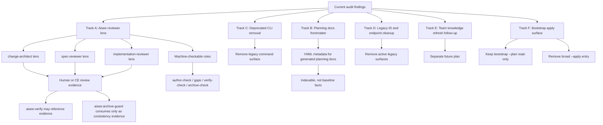

# feat: 拆分未实现契约处理方案

## Summary

本计划把刚才审计出的“已写入契约但未形成可执行能力”的问题拆成六条互不混淆的工作线：Aisee reviewer lens、planning docs frontmatter 合同、废弃 CLI 命令删除、`bootstrap --apply` 未实现入口处理、旧 ID/endpoint 活跃残留清理、team knowledge refresh 后续能力。Reviewer 不作为独立 CLI/runtime 实现；可机器化的一致性检查继续沉淀到现有 schema-aware gates。

---

## Problem Frame

当前仓库已有大量 skill、workflow 和 README 文案约束 Aisee / OpenSpec / Compound Engineering 的职责边界，但部分表述容易被读成“已经有可执行 runtime”。最明显的是 `aisee-change-architect`、`aisee-spec-reviewer`、`aisee-implementation-reviewer` 三个 reviewer role：它们已经出现在 `aisee:verify`、workflow 和 eval 中，但它们的判断高度依赖 schema template、source-map 表结构、tasks 和 evidence 约定。

因此 reviewer 不应先做成独立 CLI 或 subagent runtime。更稳妥的方向是把它们定义为只读 review lens；能稳定机器判断的规则进入 `author-check`、`gaps`、`verify-check`、`archive-check` 或 schema pack 声明。另一个独立缺口是普通 Aisee planning docs 主要使用正文元数据，缺少类似 CE plan 和 team knowledge card 的统一 YAML frontmatter 合同。其它问题性质也不同：`plugin export`、`schemas install`、`knowledge scaffold` 已是 marketplace 迁移后的废弃内容分发命令，应从 CLI 命令面删除；`bootstrap --apply` 是跨多个职责边界的未实现写入入口，应单独处理；旧 `aisee id` lifecycle 和 `/ids/{id}` 在当前入口、测试或契约文档中的活跃残留应直接清理；team knowledge refresh 是后续独立能力。

---

## Requirements

- R1. Reviewer 必须被明确表述为只读 review lens，不作为独立 CLI、subagent runtime 或自动执行器。
- R2. 三个 reviewer lens 的关注点必须互斥：change 边界、spec/artifact 一致性、implementation/evidence 一致性分别检查。
- R3. `aisee:verify` 和 `aisee:archive-guard` 只能建议使用 reviewer lens 或消费人工/CE 审查 evidence，不能把 reviewer lens 当作 CE review/test 或 archive approval。
- R4. 已废弃的内容分发命令必须从公开 CLI 命令面删除；不得继续以稳定 blocker 形式制造“将来会实现”的误读。
- R5. 旧 full ID lifecycle、旧 `/ids/{id}` endpoint、`id-registry` authoring 语义和自动迁移命令必须从当前入口、模板、测试和 active references 中清理；历史计划/审计文档只作为历史记录保留。
- R6. Team knowledge refresh 不并入 reviewer lens 或 runtime；本轮只明确它是后续独立工作，并保留当前 check/query/index/promote-batch 边界。
- R7. 每条工作线都必须有独立测试或文档验证，避免一个测试同时证明多个无关问题。
- R8. Aisee 普通 planning docs 必须获得统一 YAML frontmatter 合同，但不得把 planning docs 提升为 OpenSpec baseline 事实源。
- R9. `bootstrap --apply` 必须从公开 CLI 入口中移除或被收窄为明确、幂等、低风险的写入能力；不得继续作为永久 not implemented blocker。
- R10. CLI 命令面必须职责单一且默认做减法：非必须、可由现有命令/skill/文档流程替代、或 owner 不清晰的命令不得新增；已存在的这类入口应删除或迁出公开 help。

---

## Scope Boundaries

### In Scope

- 将三个 Aisee reviewer 明确降级为只读 review lens，而不是 runtime 或 CLI。
- 将可机器化的一致性检查沉淀到现有 schema-aware gates，而不是新增 parallel reviewer 命令。
- 给 reviewer lens 增加 focused eval / docs tests，覆盖只读、职责分离和“不替代 CE”的边界。
- 为 Aisee SRS、UI Content、Architecture、Design Spec、Design Assets、Implementation Brief、Reflect 等普通 planning docs 定义统一 frontmatter 最小字段和模板写法。
- 删除 deprecated 内容分发命令及其 blocker 测试，避免后续误实现为写入能力。
- 移除或收窄 `bootstrap --apply` 这个未实现的宽泛写入入口，保留 `bootstrap --plan` 的只读初始化计划职责。
- 清理当前用户入口、模板、测试和 active references 中的旧 ID/endpoint 残留，而不是只加提示。
- 建立命令职责矩阵，明确哪些命令保留、删除、只读化或交给 skill/文档流程处理。

### Deferred to Follow-Up Work

- Team knowledge stale card refresh 工作流。它涉及 knowledge lifecycle、card freshness、repo sync 和 review policy，应单独规划。
- 旧 full ID 到 anchor ref 的自动迁移命令。当前没有真实旧项目保护需求，先不实现批量迁移。
- Codex / CE / harness subagent runtime 适配层。未来如需 runtime，应先设计 schema-aware check contract，而不是直接包装 reviewer lens。

### Out of Scope

- 不创建 API/UI/硬件等按领域命名的全能审查 agent。
- 不让 Aisee reviewer 替代 `ce-doc-review`、`ce-code-review`、`ce-test-*` 或 `ce-work`。
- 不要求 OpenSpec change artifacts 全部改成 YAML frontmatter；它们继续以 schema/template/OpenSpec 规则为准。
- 不恢复 `aisee id reserve/activate/deprecate/check` 作为正式命令面。
- 不保留 `plugin export`、`schemas install`、`knowledge scaffold` 作为公开 CLI 命令。
- 不为“方便入口”新增聚合型写入命令；如不能证明单一职责和不可替代性，默认不做。

---

## Key Technical Decisions

- KTD1. Reviewer 不做 CLI/runtime：三个 reviewer 保持为 review lens，避免和 schema template 形成脆弱的平行实现。
- KTD2. 机器检查进入现有 gates：稳定规则放入 `author-check`、`gaps`、`verify-check`、`archive-check` 或 schema pack 声明，避免新增解释型 `verify-check`。
- KTD3. Planning docs frontmatter 是检索合同，不是事实源升级：frontmatter 只承载 doc identity、doc type、status、date、scope、source refs 等索引字段；正文和 OpenSpec artifacts 仍承载规范内容。
- KTD4. Deprecated 内容分发命令直接删除：这类命令不再推荐，也不会恢复写入能力；删除比保留 blocker 更能减少命令面噪音。
- KTD5. 旧 ID/endpoint 活跃残留直接清理：历史计划/审计文件可保留上下文，但 README、workflow、architecture、active references、CLI diagnostics 和 tests 不得继续依赖旧模型。
- KTD6. Knowledge refresh 另立 change：refresh 的对象是 team knowledge 生命周期，不是 reviewer lens；本轮只标注缺口，不设计其实现细节。
- KTD7. Bootstrap 只保留 read-only plan：`bootstrap --apply` 当前会跨越 OpenSpec 初始化、Aisee init、marketplace 安装和 legacy migration 多个职责边界；本轮不实现大一统写入器，优先删除该未实现入口。
- KTD8. 命令面采用单 owner 原则：只读协调器可以跨域观察，但不能写入；写入命令只能拥有一个领域；非必须命令删除优先于补实现。

## Command Ownership Matrix

| Entry | Ownership | Decision | Boundary |
| --- | --- | --- | --- |
| `aisee bootstrap --plan` | 只读初始化协调器 | 保留 | 只报告缺口和下一步 owner，不写文件。 |
| `aisee bootstrap --apply` | 无单一 owner | 删除公开入口 | 不实现跨 OpenSpec、Aisee init、marketplace 和 migration 的聚合写入。 |
| `aisee openspec ensure` | OpenSpec 初始化 | 保留 | 只处理 OpenSpec 依赖、目录和基础初始化。 |
| `aisee:init` | Aisee 项目 scaffolding skill | 保留 | 只处理 Aisee 本地项目结构、AGENTS、memory、hooks 和相关确认门禁。 |
| `aisee plugin export` | 旧内容分发 | 删除 | marketplace 迁移后不再作为 CLI 分发入口。 |
| `aisee schemas install` | 旧 schema 分发 | 删除 | schema pack 来源应是 marketplace-installed plugin 或外部仓库。 |
| `aisee knowledge scaffold` | 旧 knowledge 模板分发 | 删除 | 模板和团队知识仓库流程不由公开 CLI scaffold 持有。 |
| `aisee plugin path` | 开发诊断 / source checkout 定位 | 评估后保留或移出公开 help | 只有在服务本地开发且保持只读时才保留；不得作为资产分发 fallback。 |
| `aisee id reserve/activate/deprecate/check` | 旧 ID lifecycle | 删除 / 不恢复 | 当前模型使用 anchor refs、source-map、get/trace。 |

---

## High-Level Technical Design

该结构的关键约束是分层：reviewer lens 用于人工或 CE 审查视角；可机器化规则进入现有 gates；verify/archive 只能消费 evidence 和 gate 输出，不能把 lens 本身当作批准。

---

## Implementation Units

### U1. Clarify Reviewer Lens Contract

- **Goal:** 将三个 Aisee reviewer 明确为只读 review lens，移除“已存在 runtime / CLI”的误读空间。
- **Requirements:** R1, R2, R3
- **Dependencies:** none
- **Files:** `plugins/aisee-plugin/skills/aisee-verify/SKILL.md`, `plugins/aisee-plugin/skills/aisee-archive-guard/SKILL.md`, `plugins/aisee-plugin/skills/aisee-flow/SKILL.md`, `docs/workflow.md`, `docs/best-practices.md`, `README.md`, `plugins/aisee-plugin/skills/aisee-verify/evals/evals.json`
- **Approach:** 将 reviewer 文案统一为“lens / role / review viewpoint”，明确没有 `aisee review` CLI、不会自动启动 subagent、不会修改代码或运行测试。每个 lens 只列关注点、触发时机和可落地 evidence 类型。需要机器判断的检查项必须指向现有 CLI gates 或 schema pack 声明。
- **Patterns to follow:** `aisee:verify` 已有“不自动启动 subagent”边界；`aisee:flow` 已有“只输出触发建议”的表述；eval 中已有“不要求实现 subagent runtime”的约束。
- **Test scenarios:**
  - `aisee:verify` eval 明确不得创建 reviewer runtime 或 `aisee review` 命令承诺。
  - README 和 workflow 中 reviewer 段落使用 lens 语义，不出现“自动触发”“CLI 子命令已可用”之类表述。
  - 三个 lens 的职责不重叠：change boundary、spec consistency、implementation evidence 分别描述。
  - 文档仍允许消费人工/CE 审查 evidence，但不把 lens pass 写成 archive approval。
- **Verification:** reviewer 文案全仓一致；eval 能防止 future prompt 再把 lens 写成 runtime。

### U2. Move Machine-Checkable Reviewer Rules Into Existing Gates

- **Goal:** 把 reviewer lens 中稳定、可机器判断的检查项收敛到现有 schema-aware gates，而不是新增 reviewer CLI。
- **Requirements:** R1, R2, R7
- **Dependencies:** U1
- **Files:** `src/aisee_cli/author_check.py`, `src/aisee_cli/change_checks.py`, `src/aisee_cli/context_pack.py`, `src/aisee_cli/source_map.py`, `tests/test_change_checks.py`, `tests/test_context_pack.py`, `tests/test_source_map.py`
- **Approach:** 盘点三个 lens 中可稳定机器判断的规则：schema DAG、必需 artifact、artifact applicability、anchor/source-map 解析、tasks 状态、implementation paths、test/review/manual evidence。已有 gate 覆盖的只补文档映射；未覆盖但稳定的规则补进对应 gate。依赖自然语言判断的 change 粒度、边界合理性和实现漂移只保留为 lens 建议。
- **Patterns to follow:** `build_author_check` 处理 schema/order/anchor actions；`build_verify_check` 处理 blockers/warnings/status；`context_pack` target-specific derived fields 保持只读上下文。
- **Test scenarios:**
  - 缺少必需 artifact 时，`author-check` 或 `gaps` 报告 blocker/risk，不需要 reviewer CLI。
  - tasks 全部完成但缺少 test evidence 时，`verify-check` 输出 evidence risk。
  - change 中存在 legacy full ID 时，source-map/context pack 输出兼容诊断，而不是恢复旧 lifecycle。
  - quick-fix schema 不被强制要求 app-only source-map/contracts。
- **Verification:** 所有新增机器规则都有 schema-aware gate 测试；没有新增 `aisee review` 命令面。

### U3. Align Verify And Archive With Lens-Based Evidence

- **Goal:** 让 `aisee:verify` / `aisee:archive-guard` 建议或消费 reviewer lens 产生的人工/CE evidence，同时继续依赖现有 gates。
- **Requirements:** R3, R7
- **Dependencies:** U1, U2
- **Files:** `plugins/aisee-plugin/skills/aisee-verify/SKILL.md`, `plugins/aisee-plugin/skills/aisee-archive-guard/SKILL.md`, `plugins/aisee-plugin/skills/aisee-flow/SKILL.md`, `docs/workflow.md`, `README.md`, `tests/test_change_checks.py`, `tests/test_context_pack.py`
- **Approach:** 更新 skill 文案，把 reviewer role 表述改为“建议使用 lens 做人工/CE 审查并记录 evidence”。context pack 可识别明确的 Aisee reviewer evidence 文件，但仍区分 CE review/test。`verify-check` 只暴露 evidence presence 或缺口，不把 reviewer lens 缺失直接等同于 blocker，除非当前 schema 或 gate 已声明该 evidence 必需。
- **Patterns to follow:** `build_evidence` 对 `ce_doc_review`、`ce_code_review`、`details.reviews` 的解析方式；`archive-guard` 现有 Tier 2 review gate 规则。
- **Test scenarios:**
  - 有 `aisee-implementation-reviewer` lens evidence 时，context pack 能显示 Aisee consistency evidence，但 `ce_code_review` 仍为空。
  - `aisee:verify` 建议 reviewer 时，Suggested Next Step 使用“按 implementation-reviewer lens 记录审查 evidence”，而不是不存在的 CLI。
  - archive-check 不因 Aisee reviewer pass 而绕过 open P1 CE finding、failed test 或 failed validate。
  - reviewer evidence 缺失时，verify 输出 risk 或 next step；archive guard 仍按 validate/tasks/evidence blocker 规则判定。
- **Verification:** verify/archive 文案和 evidence 语义一致；现有 CE review/test tests 不回退。

### U4. Define Planning Docs Frontmatter Contract

- **Goal:** 为 Aisee 普通 planning docs 增加统一 YAML frontmatter 合同，使文档更容易被索引、筛选和追踪。
- **Requirements:** R8, R7
- **Dependencies:** none
- **Files:** `plugins/aisee-plugin/references/planning-doc-frontmatter.md`, `plugins/aisee-plugin/skills/aisee-srs/SKILL.md`, `plugins/aisee-plugin/skills/aisee-ui-content/SKILL.md`, `plugins/aisee-plugin/skills/aisee-architecture/SKILL.md`, `plugins/aisee-plugin/skills/aisee-design-spec/SKILL.md`, `plugins/aisee-plugin/skills/aisee-design-assets/SKILL.md`, `plugins/aisee-plugin/skills/aisee-implementation-bridge/SKILL.md`, `plugins/aisee-plugin/skills/aisee-reflect/SKILL.md`, `docs/workflow.md`, `README.md`
- **Approach:** 定义最小字段：`title`、`doc_type`、`status`、`date`、`scope`、`owner`、`source_refs`、`change_refs`、`anchors`。字段只做身份、状态、来源和索引，不承载需求正文、验收规则或 baseline 事实。模板中保留原有正文元数据时，应避免重复冲突：正文可显示人类可读摘要，frontmatter 是机器入口。
- **Patterns to follow:** CE plan frontmatter 的 `title/type/status/date` 稳定字段；team knowledge card frontmatter 的机器过滤字段；AGENTS 中“OpenSpec change 和 baseline 是规范事实源”的边界。
- **Test scenarios:**
  - SRS / UI Content / Architecture / Design Spec 模板示例都包含 YAML frontmatter，且正文仍保留必要的人类可读元数据。
  - frontmatter 中 `status` 不被解释为 OpenSpec lifecycle 状态，只表示 planning doc 状态。
  - `source_refs` 和 `change_refs` 使用 repo-relative path 或 anchor ref，不使用旧 full ID lifecycle。
  - 文档说明 frontmatter 不替代 `source-map.md`、OpenSpec artifacts 或 baseline specs。
- **Verification:** 新 reference 文件定义字段合同；主要 planning doc skills 引用同一合同；模板不再各自发明不兼容元数据。

### U5. Update Planning Doc Templates And Checks

- **Goal:** 将 frontmatter 合同落到主要 Aisee planning doc 模板，并增加轻量结构检查。
- **Requirements:** R8, R7
- **Dependencies:** U4
- **Files:** `plugins/aisee-plugin/skills/aisee-srs/assets/*.md`, `plugins/aisee-plugin/skills/aisee-ui-content/assets/*.md`, `plugins/aisee-plugin/skills/aisee-architecture/assets/*.md`, `plugins/aisee-plugin/skills/aisee-design-spec/assets/*.md`, `plugins/aisee-plugin/skills/aisee-design-assets/assets/*.md`, `plugins/aisee-plugin/skills/aisee-implementation-bridge/references/*.md`, `plugins/aisee-plugin/skills/aisee-reflect/references/*.md`, `tests/test_skill_cli_preflight.py`, `tests/test_plugin_packaging.py`
- **Approach:** 在模板入口统一加入 frontmatter 块，占位值使用模板变量，不写死项目事实。已有“文档编号/版本/状态/创建日期/作者/ID Scope”等正文元数据改为与 frontmatter 对齐，避免同一字段出现两个不同值。测试只检查模板包含必需字段和 packaged asset 同步，不要求解析所有生成文档。
- **Patterns to follow:** `tests/test_skill_eval_schema.py` 的资产结构测试方式；`tests/test_plugin_packaging.py` 的 packaged asset 同步思路。
- **Test scenarios:**
  - 每类主要 planning doc 模板都以 `---` frontmatter 开头，并包含必需字段。
  - 模板中的 `doc_type` 值来自固定集合，例如 `srs`、`ui-content`、`architecture`、`design-spec`、`design-assets`、`implementation-brief`、`reflect`。
  - 打包资产测试能发现模板和 marketplace plugin asset 副本不同步。
  - 不扫描或要求 OpenSpec change artifacts 必须使用 planning doc frontmatter。
- **Verification:** 模板结构测试通过；README/workflow 能说明 planning docs frontmatter 的用途和限制。

### U6. Remove Deprecated Content Distribution Commands

- **Goal:** 删除已废弃的内容分发 CLI 命令，避免旧 blocker 继续占据公开命令面。
- **Requirements:** R4, R7
- **Dependencies:** none
- **Files:** `src/aisee_cli/__main__.py`, `src/aisee_cli/plugin_assets.py`, `src/aisee_cli/schema_pack.py`, `src/aisee_cli/knowledge.py`, `tests/test_cli_command_surface.py`, `tests/test_plugin_packaging.py`, `tests/test_knowledge_scaffold.py`, `tests/test_doctor_flow_schema.py`, `README.md`, `README.en.md`, `docs/compatibility-policy.md`, `docs/compatibility-policy.en.md`, `docs/release.md`
- **Approach:** 从 argparse 中删除 `plugin export`、`schemas install`、`knowledge scaffold` 子命令，删除或重写对应 builder 函数和 blocker tests。README / compatibility policy 不再承诺这些命令返回稳定 blocker，只说明旧内容分发能力已移除，schema packs 和 team knowledge 模板来自 marketplace-installed plugin 或外部仓库。`bootstrap --apply` 不是 deprecated 内容分发命令，由 U7 单独处理。
- **Patterns to follow:** `schemas list/check` 和 `plugin inspect` 保持只读状态检查；`aisee-schema-pack` skill 指向 marketplace plugin 内容；team knowledge 文档指向 plugin asset 模板或外部知识库。
- **Test scenarios:**
  - `aisee plugin export ...`、`aisee schemas install ...`、`aisee knowledge scaffold ...` 返回 argparse unknown subcommand / missing subcommand 风格错误，而不是 deprecated blocker JSON。
  - Top-level help 和子命令 help 不再展示这三个命令。
  - README CLI reference 不再出现这三个命令；schema-pack 和 team knowledge 文档给出 marketplace / 外部仓库替代路径。
  - `plugin path` 单独评估：如果仅服务 source checkout 开发，可保留并说明用途；如果只剩 PyPI fallback blocker，则一并删除或迁出公开 help。
- **Verification:** 公开 CLI 命令面不再包含已废弃内容分发命令；相关测试不再固定 deprecated blocker 行为。

### U7. Resolve Bootstrap Apply Surface

- **Goal:** 移除 `bootstrap --apply` 这个未实现的宽泛写入入口，保留 `bootstrap --plan` 作为只读初始化计划器。
- **Requirements:** R9, R7
- **Dependencies:** none
- **Files:** `src/aisee_cli/__main__.py`, `src/aisee_cli/bootstrap.py`, `tests/test_doctor_flow_schema.py`, `README.md`, `README.en.md`, `docs/workflow.md`, `docs/workflow.en.md`, `plugins/aisee-plugin/skills/aisee-init/references/layout-migration.md`
- **Approach:** 从 argparse 中移除 `bootstrap --apply` flag 和 `build_bootstrap_apply_response`，删除 `BOOTSTRAP_APPLY_NOT_IMPLEMENTED` blocker 测试。`bootstrap --plan` 继续返回 read-only actions，并将写入动作路由到明确 owner：OpenSpec 初始化走 `aisee openspec ensure`，Aisee 项目文件和 hooks 走 `aisee:init`，schema/plugin 内容走 marketplace，legacy migration 继续要求人工确认。
- **Patterns to follow:** README 当前只推荐 `aisee bootstrap --plan --json`；`aisee:init` 已持有 AGENTS/hooks/memory 写入确认门禁；`aisee openspec ensure` 已持有 OpenSpec 初始化逻辑。
- **Test scenarios:**
  - `aisee bootstrap --help` 不再展示 `--apply`。
  - `aisee bootstrap --plan --json` 继续返回 `writes=false` 和 `apply_supported=false`。
  - 调用 `aisee bootstrap --apply --json` 得到 argparse unknown argument 错误，而不是稳定 blocker JSON。
  - bootstrap plan 不建议创建 `id-registry.json`，避免和旧 ID lifecycle 清理冲突。
- **Verification:** CLI 不再暴露永久未实现写入入口；初始化写入职责由已有专用命令或 skill 承接。

### U8. Remove Active Legacy ID And Endpoint Residue

- **Goal:** 直接清理当前入口、active references、CLI diagnostics 和测试中的旧 full ID lifecycle、`id-registry` authoring 语义和旧 `/ids/{id}` endpoint 残留，只保留 anchor ref 现行模型。
- **Requirements:** R5, R7
- **Dependencies:** U7
- **Files:** `README.md`, `README.en.md`, `docs/workflow.md`, `docs/workflow.en.md`, `docs/architecture/aisee-cli-context-and-id-registry.md`, `docs/architecture/aisee-openspec-compound-integration.md`, `plugins/aisee-plugin/references/context-pack-contract.md`, `plugins/aisee-plugin/references/id-policy.md`, `src/aisee_cli/bootstrap.py`, `src/aisee_cli/doctor.py`, `src/aisee_cli/paths.py`, `src/aisee_cli/id_registry.py`, `tests/test_cli_command_surface.py`, `tests/test_contract_server.py`, `tests/test_doctor_flow_schema.py`, `tests/test_id_registry.py`
- **Approach:** 当前入口文档只展示 `aisee get <anchor-ref>`、`aisee trace <anchor-ref>`、HTTP `/anchors/{ref}` 和 `/trace/{ref}`。active references 中不得再把 `aisee/registry/id-registry.json` 描述为事实源；如仍保留兼容读取，只应输出 legacy diagnostic，并从 bootstrap 创建建议、doctor 核心健康项和 top-level help 断言中移除。历史计划和审计文档不重写，但不得被 README/workflow/architecture 当成现行依据引用。
- **Patterns to follow:** `contract_server.route_contract_request` 当前支持 `/anchors/{ref}` 和 `/trace/{ref}`；`lookup.py` 对 legacy full ID 只输出诊断；`aisee index` 和 `sources.json` 是当前可重建追踪入口。
- **Test scenarios:**
  - CLI help 不再要求存在 `aisee id` 命令组。
  - HTTP `/anchors/<encoded-ref>` 可以读取 anchor；旧 `/ids/<id>` 不作为当前成功路径。
  - README、workflow、active references 和 schema-facing docs 当前流程不出现 `aisee id reserve/activate/deprecate` 推荐命令。
  - `aisee doctor` 不把缺少 `id-registry.json` 当作当前模型缺口；bootstrap plan 不建议创建 empty ID lifecycle registry。
  - 历史 full ID 文本只触发 `LEGACY_FULL_ID_REFERENCE` 或 `SOURCE_MAP_LEGACY_FULL_ID` 诊断。
  - `tests/test_id_registry.py` 删除或改写为 legacy diagnostic 测试；不再验证 reserve/activate/deprecate lifecycle。
- **Verification:** 当前文档、CLI diagnostics 和测试只承认 anchor model；历史计划不再影响现行入口。

### U9. Fence Team Knowledge Refresh As Separate Future Change

- **Goal:** 明确 team knowledge refresh 不是 reviewer lens 的一部分，并为后续单独规划留下清晰边界。
- **Requirements:** R6, R7
- **Dependencies:** none
- **Files:** `docs/team-knowledge.md`, `docs/architecture/aisee-team-knowledge.md`, `plugins/aisee-plugin/skills/aisee-knowledge-curate/SKILL.md`, `plugins/aisee-plugin/references/knowledge-card-contract.md`, `tests/test_knowledge_lifecycle.py`, `tests/test_knowledge_query.py`
- **Approach:** 保持当前 `check/index/query/install/update/promote-batch` 能力不变。文档中把 stale card refresh 明确标为后续独立 change，说明它需要处理 card freshness、replacement policy、repo sync、review policy，不应由 `aisee:verify` 或 reviewer lens 隐式执行。
- **Patterns to follow:** `docs/team-knowledge.md` 的“当前可用能力 / 当前不做 / 稳定前缺口”结构；knowledge lifecycle tests 对 candidate/active/deprecated 的过滤规则。
- **Test scenarios:**
  - 当前 query 继续只返回 active cards，不因 refresh 缺口改变召回。
  - deprecated replacement check 继续作为 `knowledge check` 风险，不触发自动 refresh。
  - knowledge-curate 继续只生成 review report 和 drafts，不自动写 team repo。
- **Verification:** team knowledge refresh 被清晰延期；当前 knowledge 功能测试不新增隐式自动化。

---

## Risks And Dependencies

- Reviewer lens 可能被误解为真实 runtime。通过文档、eval 和 CLI help 缺省行为反复强调 lens 非命令、非 subagent，降低误用风险。
- Reviewer evidence 分类若复用 `docs/reviews/`，可能和 CE evidence 混淆。实现时必须单独标记 Aisee consistency evidence，不把它塞进 `ce_code_review`。
- Planning docs frontmatter 可能被误解为新事实源。字段合同必须明确它只服务索引、检索和来源追踪。
- 移除 `bootstrap --apply` 可能影响依赖该 blocker JSON 的旧脚本。风险可接受，因为当前 README/workflow 只推荐 `bootstrap --plan`，且 blocker 没有执行价值。
- 清理旧 ID 活跃残留可能影响历史测试和 doctor 输出。测试应转向当前 CLI 合同，不为历史计划恢复已废弃命令面。
- 删除 deprecated 命令是破坏性 CLI 变更。需要同步 compatibility policy 和 release notes，明确迁移到 marketplace-installed plugin 内容路径。

---

## Documentation And Operational Notes

- README 的 CLI Reference 不应新增 reviewer 命令；应说明 reviewer 是 lens，机器检查走现有 gates。
- Workflow 中 reviewer 触发时机应从“role 名称像 agent”调整为“lens + evidence 位置 + gate 入口”。
- README 和 workflow 应说明普通 planning docs 有 frontmatter，但 OpenSpec artifacts 和 baseline specs 仍是规范事实源。
- Compatibility policy 应说明 `plugin export`、`schemas install`、`knowledge scaffold` 已从公开 CLI 命令面移除，避免把它们当作待补实现。
- README 和 workflow 应继续只推荐 `aisee bootstrap --plan --json`，并把写入型初始化交给 `aisee openspec ensure` 和 `aisee:init`。
- Team knowledge 文档只增加 refresh 后续边界，不设计 refresh 命令。

---

## Sources And Research

- `plugins/aisee-plugin/skills/aisee-verify/SKILL.md` 已定义 reviewer role 边界，但当前不应把它们升级为可执行 reviewer runtime。
- `src/aisee_cli/change_checks.py` 已实现 `verify-check` 和 `archive-check` 的 schema-aware gate，可作为 reviewer status/issue 输出参考。
- `src/aisee_cli/context_pack.py` 已为 `ce-work`、`aisee-verify`、`ce-doc-review`、`ce-code-review` 构建 target-specific context，是 reviewer 输入的主要本地事实源。
- `docs/plans/2026-06-09-002-feat-unimplemented-contract-split-plan.md` 和 team knowledge card 示例显示仓库已有 frontmatter 模式，但普通 Aisee planning docs 尚未统一。
- `src/aisee_cli/plugin_assets.py`、`src/aisee_cli/schema_pack.py`、`src/aisee_cli/knowledge.py` 目前仍保留内容分发旧命令的 stable blocker 实现，本计划要求删除公开命令面和对应 blocker tests。
- `src/aisee_cli/bootstrap.py` 目前仍保留 `BOOTSTRAP_APPLY_NOT_IMPLEMENTED` blocker，本计划要求移除该公开入口而不是实现宽泛 apply。
- `src/aisee_cli/contract_server.py` 当前支持 `/anchors/{ref}` 和 `/trace/{ref}`，不应恢复旧 `/ids/{id}` 为当前路径。
- `docs/team-knowledge.md` 已把 stale card refresh 列为稳定前缺口，当前不应并入 reviewer runtime。
