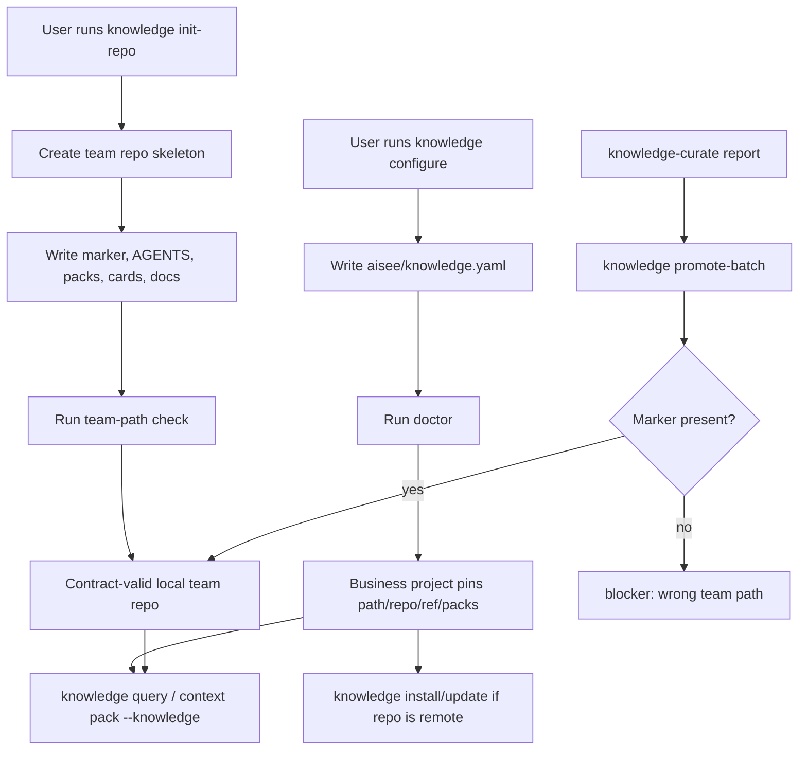

# feat: Team knowledge CLI initialization

## Summary

本计划把 team knowledge 的初始化和业务项目接入补成 CLI 一等入口。目标是让用户不再手工拼 `aisee-team-knowledge` 仓库结构，也不直接编辑业务项目配置；CLI 负责生成 contract-valid 仓库骨架、写入 `aisee/knowledge.yaml`、校验结果，并保持现有 “Git card/pack 是事实源、缓存可重建、写入需显式授权” 边界。

---

## Problem Frame

当前 team knowledge 的检索、校验、同步和 `promote-batch` 已经有实现和测试，但 onboarding 仍然断在初始化：文档要求用户复制 marketplace template 或手工创建仓库，而当前模板本身不满足 CLI 校验规则。这个缺口迫使用户绕过 CLI 直接操作 team knowledge 仓库，违背“正常情况下由 CLI 交互操作”的设计目标。

本计划不恢复旧的 `aisee knowledge scaffold` 内容分发语义。新的初始化能力应是明确命名的 CLI 工作流：`init-repo` 生成最小合法 team knowledge repo，`configure` 在业务项目中 pin repo/path/ref/packs，随后复用现有 `doctor/check/query/install/update/promote-batch`。

---

## Requirements

### CLI initialization

- R1. CLI 必须提供创建独立 team knowledge 仓库骨架的入口，生成结果可立即通过 `aisee knowledge check --team-path <path> --json`。
- R2. 初始化命令不得自动 commit、push、创建远程仓库、创建 PR 或修改当前业务项目配置。
- R3. 初始化命令必须默认拒绝覆盖非空目录；任何覆盖或合并行为都需要显式 flag，并在 JSON 中标记 `meta.writes`。
- R4. 生成的仓库必须包含 `.aisee-team-knowledge` marker、`AGENTS.md`、最小 `knowledge/packs/*.yaml`、最小 `knowledge/cards/**`、authoring/review 文档或指向文档的 README。

### Project configuration

- R5. CLI 必须提供业务项目配置入口，把 `repo/path/ref/packs/retrieval` 写入 `aisee/knowledge.yaml`，并保持该文件是项目侧唯一 team knowledge pin。
- R6. 配置入口必须支持本地 path-only dogfood 和 repo/ref/path 远程同步两种模式。
- R7. 配置入口不得复制完整知识库到业务项目；真实知识仍由配置的 team knowledge checkout 持有。
- R8. 配置后应能通过 `aisee knowledge doctor --json` 检查 path、marker 和 pack 配置一致性。

### Contract and safety

- R9. marketplace template 或 CLI 内置生成模板必须和 `validate_pack_data`、`validate_card_metadata` 的当前 contract 一致。
- R10. 写入 team knowledge worktree 的命令必须校验 `.aisee-team-knowledge` marker，避免用户误传业务项目根目录。
- R11. 新增命令必须保持稳定 JSON 输出，包含 `schema_version`、`status`、`issues`、`summary`、`meta.command` 和 `meta.writes`。
- R12. 新能力不得把 PyPI wheel 重新变成完整 plugin content 分发通道；如果 CLI 需要模板，应生成最小结构或引入小型 CLI-owned template，而不是依赖 marketplace plugin assets 存在。

---

## Scope Boundaries

### In Scope

- 新增 `aisee knowledge init-repo`，生成最小合法 team knowledge repo。
- 新增 `aisee knowledge configure`，写入或更新业务项目的 `aisee/knowledge.yaml`。
- 修正当前 marketplace team knowledge template，使它不再和 CLI contract 冲突。
- 给 `promote-batch`、`doctor` 或共享 helper 增加 marker/结构校验，至少覆盖写入路径。
- 更新 team knowledge 文档，默认路径从“复制模板并手工编辑”改为“CLI 初始化和配置”。
- 增加 CLI command surface、JSON contract、初始化、配置和 template 校验测试。

### Deferred to Follow-Up Work

- 远程仓库创建，例如 GitHub repo 创建、权限配置、CODEOWNERS、CI、PR 自动化。
- Team knowledge stale card refresh 工作流。
- Semantic/vector rerank 或 MCP 包装。
- 把所有现有 team knowledge card 内容扩展成真实可用的大型 pack。

### Out of Scope

- 不恢复 `aisee knowledge scaffold` 作为公开命令。
- 不让 `init-repo` 自动进入业务项目配置。
- 不让 `configure` 自动 clone 或 update；clone/update 继续由现有 `install/update` 持有。
- 不让 skill 直接扫描或写入 team knowledge repo；skill 仍通过 CLI 交互。

---

## Key Technical Decisions

- KTD1. **使用新命令名而不是恢复 scaffold：** `scaffold` 已从公开命令面删除；新入口命名为 `init-repo`，语义是初始化 team knowledge Git 仓库骨架，不是导出 plugin content。
- KTD2. **CLI owns minimal template：** 为避免 PyPI CLI 依赖 marketplace plugin assets，`init-repo` 应由 Python 代码生成最小 contract-valid 文件，或使用随 CLI 包含的小型模板。marketplace template 可作为示例，但不是初始化的唯一来源。
- KTD3. **配置和仓库初始化分离：** `init-repo` 只操作 team knowledge repo；`configure` 只操作业务项目的 `aisee/knowledge.yaml`。这避免一个命令同时拥有两个写入领域。
- KTD4. **pack 参数使用明确语义：** 初始化命令使用 `--initial-pack <id>`；配置命令使用 `--enable-pack <id>`，避免 `--pack` 在“创建 pack”和“启用 pack”之间含义不清。
- KTD5. **marker 是写入保护门槛：** 对 team repo 的写入命令必须默认要求 `.aisee-team-knowledge`，因为误传路径会造成真实文件写入风险。
- KTD6. **生成后立即自检：** `init-repo` 的实现应复用现有 `build_knowledge_check(..., team_path=...)` 或同等校验；如果生成结果不能自检通过，命令应返回 blocker。
- KTD7. **向后兼容现有 query/install/update：** 新命令只补 onboarding，不改变 `knowledge.yaml` 读取语义、pack/card 查询语义或 context pack 的 `--knowledge` 行为。

---

## High-Level Technical Design

---

## Implementation Units

### U1. Make the bundled team knowledge template contract-valid

- **Goal:** 修正当前 plugin 中的 team knowledge template，使文档推荐的示例路径不再和 CLI 校验规则冲突。
- **Requirements:** R1, R4, R9.
- **Dependencies:** None.
- **Files:** `plugins/aisee-plugin/skills/aisee-knowledge-curate/assets/team-knowledge/knowledge/packs/web-app.yaml`, `plugins/aisee-plugin/skills/aisee-knowledge-curate/assets/team-knowledge/knowledge/packs/openspec.yaml`, `plugins/aisee-plugin/skills/aisee-knowledge-curate/assets/team-knowledge/knowledge/cards/cli/cli-json-output-stability.md`, `plugins/aisee-plugin/skills/aisee-knowledge-curate/assets/team-knowledge/knowledge/cards/openspec/openspec-source-map-is-routing.md`, `tests/test_knowledge_config.py`, `tests/test_knowledge_schema.py`.
- **Approach:** 将 pack 补齐 `version`、`status`、`description`、`cards`、`card_globs`、`disabled_cards`、`defaults`。将 card frontmatter 改为 `applies_to.phases`、`applies_to.surfaces`、`trigger` list、`recommended_action` list、`boundaries` list。测试应直接对该模板运行 `knowledge check --team-path`，防止示例资产再次漂移。
- **Patterns to follow:** `tests/test_knowledge_config.py` 中 `create_team_knowledge` 生成的合法 fixture；`plugins/aisee-plugin/references/knowledge-card-contract.md` 的 card/pack contract。
- **Test scenarios:** 使用 template path 执行 `aisee knowledge check --team-path ... --json` 返回 `ok`；template 中 pack 引用的 card 均可解析；template 中 candidate/deprecated 示例如存在则不会默认参与 query。
- **Verification:** 文档中“可从 marketplace template 初始化”的路径至少是 contract-valid，不再产生 onboarding risk。

### U2. Add `aisee knowledge init-repo`

- **Goal:** 提供 CLI 初始化独立 team knowledge repo 的默认入口。
- **Requirements:** R1, R2, R3, R4, R11, R12.
- **Dependencies:** U1.
- **Files:** `src/aisee_cli/__main__.py`, `src/aisee_cli/knowledge.py`, `tests/test_knowledge_init_repo.py`, `tests/test_cli_command_surface.py`, `README.md`, `docs/team-knowledge.md`.
- **Approach:** 新增子命令 `aisee knowledge init-repo --dest <path> --initial-pack <id> --json`。默认 pack 可以是 `web-app`，但参数名要表达“创建初始 pack”。命令写入最小 repo skeleton 后运行同等于 `check --team-path <dest>` 的校验，并在 JSON 中返回 `written`、`team_knowledge.path`、`meta.writes`、`next_commands`。
- **Patterns to follow:** `build_knowledge_promote_batch` 的写入结果 envelope；`build_team_knowledge_index` 的 `team_knowledge` payload；现有 CLI JSON `status/issues/summary/meta` 模式。
- **Test scenarios:** 空目标目录初始化成功；目标目录已存在且非空时 blocked 且不写半成品；目标目录已存在但为空时成功或按明确规则处理；非法 `--initial-pack` 返回 blocker；生成后 `knowledge check --team-path <dest>` 返回 `ok`。
- **Verification:** 用户可以不手写任何 YAML 就得到一个可校验的 team knowledge repo 初稿。

### U3. Add `aisee knowledge configure`

- **Goal:** 提供业务项目侧 `aisee/knowledge.yaml` 的 CLI 配置入口。
- **Requirements:** R5, R6, R7, R8, R11.
- **Dependencies:** U2.
- **Files:** `src/aisee_cli/__main__.py`, `src/aisee_cli/knowledge.py`, `src/aisee_cli/paths.py`, `tests/test_knowledge_configure.py`, `docs/team-knowledge.md`, `README.md`.
- **Approach:** 新增子命令 `aisee knowledge configure --path <path> --enable-pack <id> [--repo <url>] [--ref <ref>] [--max-cards <n>] [--include-project-candidates true|false] --json`。命令只写项目根的 `aisee/knowledge.yaml`，支持多次 `--enable-pack`。如果文件存在，默认保留未覆盖字段并只更新明确传入项；涉及删除 packs 或清空 repo/ref 的行为应要求明确 flag 或留给后续。
- **Patterns to follow:** `load_knowledge_config` 的字段 shape；`knowledge_config_path` 的新旧 layout 兼容；`sources` 命令的幂等写入思路。
- **Test scenarios:** path-only 配置写入合法 YAML；repo/ref/path/packs 配置写入后 `knowledge inspect --json` 显示 config available；重复 enable 同一 pack 不产生重复项；已有 config 中未触及字段被保留；配置路径存在 team repo marker 时 `doctor` 返回 `ok`。
- **Verification:** 业务项目可以通过 CLI pin team knowledge，不需要手工编辑 `aisee/knowledge.yaml`。

### U4. Add marker and structure guards for team-repo writes

- **Goal:** 防止写入命令误把业务项目根目录或任意目录当作 team knowledge repo。
- **Requirements:** R4, R10, R11.
- **Dependencies:** U2.
- **Files:** `src/aisee_cli/knowledge.py`, `tests/test_knowledge_promote_batch.py`, `tests/test_knowledge_init_repo.py`, `docs/team-knowledge.md`.
- **Approach:** 抽出 `validate_team_repo_for_write(root, team_root)` helper，默认要求 `.aisee-team-knowledge`、`knowledge/packs`、`knowledge/cards`。`promote-batch` 在读取 curation 后、写入前调用该 helper。`init-repo` 负责创建 marker。`check --team-path` 可以继续把 marker 缺失作为 risk，但写入命令应 blocker。
- **Patterns to follow:** `build_knowledge_doctor` 当前 marker 检查；`safe_category` 和 `pack_path_for_id` 的路径保护。
- **Test scenarios:** `promote-batch --team-path <business-project-root>` 返回 `KNOWLEDGE_SCAFFOLD_MARKER_MISSING` 或等价 blocker，且不写入 `knowledge/cards`；marker 存在但目录结构缺失时 blocked；合法 init repo 可正常 promote；显式逃生口如实现，必须有测试证明 JSON 标记风险。
- **Verification:** 任何会写 team repo 的命令都先证明目标是 team knowledge repo。

### U5. Keep deprecated `scaffold` removed and update command surface

- **Goal:** 在新增初始化入口的同时保持旧内容分发命令删除，避免命令语义回退。
- **Requirements:** R2, R11, R12.
- **Dependencies:** U2, U3.
- **Files:** `src/aisee_cli/__main__.py`, `src/aisee_cli/knowledge.py`, `tests/test_cli_command_surface.py`, `tests/test_knowledge_scaffold.py`, `docs/compatibility-policy.md`, `CHANGELOG.md`.
- **Approach:** 不重新暴露 `knowledge scaffold`。如果 `build_knowledge_scaffold` 已无调用面，实施时可删除 dead code 或保留为内部迁移注释，但公开 help 和 tests 必须确认 `scaffold` 仍是 invalid choice。新增 command surface 测试确认 `init-repo` 和 `configure` 在 help 中出现。
- **Patterns to follow:** `tests/test_cli_command_surface.py` 对移除命令的断言；`docs/compatibility-policy.md` 中 Public Contract / Experimental Contract 分层。
- **Test scenarios:** `aisee knowledge scaffold ...` 仍返回 argparse invalid choice；`aisee knowledge --help` 显示 `init-repo` 和 `configure`；新增命令 JSON 中 `meta.command` 稳定；compatibility policy 说明新命令是 experimental 或 public 的准确层级。
- **Verification:** 新初始化能力不会被理解成旧 PyPI asset export 的恢复。

### U6. Refresh team knowledge docs and skill guidance

- **Goal:** 让用户路径从“复制模板并手工编辑”改为“CLI 初始化、CLI 配置、CLI 校验、CLI 写入”。
- **Requirements:** R5, R7, R8, R9, R10.
- **Dependencies:** U1, U2, U3, U4, U5.
- **Files:** `docs/team-knowledge.md`, `docs/team-knowledge.en.md`, `docs/architecture/aisee-team-knowledge.md`, `plugins/aisee-plugin/references/knowledge-card-contract.md`, `plugins/aisee-plugin/skills/aisee-knowledge-curate/SKILL.md`, `plugins/aisee-plugin/skills/aisee-knowledge-curate/references/workflow.md`, `README.md`, `README.en.md`.
- **Approach:** 文档首选流程改为 `init-repo -> check -> configure -> doctor -> query/context pack`。`aisee:knowledge-curate` 继续只生成 curation report/drafts；写入 team repo 的唯一推荐方式是 `promote-batch`，并说明 marker guard。英文文档同步同等边界，避免中英文语义分叉。
- **Patterns to follow:** `docs/compatibility-policy.md` 的 experimental 标注；`plugins/aisee-plugin/skills/aisee-knowledge-curate/SKILL.md` 的“不自动写入 team repo”边界。
- **Test scenarios:** 文档检查或 grep 测试确认 `knowledge scaffold` 不再作为推荐命令；README 中新增命令示例包含 `--json`；skill 文案不建议 agent 直接创建目录或手工写 card 到 team repo。
- **Verification:** 新用户能按文档完成初始化和接入，agent 默认不会绕过 CLI。

---

## Risks & Dependencies

- **模板来源边界风险:** 如果 `init-repo` 依赖 marketplace plugin assets，在 CLI-only 安装下会失败。缓解方式是让 CLI 生成最小模板或携带小型 CLI-owned template。
- **命令面反复风险:** 新增 `init-repo` 可能被误认为恢复 `scaffold`。缓解方式是命名、文档和 tests 明确 `scaffold` 仍移除，`init-repo` 只生成 team repo skeleton。
- **配置覆盖风险:** `configure` 修改 `aisee/knowledge.yaml`，必须保护已有字段和用户注释的合理预期。首版可以接受重写规范化 YAML，但必须文档化，并只在用户显式调用时写入。
- **写入误路径风险:** `promote-batch` 当前只要求 team path 存在。marker guard 应先于任何写入，防止错误目录被创建 `knowledge/cards`。

---

## Sources & Research

- `docs/team-knowledge.md`：当前用户流程和 experimental 能力说明。
- `docs/architecture/aisee-team-knowledge.md`：仓库边界、读取模型、沉淀流程和 marker 语义。
- `plugins/aisee-plugin/references/knowledge-card-contract.md`：card/pack 最小可解析协议。
- `src/aisee_cli/knowledge.py`：现有 inspect/query/check/doctor/install/update/promote-batch/index 实现。
- `tests/test_knowledge_config.py`、`tests/test_knowledge_query.py`、`tests/test_knowledge_install_update.py`、`tests/test_knowledge_promote_batch.py`：当前合法 fixture 和行为边界。
- `tests/test_cli_command_surface.py`：已删除内容分发命令的 public surface 约束。
