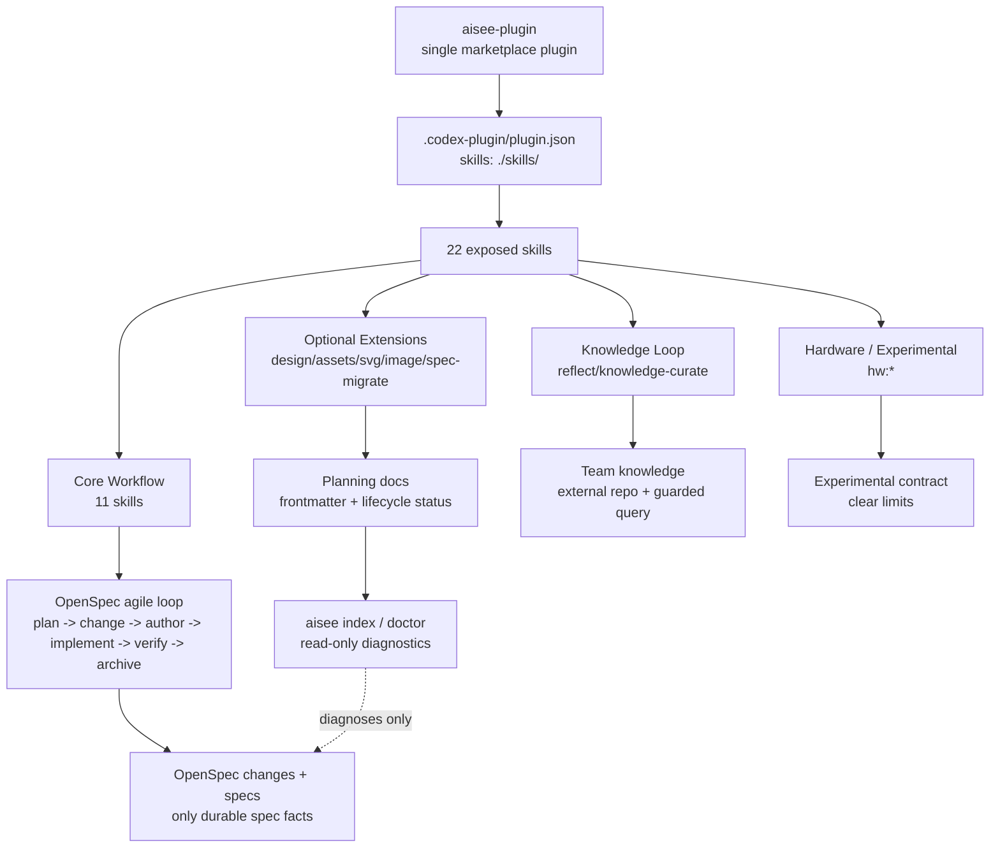

# refactor: 治理单插件 Skill 体系与长期文档迭代

## Summary

本计划保留 Aisee 单一插件和现有全部 skill，但把它们治理为核心主流程、可选扩展、知识循环、硬件/实验域四层。计划同时补齐长期 planning docs 生命周期审计、发布 smoke 失配、monorepo 项目根解析和 skill eval 覆盖缺口，让当前体系达到可长期迭代的可用状态。

---

## Problem Frame

当前插件已暴露 22 个 skill，因为 Codex manifest 的 `skills` 指向整个 `plugins/aisee-plugin/skills/` 目录。这不是文件重复，也不需要拆成多个插件；真正的问题是 README 和工作流把主流程与扩展能力平铺展示，用户容易以为所有 skill 都是同等必经节点。

从敏捷开发角度看，现有模型方向成立：planning docs 服务当前版本/迭代，`aisee:change-plan` 拆出 one or more 独立 OpenSpec changes，轻量 schema 支持小修复，archive 后 baseline 接管长期事实。但长期迭代还缺少三类治理：skill 层级需要可测试的分类合同，planning docs 需要可审计的状态生命周期，发布和 CLI 根目录解析需要与当前分发模型一致。

---

## Requirements

- R1. 保留单一 `aisee-plugin`，不拆插件、不迁移扩展 skill 到独立插件、不删除现有扩展 skill。
- R2. 明确 11 个核心主流程 skill，其余 skill 必须归入可选扩展、知识循环或硬件/实验域。
- R3. Codex manifest 继续暴露 `./skills/`，但 README、workflow、marketplace 文档和 tests 必须表达层级差异。
- R4. Aisee 工作流必须继续支持敏捷迭代：planning docs 只作为迭代输入，change 才是独立交付和验证单元，小修复可以走轻量 schema。
- R5. 普通 planning docs 必须支持长期迭代管理，包括 frontmatter、状态、来源、关联 change、可索引 anchor 和 stale active 风险提示。
- R6. CLI 不得创建第二套规范事实源；文档状态审计只能报告问题或派生索引，不能替代 OpenSpec baseline、active changes、source-map 或 tasks。
- R7. 发布前 smoke 必须与当前 CLI 命令面一致，不再调用已删除的内容分发命令。
- R8. 项目根解析必须支持 Git 仓库内的子项目和 monorepo，避免从子项目运行 CLI 时错误解析到仓库顶层。
- R9. 所有公开暴露的 skill 都必须拥有 `evals/evals.json`，至少覆盖触发边界、职责边界、事实源边界和 must_not 越界保护。
- R10. 体系文档、CLI JSON、schema pack、marketplace metadata 和 release 文档的公开契约必须同步更新并有测试守住。

---

## Scope Boundaries

### In Scope

- 保留全部 22 个 skill，并建立同插件内的 skill taxonomy。
- 更新 README、workflow、best practices、plugin marketplace、compatibility policy 和 release 文档。
- 增加 taxonomy 测试，证明 11 个 core skill 和扩展 skill 的分类不会漂移。
- 增强 planning docs frontmatter 与生命周期审计，优先复用 `aisee index` / `aisee doctor`，不新增宽泛写入命令。
- 修复 `scripts/smoke_release.py` 与当前 CLI 命令面不一致的问题。
- 改进项目根解析，使子项目、fixture 和 monorepo 场景可以按 Aisee/OpenSpec marker 正确定位。
- 补齐全部公开 skill 的最小 eval 覆盖，并让测试强制每个 `*/SKILL.md` 都有对应 `evals/evals.json`。

### Deferred to Follow-Up Work

- 单独设计硬件主工作流的完整 OpenSpec lifecycle dogfood。
- 为每个扩展 skill 建立完整高覆盖 eval 套件；本轮只要求最小边界 eval 全覆盖。
- 实现 team knowledge stale card refresh。
- 真实 Codex marketplace add/install 自动 smoke。该检查会写用户 Codex 状态，仍应作为授权后的手工 release step。

### Out of Scope

- 不拆分为多个插件。
- 不删除 `design-*`、`svg-assets`、`image-object`、`reflect`、`knowledge-curate` 或 `hw:*`。
- 不把可选扩展改成核心主流程必经节点。
- 不新增 `aisee review`、`aisee docs apply` 或其它跨职责写入命令。
- 不让 planning docs、frontmatter、cache 或 context pack 成为新的 baseline 事实源。

---

## Key Technical Decisions

- KTD1. 单插件、分层治理：保留 `skills: "./skills/"`，用文档和测试定义层级，而不是通过目录拆分影响安装模型。
- KTD2. Core 只表达默认敏捷路径：核心 11 个 skill 覆盖初始化、需求/内容/架构输入、change planning、authoring、实现交接、verify 和 archive guard。
- KTD3. 扩展 skill 是按需能力：设计、素材、知识、迁移和硬件能力继续可触发，但不得出现在默认 happy path 中。
- KTD4. 文档生命周期审计只读：`aisee index` 和 `aisee doctor` 可以报告 stale、missing frontmatter、invalid refs，但不能自动迁移或归档文档。
- KTD5. 项目根解析优先 Aisee/OpenSpec marker：在 Git 顶层之前识别最近的 `openspec/config.yaml`、`AGENTS.md`、`aisee/` 等项目 marker，避免 monorepo 子项目被吞到顶层。
- KTD6. Release smoke 只验证当前契约：旧内容分发命令已从公开命令面移除，smoke 应验证 CLI-only wheel、marketplace setup hint 和当前只读检查命令。
- KTD7. Eval 覆盖全量准入、深度分层：所有公开 skill 都必须有最小边界 eval；后续再按风险为核心、高风险扩展和硬件域增加更深场景。

---

## High-Level Technical Design

这次调整不改变插件安装拓扑。它把同一目录下的 skill 从“平铺列表”升级为“同插件内有层级的工作流系统”，并用 CLI 只读诊断和测试防止文档状态漂移。

---

## Implementation Units

### U1. Define The Skill Taxonomy Contract

- **Goal:** 建立同插件内的 skill 分层合同，明确 11 个核心 skill 和其余扩展/实验 skill 的位置。
- **Requirements:** R1, R2, R3, R4
- **Dependencies:** none
- **Files:** `plugins/aisee-plugin/references/skill-taxonomy.md`, `README.md`, `README.en.md`, `docs/workflow.md`, `docs/workflow.en.md`, `docs/best-practices.md`, `docs/best-practices.en.md`, `docs/plugin-marketplace.md`, `docs/plugin-marketplace.en.md`, `docs/compatibility-policy.md`, `docs/compatibility-policy.en.md`, `tests/test_plugin_marketplace.py`, `tests/test_skill_cli_preflight.py`
- **Approach:** 新增 taxonomy reference，定义四层：Core Workflow、Optional Extensions、Knowledge Loop、Hardware / Experimental。README 的“主要 Skills”改为分层表，Core 表固定为 11 个，扩展表说明按需触发。Marketplace 文档说明 manifest 仍暴露整个 `skills/`，分层是工作流治理合同，不是安装拆分。
- **Patterns to follow:** `docs/compatibility-policy.md` 已有 Public / Experimental / Internal 分层；`README.md` 已说明硬件 skills 保留但仍在整合。
- **Test scenarios:**
  - Core taxonomy 精确包含 `aisee:flow`、`aisee:init`、`aisee:srs`、`aisee:ui-content`、`aisee:architecture`、`aisee:change-plan`、`aisee:change-author`、`aisee-schema-pack`、`aisee:implementation-bridge`、`aisee:verify`、`aisee:archive-guard`。
  - 所有 `plugins/aisee-plugin/skills/*/SKILL.md` 都被 taxonomy 分类，不能出现未分类 skill。
  - README 中 core 表和 taxonomy reference 保持一致。
  - `tests/test_plugin_marketplace.py` 继续证明 manifest 暴露 `./skills/`，不因分层治理改成多插件。
- **Verification:** 文档读者能一眼区分默认流程和按需扩展；测试能发现新增 skill 未分类或 core 数量漂移。

### U2. Align Workflow And Agile Rules With The Taxonomy

- **Goal:** 让 workflow 和 best practices 表达敏捷路径，同时避免扩展 skill 被误解为默认步骤。
- **Requirements:** R2, R3, R4, R10
- **Dependencies:** U1
- **Files:** `docs/workflow.md`, `docs/workflow.en.md`, `docs/best-practices.md`, `docs/best-practices.en.md`, `docs/schema-packs.md`, `README.md`, `README.en.md`, `plugins/aisee-plugin/skills/aisee-flow/SKILL.md`, `plugins/aisee-plugin/skills/aisee-change-plan/SKILL.md`, `plugins/aisee-plugin/skills/aisee-implementation-bridge/SKILL.md`
- **Approach:** 将默认路径写成 core happy path，并把 `design-spec`、`design-assets`、`svg-assets`、`image-object`、`spec-migrate`、`reflect`、`knowledge-curate`、`hw:*` 放入按需分支。强调“小范围、边界明确、低风险”可跳过重 planning docs 直接走轻量 schema。`aisee:flow` 文案应推荐下一步，但不把可选扩展塞进每个 stage。
- **Patterns to follow:** `docs/workflow.md` 已有“快速路径”和“小修复跳过重前置文档”；`docs/best-practices.md` 已有“不让前置文档替代 change artifacts”。
- **Test scenarios:**
  - workflow 默认新功能路径只列 core skill，设计和知识 skill 以条件触发出现。
  - quick-fix 路径不要求 SRS/UI/Architecture。
  - existing project 接入路径说明 `aisee:spec-migrate` 是迁移工具，不是每次迭代必经步骤。
  - 硬件 workflow 被标为 domain-specific / experimental，不影响 app 默认 schema。
- **Verification:** 文档仍支持完整端到端开发，但不会把敏捷迭代变成固定瀑布流程。

### U3. Add Planning Document Lifecycle Diagnostics

- **Goal:** 让长期迭代中的 planning docs 可被索引和审计，避免 active planning docs 长期漂移。
- **Requirements:** R5, R6, R10
- **Dependencies:** U1, U2
- **Files:** `plugins/aisee-plugin/references/planning-doc-frontmatter.md`, `src/aisee_cli/index.py`, `src/aisee_cli/doctor.py`, `src/aisee_cli/paths.py`, `src/aisee_cli/output.py`, `tests/test_cli_context_bus.py`, `tests/test_doctor_flow_schema.py`, `tests/test_skill_cli_preflight.py`, `README.md`, `docs/workflow.md`, `docs/best-practices.md`
- **Approach:** 复用现有 planning doc frontmatter 合同，扩展 `aisee index --json` 的派生视图和 `aisee doctor --json` 的只读诊断。诊断覆盖 missing frontmatter、invalid `doc_type`、invalid `status`、缺少 `source_refs` / `change_refs`、active 文档未关联任何 active 或 archived change、同一 scope 下多个 active 文档等风险。诊断只报告，不自动改状态。
- **Patterns to follow:** `aisee/cache/context-index.json` 已被定义为可重建缓存；`sources.json` 和 `source-map.md` 是正式追踪入口；`tests/test_skill_cli_preflight.py` 已检查 representative templates 包含 frontmatter 字段。
- **Test scenarios:**
  - 有效 SRS/UI/Architecture frontmatter 能被 `aisee index --json` 收录为 planning doc entry。
  - 缺少 frontmatter 的 `aisee/docs/requirements/*.md` 在 doctor 中产生 risk，不阻塞 OpenSpec 项目初始化。
  - `status: active` 但 `change_refs` 为空的旧 planning doc 产生 stale risk。
  - `status: superseded` 或 `archived` 的 planning doc 不参与 active scope 冲突。
  - `aisee/cache/context-index.json` 删除后可以重建，不作为事实源。
- **Verification:** 长期文档管理有可运行的只读诊断；没有引入第二套规范事实源或自动迁移命令。

### U4. Fix Release Smoke Against Current CLI Contract

- **Goal:** 让发布前 smoke 与当前 CLI 命令面一致，恢复 public beta / PyPI release 的最小可信门禁。
- **Requirements:** R7, R10
- **Dependencies:** none
- **Files:** `scripts/smoke_release.py`, `tests/test_cli_command_surface.py`, `tests/test_plugin_packaging.py`, `docs/release.md`, `docs/plugin-marketplace.md`, `CHANGELOG.md`
- **Approach:** 移除 release smoke 中对 `aisee plugin export` 的 JSON blocker 断言，改为验证该命令已从公开命令面移除，且 installed wheel 的 `plugin inspect`、`schemas list/check`、`doctor` 输出 CLI-only 状态和 marketplace setup hint。保留 wheel/sdist 不包含完整 skill/reference/schema/team knowledge 内容的检查。
- **Patterns to follow:** `tests/test_cli_command_surface.py` 已断言 `plugin export`、`schemas install`、`knowledge scaffold` 是 invalid choice；`docs/release.md` 已说明 PyPI package 是 CLI-only。
- **Test scenarios:**
  - `python scripts/smoke_release.py` 在干净 venv 中不再调用 `plugin export`。
  - smoke 验证 `aisee plugin inspect --json` 返回 `mode=cli-only`。
  - smoke 验证 `aisee schemas list --json` 在 wheel-only 环境不报告 packaged schema source。
  - smoke 验证 `aisee plugin export ...` 返回 argparse invalid choice，且不会创建目标目录。
  - wheel 和 sdist 不包含完整 `plugins/aisee-plugin/skills/`、`references/` 或 `schema-pack/`。
- **Verification:** release smoke 通过，并能真实证明当前 CLI-only 分发契约。

### U5. Improve Project Root Resolution For Monorepo And Fixtures

- **Goal:** 避免 CLI 在 Git 仓库内子项目运行时错误解析到仓库顶层。
- **Requirements:** R8, R10
- **Dependencies:** none
- **Files:** `src/aisee_cli/project.py`, `src/aisee_cli/__main__.py`, `src/aisee_cli/context_pack.py`, `tests/test_doctor_flow_schema.py`, `tests/test_lifecycle_dogfood.py`, `tests/test_cli_errors.py`, `README.md`, `docs/workflow.md`
- **Approach:** 将 `resolve_project_root` 改为优先从当前目录向上寻找最近的 Aisee/OpenSpec project marker，例如 `openspec/config.yaml`、`openspec/changes/`、`AGENTS.md` 与 `aisee/` 的合理组合；只有找不到 marker 时才 fallback 到 Git top-level。同步消除 `context_pack.py` 内部重复 root resolver，统一调用 `aisee_cli.project.resolve_project_root`。如需要 escape hatch，优先考虑环境变量或未来全局 `--root`，本轮默认先解决自动 marker。
- **Patterns to follow:** `tests/test_lifecycle_dogfood.py` 复制 fixture 到临时独立目录后可到 `archive-ready`；当前直接在 repo fixture 下运行会被 Git top-level 吞掉。
- **Test scenarios:**
  - 在 `tests/fixtures/scenarios/app-full-lifecycle` 下运行 CLI 时，root 解析为 fixture 项目而不是仓库顶层。
  - 在普通仓库根运行 CLI 时，root 仍解析为仓库根。
  - 在无 OpenSpec/Aisee marker 的目录运行 CLI 时，仍 fallback 到 Git top-level 或 cwd，保持现有行为。
  - `context pack`、`flow inspect`、`doctor` 使用同一 root resolver。
  - monorepo 中两个子项目各自带 `openspec/config.yaml` 时，从各自目录运行不会交叉读取。
- **Verification:** fixture 和 monorepo 场景的 root 解析可预测；不会破坏现有普通单仓库项目。

### U6. Require Eval Coverage For Every Public Skill

- **Goal:** 把 22 个 skill 的行为回归从“有些有 eval”升级为所有公开 skill 都有最小边界 eval 的准入规则。
- **Requirements:** R2, R9, R10
- **Dependencies:** U1
- **Files:** `tests/test_skill_eval_schema.py`, `plugins/aisee-plugin/references/skill-taxonomy.md`, `plugins/aisee-plugin/skills/*/evals/evals.json`, `README.md`, `docs/compatibility-policy.md`
- **Approach:** 测试读取所有 `plugins/aisee-plugin/skills/*/SKILL.md`，并要求每个公开 skill 都存在 `evals/evals.json`。新增缺失的 13 个 eval 文件，保持最小但可执行的边界覆盖：触发场景、禁止替代的相邻 skill、事实源约束、输出必须包含内容和 `must_not`。taxonomy 仍用于表达 core / optional / knowledge / hardware 层级，但不再作为“可无 eval”的豁免依据。
- **Patterns to follow:** `tests/test_skill_eval_schema.py` 已定义标准 eval schema；当前 9 个 skill 已有 eval，可作为格式样例。
- **Test scenarios:**
  - 任一公开 `SKILL.md` 缺失对应 `evals/evals.json` 时测试失败。
  - 新增 skill 未在 taxonomy 中登记时测试失败。
  - Optional / Knowledge / Hardware skill 也必须有最小 eval；taxonomy 只能标注覆盖深度和后续增强优先级，不能豁免 eval 文件。
  - Eval case 必须包含 `must_not`，防止 optional skill 越界成核心流程或事实源。
  - Hardware skill eval 必须说明仍属 experimental / domain-specific，不影响 app 默认路径。
- **Verification:** 每个公开 skill 都有可回归行为边界；新增或移动 skill 不会静默扩大默认流程。

### U7. Update Compatibility And Release Governance

- **Goal:** 让公开契约文档覆盖 skill 分层、planning docs 生命周期、项目根解析和 release smoke 修正。
- **Requirements:** R3, R5, R7, R8, R9, R10
- **Dependencies:** U1, U3, U4, U5, U6
- **Files:** `docs/compatibility-policy.md`, `docs/compatibility-policy.en.md`, `docs/release.md`, `docs/plugin-marketplace.md`, `docs/plugin-marketplace.en.md`, `CHANGELOG.md`, `tests/test_version_consistency.py`, `tests/test_plugin_marketplace.py`
- **Approach:** 将 skill taxonomy 和 planning docs lifecycle diagnostics 纳入 compatibility policy。明确改变 core skill 集合、manifest skills path、CLI root resolution semantics、planning docs status diagnostics、release smoke expectations 都属于需要测试和 release notes 的契约变化。Release 文档增加当前 smoke 关注点：CLI-only wheel、marketplace hint、removed command invalid choice、root resolver fixture。
- **Patterns to follow:** `docs/compatibility-policy.md` 已有 Public / Experimental / Internal 分层；`docs/release.md` 已要求 smoke 和 version checks。
- **Test scenarios:**
  - version consistency 继续覆盖 marketplace metadata、plugin metadata 和 CLI version。
  - plugin marketplace test 继续验证 manifest `skills` 指向 `./skills/`。
  - release 文档不再提到 `plugin export` blocker 语义。
  - compatibility policy 明确 skill taxonomy 是 public plugin content contract，硬件主流程仍 experimental。
- **Verification:** 未来维护者能知道哪些调整需要测试、变更说明和版本升级。

---

## System-Wide Impact

这次调整会改变用户理解 Aisee 的方式，但不改变插件安装方式。用户仍安装一个 `aisee-plugin`，仍能触发所有 skill；区别是默认推荐路径更清楚，扩展能力不再和核心敏捷路径混在同一层级。

CLI 层面会新增或增强只读诊断，尤其是 planning docs lifecycle 和项目根解析。因为这些能力不写文件、不迁移文档、不改变 OpenSpec 状态机，风险主要集中在误报和旧项目兼容，而不是数据破坏。

---

## Risks And Dependencies

- **Taxonomy 漂移风险：** 新增 skill 后忘记分类会让 README 和 manifest 认知再次失配。缓解方式是让测试读取 taxonomy 并要求全量覆盖。
- **文档审计误报风险：** 老项目可能没有 frontmatter。缓解方式是先将缺失 frontmatter 报为 risk，不作为 doctor blocker。
- **敏捷流程变重风险：** frontmatter 和 diagnostics 可能被误解为每次都要重文档。缓解方式是在 workflow 中保留 quick-fix / quick-research 轻路径。
- **Root resolver 回归风险：** marker 优先可能改变某些嵌套目录行为。缓解方式是覆盖 cwd、Git root、fixture、monorepo 子项目和无 marker 目录。
- **Eval 补齐范围膨胀风险：** 一次性给 22 个 skill 写完整高覆盖 eval 成本高。缓解方式是本轮只强制最小边界 eval 全覆盖，深场景按 taxonomy 后续增强。
- **Release smoke 再次漂移风险：** CLI 命令面调整后 smoke 容易滞后。缓解方式是让 smoke 复用 command surface tests 的当前契约，不手写旧命令假设。

---

## Acceptance Examples

- AE1. 给定用户安装 Aisee 插件，当查看 README skill 表时，能看到 11 个核心 skill 和扩展 skill 分层，而不是 22 个平铺主流程节点。
- AE2. 给定用户开发一个小修复，当阅读 workflow 时，可以选择 `quick-fix` 轻路径，不需要先生成 SRS、UI Content 或 Architecture。
- AE3. 给定项目中存在长期 active 的旧 SRS，且没有关联任何 change，当运行 `aisee doctor --json` 时，输出 planning doc stale risk，但不阻塞 OpenSpec validate 或 archive。
- AE4. 给定 release wheel 安装到干净 venv，当运行 smoke 时，不再调用 `aisee plugin export`，并能证明 wheel 是 CLI-only。
- AE5. 给定在 Git 仓库内的 fixture 子项目运行 `aisee flow inspect`，CLI 使用 fixture 下的 OpenSpec 项目，而不是仓库顶层。
- AE6. 给定新增一个 skill 目录但未登记 taxonomy，当运行测试时失败并提示该 skill 未分类。
- AE7. 给定任一公开 skill 缺少 eval，当运行 skill eval schema tests 时失败；给定 optional skill 只有最小边界 eval 时通过，并可在 taxonomy 中标注后续增强优先级。

---

## Documentation And Operational Notes

README、workflow 和 best practices 的语气应从“功能清单”改为“默认路径 + 按需扩展”。Core Workflow 是用户首先看到的路径；扩展能力在同一插件内保留，但不暗示每次都要触发。

Release 文档需要明确当前 public beta 候选的最低门禁：`pytest`、version check、release smoke、CLI-only wheel 内容检查、marketplace manifest 检查、root resolver fixture 测试。Codex marketplace 真实安装仍是授权后的手工 smoke，不放入默认自动发布流程。

---

## Sources And Research

- `plugins/aisee-plugin/.codex-plugin/plugin.json` 当前通过 `skills: "./skills/"` 暴露整个 skill 目录。
- `README.md` 当前列出 17 个 Aisee skill，并另列 4 个硬件 skill，尚未表达 core / optional / experimental 分层。
- `docs/workflow.md` 已具备敏捷原则：planning docs 是迭代输入，OpenSpec change 和 baseline 是事实源，小修复可走轻路径。
- `plugins/aisee-plugin/references/planning-doc-frontmatter.md` 已定义 planning docs frontmatter 合同，可作为长期文档审计基础。
- `scripts/smoke_release.py` 当前仍调用已移除的 `aisee plugin export`，与 `tests/test_cli_command_surface.py` 的 invalid choice 契约冲突。
- `src/aisee_cli/project.py` 当前优先使用 `git rev-parse --show-toplevel`，会把仓库内子项目解析到 Git 顶层。
- `tests/test_lifecycle_dogfood.py` 证明 full lifecycle fixture 在复制到独立临时项目并安装 schema 后可以达到 `archive-ready`。
- `tests/test_skill_eval_schema.py` 已提供标准 eval schema，但当前只有 9 个 skill 具备 `evals/evals.json`；本计划要求补齐其余 13 个并把“每个公开 skill 必须有 eval”写入测试。
