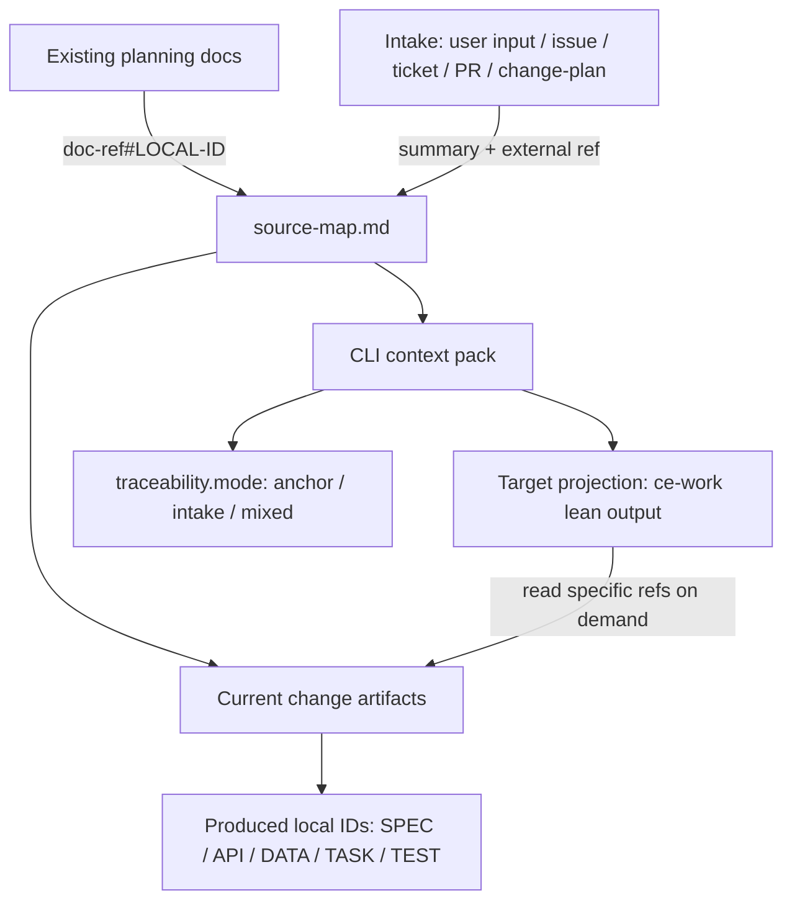

# refactor: 支持无前置文档的 intake 来源追踪

## Summary

本计划让 `aisee-app-spec-driven` 等生成 `source-map.md` 的 schema 合法支持“无 SRS / UI Content / Architecture 前置文档”的直接输入路径。核心变化是把上游来源分成 anchor 来源和 intake 来源：已有 planning docs 继续使用 `doc-ref#LOCAL-ID`，原始用户输入、issue、ticket、PR 或 change-plan 摘要只记录为精简 intake 摘要，并由当前 OpenSpec artifacts 生成 `SPEC-001`、`API-001`、`TASK-001` 等 local ID。

同时补强相关 skill 与 CLI 的结合边界：skill 应自行调用对应 CLI JSON 命令，用户只触发 skill；CLI 按 target 返回最小机器上下文。压缩的是传输上下文，不是规范事实。给 `ce-work` 的内容应是可回读的执行索引，而不是完整 context pack、全量诊断 JSON 或 artifact 正文。

另一个边界是 schema 可用性：`aisee:change-plan` 可以为每个 planned change 选择不同 schema，但公开 CLI 不再安装 schema pack。项目缺少所选 schema 时，应转交 `aisee-schema-pack` skill 使用 marketplace plugin assets 写入 `openspec/schemas/`，而不是建议 `aisee schemas install`。

完整链路必须区分只读自动化与写入确认：skills 可以自动调用只读 CLI 获取状态，但任何写入 schema、hooks、baseline 或 artifacts 的动作都必须 checkpoint。`/opsx:new` 创建 change 后还必须把 schema 固化到 change metadata；后续 skill 只读取该 metadata，不根据现有 artifacts 猜测或重选 schema。

---

## Problem Frame

当前 `aisee:change-plan` 允许原始需求、ticket 或 issue 直接进入 change planning，但 `source-map` seed 规则和 app schema 模板仍暗含 `FR / NFR / RULE` 必须来自 SRS anchor。结果是 agent 容易为了满足模板而伪造 `docs/...#FR-001`，随后 CLI 将其解析为 unresolved anchor，导致 `author-check` 和 context pack 出现误导性风险。

这次优化不回退 local ID 模型，也不把聊天原文变成新的事实源。OpenSpec change artifacts 和 archive 后 baseline 仍是规范事实源；intake 只记录经过整理、压缩、脱敏的输入摘要和外部引用。

---

## Requirements

- R1. 无前置 planning docs 时，`change-plan` 和 app schema 模板不得要求或诱导生成 SRS `FR` anchor。
- R2. `source-map.md` 必须能记录精简 intake 来源，包括用户输入、issue、ticket、PR 或 change-plan 摘要，但不得默认保存原始长提示词。
- R3. CLI JSON 必须区分 `upstream_refs=[]` 和“没有来源”；无 anchor 但有 intake 来源与 produced local IDs 时应视为合法 intake 路径。
- R4. 既有 anchor 路径必须保持不变；真实 unresolved anchor 仍要报告 `ANCHOR_RESOLUTION_MISSING`。
- R5. 模板和规则更新必须控制文档体量，避免把 `source-map.md` 扩展成需求正文、任务清单或聊天记录。
- R6. Implementation Bridge 给 `ce-work` 的 handoff 必须是 lean execution brief：只包含事实源引用、scope、IDs、allowed paths、任务起点、风险和验证入口，不原样转发 full context pack。
- R7. 压缩产物不得成为新的事实源；任何细节缺失或冲突必须回读 OpenSpec artifacts，并以 artifacts 为准。
- R8. CLI 的 `--for ce-work` 输出必须按 target 做 projection，剔除未被当前 change 引用的 planning docs 明细、空字段、治理类 issue 明细和 artifact 正文。
- R9. 由于 CLI JSON 合同和 package assets 会变化，本次实现必须包含版本升级、PyPI 发布准备和版本一致性校验。
- R10. 相关 Aisee skills 必须自行调用对应 CLI JSON 命令并消费 target projection；除 CLI 不可用 fallback 外，不要求用户手工运行 CLI。
- R11. 相关 skill 文档必须保持精简，只保留触发条件、CLI 调用合同、输出边界和 fallback；长规则放入 references，避免 skill 本身向 agent 注入大段无效上下文。
- R12. `change-plan` 选择 schema 后必须检查 schema 是否已安装或 source 是否可用；缺失时输出 schema availability blocker，并转交 `aisee-schema-pack`，不得建议已移除的 `aisee schemas install`。
- R13. `change-author`、context pack、verify 和 implementation-bridge 发现当前 change schema 缺失时必须停止或降级为 blocker 诊断，不能静默 fallback 到 default schema 继续 author / execute。
- R14. 只读 CLI 可由 skill 自动调用；写入 `openspec/schemas/**`、OpenSpec baseline、hooks 或 change artifacts 前必须 checkpoint，并列出目标路径、覆盖策略和回滚方式。
- R15. `/opsx:new` 或等效 change 创建必须固化 schema metadata；metadata 缺失或与 change-plan 输出不一致时，`change-author` 必须 blocker，不得根据 artifacts 猜 schema。
- R16. PyPI package 与 marketplace plugin 的发布分工必须清楚：PyPI 只发布 CLI 合同，marketplace plugin 发布 skills、references 和 schema pack assets；版本需要同步或显式兼容。
- R17. 测试必须覆盖无 SRS intake 路径、既有 SRS anchor 路径、伪造 / 缺失 anchor 路径、lean handoff 不含 artifact 全文、`ce-work` projection 不输出无关 planning docs 明细、skill/CLI 调用合同文案不退化为“用户手工执行命令”、schema 缺失时不建议 `aisee schemas install`，以及 metadata schema 缺失 / 不一致时阻断 author。

---

## Key Technical Decisions

- KTD1. **Intake 不是 anchor:** `Intake 来源` 记录输入来源和摘要，不参与 `aisee get <anchor-ref>` / `trace` 解析，也不分配 `FR-001`。只有落在文档中的对象才拥有 local ID。
- KTD2. **当前 change 承接正式 local ID:** 无 SRS 路径下，由 `specs/**/*.md`、contracts 和 `tasks.md` 生成 `SPEC / API / DATA / TASK / TEST` local ID，`source-map.md` 只记录 intake 到这些产出 ID 的追踪关系。
- KTD3. **CLI 增量增强而非重写:** 保留现有 `anchor_refs`、`local_ids`、`upstream_refs` 行为，新增 `intake_sources` 与 traceability mode，避免破坏既有 JSON 消费方。
- KTD4. **摘要优先、原文例外:** 模板只要求 1-5 句 intake 摘要和可选外部引用；原始提示词仅在用户或项目审计规则明确要求时作为单独 evidence 保存。
- KTD5. **缺来源是风险，非空 anchor 是解析对象:** 有 intake 来源和 produced local IDs 时不报来源缺失；既没有 anchor、也没有 intake、也没有 produced local IDs 时报告新的 trace gap。
- KTD6. **压缩传输上下文，不压缩事实源:** `implementation-bridge` 可以把 full context pack 压成 lean handoff，但每条摘要必须带 source reference，缺细节时回读 artifact，冲突时以 artifact 为准。
- KTD7. **按 target 投影 CLI JSON:** `doctor` / `verify` 可以保留全量诊断；`ce-work` 只输出执行相关字段。类似 `planning_docs.items` 的治理明细应折叠为 summary，除非它直接影响当前 change。
- KTD8. **版本升级随 CLI 合同一起交付:** 新增 `intake_sources`、traceability mode、lean handoff 或 target projection 都属于可见 CLI 输出变化，必须同步更新 package 版本、资产版本和发布说明。
- KTD9. **Skill 是 CLI 的自动消费者:** `implementation-bridge`、`verify`、`archive-guard`、`change-author`、`flow` 等 skill 应自动调用 CLI JSON，并把 CLI 输出投影为阶段所需的简短结论；用户不承担手工运行命令的常规路径。
- KTD10. **Skill 文档瘦身:** `SKILL.md` 不承载大 JSON 样例、全量字段说明或教程式背景，只保留执行合同；复杂字段映射、target projection 和 fallback 细则放入 `references/`。
- KTD11. **Schema 安装归 aisee-schema-pack:** `aisee schemas list/check` 只做状态检查；schema pack 写入由 marketplace-installed `aisee-schema-pack` skill 使用 `scripts/setup-schemas.js` 完成。缺 schema 时输出转交动作，不调用已移除的 CLI install。
- KTD12. **Schema 缺失是 author/execute blocker:** `context_pack` 可为诊断返回 schema missing metadata，但 author、verify 和 ce-work handoff 不得基于 `default_schema_info()` 假装 schema 可执行。
- KTD13. **只读自动化，写入 checkpoint:** skill 自动调用 CLI 只适用于 read-only 状态检查和 JSON context 获取；任何项目写入必须显式 checkpoint，不能因为 skill 自动化而跳过用户确认。
- KTD14. **Schema metadata 是执行入口:** change 创建后以 change metadata 中声明的 schema 为准。`change-author`、context pack、verify、archive-guard 只能校验和消费该 schema，不能从 artifact 形状反推 schema。
- KTD15. **发布载体分离:** PyPI / pipx 是 CLI-only 分发面；marketplace plugin 是 skills、references、schema packs 和 templates 分发面。release notes 要分别说明 CLI JSON 合同和 plugin assets 变化。

---

## High-Level Technical Design

无 SRS 时，`upstream_refs` 仍为空；新的 `intake_sources` 承担来源说明，`produced_local_ids` 证明当前 change 已把输入提升为可验证 artifacts。

---

## Scope Boundaries

In scope:

- 更新 `aisee:change-plan`、`aisee:change-author` 和 app schema 模板对无前置文档路径的规则。
- 给 CLI parser / context pack 增加 intake 来源解析和 traceability mode。
- 约束 CLI / implementation-bridge 只向 `ce-work` 输出 lean execution brief，不传完整 artifact text、全量 planning docs 诊断或无关空字段。
- 审计并调整相关 skills 与 CLI JSON 命令的结合方式，确保 skill 自动调用 CLI、消费最小投影、输出简短结论。
- 增加 schema availability preflight：schema 选择后检查项目安装状态和 plugin source 可见性，缺失时转交 `aisee-schema-pack`。
- 增加 `/opsx:new` schema metadata gate，确保创建后的 change 能被后续 skill 按声明 schema 读取。
- 明确 read-only CLI 自动调用与写入 checkpoint 的边界。
- 纳入 PyPI/package 版本升级、发布说明和版本一致性检查。
- 增加 focused tests，保护 existing anchor behavior 和 unresolved anchor behavior。
- 修正明显诱导伪造 anchor 的示例文案。

Out of scope:

- 不恢复旧 full ID lifecycle，也不新增 `aisee id reserve/activate` 类命令。
- 不把原始用户提示词作为默认长期 artifact。
- 不重新设计 schema pack DAG 或 OpenSpec archive 规则。
- 不引入新的事实源；intake 来源只作为当前 change authoring 线索。
- 不在本次发布中改变 `doctor` / governance target 的全量诊断能力，只调整 `ce-work` 等执行 target 的投影。
- 不把所有 Aisee skill 重写一遍；只改与 current change authoring、implementation handoff、verify/archive、flow 路由直接相关的 skill/CLI 接口。
- 不恢复 `aisee schemas install` 公开 CLI 写入能力；schema pack 仍通过 marketplace plugin skill 安装。
- 不把 schema pack assets 重新塞回 PyPI wheel；PyPI 仍保持 CLI-only。

### Deferred to Follow-Up Work

- Device schema 的更深模板整理可在 app 路径稳定后单独处理。本次只修正与 intake 兼容相关的最小规则。
- 历史架构文档中的旧 full ID 讨论继续作为后续清理项，不纳入本次优化。

---

## Implementation Units

### U1. 规则与模板支持 intake 来源

- **Goal:** 让 skill 与 app schema 模板明确支持无 SRS / UI / Architecture 的直接输入路径，并阻止伪造 SRS anchor。
- **Requirements:** R1, R2, R5
- **Dependencies:** none
- **Files:**
  - `plugins/aisee-plugin/skills/aisee-change-plan/references/source-map-rules.md`
  - `plugins/aisee-plugin/skills/aisee-change-plan/references/output-template.md`
  - `plugins/aisee-plugin/skills/aisee-schema-pack/assets/schema-pack/aisee-app-spec-driven/templates/source-map.md`
  - `plugins/aisee-plugin/skills/aisee-schema-pack/assets/schema-pack/aisee-app-spec-driven/templates/proposal.md`
- **Approach:** 在 source-map seed 规则中定义 anchor 来源与 intake 来源。`FR / NFR / RULE` 在有 SRS 时必须使用 anchor；无 SRS 时写 `N/A — no SRS planning doc`，并在 `Intake 来源` 表记录精简摘要、状态、承接 artifact 和备注。模板示例中把 `docs/...#FR-001` 改为 `docs/...#FR-001 / N/A` 形态，避免默认诱导伪造 anchor。
- **Patterns to follow:** 继续遵守 `plugins/aisee-plugin/references/id-policy.md` 的 local ID / anchor ref 分工，以及 app source-map 模板“只记录路由，不写需求正文”的边界。
- **Test scenarios:**
  - Test expectation: none -- 本单元是 skill/template 文案变更，行为验证由 U5/U8 的 parser 与 CLI 测试覆盖。
- **Verification:** 模板中无 SRS 路径不要求 `FR-001`；`Intake 来源` 示例短小，不包含原始提示词全文。

### U2. Change author 规则承接 intake 路径

- **Goal:** 让 `aisee:change-author` 在 app/device schema 下区分“读取已有 planning docs”和“读取 change-plan / issue / 用户输入 intake”。
- **Requirements:** R1, R2, R5
- **Dependencies:** U1
- **Files:**
  - `plugins/aisee-plugin/skills/aisee-change-author/SKILL.md`
  - `plugins/aisee-plugin/skills/aisee-change-author/references/authoring-rules.md`
- **Approach:** 调整输入门禁与 authoring rules：app/device schema 只有存在相关 planning docs 时才读取 SRS、UI Content、Architecture；无前置文档时读取 Change Plan、Issue 或用户输入摘要，并在当前 change artifacts 中生成正式 local ID。保留 `[ID-FINALIZATION-REQUIRED]` fallback，但禁止用它创建假上游 anchor。
- **Patterns to follow:** `aisee:change-author` 已有“只处理单个 change”“只写 schema 声明 artifacts”“当前 change 内新增 local ID”的规则，直接在这些规则下补 intake 分支。
- **Test scenarios:**
  - Test expectation: none -- 规则变更由 U5/U8 的 author-check 场景间接验证。
- **Verification:** author 规则能说明无 SRS 路径的输入读取顺序和缺口落点，且不把 intake 摘要写成平行需求文档。

### U3. Schema availability preflight 与 aisee-schema-pack 转交

- **Goal:** 确保 `change-plan` 为每个 change 选择的 schema 在项目中可用；不可用时给出正确安装路径并阻止后续 author / execute 误用 fallback schema。
- **Requirements:** R12, R13
- **Dependencies:** U1
- **Files:**
  - `plugins/aisee-plugin/skills/aisee-change-plan/SKILL.md`
  - `plugins/aisee-plugin/skills/aisee-change-plan/references/schema-selection-rules.md`
  - `plugins/aisee-plugin/skills/aisee-change-author/SKILL.md`
  - `plugins/aisee-plugin/skills/aisee-schema-pack/SKILL.md`
  - `src/aisee_cli/schema_pack.py`
  - `src/aisee_cli/context_pack.py`
  - `src/aisee_cli/author_check.py`
  - `tests/test_doctor_flow_schema.py`
  - `tests/test_context_pack.py`
  - `tests/test_skill_cli_preflight.py`
- **Approach:** `change-plan` 在输出 `/opsx:new "<change>" --schema <schema>` 前，先通过 `aisee schemas list/check --json` 或本地 schema path 判断所选 schema 是否安装；未安装但 plugin source 可用时输出 `aisee-schema-pack` 转交和 `setup-schemas.js --schema <name>` 安装计划。`change-author` 与 implementation/verify target 发现 schema path 缺失时输出 `[SCHEMA-NOT-INSTALLED]` / `SCHEMA_NOT_FOUND` blocker，不基于 default schema 继续生成 artifacts。
- **Patterns to follow:** `aisee-schema-pack` 当前安装规则是使用 skill 内 `scripts/setup-schemas.js` 从 `assets/schema-pack/` 写入项目 `openspec/schemas/<schema-name>/`；公开 CLI 的 `aisee schemas install` 已移除，只保留 `list/check`。
- **Test scenarios:**
  - `tests/test_doctor_flow_schema.py`: 未安装 schema 但 plugin source 可见时，诊断输出建议 `aisee-schema-pack` / `setup-schemas.js`，不包含 `aisee schemas install`。
  - `tests/test_context_pack.py`: 当前 change 声明不存在 schema 时，author/ce-work target 产生 schema missing blocker，不继续使用 default artifacts 作为可执行上下文。
  - `tests/test_skill_cli_preflight.py`: `change-plan` 和 `change-author` 文案包含 schema availability preflight 与 aisee-schema-pack 转交规则。
- **Verification:** 缺 schema 的 change 不会进入 author/implementation；安装建议指向 marketplace plugin skill，并保留写入前 checkpoint。

### U4. Change metadata schema gate

- **Goal:** 确保 `/opsx:new` 或等效创建动作把 selected schema 固化为当前 change 的唯一 schema 入口，并让后续 skill 在 metadata 缺失或不一致时停止。
- **Requirements:** R15
- **Dependencies:** U3
- **Files:**
  - `plugins/aisee-plugin/skills/aisee-change-plan/SKILL.md`
  - `plugins/aisee-plugin/skills/aisee-change-author/SKILL.md`
  - `src/aisee_cli/context_pack.py`
  - `src/aisee_cli/author_check.py`
  - `src/aisee_cli/flow.py`
  - `tests/test_context_pack.py`
  - `tests/test_doctor_flow_schema.py`
- **Approach:** 在 change-plan 输出中把 schema selection 和 `/opsx:new "<change>" --schema <schema>` 视为绑定合同。change-author 和 context pack 先读取 change metadata；metadata 缺失、schema path 缺失或 schema 与计划记录不一致时，输出 `SCHEMA_METADATA_MISSING` / `SCHEMA_MISMATCH` / `SCHEMA_NOT_FOUND` blocker。后续阶段不得根据 `source-map.md` 是否存在、artifact 文件形状或 openspec config default 猜测当前 change schema。
- **Patterns to follow:** `src/aisee_cli/context_pack.py` 已优先读取 change `.openspec.yaml` 再 fallback 到 `openspec/config.yaml`；本单元把 author/execute target 下的 fallback 改成带 blocker 的诊断路径。
- **Test scenarios:**
  - `tests/test_context_pack.py`: change 缺 `.openspec.yaml` 或等效 schema metadata 时，`--for ce-work` 不生成可执行 brief。
  - `tests/test_context_pack.py`: metadata schema 与 plan/source-map 中声明 schema 不一致时，返回 mismatch risk/blocker，不继续按 default schema 执行。
  - `tests/test_doctor_flow_schema.py`: flow 对 schema metadata 缺失的 change 推荐回到 change creation / author 修复，而不是进入 implementation。
- **Verification:** 每个进入 author/implementation 的 change 都有明确 schema metadata，且后续 skill 不重选 schema。

### U5. CLI 解析 intake_sources 与 traceability mode

- **Goal:** 让 CLI 输出表达无 anchor 但有来源的合法状态，避免 `upstream_refs=[]` 被消费方误读为空来源。
- **Requirements:** R3, R4
- **Dependencies:** U1
- **Files:**
  - `src/aisee_cli/source_map.py`
  - `src/aisee_cli/context_pack.py`
  - `src/aisee_cli/author_check.py`
  - `tests/test_source_map.py`
  - `tests/test_context_pack.py`
- **Approach:** 在 `parse_source_map()` 中解析 `Intake 来源` / `Intake Sources` 表，返回 `intake_sources`。在 context pack 的 `derived.traceability` 中加入 `intake_sources` 和 `mode`：只有 anchor 为 `anchor`，只有 intake 为 `intake`，两者都有为 `mixed`，两者都没有为 `empty`。保留 `upstream_refs` 字段语义，只表示 anchor refs。
- **Patterns to follow:** 复用现有 table parser、`normalize_key()` 和 `extract_anchor_refs()`；不要把 intake `ref` 送进 `parse_anchor_ref()`。
- **Test scenarios:**
  - `tests/test_source_map.py`: structured source-map 含 `Intake Sources` 表时，`parse_source_map()` 返回类型、引用 / 描述、状态、承接 artifact 和摘要备注。
  - `tests/test_context_pack.py`: 无 SRS source-map 只有 intake 来源和 `SPEC-001` 时，`upstream_refs == []`、`intake_sources` 非空、`produced_local_ids` 包含 `SPEC-001`、`missing_references == []`。
  - `tests/test_context_pack.py`: 既有 SRS anchor 场景继续返回 `mode=anchor`，原有 `upstream_refs` 和 resolved anchors 不变。
- **Verification:** 现有 anchor 测试不需要改断言语义；新增 intake 测试证明无 SRS 路径不是空来源。

### U6. CLI ce-work target 输出 lean projection

- **Goal:** 防止 `aisee context pack --for ce-work` 和 implementation-bridge 把 full context pack、全量 diagnostics 或 artifact 正文直接输入 `ce-work`，同时保证压缩后仍可追溯、可回读、不丢事实。
- **Requirements:** R6, R7, R8
- **Dependencies:** U5
- **Files:**
  - `plugins/aisee-plugin/skills/aisee-implementation-bridge/SKILL.md`
  - `plugins/aisee-plugin/skills/aisee-implementation-bridge/references/brief-template.md`
  - `plugins/aisee-plugin/skills/aisee-implementation-bridge/references/brief-index-template.md`
  - `src/aisee_cli/context_pack.py`
  - `src/aisee_cli/flow.py`
  - `tests/test_context_pack.py`
- **Approach:** 在 CLI 层为 `ce-work` target 增加 lean projection，或在现有 pack 中新增明确的 `facts.derived.execution.brief` 并要求 bridge 只消费该投影。Full context pack 可继续服务 verify/debug；`ce-work` 投影只列 `Authoritative Source`、scope、source refs、produced IDs、allowed paths、task start、verification 和风险。未被当前 change 引用的 `planning_docs.items`、空 metadata、治理类 issue 明细和 `facts.parsed.artifacts.*.text` 不进入 ce-work handoff；必要时只保留 `planning_docs_summary`。
- **Patterns to follow:** `aisee:implementation-bridge` 已写明 Brief 只做执行索引、不复制 artifacts 正文；本单元把该规则从文案建议提升为给 `ce-work` 的硬交接边界。
- **Test scenarios:**
  - `tests/test_context_pack.py`: ce-work target 的 derived execution / lean brief 不包含 `facts.parsed.artifacts.*.text` 的正文副本。
  - `tests/test_context_pack.py`: lean handoff 保留 source refs、produced local IDs、allowed paths、task start 和 verification hints。
  - `tests/test_context_pack.py`: 当 brief 摘要引用 `SPEC-001` 或 `API-001` 时，能定位到对应 artifact path，而不是只留下无来源自然语言摘要。
  - `tests/test_context_pack.py`: 仓库存在 10+ 个未被当前 change 引用且 frontmatter 缺失的 planning docs 时，`--for ce-work` 不输出逐项 `planning_docs.items`，只输出 summary 或不输出。
- **Verification:** 给 `ce-work` 的 handoff 可以作为执行索引独立阅读；任何实现细节都能通过 path、anchor 或 local ID 回读 OpenSpec artifacts。

### U7. 审计相关 skill 与 CLI 调用合同

- **Goal:** 确保相关 Aisee skills 自动调用 CLI JSON、消费 target projection，并避免 `SKILL.md` 注入大段无效上下文。
- **Requirements:** R10, R11, R14
- **Dependencies:** U3, U5, U6
- **Files:**
  - `plugins/aisee-plugin/skills/aisee-change-author/SKILL.md`
  - `plugins/aisee-plugin/skills/aisee-change-author/references/authoring-rules.md`
  - `plugins/aisee-plugin/skills/aisee-implementation-bridge/SKILL.md`
  - `plugins/aisee-plugin/skills/aisee-verify/SKILL.md`
  - `plugins/aisee-plugin/skills/aisee-archive-guard/SKILL.md`
  - `plugins/aisee-plugin/skills/aisee-flow/SKILL.md`
  - `plugins/aisee-plugin/skills/aisee-change-plan/SKILL.md`
  - `tests/test_skill_cli_preflight.py`
- **Approach:** 建立一张小型 skill-to-CLI 合同表，逐个确认 skill 是否写明自动调用 CLI、消费哪个 target、输出什么最小结论、CLI 不可用时如何 fallback。`SKILL.md` 只保留合同与门禁；字段映射、N/A 规则和长 fallback 放到 references。避免在 skill 中粘贴完整 JSON 示例或全量 context pack 字段。
- **Execution boundary:** 合同表必须标出 CLI 调用是否 read-only。read-only 命令由 skill 自动执行；写入 schema、hooks、baseline 或 artifacts 的动作必须 checkpoint 后执行。
- **Patterns to follow:** 项目 AGENTS 规则要求修改 skill 时保持 `SKILL.md` 精简，将长规则放入 `references/`；现有 `aisee:implementation-bridge` 已有 CLI 调用顺序，可作为合同格式样例。
- **Test scenarios:**
  - `tests/test_skill_cli_preflight.py`: 关键 skill 文案包含自动 CLI 调用要求，不把常规路径写成“提示用户手工运行 CLI”。
  - `tests/test_skill_cli_preflight.py`: 关键 `SKILL.md` 不包含大段 full context pack JSON 样例或过长字段清单。
  - `tests/test_skill_cli_preflight.py`: `implementation-bridge` 指向 `--for ce-work` lean projection，`verify` / `archive-guard` 保留 verify/archive target 语义。
- **Verification:** 相关 skill 的主文件更短、更像执行合同；长规则归档到 references，且不会把无关 CLI 诊断塞给下游 agent。

### U8. 校验语义与回归覆盖

- **Goal:** 把“无来源”“合法 intake 来源”“缺失 anchor”三种状态区分开，避免 CLI 风险提示过宽或过窄。
- **Requirements:** R3, R4, R17
- **Dependencies:** U5, U7
- **Files:**
  - `src/aisee_cli/context_pack.py`
  - `tests/test_context_pack.py`
  - `tests/test_doctor_flow_schema.py`
  - `tests/test_schema_pack_examples.py`
- **Approach:** 在 gap 构建中保留 unresolved anchor 的现有风险；新增或调整来源缺口判断：当 schema 需要 `source-map.md` 且没有 anchor、没有 intake、没有 produced local IDs 时报告 `SOURCE_TRACE_MISSING` 风险。schema pack example 检查应继续允许 anchor 示例，同时补一个无 SRS intake 示例或 fixture 片段，防止模板回退到强制 SRS。
- **Scope guard:** `SOURCE_TRACE_MISSING` 只适用于生成 `source-map.md` 或显式要求 traceability 的 schema；`quick-fix`、`quick-research` 等轻量 schema 应检查自身主 artifact 的问题来源和结论依据，不套用 app traceability gate。
- **Patterns to follow:** 当前 `ANCHOR_RESOLUTION_MISSING` 是 risk 而非 blocker，保持兼容；`SOURCE_MAP_MISSING` 仍是 blocker。
- **Test scenarios:**
  - `tests/test_context_pack.py`: `docs/requirements/missing.md#FR-999` 仍触发 `ANCHOR_RESOLUTION_MISSING`。
  - `tests/test_context_pack.py`: 空 source-map 或只有路径、无 intake、无 local ID 时触发 `SOURCE_TRACE_MISSING`。
  - `tests/test_doctor_flow_schema.py`: app schema 有 source-map 但没有 anchor 来源时，doctor 输出能显示 intake 或 trace gap，而不是暗示必须补 SRS。
  - `tests/test_schema_pack_examples.py`: 模板 / example 不包含必须伪造 SRS anchor 的占位。
- **Verification:** 相关测试通过后，`aisee change author-check` 对合法 intake 路径应为 `ready` 或仅保留与 artifacts/tasks 相关的真实 warning。

### U9. 版本升级与 PyPI / marketplace 发布准备

- **Goal:** 把 CLI JSON 合同、marketplace plugin assets 和 skill 规则变更作为一次兼容发布交付，避免本地插件、marketplace plugin 和 PyPI CLI 行为漂移。
- **Requirements:** R9, R16
- **Dependencies:** U1, U3, U4, U5, U6, U7, U8
- **Files:**
  - `pyproject.toml`
  - `plugins/aisee-plugin/plugin.json`
  - `src/aisee_cli/__init__.py`
  - `CHANGELOG.md`
  - `docs/release.md`
  - `scripts/check_versions.py`
  - `scripts/sync_versions.py`
  - `scripts/sync_package_assets.py`
  - `tests/test_version_consistency.py`
  - `tests/test_plugin_packaging.py`
- **Approach:** 根据仓库既有版本治理脚本同步 Python package、plugin manifest 和 package assets 版本。发布说明必须点明 CLI JSON 新增字段、`ce-work` projection、intake source 语义和兼容性：旧字段保留，新字段增量添加，full diagnostic 能力保留在 verify/doctor 类 target。
- **Distribution split:** PyPI / pipx 发布只覆盖 CLI 代码和 JSON 合同；marketplace plugin 发布覆盖 skills、references、schema pack assets 和 templates。两者版本同步或兼容即可，不把 schema pack assets 重新纳入 PyPI wheel。
- **Patterns to follow:** 复用 `scripts/check_versions.py`、`scripts/sync_versions.py`、`scripts/sync_package_assets.py` 的版本同步流程，不手写多处版本号。
- **Test scenarios:**
  - `tests/test_version_consistency.py`: package、plugin manifest、CLI 版本保持一致。
  - `tests/test_plugin_packaging.py`: 打包资产包含更新后的 skill references、schema templates 和 CLI package metadata。
  - Release smoke: 构建前运行版本检查和 package assets 同步检查，确认 PyPI CLI 包包含 intake / lean handoff 相关 CLI 变更，marketplace plugin assets 包含 skill / schema template 变更。
- **Verification:** 版本检查、packaging 测试和 release smoke 通过；`CHANGELOG.md` 记录 CLI JSON 增量字段、marketplace plugin assets 变更与 `ce-work` projection 兼容说明。

---

## Risks & Dependencies

- **JSON 兼容风险:** 新字段必须增量添加，不能重命名 `upstream_refs`、`anchor_refs` 或 `produced_local_ids`。下游旧消费者看到新增字段应不受影响。
- **模板膨胀风险:** `Intake 来源` 必须保持摘要级，不能复制聊天全文。计划要求模板只给一张小表和短摘要位置。
- **handoff 膨胀风险:** full context pack 可能包含 artifact text 和 planning docs 诊断；CLI / implementation-bridge 必须投影成 lean brief 后再交给 `ce-work`。
- **skill 上下文膨胀风险:** 把 CLI 字段、完整 JSON 样例或教程背景直接塞进 `SKILL.md` 会污染每次 skill 调用；长规则必须转移到 references，并由触发条件按需读取。
- **人工步骤回退风险:** 如果 skill 文案只提示用户运行 CLI，而不是自动调用 CLI，工作流会变慢且容易遗漏 target projection；常规路径必须是 skill 自动消费 CLI。
- **schema 缺失误执行风险:** `context_pack` 的 default schema fallback 若被 author/ce-work 当成真实 schema，会生成错误 artifacts；必须把 schema missing 提升为 blocker。
- **安装路径误导风险:** 文案如果建议 `aisee schemas install`，会回到已移除的公开 CLI 写入路径；必须指向 `aisee-schema-pack` skill 和 setup script。
- **schema metadata 漂移风险:** change-plan 输出、`/opsx:new` metadata 和当前 change 实际 schema 若不一致，后续 skill 可能按错 schema author；必须以 metadata gate 阻断。
- **写入自动化风险:** skill 自动运行 CLI 若不区分 read-only 与 writes，会跳过 schema 或 artifact 写入确认；合同表必须显式标注写入 checkpoint。
- **发布漂移风险:** 本地插件 assets 和 PyPI 包如果不同步，会让用户看到不同 CLI JSON 合同；版本升级与 assets 同步必须和实现同批完成。
- **误放宽风险:** 无 SRS intake 合法不等于 unresolved anchor 合法。任何出现的 anchor ref 仍必须可解析。
- **事实源边界风险:** Intake 只能是 authoring 线索；最终规范事实仍要落到 current change artifacts 和 archive 后 baseline。

---

## Sources & Research

- `plugins/aisee-plugin/skills/aisee-change-plan/references/source-map-rules.md` 当前要求 `FR / NFR / RULE / FLOW / STATE` 引用 SRS anchor，是本次修复的主要规则缺口。
- `plugins/aisee-plugin/skills/aisee-schema-pack/assets/schema-pack/aisee-app-spec-driven/templates/source-map.md` 当前模板提供上游来源、上游输入 anchor 和本 change 产出 local ID 表，是新增 intake 来源的落点。
- `src/aisee_cli/source_map.py` 已有通用 Markdown table parser，适合增量解析 `Intake 来源`。
- `src/aisee_cli/context_pack.py` 当前从 source-map 抽取 `upstream_refs` 和 `produced_local_ids`，适合新增 traceability mode。
- `src/aisee_cli/schema_pack.py` 当前 `list/check` 只报告 installed/source 状态，`install_schema_packs()` 返回 deprecated blocker；schema 写入由 `aisee-schema-pack` skill 的 `scripts/setup-schemas.js` 完成。
- `src/aisee_cli/context_pack.py` 当前可从 change metadata fallback 到 `openspec/config.yaml` / default schema；author/execute target 需要把 metadata/schema missing 作为 blocker，而不是静默执行。
- `plugins/aisee-plugin/skills/aisee-implementation-bridge/SKILL.md` 已要求 Brief 只写摘要、路径、ID、允许路径和验证入口，不复制 artifact 正文；本计划把它补成 ce-work handoff 的强约束。
- `plugins/aisee-plugin/skills/aisee-verify/SKILL.md`、`aisee-archive-guard/SKILL.md`、`aisee-change-author/SKILL.md` 和 `aisee-flow/SKILL.md` 是相关 CLI 自动消费链路，需要一起审计防止手工命令化和上下文膨胀。
- `pyproject.toml`、`plugins/aisee-plugin/plugin.json` 与版本同步脚本共同决定 PyPI/package 发布版本；CLI JSON 合同变化必须进入版本升级和发布说明。
- `tests/test_source_map.py`、`tests/test_context_pack.py` 和 `tests/test_doctor_flow_schema.py` 已覆盖 source-map parsing、context pack、doctor/author-check 行为，应作为最小回归测试面。
