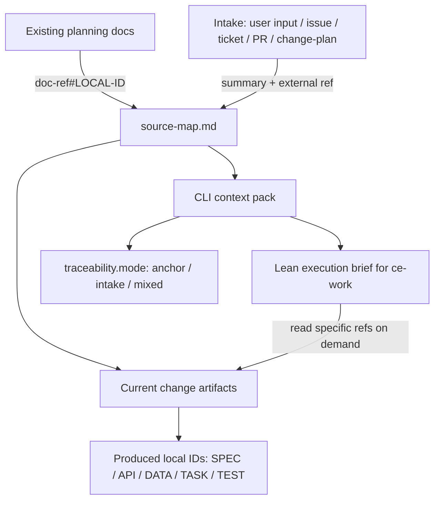

# refactor: 支持无前置文档的 intake 来源追踪

## Summary

本计划让 `aisee-app-spec-driven` 等生成 `source-map.md` 的 schema 合法支持“无 SRS / UI Content / Architecture 前置文档”的直接输入路径。核心变化是把上游来源分成 anchor 来源和 intake 来源：已有 planning docs 继续使用 `doc-ref#LOCAL-ID`，原始用户输入、issue、ticket、PR 或 change-plan 摘要只记录为精简 intake 摘要，并由当前 OpenSpec artifacts 生成 `SPEC-001`、`API-001`、`TASK-001` 等 local ID。

同时补强 implementation-bridge 的交接边界：压缩的是传输上下文，不是规范事实。给 `ce-work` 的内容应是可回读的执行索引，而不是完整 context pack 或 artifact 正文。

---

## Problem Frame

当前 `aisee:change-plan` 允许原始需求、ticket 或 issue 直接进入 change planning，但 `source-map` seed 规则和 app schema 模板仍暗含 `FR / NFR / RULE` 必须来自 SRS anchor。结果是 agent 容易为了满足模板而伪造 `docs/...#FR-001`，随后 CLI 将其解析为 unresolved anchor，导致 `author-check` 和 context pack 出现误导性风险。

这次优化不回退 local ID 模型，也不把聊天原文变成新的事实源。OpenSpec change artifacts 和 archive 后 baseline 仍是规范事实源；intake 只记录经过整理、压缩、脱敏的输入摘要和外部引用。

---

## Requirements

- R1. 无前置 planning docs 时，`change-plan` 和 app schema 模板不得要求或诱导生成 SRS `FR` anchor。
- R2. `source-map.md` 必须能记录精简 intake 来源，包括用户输入、issue、ticket、PR 或 change-plan 摘要，但不得默认保存原始长提示词。
- R3. CLI JSON 必须区分 `upstream_refs=[]` 和“没有来源”；无 anchor 但有 intake 来源与 produced local IDs 时应视为合法 intake 路径。
- R4. 既有 anchor 路径必须保持不变；真实 unresolved anchor 仍要报告 `ANCHOR_RESOLUTION_MISSING`。
- R5. 模板和规则更新必须控制文档体量，避免把 `source-map.md` 扩展成需求正文、任务清单或聊天记录。
- R6. Implementation Bridge 给 `ce-work` 的 handoff 必须是 lean execution brief：只包含事实源引用、scope、IDs、allowed paths、任务起点、风险和验证入口，不原样转发 full context pack。
- R7. 压缩产物不得成为新的事实源；任何细节缺失或冲突必须回读 OpenSpec artifacts，并以 artifacts 为准。
- R8. 测试必须覆盖无 SRS intake 路径、既有 SRS anchor 路径、伪造 / 缺失 anchor 路径和 lean handoff 不含 artifact 全文。

---

## Key Technical Decisions

- KTD1. **Intake 不是 anchor:** `Intake 来源` 记录输入来源和摘要，不参与 `aisee get <anchor-ref>` / `trace` 解析，也不分配 `FR-001`。只有落在文档中的对象才拥有 local ID。
- KTD2. **当前 change 承接正式 local ID:** 无 SRS 路径下，由 `specs/**/*.md`、contracts 和 `tasks.md` 生成 `SPEC / API / DATA / TASK / TEST` local ID，`source-map.md` 只记录 intake 到这些产出 ID 的追踪关系。
- KTD3. **CLI 增量增强而非重写:** 保留现有 `anchor_refs`、`local_ids`、`upstream_refs` 行为，新增 `intake_sources` 与 traceability mode，避免破坏既有 JSON 消费方。
- KTD4. **摘要优先、原文例外:** 模板只要求 1-5 句 intake 摘要和可选外部引用；原始提示词仅在用户或项目审计规则明确要求时作为单独 evidence 保存。
- KTD5. **缺来源是风险，非空 anchor 是解析对象:** 有 intake 来源和 produced local IDs 时不报来源缺失；既没有 anchor、也没有 intake、也没有 produced local IDs 时报告新的 trace gap。
- KTD6. **压缩传输上下文，不压缩事实源:** `implementation-bridge` 可以把 full context pack 压成 lean handoff，但每条摘要必须带 source reference，缺细节时回读 artifact，冲突时以 artifact 为准。

---

## High-Level Technical Design

无 SRS 时，`upstream_refs` 仍为空；新的 `intake_sources` 承担来源说明，`produced_local_ids` 证明当前 change 已把输入提升为可验证 artifacts。

---

## Scope Boundaries

In scope:

- 更新 `aisee:change-plan`、`aisee:change-author` 和 app schema 模板对无前置文档路径的规则。
- 给 CLI parser / context pack 增加 intake 来源解析和 traceability mode。
- 约束 implementation-bridge 只向 `ce-work` 输出 lean execution brief，不传完整 artifact text。
- 增加 focused tests，保护 existing anchor behavior 和 unresolved anchor behavior。
- 修正明显诱导伪造 anchor 的示例文案。

Out of scope:

- 不恢复旧 full ID lifecycle，也不新增 `aisee id reserve/activate` 类命令。
- 不把原始用户提示词作为默认长期 artifact。
- 不重新设计 schema pack DAG 或 OpenSpec archive 规则。
- 不引入新的事实源；intake 来源只作为当前 change authoring 线索。

### Deferred to Follow-Up Work

- Device schema 的更深模板整理可在 app 路径稳定后单独处理。本次只修正与 intake 兼容相关的最小规则。
- 历史架构文档中的旧 full ID 讨论继续作为后续清理项，不纳入本次优化。

---

## Implementation Units

### U1. 规则与模板支持 intake 来源

- **Goal:** 让 skill 与 app schema 模板明确支持无 SRS / UI / Architecture 的直接输入路径，并阻止伪造 SRS anchor。
- **Requirements:** R1, R2, R5
- **Dependencies:** none
- **Files:**
  - `plugins/aisee-plugin/skills/aisee-change-plan/references/source-map-rules.md`
  - `plugins/aisee-plugin/skills/aisee-change-plan/references/output-template.md`
  - `plugins/aisee-plugin/skills/aisee-schema-pack/assets/schema-pack/aisee-app-spec-driven/templates/source-map.md`
  - `plugins/aisee-plugin/skills/aisee-schema-pack/assets/schema-pack/aisee-app-spec-driven/templates/proposal.md`
- **Approach:** 在 source-map seed 规则中定义 anchor 来源与 intake 来源。`FR / NFR / RULE` 在有 SRS 时必须使用 anchor；无 SRS 时写 `N/A — no SRS planning doc`，并在 `Intake 来源` 表记录精简摘要、状态、承接 artifact 和备注。模板示例中把 `docs/...#FR-001` 改为 `docs/...#FR-001 / N/A` 形态，避免默认诱导伪造 anchor。
- **Patterns to follow:** 继续遵守 `plugins/aisee-plugin/references/id-policy.md` 的 local ID / anchor ref 分工，以及 app source-map 模板“只记录路由，不写需求正文”的边界。
- **Test scenarios:**
  - Test expectation: none -- 本单元是 skill/template 文案变更，行为验证由 U3/U4 的 parser 与 CLI 测试覆盖。
- **Verification:** 模板中无 SRS 路径不要求 `FR-001`；`Intake 来源` 示例短小，不包含原始提示词全文。

### U2. Change author 规则承接 intake 路径

- **Goal:** 让 `aisee:change-author` 在 app/device schema 下区分“读取已有 planning docs”和“读取 change-plan / issue / 用户输入 intake”。
- **Requirements:** R1, R2, R5
- **Dependencies:** U1
- **Files:**
  - `plugins/aisee-plugin/skills/aisee-change-author/SKILL.md`
  - `plugins/aisee-plugin/skills/aisee-change-author/references/authoring-rules.md`
- **Approach:** 调整输入门禁与 authoring rules：app/device schema 只有存在相关 planning docs 时才读取 SRS、UI Content、Architecture；无前置文档时读取 Change Plan、Issue 或用户输入摘要，并在当前 change artifacts 中生成正式 local ID。保留 `[ID-FINALIZATION-REQUIRED]` fallback，但禁止用它创建假上游 anchor。
- **Patterns to follow:** `aisee:change-author` 已有“只处理单个 change”“只写 schema 声明 artifacts”“当前 change 内新增 local ID”的规则，直接在这些规则下补 intake 分支。
- **Test scenarios:**
  - Test expectation: none -- 规则变更由 U4 的 author-check 场景间接验证。
- **Verification:** author 规则能说明无 SRS 路径的输入读取顺序和缺口落点，且不把 intake 摘要写成平行需求文档。

### U3. CLI 解析 intake_sources 与 traceability mode

- **Goal:** 让 CLI 输出表达无 anchor 但有来源的合法状态，避免 `upstream_refs=[]` 被消费方误读为空来源。
- **Requirements:** R3, R4
- **Dependencies:** U1
- **Files:**
  - `src/aisee_cli/source_map.py`
  - `src/aisee_cli/context_pack.py`
  - `src/aisee_cli/author_check.py`
  - `tests/test_source_map.py`
  - `tests/test_context_pack.py`
- **Approach:** 在 `parse_source_map()` 中解析 `Intake 来源` / `Intake Sources` 表，返回 `intake_sources`。在 context pack 的 `derived.traceability` 中加入 `intake_sources` 和 `mode`：只有 anchor 为 `anchor`，只有 intake 为 `intake`，两者都有为 `mixed`，两者都没有为 `empty`。保留 `upstream_refs` 字段语义，只表示 anchor refs。
- **Patterns to follow:** 复用现有 table parser、`normalize_key()` 和 `extract_anchor_refs()`；不要把 intake `ref` 送进 `parse_anchor_ref()`。
- **Test scenarios:**
  - `tests/test_source_map.py`: structured source-map 含 `Intake Sources` 表时，`parse_source_map()` 返回类型、引用 / 描述、状态、承接 artifact 和摘要备注。
  - `tests/test_context_pack.py`: 无 SRS source-map 只有 intake 来源和 `SPEC-001` 时，`upstream_refs == []`、`intake_sources` 非空、`produced_local_ids` 包含 `SPEC-001`、`missing_references == []`。
  - `tests/test_context_pack.py`: 既有 SRS anchor 场景继续返回 `mode=anchor`，原有 `upstream_refs` 和 resolved anchors 不变。
- **Verification:** 现有 anchor 测试不需要改断言语义；新增 intake 测试证明无 SRS 路径不是空来源。

### U4. Lean execution brief 约束 implementation-bridge

- **Goal:** 防止 implementation-bridge 把 full context pack 或 artifact 正文直接输入 `ce-work`，同时保证压缩后仍可追溯、可回读、不丢事实。
- **Requirements:** R6, R7
- **Dependencies:** U3
- **Files:**
  - `plugins/aisee-plugin/skills/aisee-implementation-bridge/SKILL.md`
  - `plugins/aisee-plugin/skills/aisee-implementation-bridge/references/brief-template.md`
  - `plugins/aisee-plugin/skills/aisee-implementation-bridge/references/brief-index-template.md`
  - `src/aisee_cli/context_pack.py`
  - `tests/test_context_pack.py`
- **Approach:** 在 bridge 规则中明确 `full context pack` 只供 bridge / verify / debug 使用，`ce-work` 默认接收 lean execution brief。Brief 只列 `Authoritative Source`、scope、source refs、produced IDs、allowed paths、task start、verification 和风险；不得复制 proposal、specs、contracts、source-map 或 tasks 正文。若 CLI 层已有 `facts.parsed.artifacts.*.text`，bridge 必须选择性投影字段；如需要 CLI 支持，可新增 `facts.derived.execution.brief` 或后续 `--lean` 输出，但保持 full JSON 兼容。
- **Patterns to follow:** `aisee:implementation-bridge` 已写明 Brief 只做执行索引、不复制 artifacts 正文；本单元把该规则从文案建议提升为给 `ce-work` 的硬交接边界。
- **Test scenarios:**
  - `tests/test_context_pack.py`: ce-work target 的 derived execution / lean brief 不包含 `facts.parsed.artifacts.*.text` 的正文副本。
  - `tests/test_context_pack.py`: lean handoff 保留 source refs、produced local IDs、allowed paths、task start 和 verification hints。
  - `tests/test_context_pack.py`: 当 brief 摘要引用 `SPEC-001` 或 `API-001` 时，能定位到对应 artifact path，而不是只留下无来源自然语言摘要。
- **Verification:** 给 `ce-work` 的 handoff 可以作为执行索引独立阅读；任何实现细节都能通过 path、anchor 或 local ID 回读 OpenSpec artifacts。

### U5. 校验语义与回归覆盖

- **Goal:** 把“无来源”“合法 intake 来源”“缺失 anchor”三种状态区分开，避免 CLI 风险提示过宽或过窄。
- **Requirements:** R3, R4, R8
- **Dependencies:** U3
- **Files:**
  - `src/aisee_cli/context_pack.py`
  - `tests/test_context_pack.py`
  - `tests/test_doctor_flow_schema.py`
  - `tests/test_schema_pack_examples.py`
- **Approach:** 在 gap 构建中保留 unresolved anchor 的现有风险；新增或调整来源缺口判断：当 schema 需要 `source-map.md` 且没有 anchor、没有 intake、没有 produced local IDs 时报告 `SOURCE_TRACE_MISSING` 风险。schema pack example 检查应继续允许 anchor 示例，同时补一个无 SRS intake 示例或 fixture 片段，防止模板回退到强制 SRS。
- **Patterns to follow:** 当前 `ANCHOR_RESOLUTION_MISSING` 是 risk 而非 blocker，保持兼容；`SOURCE_MAP_MISSING` 仍是 blocker。
- **Test scenarios:**
  - `tests/test_context_pack.py`: `docs/requirements/missing.md#FR-999` 仍触发 `ANCHOR_RESOLUTION_MISSING`。
  - `tests/test_context_pack.py`: 空 source-map 或只有路径、无 intake、无 local ID 时触发 `SOURCE_TRACE_MISSING`。
  - `tests/test_doctor_flow_schema.py`: app schema 有 source-map 但没有 anchor 来源时，doctor 输出能显示 intake 或 trace gap，而不是暗示必须补 SRS。
  - `tests/test_schema_pack_examples.py`: 模板 / example 不包含必须伪造 SRS anchor 的占位。
- **Verification:** 相关测试通过后，`aisee change author-check` 对合法 intake 路径应为 `ready` 或仅保留与 artifacts/tasks 相关的真实 warning。

---

## Risks & Dependencies

- **JSON 兼容风险:** 新字段必须增量添加，不能重命名 `upstream_refs`、`anchor_refs` 或 `produced_local_ids`。下游旧消费者看到新增字段应不受影响。
- **模板膨胀风险:** `Intake 来源` 必须保持摘要级，不能复制聊天全文。计划要求模板只给一张小表和短摘要位置。
- **handoff 膨胀风险:** full context pack 可能包含 artifact text；implementation-bridge 必须投影成 lean brief 后再交给 `ce-work`。
- **误放宽风险:** 无 SRS intake 合法不等于 unresolved anchor 合法。任何出现的 anchor ref 仍必须可解析。
- **事实源边界风险:** Intake 只能是 authoring 线索；最终规范事实仍要落到 current change artifacts 和 archive 后 baseline。

---

## Sources & Research

- `plugins/aisee-plugin/skills/aisee-change-plan/references/source-map-rules.md` 当前要求 `FR / NFR / RULE / FLOW / STATE` 引用 SRS anchor，是本次修复的主要规则缺口。
- `plugins/aisee-plugin/skills/aisee-schema-pack/assets/schema-pack/aisee-app-spec-driven/templates/source-map.md` 当前模板提供上游来源、上游输入 anchor 和本 change 产出 local ID 表，是新增 intake 来源的落点。
- `src/aisee_cli/source_map.py` 已有通用 Markdown table parser，适合增量解析 `Intake 来源`。
- `src/aisee_cli/context_pack.py` 当前从 source-map 抽取 `upstream_refs` 和 `produced_local_ids`，适合新增 traceability mode。
- `plugins/aisee-plugin/skills/aisee-implementation-bridge/SKILL.md` 已要求 Brief 只写摘要、路径、ID、允许路径和验证入口，不复制 artifact 正文；本计划把它补成 ce-work handoff 的强约束。
- `tests/test_source_map.py`、`tests/test_context_pack.py` 和 `tests/test_doctor_flow_schema.py` 已覆盖 source-map parsing、context pack、doctor/author-check 行为，应作为最小回归测试面。
