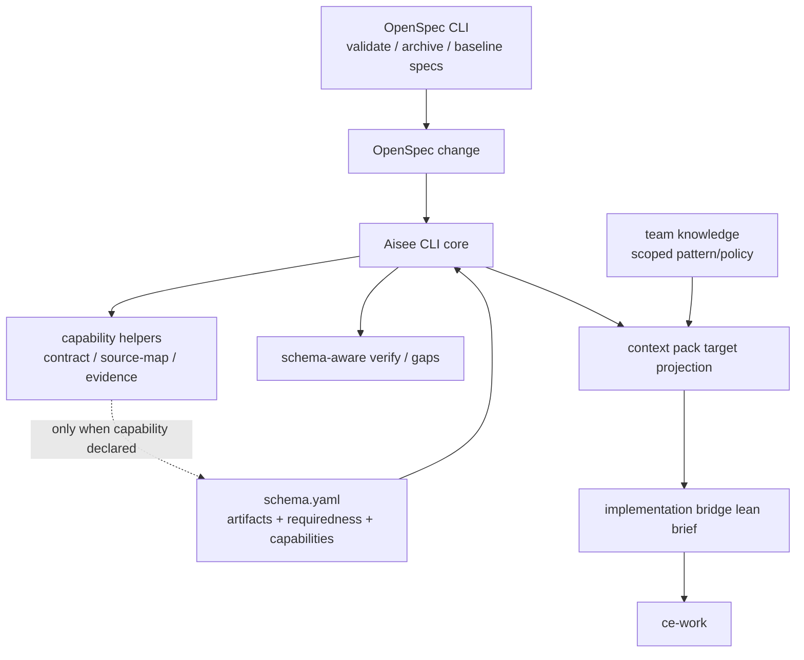
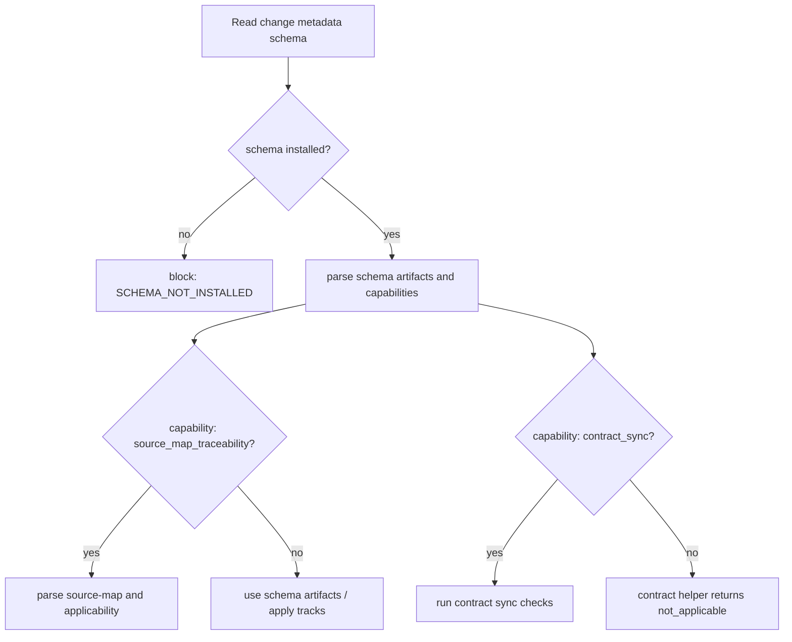

# refactor: 解耦 CLI 与 app schema 的隐式绑定

## Summary

本计划把 Aisee CLI 从 `aisee-app-spec-driven` 的隐式默认模型中解耦，改成基于当前 change schema 声明的 artifacts、capabilities、requiredness 和 apply tracks 工作。目标不是削弱 CLI，而是把 CLI 收缩为 deterministic parser / checker / projector：OpenSpec CLI 继续负责规范结构、validate 和 archive，Aisee skills 继续负责 workflow orchestration，Aisee CLI 只负责 schema 扩展门禁、上下文投影、traceability、knowledge retrieval 和 CE handoff 的机器合同。

---

## Problem Frame

当前链路已经支持多 schema，但部分通用 CLI 路径仍混入 app-first 假设。`context_pack.py` 写死 `change-context`、`ui-contract`、`service-contract`、`data-model`，`contract_sync_gaps()` 直接以 `service-contract` 为检查入口，`contract.py` 只认识 app contract artifacts。即使 skill 文案强调 schema-aware，只要 CLI core 仍默认理解 app artifact，就会让 `quick-fix`、`quick-research`、`infra-change`、`security-audit`、`docsite-driven` 或未来 schema 被 app 规则污染。

更大的风险是跨环节扩散：skill 可能成为隐形 schema，implementation bridge 可能给 `ce-work` 注入大 JSON 和空字段，team knowledge 可能把某项目经验升级成全局事实，Aisee CLI 也可能越界替代 OpenSpec CLI。需要用同一条边界收束：机制通用，策略由 schema 声明，事实留在项目和 change 内。

---

## Requirements

- R1. Aisee CLI core 不得把 `aisee-app-spec-driven` 当作默认 schema、隐式基类或通用 artifact 模型。
- R2. schema 必须能声明 artifacts、requiredness、N/A 规则、apply tracks、archive tracks 和 capabilities；CLI 按声明执行，不按 artifact 名称猜语义。
- R3. app-specific checks 只能在 schema 声明对应 capability 时运行；非 app schema 不得被要求 `source-map.md`、`ui-contract.md`、`service-contract.md`、`data-model.md` 或 `change-context.md`。
- R4. `aisee-app-spec-driven` 内部的按需 artifacts 必须继续支持 Required=no / N/A reason；CLI 不得用硬编码清单替代 schema/source-map 的适用性声明。
- R5. `aisee contract ...` 可以保留为 contract capability helper，但对无 contract capability 的 schema 必须返回 `not_applicable` 或空 manifest 原因，不输出误导性错误。
- R6. Aisee CLI 必须与 OpenSpec CLI 分工清楚：Aisee 不替代 `openspec validate`、不创建平行 baseline、不把 cache/index/registry 当规范事实源。
- R7. skill 只能调用 CLI 查询当前 schema 和最小投影，不得在 `SKILL.md` 中写死 app artifacts 或把教程式规则注入默认上下文。
- R8. implementation bridge 给 `ce-work` 的输入必须是 lean projection；完整 JSON、完整 registry、完整 team knowledge 和无关 planning docs 只能作为按需引用。
- R9. team knowledge 和跨项目复用必须携带作用域；跨项目只能共享 pattern/policy，不能共享项目事实、业务 ID 或 artifact 判断。
- R10. CLI 命令面必须分层：`doctor` 检查环境和 schema pack 健康，`bootstrap` 只输出只读初始化计划，`openspec ensure` 只桥接 OpenSpec CLI 初始化，`schemas` 检查、校验和格式化 schema pack 结构，`inspect`/`gaps`/`author-check`/`verify-check`/`flow` 检查当前 change，`contract`、`sources`、`index`、`get`、`trace`、`plugin` 和 `knowledge` 作为各自 scoped helper，不越界成全量 verifier。
- R11. 正常流程必须保持不变：用户仍触发 skill，skill 自动调用 CLI，只是 CLI 返回更窄、更确定的 JSON 合同，不要求用户手工多跑命令。
- R12. 测试必须覆盖 app schema、device schema、quick-fix、quick-research、docsite、infra、security 以及无 contract capability schema，防止 app 规则回流。
- R13. schema pack 必须有统一 formatter / linter，机械收敛字段顺序、capabilities、requiredness、N/A policy、apply/archive tracks 和模板路径；formatter 不得推断业务语义或替 change 选择 schema。
- R14. schema pack、templates 和 skills 必须同批优化：schema 声明机器规则，templates 引导填写当前 schema 的必要内容，skills 调用 CLI/schema projection，不再复制 app artifact 清单或把 app schema 写成默认流程。

---

## Key Technical Decisions

- KTD1. **CLI 是 parser / checker / projector:** CLI 提供确定性解析、门禁检查和 target projection；它不是 workflow owner、planner、author、installer、archive authority 或 implementation agent。
- KTD2. **CLI core 绑定 schema contract，不绑定 app schema:** core 只解析 schema metadata、schema.yaml、artifacts、capabilities 和当前 change artifacts；`aisee-app-spec-driven` 只是一个 schema pack。
- KTD3. **capability-driven checker:** `contract_sync`、`source_map_traceability`、`app_contracts`、`security_evidence`、`infra_rollback` 等检查由 schema capability 启用，不由 schema name 或 artifact 名称硬编码触发。
- KTD4. **requiredness 属于 schema 和本 change 适用性:** `required=true|false|conditional` 和 `na_requires_reason` 由 schema 声明；source-map schema 可以在 Artifact Applicability 表中记录本次 Required=no 原因。
- KTD5. **OpenSpec CLI 是规范状态权威:** Aisee CLI 可以收集和展示 `openspec validate` 证据，但不能替代 validate/archive，也不能绕过 OpenSpec change lifecycle。
- KTD6. **skill 是 thin orchestrator:** skill 自动调用只读 CLI JSON，并把输出转成阶段所需结论；artifact 列表、requiredness 和 capability 都从 CLI/schema 来，不在 skill 内复制。
- KTD7. **bridge 是投影，不是事实源:** `--for ce-work` 输出执行索引和引用路径；缺细节时回读 current change artifacts，冲突时以 OpenSpec artifacts 为准。
- KTD8. **team knowledge scoped retrieval:** team card 必须声明 scope level、schema/phase/surface/stack 过滤条件；project-fact 不跨项目召回。
- KTD9. **开发阶段直接收敛:** 当前仍处于正常开发测试阶段，不为旧 schema 行为保留兼容迁移层。更新本仓库 schema pack 与 fixtures 后，CLI 直接要求 capability / requiredness 字段可解析；缺字段输出清晰 schema issue。
- KTD10. **写入型 helper 不承担 schema 决策:** `sources add/remove`、`knowledge configure/install/update/promote-batch/init-repo`、`knowledge index`、`index` 和 `openspec ensure` 可以写入各自管理的 registry/cache/checkout/OpenSpec 初始化结果，但不能选择 app schema、修补 change artifacts 或替代 author/verify。
- KTD11. **schema formatter 是机械工具:** formatter 只做稳定排序、字段规范化、缺字段诊断和 dry-run/check/write 模式；它不能根据 artifact 名称补业务 capability，也不能把 app schema 规则套到其它 schema。
- KTD12. **schema、template、skill 同步发布:** 本次不允许只改 CLI。每个 schema 的 `schema.yaml`、templates、相关 skill 和测试 fixture 必须一起更新，否则 agent 仍会从旧模板或 skill 文案获得错误上下文。

---

## High-Level Technical Design

---

## Scope Boundaries

In scope:

- Add schema capability parsing and expose it in CLI JSON.
- Update schema packs and templates in the same change so CLI, schema, and authoring guidance share one contract.
- Replace app artifact hard-coding in context pack and gates with capability / requiredness checks.
- Keep app schema behavior, including optional `change-context`、`ui-contract`、`service-contract`、`data-model` with Required=no reasons.
- Make contract helper capability-gated.
- Tighten OpenSpec CLI boundary in verify/archive/flow docs and CLI evidence handling.
- Update relevant skills to consume schema/capability projection instead of carrying app-specific artifact lists.
- Add tests across multiple schema families.
- Audit CLI commands beyond context pack so `doctor`、`bootstrap`、`openspec ensure`、`plugin`、`sources`、`schemas list/check/format`、`index`、`change inspect`、`gaps`、`flow`、`get`、`trace`、`contract` and `knowledge` keep distinct responsibilities.
- Update architecture docs so future schema packs do not copy app assumptions as global rules.

Out of scope:

- Do not redesign OpenSpec schema format beyond Aisee extension fields.
- Do not remove `aisee-app-spec-driven` or its contract artifacts.
- Do not make Aisee CLI perform `openspec archive`.
- Do not make team knowledge a vector memory or project fact store.
- Do not restore schema pack installation through PyPI CLI.

### Deferred to Follow-Up Work

- A later plan can migrate historical docs that still speak as if app schema is the happy-path baseline.
- A later plan can add richer semantic schema validation once capability fields are stable.

---

## CLI Command Boundary Matrix

| Command group | Responsibility | Must not do |
|---|---|---|
| `doctor` | Project environment, OpenSpec CLI availability, plugin/schema source visibility, installed schema parse health, registry/cache layout risks | Inspect a selected change's app artifacts or report missing `service-contract.md` / `source-map.md` |
| `bootstrap --plan` | Read-only initialization and migration plan based on doctor output | Mutate files, expose `--apply`, install schema packs, choose app schema, or hand-create OpenSpec internals |
| `openspec ensure` | Invoke OpenSpec CLI initialization/profile as a bridge | Replace OpenSpec CLI semantics or install Aisee schemas |
| `plugin inspect/path` | Locate marketplace/plugin assets for installed agent runtimes | Treat plugin assets as installed project schemas or copy assets silently |
| `schemas list/check/format` | Report schema source/installed state, validate schema/template structure, and mechanically normalize schema pack formatting | Decide whether a change is authored, implementation-ready, archive-ready, or infer business capabilities from artifact names |
| `change inspect` / `author-check` / `verify-check` / `archive-check` / `gaps` | Current change schema-aware gates and diagnostics | Fall back to app schema, run app checks without capabilities, or mutate artifacts |
| `context pack` | Target-specific projection for CE/review/verify consumers | Pass full artifacts or unrelated governance JSON to execution targets |
| `flow inspect/next` | Aggregate doctor/change gates into next-step recommendation | Invent readiness from app artifact presence or bypass blockers from source commands |
| `contract *` | Read-only contract capability helper | Error as if non-contract schemas are malformed; should be not-applicable |
| `knowledge *` | Scoped team knowledge configure/check/query/index/install/promote workflows | Become OpenSpec fact source or inject project facts across projects |
| `sources *` | Manage `aisee/registry/sources.json` input source registry | Become anchor resolver, schema selector, or change verifier |
| `index` | Rebuild cache/index views from project files | Become a durable fact source |
| `get` / `trace` | Resolve and trace anchor refs | Resolve intake summaries as anchors or require FR-style IDs for no-doc inputs |

Any command that starts generating long-lived artifact bodies, selecting a schema for a change, reordering the workflow, interpreting product semantics, or replacing `openspec validate` / `openspec archive` is out of bounds for the CLI layer.

---

## Implementation Units

### U1. Schema capability contract

- **Goal:** Add a minimal capability model to schema parsing and schema pack assets without preserving legacy app-default behavior.
- **Requirements:** R1, R2, R3, R4, R12, R13, R14
- **Dependencies:** none
- **Files:**
  - `src/aisee_cli/__main__.py`
  - `src/aisee_cli/context_pack.py`
  - `src/aisee_cli/schema_pack.py`
  - `plugins/aisee-plugin/skills/aisee-schema-pack/assets/schema-pack/aisee-app-spec-driven/schema.yaml`
  - `plugins/aisee-plugin/skills/aisee-schema-pack/assets/schema-pack/aisee-app-spec-driven/templates/source-map.md`
  - `plugins/aisee-plugin/skills/aisee-schema-pack/assets/schema-pack/aisee-app-spec-driven/templates/tasks.md`
  - `plugins/aisee-plugin/skills/aisee-schema-pack/assets/schema-pack/aisee-device-spec-driven/schema.yaml`
  - `plugins/aisee-plugin/skills/aisee-schema-pack/assets/schema-pack/aisee-device-spec-driven/templates/source-map.md`
  - `plugins/aisee-plugin/skills/aisee-schema-pack/assets/schema-pack/aisee-device-spec-driven/templates/tasks.md`
  - `plugins/aisee-plugin/skills/aisee-schema-pack/assets/schema-pack/quick-fix/schema.yaml`
  - `plugins/aisee-plugin/skills/aisee-schema-pack/assets/schema-pack/quick-fix/templates/tasks.md`
  - `plugins/aisee-plugin/skills/aisee-schema-pack/assets/schema-pack/quick-research/schema.yaml`
  - `plugins/aisee-plugin/skills/aisee-schema-pack/assets/schema-pack/aisee-docsite-driven/schema.yaml`
  - `plugins/aisee-plugin/skills/aisee-schema-pack/assets/schema-pack/infra-change/schema.yaml`
  - `plugins/aisee-plugin/skills/aisee-schema-pack/assets/schema-pack/security-audit/schema.yaml`
  - `tests/test_doctor_flow_schema.py`
  - `tests/test_context_pack.py`
  - `tests/test_schema_pack_examples.py`
  - `tests/test_cli_command_surface.py`
- **Approach:** Extend `parse_schema()` to read schema-level and artifact-level capabilities, requiredness, and N/A policy. Update repository schema packs and fixtures in the same change so CLI does not need to derive legacy app defaults. Add capability fields to context pack under `facts.parsed.schema`; malformed or incomplete schema definitions should produce explicit schema issues.
- **Patterns to follow:** Current `parse_schema()` already extracts artifacts, apply, archive tracks, `source_map_required`, and `tasks_required`; extend that path instead of introducing a parallel schema parser. `schema_pack.py` already owns schema list/check, so add formatter/linter behavior there rather than scattering YAML normalization in skills.
- **Test scenarios:**
  - App schema exposes `source_map_traceability`, app contract capabilities, conditional artifacts, and tasks/apply tracks.
  - Quick research exposes no apply/tasks requirement and no source-map or contract capability.
  - Infra schema exposes rollback/impact capabilities without app contracts.
  - Missing capability fields in a fixture schema produce a clear schema issue and do not fall back to app defaults.
  - Schema formatter check mode reports drift when field order, capabilities, requiredness, N/A policy, apply/archive tracks, or template paths are not canonical.
  - Schema formatter write mode updates only `schema.yaml` formatting and does not infer missing business capabilities from artifact names.
  - Templates for app/device mention Required=yes/no only where the schema declares conditional artifacts; lightweight schemas do not mention source-map or app contracts.
- **Verification:** `aisee context pack --for aisee-verify` reports capabilities for installed schemas, `aisee schemas check` validates capability shape, and formatter check passes on repository schema packs.

### U2. Context pack and gates stop hard-coding app artifacts

- **Goal:** Replace app artifact hard-coding in generic CLI flow with schema/capability-driven checks.
- **Requirements:** R1, R3, R4, R8, R12
- **Dependencies:** U1
- **Files:**
  - `src/aisee_cli/context_pack.py`
  - `src/aisee_cli/change_checks.py`
  - `src/aisee_cli/author_check.py`
  - `src/aisee_cli/flow.py`
  - `tests/test_context_pack.py`
  - `tests/test_change_checks.py`
  - `tests/test_doctor_flow_schema.py`
- **Approach:** Remove `OPTIONAL_APP_ARTIFACTS` as a generic decision source. Artifact missing/N/A behavior should come from schema requiredness and source-map applicability when source-map capability exists. `contract_sync_gaps()` should run only when the schema declares contract sync capability and the relevant contract artifact is required for this change.
- **Patterns to follow:** Existing `schema_generates_source_map()` and `schema_requires_tasks()` already derive behavior from schema structure; use the same model for contract and optional artifacts.
- **Test scenarios:**
  - App schema with `service-contract` Required=no and reason does not ask implementer to create `service-contract.md`.
  - App schema with Required=yes service contract and missing sync metadata reports contract sync risk.
  - Quick-fix with `problem/solution/tasks` does not mention source-map or app contracts.
  - Quick-research with no apply block does not become implementation-ready or require tasks.
  - Security/infra/docsite schemas report only their domain evidence gaps.
- **Verification:** Non app schemas can pass author-check/gaps without app artifacts; app schema retains current optional contract behavior.

### U3. CLI command surface responsibility audit

- **Goal:** Adjust CLI commands that interpret project or change health so each command stays in its layer and does not reintroduce app defaults.
- **Requirements:** R1, R3, R6, R10, R11, R12
- **Dependencies:** U1, U2
- **Files:**
  - `src/aisee_cli/__main__.py`
  - `src/aisee_cli/bootstrap.py`
  - `src/aisee_cli/doctor.py`
  - `src/aisee_cli/openspec_init.py`
  - `src/aisee_cli/plugin_assets.py`
  - `src/aisee_cli/sources.py`
  - `src/aisee_cli/schema_pack.py`
  - `src/aisee_cli/change.py`
  - `src/aisee_cli/author_check.py`
  - `src/aisee_cli/change_checks.py`
  - `src/aisee_cli/flow.py`
  - `src/aisee_cli/context_pack.py`
  - `src/aisee_cli/index.py`
  - `src/aisee_cli/lookup.py`
  - `src/aisee_cli/knowledge.py`
  - `tests/test_cli_command_surface.py`
  - `tests/test_doctor_flow_schema.py`
  - `tests/test_change_checks.py`
- **Approach:** Define command responsibility explicitly in code and tests. `doctor` reports initialization, OpenSpec CLI availability, marketplace/plugin asset visibility, installed schemas, schema parse health, version compatibility, registry/cache health, and AGENTS/config issues; it must not report missing change artifacts such as `service-contract.md` or `source-map.md`. `bootstrap --plan` consumes doctor output and returns a read-only initialization plan with `writes=false` and `apply_supported=false`; it can suggest `openspec init` and `aisee-schema-pack`, but must not select app schema by default, install schema packs, mutate files, or create OpenSpec internals by hand. `openspec ensure` can run OpenSpec CLI init/profile but does not own Aisee schemas. `plugin inspect/path` only reports asset locations. `sources` manages input-source registry, `index` writes rebuildable cache, and `get/trace` stay anchor-only. `schemas list/check` reports schema pack source and schema structure only. Change-level commands consume current change metadata and capability checks. `flow` only aggregates those gates into next-step recommendations.
- **Patterns to follow:** Existing `doctor.py` already aggregates environment checks, `bootstrap.py` already emits read-only actions, and `schema_pack.py` already separates list/check from removed install behavior; keep that separation and avoid moving verify logic into doctor or bootstrap.
- **Test scenarios:**
  - `aisee doctor --json` on an initialized project reports installed schema health without requiring app artifacts.
  - `aisee doctor --json` with marketplace plugin missing reports schema pack source guidance, not `service-contract.md` or `source-map.md` gaps.
  - `aisee bootstrap --plan --json` remains read-only, includes `writes=false` and `apply_supported=false`, and does not expose an `--apply` mutation path.
  - `aisee bootstrap --plan --json` suggests OpenSpec initialization via `openspec init` and schema pack availability via marketplace plugin / `aisee-schema-pack`, not by hand-created OpenSpec directories or `aisee schemas install`.
  - `aisee schemas check --json` validates schema structure and templates without deciding whether a change is implementation-ready.
  - `aisee schemas format --check --json` reports formatting drift without writing files; `--write` mechanically normalizes schema files without changing semantic capability choices.
  - `aisee openspec ensure --json` invokes OpenSpec init/profile behavior without installing Aisee schema packs or selecting app schema.
  - `aisee plugin inspect/path --json` reports plugin asset availability without marking source assets as project-installed schemas.
  - `aisee sources add/remove --json` only changes `aisee/registry/sources.json` and does not change current change schema or anchor resolution rules.
  - `aisee index --json` and `aisee knowledge index --json` mark generated indexes as rebuildable cache, not facts.
  - `aisee get` / `aisee trace` resolve anchor refs only and do not treat intake source summaries as anchors.
  - `aisee change inspect` and `aisee gaps` use current change metadata and capabilities for app and non-app fixtures.
  - `aisee flow inspect --change <change> --json` recommends author/work/verify/archive from aggregated gates, not from hard-coded app artifact presence.
  - No CLI command in this audit generates long-lived artifact bodies, chooses schema for an existing change, reorders the workflow, interprets product semantics, or replaces OpenSpec validate/archive.
- **Verification:** Command JSON surfaces remain stable where possible, each command's `meta.command` / issue codes make clear whether the issue is project-level, schema-level, change-level, capability-level, or knowledge-scope-level, and the normal skill-driven workflow still calls the same CLI commands automatically.

### U4. Contract helper becomes capability-gated

- **Goal:** Make `aisee contract ...` read-only helper explicitly scoped to contract-capable schemas.
- **Requirements:** R3, R5, R6, R10, R12
- **Dependencies:** U1, U2, U3
- **Files:**
  - `src/aisee_cli/contract.py`
  - `src/aisee_cli/contract_server.py`
  - `src/aisee_cli/__main__.py`
  - `tests/test_contract_context.py`
  - `tests/test_contract_server.py`
  - `tests/test_cli_command_surface.py`
- **Approach:** Keep the app contract surface, but derive eligible contract artifacts from schema capabilities / artifact roles. For a selected change whose schema has no contract capability, `summary/get` should return a clear not-applicable result or command-level error that names the schema, while `manifest` omits it with a reason.
- **Patterns to follow:** Existing contract commands are manifest-first and read-only; keep this external contract shape while changing eligibility.
- **Test scenarios:**
  - App schema manifest includes service/UI/data contracts as before.
  - Quick-fix and quick-research changes do not appear as contract-capable entries.
  - `contract get` against a non-contract schema returns `CONTRACT_NOT_APPLICABLE` rather than `contract artifact not found`.
  - Contract server response stays stable for app schema and omits non-contract schemas.
- **Verification:** Cross-repo consumers still receive app contract summaries, while lightweight changes do not produce misleading contract errors.

### U5. OpenSpec CLI boundary and evidence integration

- **Goal:** Ensure Aisee verify/archive/flow consume OpenSpec CLI evidence without replacing OpenSpec authority.
- **Requirements:** R6, R10, R12
- **Dependencies:** U1, U2, U3
- **Files:**
  - `src/aisee_cli/change_checks.py`
  - `src/aisee_cli/source_map.py`
  - `src/aisee_cli/flow.py`
  - `plugins/aisee-plugin/skills/aisee-verify/SKILL.md`
  - `plugins/aisee-plugin/skills/aisee-archive-guard/SKILL.md`
  - `docs/architecture/aisee-openspec-compound-integration.md`
  - `docs/architecture/openspec-multi-schema-best-practices.md`
  - `tests/test_change_checks.py`
  - `tests/test_doctor_flow_schema.py`
- **Approach:** Keep `openspec validate <change>` as a required evidence surface for verify/archive. Aisee checks can add schema/capability risks, but OpenSpec validate failure remains blocker. Docs should state that Aisee does not own baseline specs, archive conflict resolution, or OpenSpec schema selection precedence.
- **Patterns to follow:** `aisee:verify` already describes OpenSpec validate as authority; align CLI status and docs with that contract.
- **Test scenarios:**
  - Missing validate evidence is a risk before archive and a blocker at archive guard when policy requires it.
  - Failed validate evidence blocks archive even if Aisee schema checks pass.
  - Aisee flow does not recommend archive when validate evidence is absent or failing.
  - Docs distinguish OpenSpec change lifecycle from Aisee schema capability gates.
- **Verification:** Aisee output never presents `archive-ready` when OpenSpec validation has failed.

### U6. Skill, schema template, and bridge context hygiene

- **Goal:** Ensure skills and schema templates consume the new schema/capability projection, keep handoff context small, and stop presenting app schema as the default workflow.
- **Requirements:** R7, R8, R10, R11, R12, R14
- **Dependencies:** U1, U2, U3, U5
- **Files:**
  - `plugins/aisee-plugin/skills/aisee-change-plan/SKILL.md`
  - `plugins/aisee-plugin/skills/aisee-change-plan/references/schema-selection-rules.md`
  - `plugins/aisee-plugin/skills/aisee-change-plan/references/source-map-rules.md`
  - `plugins/aisee-plugin/skills/aisee-change-plan/references/output-template.md`
  - `plugins/aisee-plugin/skills/aisee-change-author/SKILL.md`
  - `plugins/aisee-plugin/skills/aisee-implementation-bridge/SKILL.md`
  - `plugins/aisee-plugin/skills/aisee-verify/SKILL.md`
  - `plugins/aisee-plugin/skills/aisee-archive-guard/SKILL.md`
  - `plugins/aisee-plugin/skills/aisee-flow/SKILL.md`
  - `plugins/aisee-plugin/skills/aisee-init/SKILL.md`
  - `plugins/aisee-plugin/skills/aisee-init/assets/codex-agents-template.md`
  - `plugins/aisee-plugin/skills/aisee-schema-pack/SKILL.md`
  - `plugins/aisee-plugin/skills/aisee-schema-pack/references/multi-schema-best-practices.md`
  - `plugins/aisee-plugin/skills/hw-change-plan/SKILL.md`
  - `plugins/aisee-plugin/skills/hw-init/SKILL.md`
  - `plugins/aisee-plugin/references/id-policy.md`
  - `plugins/aisee-plugin/references/context-pack-contract.md`
  - `plugins/aisee-plugin/references/context-pack-targets.md`
  - `tests/test_skill_cli_preflight.py`
- **Approach:** Replace fixed app artifact lists in skill instructions and templates with “read current schema artifacts/capabilities from CLI” wording. `aisee-change-plan` should choose schema and emit source-map seed only when schema declares source-map capability. `aisee-change-author` should author only current schema artifacts. `aisee-init` AGENTS template should describe multi-schema behavior without saying app schema is the default. `aisee-schema-pack` should teach capability/formatter rules. Hardware skills should keep device source-map behavior scoped to device schema. Implementation bridge should prefer `facts.derived.execution.brief` and avoid full context pack passthrough.
- **Patterns to follow:** Current `aisee:implementation-bridge` already says to consume lean projection and avoid artifact text; update related skills to the same contract. Keep `SKILL.md` concise and move long capability mapping into references, matching the repository rule that skill content should stay small.
- **Test scenarios:**
  - Skill docs do not say every change must generate app contracts.
  - `aisee-init` generated AGENTS template does not say app schema is the default; it says to inspect current change schema.
  - `aisee-schema-pack` describes formatter/check behavior and capability fields without suggesting `aisee schemas install`.
  - `aisee-change-plan` docs say source-map seed is emitted only for schemas that declare source-map capability.
  - `aisee-change-author` docs say current schema artifacts are authoritative and conditional artifacts need Required=yes/no or N/A reason.
  - Hardware skill docs keep device requirements scoped to `aisee-device-spec-driven`, not global change flow.
  - Skill docs say source-map is required only when schema generates it.
  - Implementation bridge docs name capability projection and lean brief, not full JSON forwarding.
  - Skill docs preserve automatic read-only CLI use and write checkpoint boundaries.
- **Verification:** A text-level regression test fails if app artifact names reappear as global requirements in relevant skills.

### U7. Team knowledge and cross-project scope guard

- **Goal:** Prevent cross-project and team knowledge reuse from becoming another hidden app/project fact source.
- **Requirements:** R8, R9
- **Dependencies:** U1
- **Files:**
  - `src/aisee_cli/knowledge.py`
  - `docs/architecture/aisee-team-knowledge.md`
  - `plugins/aisee-plugin/skills/aisee-knowledge-curate/SKILL.md`
  - `plugins/aisee-plugin/skills/aisee-reflect/SKILL.md`
  - `tests/test_knowledge_config.py`
  - `tests/test_knowledge_configure.py`
- **Approach:** Add or document scope levels for retrieved knowledge: `pattern`, `policy`, and `project-fact`. Query output should default to pattern/policy cards for cross-project contexts and exclude project facts unless the project pin explicitly allows them. Bridge context should include only top N scoped guardrails, never raw card bodies or broad memory dumps.
- **Patterns to follow:** Existing team knowledge architecture already says OpenSpec/current change facts have priority over project-local evidence and team cards; encode that as retrieval and projection behavior.
- **Test scenarios:**
  - Cross-project query excludes `project-fact` cards by default.
  - Schema/phase/surface filters prevent app-specific cards from applying to quick-research or infra changes.
  - Context pack includes only capped guardrail summaries and source references.
  - Project-local facts remain lower priority than current change artifacts.
- **Verification:** A team card cannot force app artifacts into a non-app schema flow.

### U8. Documentation and migration guidance

- **Goal:** Document the new boundary so future schema packs, skills, and CLI commands do not recreate the coupling.
- **Requirements:** R1, R2, R6, R7, R9
- **Dependencies:** U1-U7
- **Files:**
  - `docs/architecture/OPENSPEC_SCHEMA_GUIDE.md`
  - `docs/architecture/aisee-cli-context-and-id-registry.md`
  - `docs/architecture/aisee-openspec-compound-integration.md`
  - `docs/architecture/openspec-multi-schema-best-practices.md`
  - `docs/architecture/aisee-team-knowledge.md`
  - `README.md`
- **Approach:** Add a concise “schema capability boundary” section: CLI core consumes schema contract; app schema declares app capabilities; OpenSpec CLI remains validate/archive authority; team knowledge shares patterns, not facts. Keep examples small and avoid turning docs into tutorials.
- **Patterns to follow:** Existing architecture docs already separate Aisee/OpenSpec/Compound responsibilities and multi-schema conflict rules; update those documents instead of creating a parallel spec.
- **Test scenarios:**
  - Test expectation: none -- documentation-only unit.
- **Verification:** Docs state the invariant that app schema is not a hidden base class, and no doc recommends `aisee schemas install` for schema pack writes.

---

## Risks & Dependencies

- **Schema fixture drift risk:** Repository fixtures and schema pack assets must be updated together. Mitigation: schema check tests should fail clearly when a fixture lacks required capability / requiredness fields.
- **Behavior drift risk:** Moving checks behind capabilities can accidentally weaken app schema validation. Mitigation: app schema regression tests must prove current Required=yes and Required=no contract behavior.
- **OpenSpec boundary risk:** Aisee may still appear authoritative if verify output is worded poorly. Mitigation: status names and docs must keep OpenSpec validate/archive as hard authority.
- **Context bloat risk:** Capability data could make context packs larger. Mitigation: expose full schema details only in verify/doctor targets; `ce-work` receives compact capability names and source references.
- **Team knowledge contamination risk:** Project facts may leak across projects. Mitigation: default retrieval excludes `project-fact` outside the pinned project scope.

---

## Sources & Research

- `src/aisee_cli/context_pack.py` currently parses schema and builds target context packs, but also contains app artifact constants and service-contract sync checks.
- `src/aisee_cli/contract.py` and `src/aisee_cli/contract_server.py` provide the existing app contract read-only surface.
- `src/aisee_cli/change_checks.py` already shows the desired direction by applying schema-specific evidence requirements for docsite, infra, security, quick-fix, and quick-research.
- `plugins/aisee-plugin/skills/aisee-schema-pack/assets/schema-pack/aisee-app-spec-driven/schema.yaml` already says app contracts are conditional and may be Required=no with reasons.
- `docs/architecture/aisee-openspec-compound-integration.md` defines the current Aisee / OpenSpec / Compound boundary.
- `docs/architecture/aisee-team-knowledge.md` defines team knowledge as scoped guardrails, not a fact source.
