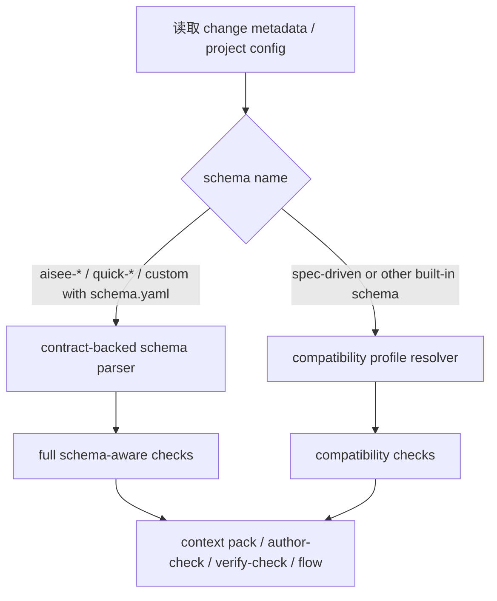
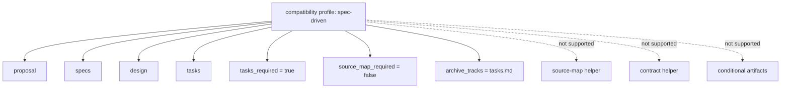

# refactor: 为 OpenSpec spec-driven 增加兼容模式

## Summary

本计划把 Aisee 从“必须先拥有 Aisee 专属 schema contract 才能工作”的模型，调整为“默认兼容 OpenSpec 标准 schema，Aisee schema 只提供增强能力”的模型。目标不是回退 schema-aware 检查，而是把 `spec-driven`、未来其他官方内置 schema，以及未安装 Aisee schema pack 的真实 OpenSpec 项目，重新纳入 `doctor` 之外的 change 级 CLI 可用面。

同时，本计划要求把版本从 `0.6.0` 升级到新的 `MINOR` 版本，因为 change 级 JSON 语义会从“`spec-driven` 一律 blocker”调整为“兼容模式可继续运行并给出降级提示”，这属于公开契约行为变化。

---

## Problem Frame

当前 CLI 已完成“不要把 `aisee-app-spec-driven` 当默认 schema”的收敛，但它又走到了另一个极端：change 级路径把“存在可解析的 `schema.yaml` contract”当成硬前提。对 `aisee-app-spec-driven`、`quick-fix`、`quick-research` 这类 Aisee schema，这个前提成立；对 OpenSpec 官方内置 `spec-driven`，当前实现没有兼容层，于是 `author-check`、`verify-check`、`archive-check`、`flow inspect`、`context pack` 会统一落到 `SCHEMA_NOT_FOUND` / `SCHEMA_CONTRACT_UNAVAILABLE`。

真实项目验证已经证明这不是理论问题。`/Users/fengliang/PycharmProjects/aids-prevention-full` 这种正常运行中的 OpenSpec 项目，`openspec/config.yaml` 和所有活跃 change 都使用 `schema: spec-driven`，项目内没有 `openspec/schemas/spec-driven/schema.yaml`，因此 Aisee change 级链路全部被阻断，尽管该项目的 OpenSpec artifacts 本身是合法且完整的。这说明阻塞点在 Aisee CLI 的兼容策略，而不在项目。

更深层的问题是产品定位：Aisee 应该是 OpenSpec 的增强层，而不是只有在迁入 `aisee-*` schema 后才可用的平行体系。Aisee schema 可以带来 `source-map`、contract helper、conditional artifacts、domain evidence 等增强，但这些增强不应该被提升为基础可用性的门槛。

---

## Requirements

- R1. Aisee 必须能在标准 OpenSpec `spec-driven` change 上运行基础的 change 级 CLI：`change inspect`、`author-check`、`verify-check`、`archive-check`、`flow inspect`、`context pack`。
- R2. 对 `spec-driven` 或其他 OpenSpec 官方内置 schema，CLI 不得再返回 `SCHEMA_NOT_FOUND` / `SCHEMA_CONTRACT_UNAVAILABLE` blocker，除非 change metadata 本身损坏。
- R3. Aisee schema 继续作为增强层存在，但其 capability 缺失只能导致对应增强能力降级，不能导致基础 change 链路整体不可用。
- R4. CLI 必须显式区分两类 schema 来源：Aisee contract-backed schema 与 OpenSpec compatibility schema；消费者能看出当前是 full mode 还是 compatibility mode。
- R5. `spec-driven` compatibility mode 至少要支持 `proposal`、`specs`、`design`、`tasks`、`tasks_required=true`、`source_map_required=false` 和基础 archive track。
- R6. `spec-driven` compatibility mode 不得伪造 Aisee 专属 artifacts，例如 `source-map.md`、`ui-contract.md`、`service-contract.md`、`data-model.md`。
- R7. contract helper、source-map 检查、conditional artifact、domain evidence 等能力必须在 compatibility mode 下明确返回 `not_applicable`、`unsupported` 或降级说明，而不是 blocker。
- R8. `doctor`、`schemas list/check`、`plugin inspect/path` 的职责保持不变，不因为 compatibility mode 而重新耦合为 schema 安装器或 change 修复器。
- R9. 技能文案、架构文档和 best practices 必须同步更新：Aisee 不依赖专属能力才能工作；Aisee schema 是增强包，不是准入证。
- R10. 这次变更属于公开契约升级：需要升级 CLI / plugin 版本、更新 release 文档、补 contract tests 和 smoke。
- R11. 兼容层只处理 OpenSpec 标准 schema 的“最小可用集”，不得把 OpenSpec 官方 schema 重新复制为另一套长期事实源。
- R12. 真实回归场景必须覆盖三类项目：Aisee schema 项目、纯 `spec-driven` 项目、混合项目（部分 Aisee schema，部分官方 schema）。

---

## Key Technical Decisions

- KTD1. **Aisee 改成双轨 schema 模型。** CLI 内部区分 `contract-backed` 与 `compatibility` 两种 schema mode。前者来自 `schema.yaml`；后者来自内置 compatibility profile，不依赖项目安装 Aisee schema。
- KTD2. **`spec-driven` 进入 compatibility profile，而不是报缺 schema。** 当 change metadata 或项目 config 指向 `spec-driven`，且项目内/marketplace 中找不到同名 Aisee schema contract 时，CLI 直接加载内置 `spec-driven` profile。
- KTD3. **兼容层是运行时适配器，不是新事实源。** 不在仓库内复制官方 `spec-driven/schema.yaml`，也不要求项目生成 `openspec/schemas/spec-driven/`。兼容层只在 CLI 进程内构造最小 schema view。
- KTD4. **增强能力降级而不是整体阻断。** 在 compatibility mode 下，`source_map_traceability`、`contract_helper`、`contract_sync`、conditional artifacts、schema-specific evidence 全部走明确降级结果，不再报 schema 缺失 blocker。
- KTD5. **标准 OpenSpec artifact 组合优先。** `spec-driven` compatibility profile 的最小 contract 只包含 `proposal`、`specs`、`design`、`tasks`；这与 OpenSpec 官方默认工作流一致。
- KTD6. **Flow 与 verify 的 blocker 语义要重分层。** `SCHEMA_METADATA_MISSING`、`SCHEMA_MISMATCH` 继续是 blocker；但“当前 schema 是 OpenSpec 内置 schema 且未安装 Aisee contract”不再是 blocker，而是 mode 切换。
- KTD7. **change JSON 需要显式暴露 mode/source。** 至少在 `facts.parsed.schema`、`change inspect`、`flow inspect` 里暴露 `mode=contract-backed|compatibility` 与 `source=aisee-schema|openspec-built-in|project-installed|project-config`。
- KTD8. **contract helper 保持 read-only，但在 compatibility mode 统一 `not_applicable`。** 这比“artifact 不存在”更准确，也更符合 helper 的定位。
- KTD9. **公开契约变化走 `MINOR` 升级。** 从 `0.6.0` 升到 `0.7.0`。原因：change 级 CLI 对 `spec-driven` 的行为不再是 blocker，属于已文档化语义变化。
- KTD10. **旧计划局部 supersede。** `2026-06-10-002` 中“CLI core 只绑定 schema contract”的表述，收敛为“CLI core 先绑定 OpenSpec change，再按可用性绑定 schema contract 或 compatibility profile”。这是补正，不是回退 app-first。

---

## High-Level Technical Design

---

## Scope Boundaries

In scope:

- 为 `spec-driven` 增加内置 compatibility profile。
- 调整 context pack、flow、author-check、verify-check、archive-check、contract helper 的 blocker/降级语义。
- 在 CLI JSON 中暴露 schema mode/source。
- 为 mixed project 增加测试与 fixture。
- 同步更新架构文档、best practices、workflow、release 文档。
- 升级版本并更新 smoke / version governance。

Out of scope:

- 不在项目内生成或安装 `openspec/schemas/spec-driven/` 副本。
- 不重新设计 OpenSpec 官方 schema 格式。
- 不把 compatibility profile 扩展成任意第三方 schema 的推断器。
- 不恢复 app-first artifact 推断。

### Deferred to Follow-Up Work

- 若未来需要支持更多官方内置 schema，可在同一 compatibility 机制下新增 profile，但本次先只做 `spec-driven`。
- 若后续需要支持“从 `openspec schema which` 动态读取官方 schema 详情”，可另立计划评估是否值得引入 OpenSpec CLI 依赖面扩张。

---

## Alternative Approaches Considered

### 方案 A：要求所有项目安装本地 `spec-driven` fork

不采纳。它会把 Aisee 重新变成迁移门槛，而且需要改真实项目内容才能跑 CLI，违背“增强层”定位。

### 方案 B：把官方 `spec-driven` 复制到 plugin schema pack

不采纳。这样会制造第二份 schema 事实源，还会引入和 OpenSpec 官方 schema 漂移的问题。

### 方案 C：运行时 compatibility profile

采纳。它让 CLI 保持只读兼容，同时不把 OpenSpec 官方 schema 挪成 Aisee 自己的静态资产。

---

## Risks And Dependencies

- 风险 1：`spec-driven` compatibility 规则定义过窄，导致部分已有 OpenSpec 项目仍被误判。
  - 缓解：先覆盖标准 `proposal/specs/design/tasks`，对其它增强能力一律显式 `not_applicable`，不要猜测额外 artifact。
- 风险 2：JSON 消费方假设 `SCHEMA_NOT_FOUND` 仍会出现，兼容层会改变它们的错误处理。
  - 缓解：明确 `0.7.0` 为 `MINOR` 升级，更新 docs 和 tests，并在 release notes 写明语义变化。
- 风险 3：技能文案和代码边界不同步，用户仍会得到“必须先安装 Aisee schema”的错误心智。
  - 缓解：文档、skill、README、workflow 同批更新。
- 依赖：现有 `contract_helper`、`flow`、`context_pack` 的消费者都要接受 `compatibility` mode 字段和更多 `not_applicable` 返回。

---

## Sources & Research

- `docs/plans/2026-06-10-002-refactor-schema-capability-boundaries-plan.md`
- `docs/architecture/aisee-openspec-compound-integration.md`
- `docs/architecture/openspec-multi-schema-best-practices.md`
- `docs/architecture/OPENSPEC_SCHEMA_GUIDE.md`
- `docs/compatibility-policy.md`
- `docs/release.md`
- 真实项目只读验证：`/Users/fengliang/PycharmProjects/aids-prevention-full`
  - 项目和活跃 change 全部使用 `schema: spec-driven`
  - `aisee doctor --json` 可运行
  - `aisee flow inspect` / `aisee change author-check` 全部阻塞于 `SCHEMA_NOT_FOUND` / `SCHEMA_CONTRACT_UNAVAILABLE`

---

## Implementation Units

### U1. 建立 OpenSpec compatibility profile 解析层

- **Goal:** 让 CLI 能在没有 Aisee `schema.yaml` 的前提下，对 `spec-driven` 生成最小可用 schema view。
- **Requirements:** R1, R2, R4, R5, R6, R11, R12
- **Dependencies:** none
- **Files:**
  - `src/aisee_cli/context_pack.py`
  - `src/aisee_cli/change.py`
  - `src/aisee_cli/author_check.py`
  - `tests/test_context_pack.py`
  - `tests/test_doctor_flow_schema.py`
- **Approach:** 在 `resolve_change_schema()` / `find_schema_paths()` 之后引入 `compatibility profile resolver`。当 schema name 为 `spec-driven` 且没有可解析的 `schema.yaml` 时，返回内置 profile，而不是走 `default_schema_info()` 的 blocker 路径。该 profile 明确提供 `proposal/specs/design/tasks`、`tasks_required=true`、`source_map_required=false`、`archive_tracks=["tasks.md"]`。
- **Patterns to follow:** 复用现有 `parse_schema()` 输出结构和 `ArtifactSpec` 数据形状，不新增平行 parser。`default_schema_info()` 可以演化为按 schema name 分流的 compatibility factory，而不是统一 blocker stub。
- **Test scenarios:**
  - 给定 `schema: spec-driven` 且无 `openspec/schemas/spec-driven/schema.yaml`，`build_context_pack()` 返回 `mode=compatibility`，不生成 `SCHEMA_NOT_FOUND` blocker。
  - 给定 `schema: spec-driven` change，artifact 列表至少包含 `proposal`、`specs`、`design`、`tasks`。
  - 给定缺失 `.openspec.yaml` 的 change，仍然保持 `SCHEMA_METADATA_MISSING` blocker。
  - 给定 metadata schema 与 artifact hint 冲突，仍然保持 `SCHEMA_MISMATCH` blocker。
- **Verification:** `aisee context pack --change <spec-driven-change> --for aisee-verify --json` 能返回兼容模式 schema 信息，而不是 schema 缺失错误。

### U2. change 级门禁改为“降级而非缺 schema 阻断”

- **Goal:** 让 `author-check`、`verify-check`、`archive-check`、`flow inspect` 在 `spec-driven` 下继续工作。
- **Requirements:** R1, R2, R3, R5, R6, R7, R12
- **Dependencies:** U1
- **Files:**
  - `src/aisee_cli/author_check.py`
  - `src/aisee_cli/change_checks.py`
  - `src/aisee_cli/flow.py`
  - `src/aisee_cli/context_pack.py`
  - `tests/test_change_checks.py`
  - `tests/test_doctor_flow_schema.py`
- **Approach:** 将“schema 不可解析”从 `spec-driven` compatibility 场景中摘出 blocker 列表。`build_gaps()` 和 `inspect_schema()` 需要认得 compatibility mode，并只保留真正的 metadata/blocker。`flow inspect` 应在 `spec-driven` 下给出正常 stage/recommended_path，而不是机械回到 `aisee:change-author`。
- **Execution note:** 先补 characterization tests，再改 blocker 语义，避免把 `SCHEMA_NOT_FOUND` 在真正坏 schema 场景里一并吃掉。
- **Patterns to follow:** 当前 `change_checks.py` 已经区分 `tasks_required`、`schema_supports_contract_helper` 等能力；兼容层要沿用这种条件化策略，而不是新增 `if schema == "spec-driven"` 的散点分支。
- **Test scenarios:**
  - `spec-driven` change 且 `proposal/specs/design/tasks` 齐全时，`author-check` 不是 `blocked`。
  - `spec-driven` change 有未完成 tasks 时，`archive-check` 仍返回 `TASKS_OPEN` blocker。
  - `spec-driven` change 缺 `openspec validate` evidence 时，`archive-check` 仍返回 `VALIDATE_EVIDENCE_MISSING` blocker。
  - `flow inspect` 在 `spec-driven` change 上给出正常下一步建议，而不是 `SCHEMA_NOT_FOUND` 驱动的伪 blocker。
- **Verification:** `aisee flow inspect --change <spec-driven-change> --json` 能进入 change-authored / verified / archive-ready 等正常 stage。

### U3. helper 能力在 compatibility mode 下统一 not_applicable

- **Goal:** 让 contract/source-map 相关 helper 在 `spec-driven` 下返回准确的降级结果。
- **Requirements:** R3, R5, R6, R7, R12
- **Dependencies:** U1, U2
- **Files:**
  - `src/aisee_cli/contract.py`
  - `src/aisee_cli/context_pack.py`
  - `src/aisee_cli/change.py`
  - `tests/test_contract_context.py`
  - `tests/test_contract_server.py`
  - `tests/test_context_pack.py`
- **Approach:** compatibility mode 默认关闭 `contract_helper`、`source_map_traceability`、`contract_sync`。`contract summary/get/manifest` 在 `spec-driven` 下保持 `status=not_applicable`，reason 明确说明“当前 schema 未声明该增强能力”。`context pack` 则返回 `source_map.status=not_applicable`，但不再推导成 schema 缺失。
- **Patterns to follow:** `contract.py` 已有 `not_applicable_contract_result()`；扩展使用场景即可。`not_applicable_source_map()` 已存在，应保留并把它从“无能力”语义和“缺 schema”语义彻底分离。
- **Test scenarios:**
  - `aisee contract summary --change <spec-driven-change> --json` 返回 `status=not_applicable`，而不是异常或 blocker。
  - `aisee contract manifest --json` 会跳过 `spec-driven` changes，不把它们记成 malformed schema。
  - `spec-driven` 的 `change inspect` / `context pack` 中 `source_map.status` 为 `not_applicable`，但 overall status 不因 source-map 缺失而阻断。
- **Verification:** helper 输出能清楚区分“无此增强能力”和“项目坏了”。

### U4. 公开契约、技能和文档同步收敛到“增强层”定位

- **Goal:** 把 Aisee 的产品边界从“专属 schema 前提”改写为“OpenSpec 增强层 + 可选增强包”。
- **Requirements:** R8, R9, R10, R11
- **Dependencies:** U1, U2, U3
- **Files:**
  - `README.md`
  - `docs/compatibility-policy.md`
  - `docs/release.md`
  - `docs/workflow.md`
  - `docs/best-practices.md`
  - `docs/architecture/aisee-openspec-compound-integration.md`
  - `docs/architecture/openspec-multi-schema-best-practices.md`
  - `plugins/aisee-plugin/skills/aisee-implementation-bridge/SKILL.md`
  - `plugins/aisee-plugin/skills/aisee-verify/SKILL.md`
  - `plugins/aisee-plugin/skills/aisee-archive-guard/SKILL.md`
  - `plugins/aisee-plugin/skills/aisee-change-plan/references/schema-selection-rules.md`
- **Approach:** 更新文档和 skill 规则，明确：
  - Aisee 可在 `spec-driven` 上运行基础链路
  - `aisee-* schema` 是增强 schema，不是强制门槛
  - `source-map` / contract / conditional artifacts 是增强能力
  - 真实项目若仍是 `spec-driven`，不应被 change 级 CLI 直接打死
- **Patterns to follow:** 继续沿用现有的 Public Contract / Experimental / Internal 分层写法，不新增平行术语。
- **Test scenarios:** Test expectation: none -- 文档与 skill 变更本身不产生行为，但相关 contract tests 和 real-project regression 由 U5 覆盖。
- **Verification:** 文档和 skill 不再声称或暗示“未安装 Aisee schema pack 就无法运行 change 级 CLI”。

### U5. 版本升级、回归样本与发布门禁

- **Goal:** 将 compatibility mode 作为一次完整的 `MINOR` 发布交付，而不是仅改本地实现。
- **Requirements:** R10, R12
- **Dependencies:** U1, U2, U3, U4
- **Files:**
  - `pyproject.toml`
  - `src/aisee_cli/__init__.py`
  - `.agents/plugins/marketplace.json`
  - `plugins/aisee-plugin/.codex-plugin/plugin.json`
  - `plugins/aisee-plugin/.claude-plugin/plugin.json`
  - `plugins/aisee-plugin/.cursor-plugin/plugin.json`
  - `scripts/check_versions.py`
  - `scripts/sync_versions.py`
  - `scripts/smoke_release.py`
  - `tests/test_version_consistency.py`
  - `tests/test_plugin_packaging.py`
  - `tests/test_doctor_flow_schema.py`
  - `tests/test_cli_command_surface.py`
- **Approach:** 将版本从 `0.6.0` 升级到 `0.7.0`。补充一组 `spec-driven` regression fixtures，覆盖：
  - 纯 `spec-driven`
  - 纯 Aisee schema
  - mixed project
  同时更新 smoke 和版本治理说明，明确这是一次 change 级 JSON 行为升级。
- **Patterns to follow:** 复用现有版本治理链路：`pyproject.toml` 为单一版本事实源，`scripts/check_versions.py` / `sync_versions.py` 同步 manifest 与 CLI 版本，`scripts/smoke_release.py` 验证安装后命令面。
- **Test scenarios:**
  - 版本检查脚本在 `0.7.0` 上通过，所有 metadata 同步。
  - installed wheel smoke 中，`aisee doctor --json`、`aisee schemas list/check/format --json` 继续通过。
  - mixed project 中，Aisee schema change 继续走 full mode，`spec-driven` change 走 compatibility mode。
  - 真实项目样式 fixture（无 `openspec/schemas/spec-driven/`）不再在 `flow inspect` / `author-check` 上被 `SCHEMA_NOT_FOUND` 阻断。
- **Verification:** `python scripts/check_versions.py`、相关 pytest、`python scripts/smoke_release.py` 全部通过，且 release notes 明确写出 `spec-driven` 兼容模式上线。

---

## Success Metrics

- `spec-driven` 项目上的 `flow inspect` / `author-check` 从统一 `blocked` 下降到按真实 artifacts 和 evidence 决定状态。
- Aisee schema 项目不回退到 app-first 或 compatibility 模式。
- 发布后的 `CLI` / plugin / docs 版本一致，且 smoke 覆盖 compatibility 回归。

---

## Open Questions

- OQ1. 本次 compatibility profile 是否只支持 `spec-driven`，还是顺手为其他 OpenSpec 官方内置 schema 预留注册位？建议本次只做 `spec-driven`，其余留后续。
- OQ2. JSON 中 mode/source 字段是否新增在所有 change 级命令顶层，还是仅放在 `facts.parsed.schema`？建议至少在 `facts.parsed.schema` 和 `change inspect` / `flow inspect` 的摘要层都可见。

