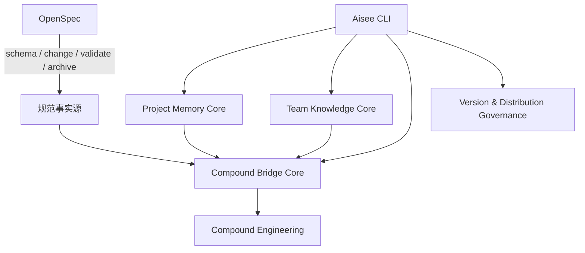
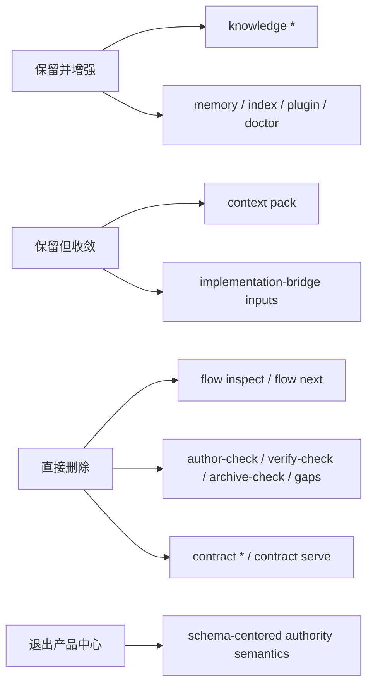

# refactor: 重构 Aisee CLI 为 knowledge-first bridge

## Summary

本计划把 Aisee CLI 从“schema-aware change gate 与流程裁决器”重构为 “knowledge-first bridge”：CLI 的核心职责收敛到本项目记忆、团队记忆、面向 Compound 的最小上下文桥接，以及版本/分发治理。OpenSpec 继续负责 schema、change artifacts、validate 与 archive；Compound 继续负责 plan/work/review/test；Aisee 保留增强层角色，但不再以 change gate authority 为中心。

该重构不是在旧的 `spec-driven compatibility` 路线之上继续补缀，而是直接改写产品重心。`spec-driven`、`aisee-* schema` 与其它 OpenSpec schema 是否存在，不再决定 Aisee 是否可用，只会影响 Aisee 能提供多少增强信息。与此同时，相关 skill 必须同步调整，避免 CLI 已弱化而 skill 仍以 schema blocker 为前置。用户进一步明确：**跨项目获取制品不是保留项，应直接删除**；因此本计划把 `contract *`、`contract serve` 及其服务链路从“待弱化”提升为“待移除”，并且**不提供兼容层、过渡命令或迁移兜底**。

---

## Problem Frame

当前 Aisee CLI 的命令面把 change/schema 环节放得过重：`flow inspect`、`author-check`、`verify-check`、`archive-check`、`context pack`、`contract` 与 `implementation-bridge` 一起形成了一套接近“第二流程控制器”的体系。即使最近已经去掉 app-first 假设，change 级路径依然默认“当前 change 必须有可解析的 Aisee schema contract”，这让 Aisee 的基础可用性与专属 schema 绑定得过深。

但从产品定位上看，Aisee 应该是 OpenSpec 之外的增强层。用户已经明确：最值得由 CLI 持续增强的是两类知识能力，一类是**本项目记忆**，一类是**团队记忆知识**。这两类内容的格式、索引、作用域与查询协议都可以由 Aisee 自主定义和测试，也最容易形成跨项目复用价值。相反，schema-aware change gate、archive readiness 和 contract authority 这类职责天然容易与 OpenSpec state machine 冲突，也会让 skill 和 CLI 重复持有流程边界。

现有代码也说明了这一点：`src/aisee_cli/knowledge.py` 已经具备较完整的配置、索引、检索和作用域控制；`docs/architecture/aisee-team-knowledge.md` 已明确了 team knowledge 的仓库边界与读取模型；而 `src/aisee_cli/context_pack.py`、`src/aisee_cli/flow.py` 和 `plugins/aisee-plugin/skills/aisee-implementation-bridge/SKILL.md` 则仍然把大量 change gating 与 execution routing 放在 CLI/skill 主链路里。`src/aisee_cli/contract.py`、`contract_server.py` 以及 README / workflow 中的 `aisee contract manifest/summary/get/serve` 又进一步把 Aisee 推向“跨项目制品获取层”，这与 knowledge-first 定位不符。继续沿旧路线补 schema 兼容，只会加深这条重流程链，而不是把 Aisee 拉回增强层定位。

---

## Requirements

- R1. Aisee CLI 的核心职责必须收敛为四类：本项目记忆、团队记忆、Compound bridge、版本/分发治理。
- R2. 本项目记忆与团队记忆必须被明确定义为不同 contract：作用域、写入位置、读取模型、缓存语义、review 流程都要独立表达。
- R3. `knowledge` 相关命令必须继续作为主干能力增强，并优先服务 project memory / team knowledge，而不是附属在 change gate 之下。
- R4. `context` / `bridge` 相关命令必须收敛为“最小上下文投影器”，不再充当 schema 或 archive authority。
- R5. `flow inspect`、`flow next`、`author-check`、`verify-check`、`archive-check`、`gaps` 等 change/schema 命令必须直接删除，不再保留在主命令面；`contract *`、`contract serve` 与跨项目制品获取链路也一并删除。
- R6. OpenSpec 仍是唯一规范状态机与 baseline 事实源；Aisee memory / knowledge 不得升级为规范事实源。
- R7. Team knowledge 继续只共享 pattern/policy，不共享当前项目需求、artifact 真相或未审查 project-fact。
- R8. Project memory 必须面向“当前仓库长期有效但不属于 OpenSpec baseline 的工程记忆”，并通过 CLI 提供明确的索引、查询和 cache contract。
- R9. 相关 skill 必须同步调整：`implementation-bridge`、`verify`、`archive-guard`、`change-plan`、`aisee-schema-pack`、`init` 至少要与新的 CLI 边界一致。
- R10. 文档必须改写为“OpenSpec first, Aisee augmenting, Compound executing”的稳定叙事，不再暗示 Aisee schema 是准入证。
- R11. 这次属于公开契约重排：需要升级 CLI/plugin 版本，更新 compatibility policy、release notes、README/workflow/best-practices，并补 smoke 与 contract tests。
- R12. 迁移策略必须避免一次性删除全部旧命令：先定义保留/弱化/合并/移除四类，再按阶段迁移。
- R13. 对 `contract *` 与相关启动服务不做兼容保留：不增加 deprecated blocker、不保留空壳子命令、不保留只读服务入口。

---

## Key Technical Decisions

- KTD1. **CLI product center 改为 knowledge-first。** Aisee CLI 的主干不再是 change gate，而是 project memory、team knowledge、Compound bridge 和 governance。
- KTD2. **Project memory 与 team knowledge 分层。** project memory 服务当前仓库；team knowledge 服务跨项目复用。两者都不是 OpenSpec 事实源。
- KTD3. **Bridge 是投影，不是裁决。** `context pack` 与 `implementation-bridge` 只输出最小上下文给 Compound，不负责定义 change 是否“可以继续”。
- KTD4. **OpenSpec authority 彻底回归 OpenSpec。** schema、change lifecycle、validate、archive 的权威判断只属于 OpenSpec 与人工审查流程；Aisee 最多输出 lens/advice。
- KTD5. **删除而不是降级。** 对 knowledge-first 定位无核心价值的 change/schema 命令不再保留为 CLI 产品面；Aisee 不再提供单独的 change readiness / archive readiness / workflow routing 命令。
- KTD6. **Skill 必须 thin orchestrator。** skill 只消费 CLI 的 memory/knowledge/bridge/advisory 输出，不再重复持有重型流程前提。
- KTD7. **跨项目制品获取直接删除。** `contract manifest/summary/get/serve` 不再视为可收缩 helper，而是从 CLI 产品面移除；Aisee 不再把“跨项目读取 change 制品”当成能力方向，也不保留服务启动入口或过渡壳。
- KTD8. **版本升级走 `MINOR`。** 从 `0.6.0` 升级到 `0.7.0`。原因不是新增单个命令，而是对公开命令面和 JSON 语义进行重新分层。
- KTD9. **旧路线直接废弃。** 删除“以 compatibility profile 扩展 change gate 为主轴”的计划文档，不在其基础上继续演化。

---

## High-Level Technical Design

---

## Scope Boundaries

In scope:

- 重新定义 CLI 命令面与职责分层。
- 强化 project memory / team knowledge contract 与命令体系。
- 收敛 context/bridge 为最小投影。
- 删除 change/schema gate 命令面。
- 删除 `contract *`、`contract_server` 以及跨项目制品获取叙事。
- 同步调整关键 skill 的定位与文案。
- 升级版本并更新 release / compatibility / README / workflow。

Out of scope:

- 不在本计划里直接实现新的 team knowledge 算法、向量检索或复杂排序策略。
- 不重新设计 OpenSpec schema 格式。
- 不让 Aisee 接管 Compound 的实现、测试或 review。
- 不把 project memory 写进 OpenSpec baseline。
- 不保留任何“跨项目获取当前 change 制品”的替代命令。

### Deferred to Follow-Up Work

- 若后续需要为 project memory 增加单独文件结构或 DSL，可在 knowledge-first CLI 完成后再做。

---

## Alternative Approaches Considered

### 方案 A：继续沿 `spec-driven compatibility` 扩展 change gate

不采纳。它虽然能缓解 `spec-driven` blocker，但仍然把 CLI 的主价值押在 change/schema authority 上，与你刚确认的产品方向冲突。

### 方案 B：完全移除 CLI，只保留 skill

不采纳。knowledge、memory、bridge 和版本治理都需要 deterministic contract、索引与测试回归，纯 skill 容易重新回到 prompt 漂移与规则重复。

### 方案 C：保留 CLI，但重构为 knowledge-first bridge

采纳。它保留 CLI 的可测试内核优势，同时把 authority 还给 OpenSpec，把 orchestration 还给 skill/Compound，并删除不再需要的跨项目制品获取面。

---

## Impact Assessment

本次删除“跨项目获取制品”影响的是**CLI 命令、服务入口、文档叙事、测试与相关 skill 文案**，不是 OpenSpec change 内部继续使用的 contract artifacts。

明确不删除的内容：

- `service-contract.md`、`ui-contract.md`、`data-model.md`、`hardware-contract.md` 等 schema artifact 仍可作为当前项目/当前 change 内部事实源或实现输入存在。
- `implementation-bridge` 仍可引用当前 change 内部 contract artifact 的路径或摘要，前提是它们属于当前项目的本地上下文，而不是跨项目拉取能力。
- team knowledge card 中涉及 `contract` surface 的 pattern/policy 可继续存在，但它们表达的是经验规则，不是跨项目 artifact transport。

明确要删除或收缩的内容：

- CLI 命令：`aisee contract manifest|summary|get|serve`
- 代码：`src/aisee_cli/contract.py`、`src/aisee_cli/contract_server.py`、`__main__.py` 中 contract 命令路由
- 测试：`tests/test_contract_context.py`、`tests/test_contract_server.py` 以及任何依赖跨项目制品读取的 fixture
- 文档：README、workflow、release、best-practices、compatibility policy 中所有把 `contract *` 当正式能力介绍的段落
- skill：凡是把 contract helper / serve / manifest 当推荐常规路径的 skill 文案都要改写
- 启动入口：任何启动 `contract serve`、暴露本地契约 HTTP 只读服务的示例、脚本、教程和 smoke 说明

风险在于：

- 用户原本可能把 `contract *` 或 `contract serve` 当作“当前 change 内部 contract 摘要工具 / 本地只读服务”在用，删除后需要明确迁移：这类需求回到本地 `context pack`、knowledge query 或直接读取当前 change artifact。
- 与 `contract *` 相关的知识卡、示例和教程若不一起清理，会保留错误入口。
- 若保留任何空壳、deprecated blocker 或兼容子命令，反而会延长错误心智，因此本计划要求直接删除。

---

## Risks And Dependencies

- 风险 1：删除 change/schema gate 命令后，用户会失去对“change readiness summary”的旧入口依赖。
  - 缓解：文档明确 Aisee 不再承担该职责，相关判断回归 OpenSpec、人工审查与 Compound 执行链。
- 风险 2：skill 若不同步调整，会继续把旧 blocker 语义带回主流程。
  - 缓解：skill 调整与 CLI 命令面重构同批进行。
- 风险 3：project memory 与 team knowledge 边界不清，会再次演化出平行事实源。
  - 缓解：把 scope、cache、review、write paths 与 source-of-truth 规则写进 contract 与 tests。
- 风险 4：删除 `contract *` 和 `contract serve` 后，仍有用户或 skill 继续引用旧命令。
  - 缓解：统一移除 README / workflow / skill 文案，并在 release notes 写迁移说明；命令面不保留兼容壳。
- 风险 5：版本升级不完整会导致 marketplace plugin、CLI 和文档叙事错位。
  - 缓解：沿现有 `check_versions.py`、`sync_versions.py`、`smoke_release.py` 全链路执行。

---

## Sources & Research

- `docs/architecture/aisee-team-knowledge.md`
- `src/aisee_cli/knowledge.py`
- `src/aisee_cli/context_pack.py`
- `src/aisee_cli/flow.py`
- `plugins/aisee-plugin/skills/aisee-implementation-bridge/SKILL.md`
- `README.md`
- `docs/compatibility-policy.md`
- `docs/release.md`

---

## Implementation Units

### U1. 明确 knowledge-first 命令分层与删除清单

- **Goal:** 给 CLI 命令面建立“保留并增强 / 直接删除”的明确分类。
- **Requirements:** R1, R3, R4, R5, R12
- **Dependencies:** none
- **Files:**
  - `README.md`
  - `docs/compatibility-policy.md`
  - `docs/release.md`
  - `src/aisee_cli/__main__.py`
  - `tests/test_cli_command_surface.py`
- **Approach:** 建立一张命令边界矩阵，明确：
  - 核心保留：`knowledge *`、`doctor`、`plugin *`、`index`
  - 保留但收敛：`context pack`
  - 直接删除：`flow *`、`change author-check`、`change verify-check`、`change archive-check`、`gaps`、`contract *`
  先文档化，再调整命令 JSON 语义，避免隐式改行为。
- **Patterns to follow:** 复用当前 compatibility policy 的 Public/Experimental/Internal 分层，而不是另起一套命名。
- **Test scenarios:**
  - `--help` 与 command surface tests 能反映保留的命令组。
  - 被删除的命令在公开命令面上不再存在。
  - 文档中的 CLI 参考与实际命令面保持一致。
- **Verification:** 命令面与文档能清晰表达 CLI 的主次层级，不再需要从代码里倒推产品定位。

### U2. 强化本项目记忆与团队记忆 contract

- **Goal:** 把 project memory 与 team knowledge 作为 CLI 的第一核心能力重新收敛。
- **Requirements:** R1, R2, R3, R6, R7, R8
- **Dependencies:** U1
- **Files:**
  - `src/aisee_cli/knowledge.py`
  - `src/aisee_cli/paths.py`
  - `docs/architecture/aisee-team-knowledge.md`
  - `README.md`
  - `docs/compatibility-policy.md`
  - `tests/test_knowledge_config.py`
  - `tests/test_knowledge_query.py`
  - `tests/test_knowledge_index.py`
  - `tests/test_knowledge_lifecycle.py`
- **Approach:** 明确 project memory 与 team knowledge 的最小 contract：
  - 写入位置
  - cache 与事实源边界
  - scope level
  - 检索上限
  - review/curation 前置
  同时审视是否需要把当前 project memory 进一步显式建模，而不是继续隐含在 planning docs / memory files / cache 中。
- **Patterns to follow:** 以现有 `knowledge.py`、`aisee-team-knowledge.md` 为基础增强，不新增平行知识系统。
- **Test scenarios:**
  - team knowledge 配置缺失时，query/index/doctor 返回稳定 info/risk，而不是把项目打成不可用。
  - project-local candidates 与 team active cards 的 dedupe 语义保持稳定。
  - 索引文件继续标记 `cache_is_fact_source: false`。
  - project memory / team knowledge 的 source-of-truth 规则在 JSON 输出中可识别。
- **Verification:** knowledge 相关命令成为 CLI 最稳定、最明确的 contract 面。

### U3. 把 context/bridge 收缩为最小 Compound 投影

- **Goal:** 让 `context pack` 与 `implementation-bridge` 回到“上下文桥接器”而非“流程裁决器”。
- **Requirements:** R1, R4, R5, R6, R9
- **Dependencies:** U1, U2
- **Files:**
  - `src/aisee_cli/context_pack.py`
  - `plugins/aisee-plugin/skills/aisee-implementation-bridge/SKILL.md`
  - `plugins/aisee-plugin/references/context-pack-contract.md`
  - `plugins/aisee-plugin/references/context-pack-targets.md`
  - `tests/test_context_pack.py`
  - `tests/test_contract_context.py`
- **Approach:** 将 `context pack` 的语义重写为最小投影：
  - OpenSpec artifacts 摘要
  - 允许路径 / evidence / 相关知识卡
  - advisory 风险
  不再承担 schema authority。`implementation-bridge` 则改成“把 OpenSpec + knowledge + advisory context 交给 Compound”，而不是先证明进入实现的合法性。它只处理**当前项目内部**上下文，不再承担任何跨项目 artifact retrieval 心智。
- **Patterns to follow:** 保留 `facts.parsed` / `facts.derived` 的结构，但削弱其 gate 色彩，强化 bridge 色彩。
- **Test scenarios:**
  - `ce-work` target 继续拿到 lean projection，而不是 artifact 正文全集。
  - 在没有增强 schema 能力时，context pack 返回降级信号而不是整体失败。
  - bridge skill 不再把 absence of schema-specific enhancement 当作进入 `ce-work` 的 blocker。
- **Verification:** Compound 能消费上下文，但不会被 Aisee CLI 预先裁决流程合法性。

### U4. 直接删除 change/schema gate 与跨项目制品获取命令面

- **Goal:** 直接删除 `flow *`、`author-check`、`verify-check`、`archive-check`、`gaps`、`contract *`、`contract serve` 及其服务/路由/测试/文档链路。
- **Requirements:** R4, R5, R6, R9, R12, R13
- **Dependencies:** U1, U3
- **Files:**
  - `src/aisee_cli/__main__.py`
  - `src/aisee_cli/flow.py`
  - `src/aisee_cli/author_check.py`
  - `src/aisee_cli/change_checks.py`
  - `src/aisee_cli/contract.py`
  - `src/aisee_cli/contract_server.py`
  - `plugins/aisee-plugin/skills/aisee-verify/SKILL.md`
  - `plugins/aisee-plugin/skills/aisee-archive-guard/SKILL.md`
  - `plugins/aisee-plugin/skills/aisee-change-plan/references/schema-selection-rules.md`
  - `tests/test_doctor_flow_schema.py`
  - `tests/test_change_checks.py`
  - `tests/test_cli_command_surface.py`
  - `tests/test_contract_context.py`
  - `tests/test_contract_server.py`
- **Approach:** 直接删除命令路由、实现文件、服务入口、公开文档与对应测试，不保留 deprecated blocker、空壳命令、兼容服务或 advisory 替代壳。`context pack` 与 `implementation-bridge` 若需要少量当前 change 摘要，应在各自命令内直接读取本地 OpenSpec artifacts，不再依赖这组独立 gate 命令。
- **Execution note:** 先用 characterization tests 固定哪些删除属于公开命令面变化，再整体移除对应入口，避免留下半删状态。
- **Patterns to follow:** 参考此前删除 `plugin export`、`schemas install`、`knowledge scaffold` 的公开命令面收敛方式，但这次不保留 blocker JSON 兼容。
- **Test scenarios:**
  - `aisee flow ...`、`aisee change author-check ...`、`aisee change verify-check ...`、`aisee change archive-check ...`、`aisee gaps ...`、`aisee contract ...` 在公开命令面上都不存在。
  - README / workflow / skill 文案中不再引用这些命令作为常规入口。
  - `context pack` 与 `implementation-bridge` 仍能消费当前项目内部 contract artifact 路径，不依赖已删除命令。
- **Verification:** 这组命令及服务从产品面彻底消失，CLI 只保留 knowledge-first 核心与最小 bridge。

### U5. 同步重写相关 skill 与版本治理

- **Goal:** 避免 CLI 与 skill 边界打架，并把这次命令面重排作为一个完整 `MINOR` 发布交付。
- **Requirements:** R9, R10, R11, R12
- **Dependencies:** U1, U2, U3, U4
- **Files:**
  - `plugins/aisee-plugin/skills/aisee-implementation-bridge/SKILL.md`
  - `plugins/aisee-plugin/skills/aisee-verify/SKILL.md`
  - `plugins/aisee-plugin/skills/aisee-archive-guard/SKILL.md`
  - `plugins/aisee-plugin/skills/aisee-schema-pack/SKILL.md`
  - `plugins/aisee-plugin/skills/aisee-init/SKILL.md`
  - `plugins/aisee-plugin/skills/aisee-change-plan/SKILL.md`
  - `README.md`
  - `docs/workflow.md`
  - `docs/best-practices.md`
  - `pyproject.toml`
  - `src/aisee_cli/__init__.py`
  - `.agents/plugins/marketplace.json`
  - `plugins/aisee-plugin/.codex-plugin/plugin.json`
  - `plugins/aisee-plugin/.claude-plugin/plugin.json`
  - `plugins/aisee-plugin/.cursor-plugin/plugin.json`
  - `scripts/check_versions.py`
  - `scripts/sync_versions.py`
  - `scripts/smoke_release.py`
  - `tests/test_version_consistency.py`
  - `tests/test_plugin_packaging.py`
- **Approach:** 统一 skill 与文档叙事：
  - OpenSpec first
  - Aisee augmenting
  - Compound executing
  - 删除跨项目制品获取能力、启动服务与 change/schema gate 命令入口
  - 删除任何启动本地 contract 只读服务的正式能力与说明
  同时将版本从 `0.6.0` 升到 `0.7.0`，并把 release/smoke/check_versions 全部覆盖到新命令边界。
- **Patterns to follow:** 沿现有版本治理脚本和 smoke release 机制推进，不另起发布流程。
- **Test scenarios:**
  - 版本文件同步检查在 `0.7.0` 下通过。
  - smoke 继续验证 installed wheel 的命令面、plugin hint、schema/knowledge 只读行为，且 `flow`、`author-check`、`verify-check`、`archive-check`、`gaps`、`contract` 与 `serve` 都不再出现在公开命令面。
  - 关键 skill 文案不再声明 Aisee schema 是 CLI 基础可用性的前提，也不再把已删除命令当推荐路径。
- **Verification:** CLI、plugin、skill、文档与版本治理全部对齐到 knowledge-first bridge 路线。

---

## Success Metrics

- 团队内部对 Aisee 的一句话认知变成“knowledge + bridge + governance”，而不是“第二套 change gate”。
- knowledge 相关命令成为最稳定的 CLI contract 面。
- 被保留的 change/schema 命令不再主导产品定位。
- 技能文案、README、workflow 与 CLI 输出不再互相打架。

---

## Open Questions

- OQ1. project memory 是否需要新增显式 CLI 子命令，还是继续在现有 `knowledge` / `memory` / `index` contract 下演化？
- OQ2. `contract *` 是保留为低频 helper，还是后续并入 bridge/knowledge 辅助面后逐步退出主命令面？
- OQ3. `flow inspect` 是否保留名称但降级语义，还是在后续版本中进一步改名以避免 authority 心智残留？
