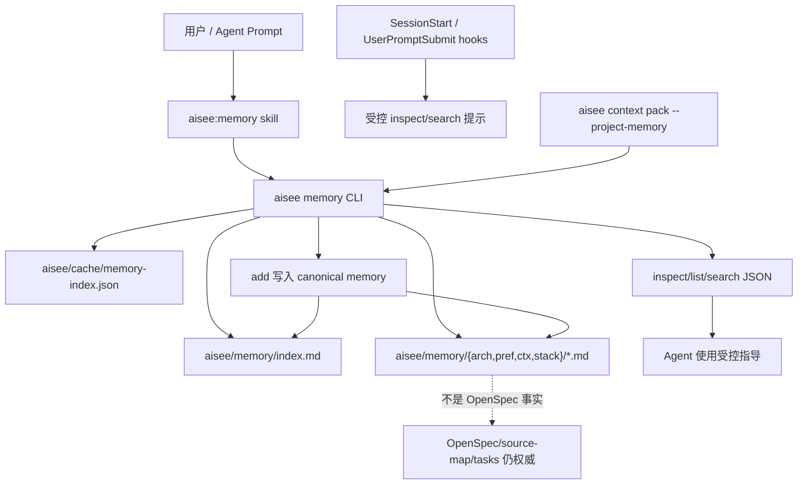

# feat: 新增项目记忆 CLI

## 摘要

新增轻量 `aisee memory` 命令组，用于项目本地长期记忆；更新 hooks，让 agent 通过受控发现和检索使用 memory，而不是在会话启动时注入大量上下文；新增 `aisee:memory` skill；并将 CLI / PyPI 包版本升级到 `0.9.0`。

本设计保持项目记忆与 OpenSpec 事实、`source-map.md` 路由、context pack 和团队知识 guardrails 的边界清晰。

---

## 问题背景

仓库已经有 `aisee/memory/` 模板和 hook 感知能力，但 agent 目前没有稳定 CLI 入口来发现、搜索或写入项目记忆。现有 `session-inject.js` 可以提示 memory 文件位置，但不能做任务相关的受控检索；如果 agent 直接读取文件，容易注入过期、无关或过量上下文。

新的模型应让 agent 通过 `aisee memory inspect` 发现 memory 能力，通过 `aisee memory search` 获取少量相关记忆，并且只在用户明确确认后写入记忆。`aisee doctor` 不应变成命令索引；它可以继续保留已有 layout 检查，而 memory 能力发现应归属 `aisee memory`。

---

## 需求

- R1. 新增顶层 `aisee memory` 命令组，提供 JSON-first 的 `inspect`、`list`、`search`、`add` 和索引维护能力。
- R2. 项目记忆长期存放在 canonical `aisee/memory/`；legacy `.memory/` 只允许 fallback 读取；新写入必须使用 canonical 路径。
- R3. 支持现有记忆类型 `arch`、`pref`、`ctx`、`stack`，并补齐 status、priority、summary、source refs、updated time 等检索所需 metadata。
- R4. 默认读取必须保持受控：不做全树注入，不默认返回正文，不默认返回 stale/deprecated 条目。
- R5. 写入 memory 必须来自用户明确意图，并在 JSON 中报告 `meta.writes: true`；hooks 永远不能自动写 memory。
- R6. Hook 只能提示 `aisee memory inspect/search` 入口，并可选注入极少量高优先级摘要；不能注入完整 index 或正文。
- R7. `aisee context pack` 只能通过显式 flag 包含项目记忆；不得把 memory 混入 OpenSpec parsed facts。
- R8. 新增 `aisee:memory` skill，指导 agent 何时使用 memory CLI，以及何时把候选生成交回 `aisee:reflect`。
- R9. 更新 `aisee:init`、README、架构文档、兼容性策略、workflow 文档、release notes 和 skill taxonomy，说明新的 memory 边界。
- R10. 将 package、CLI、marketplace 和 plugin metadata 版本从 `0.8.0` 升级到 `0.9.0`，因为 `aisee memory` 是新的公开 CLI 面。

---

## 关键技术决策

- KTD1. `aisee memory inspect` 负责 memory 命令发现。`aisee doctor --json` 不新增详细 memory section，只继续通过已有 `aisee.layout` 报告 memory 路径状态。
- KTD2. Project memory 是项目本地指导信息，不是事实源。OpenSpec artifacts、baseline specs、tasks 和 `source-map.md` 与 memory 冲突时优先级更高。
- KTD3. 新 memory 文件采用紧凑 metadata contract。CLI 新写入的 memory 使用 YAML frontmatter + Markdown 正文；解析器对当前模板中的粗体 metadata 格式保持只读兼容。
- KTD4. Search 先读取 index metadata，再按需读取具体文件。默认结果只包含 `id`、`type`、`title`、`summary`、`path`、`priority`、`status`、`source_refs`、`updated_at`；正文必须通过 `--include-body` 显式请求。
- KTD5. `add` 命令保持窄接口。它接收 `--type`、`--title`、`--summary`、`--body`、可选 `--priority` 和可重复 `--source-ref`，自动生成安全 slug，并同步更新 `aisee/memory/index.md`。
- KTD6. Hooks 保持只读。`SessionStart` 只注入入口提示和最多少量高优先级摘要；`UserPromptSubmit` 可在识别到 memory 写入意图时提示使用 `aisee:memory` 或 `aisee:reflect`，但不能改文件。
- KTD7. Context pack memory 必须显式启用。新增 `--project-memory` flag，而不是默认包含；结果放在 `project_memory` 或 `guardrails.project_memory` 等独立字段，不放入 `facts.parsed`。
- KTD8. 版本目标为 `0.9.0`。根据 `docs/compatibility-policy.md`，新增公开命令组和 JSON contract 属于 minor release。

---

## 高层技术设计

CLI 必须把 `aisee/cache/memory-index.json` 当作可删除、可重建 cache。长期 memory 事实来源是 canonical `aisee/memory/` 树和 `index.md`。

---

## 范围边界

本次包含：

- 新增公开 `aisee memory` 命令组。
- 定义 canonical memory metadata contract 和解析器。
- 实现受控搜索和可选 cache rebuild。
- 更新只读 hook 行为。
- 通过显式 flag 让 context pack 可选包含项目记忆。
- 新增 `aisee:memory` skill 和相关文档 / 测试。
- 升级版本到 `0.9.0`。

本次不包含：

- Hook 自动写入 memory。
- 全局用户 memory、home 目录 memory 或跨项目 memory。
- Vector search、semantic rerank、MCP service 或后台 daemon。
- 替代 `aisee:reflect`；reflect 仍负责候选生成和复盘。
- 把 OpenSpec facts、tasks 或 source-map 责任迁移到 memory。
- 给 `aisee doctor --json` 增加详细 memory 命令发现能力。

延后事项：

- 复杂 memory 冲突解决 UI。
- 自动 stale-entry 过期任务。
- 当前 Codex hook target 之外的跨 agent hook 支持。
- 若 lexical search 不够，再考虑可选 semantic search。

---

## 系统影响

本计划新增公开 CLI 面、新公开 skill、hook 输出变化和 package 版本变化。影响 CLI 消费方、marketplace plugin 用户、项目初始化产物和 agent 会话启动上下文。虽然大部分行为是 additive，但仍应按兼容性变更处理。

---

## 实施单元

### U1. Memory 数据模型与解析器

- **目标：** 新增内部 memory 解析器和 metadata 规范化层，供所有 memory 命令复用。
- **需求：** R2、R3、R4。
- **依赖：** 无。
- **文件：** `src/aisee_cli/memory.py`、`src/aisee_cli/paths.py`、`tests/test_memory_config.py`。
- **方案：** 定义可接受的 type、status、priority、source refs、summary limits，以及 canonical/legacy 路径解析。CLI 新写入文件使用 frontmatter；当前模板里的粗体 metadata 格式保持只读可解析。
- **参考模式：** `src/aisee_cli/knowledge.py` 的 JSON envelope 和 issue handling；`src/aisee_cli/paths.py` 的 canonical/legacy path policy。
- **测试场景：**
  - 缺少 `aisee/memory/` 时返回非阻断 missing 状态。
  - canonical memory 与 legacy `.memory/` 同时存在时 canonical 优先。
  - 只有 legacy `.memory/` 时可读取，但报告为 fallback。
  - 非法 type、status、priority 或缺失 summary 产生 issues，不崩溃。
  - deprecated 和 stale entries 能被解析，但默认搜索不返回。
- **验证：** Parser 返回稳定 normalized entries 和 issue summary，且不写文件。

### U2. 公开 `aisee memory` 命令组

- **目标：** 暴露 `inspect`、`list`、`search`、`add`、`update-index` 子命令。
- **需求：** R1、R4、R5。
- **依赖：** U1。
- **文件：** `src/aisee_cli/__main__.py`、`src/aisee_cli/memory.py`、`tests/test_memory_cli.py`、`tests/test_cli_command_surface.py`。
- **方案：** 新增顶层 `memory` parser。命令保持最小集：`inspect`、`list`、`search`、`add`、`update-index`。第一版不增加 `memory doctor`；`inspect` 负责报告结构问题和使用策略。
- **参考模式：** `knowledge inspect/query/index` 的只读命令形态，以及 `knowledge configure/promote-batch` 的写入 metadata。
- **测试场景：**
  - `aisee --help` 包含 `memory`。
  - `aisee memory --help` 只列出支持的子命令。
  - `inspect --json` 返回 root、policy、types、summary、limits 和 next commands。
  - `list --json` 支持按 type/status/priority 过滤，并默认只返回 active entries。
  - `search --query <text> --json` 只返回受控 metadata。
  - `search --include-body --json` 返回有限 body excerpt。
  - `add --type pref --title ... --summary ... --body ... --json` 写 canonical 文件并更新 `index.md`。
  - `add` 拒绝 unsupported type 和 unsafe slug。
  - `update-index --json` 重建 `aisee/memory/index.md` 或 cache，并明确 cache 不是事实源。
- **验证：** CLI JSON 可解析；`meta.command` 稳定；读命令报告 `writes: false`；写命令报告 `writes: true`。

### U3. 受控搜索、索引与冲突信号

- **目标：** 提供有用但不过量的 memory retrieval。
- **需求：** R4、R6。
- **依赖：** U1、U2。
- **文件：** `src/aisee_cli/memory.py`、`tests/test_memory_search.py`、`tests/test_memory_index.py`。
- **方案：** 对 title、summary、tags/source refs、type 和可用 body tokens 做 lexical matching。默认 `--limit` 保持较小，并设置硬上限。对同 type/title 或显式 replacement 关系检测冲突，返回 `memory_conflicts`，不要静默选择。
- **参考模式：** `src/aisee_cli/knowledge.py` 中的 `match_cards`、`tokens_for_card` 和 index cache 处理。
- **测试场景：**
  - Search 最多返回默认 limit。
  - 对风格 / 流程类 prompt，`pref` entries 可获得更高排序。
  - `stack` entries 只在 query 命中工具、依赖、命令或环境提示时出现。
  - stale/deprecated entries 只有显式 include flags 时返回。
  - 冲突 active entries 通过 `memory_conflicts` 暴露。
  - 删除 cache 不影响 search 正确性。
- **验证：** Search 输出稳定、受控，且 cache 标记 `cache_is_fact_source: false`。

### U4. 通过 `--project-memory` 显式接入 context pack

- **目标：** 为 change-scoped work 提供可选项目记忆增强，同时不污染 OpenSpec facts。
- **需求：** R7。
- **依赖：** U2、U3。
- **文件：** `src/aisee_cli/__main__.py`、`src/aisee_cli/context_pack.py`、`src/aisee_cli/memory.py`、`plugins/aisee-plugin/references/context-pack-contract.md`、`tests/test_context_pack.py`、`tests/test_memory_context_pack.py`。
- **方案：** 新增 `aisee context pack --project-memory`，基于 change id、target、artifact paths 和 source-map terms 调用 memory search。结果放到 `project_memory` 或 `guardrails.project_memory` 等独立字段；不改变 `facts.parsed` 和 `facts.derived`。
- **参考模式：** `src/aisee_cli/__main__.py` 中现有 `--knowledge` 路径和 `compact_knowledge_for_context_pack`。
- **测试场景：**
  - 不带 `--project-memory` 时 context pack 输出不变。
  - 带 `--project-memory` 时包含受控 memory matches。
  - memory conflicts 作为 guardrail warnings，而不是 blocker facts。
  - 缺少 memory 时 pack 不失败，字段为空或省略。
- **验证：** 现有 context pack 测试保持稳定，新字段是 additive。

### U5. Hook 行为更新

- **目标：** 让项目 hooks 可以发现 memory，但避免过量注入。
- **需求：** R4、R6。
- **依赖：** U2、U3。
- **文件：** `plugins/aisee-plugin/skills/aisee-init/scripts/hooks/session-inject.js`、`plugins/aisee-plugin/skills/aisee-init/scripts/hooks/spec-drift.js`、`plugins/aisee-plugin/skills/aisee-init/SKILL.md`、`tests/test_hooks.py` 或新增 `tests/test_memory_hooks.py`。
- **方案：** 将当前 memory summary 文案替换为更小的提示：使用 `aisee memory inspect --json` 和 `aisee memory search --query "<task>" --json`。可选注入高优先级 title/summary，但必须限制数量和字符长度。`UserPromptSubmit` 可识别“记住 / 以后都 / project memory”等语言并提示使用 `aisee:memory` 或 `aisee:reflect`，但不能写文件。
- **参考模式：** 当前 `session-inject.js` 的大小限制和 `spec-drift.js` 的 additionalContext envelope。
- **测试场景：**
  - SessionStart 无 memory 时不输出 memory block。
  - SessionStart 有 memory 时只输出入口提示和有限高优先级摘要。
  - Hook 输出说明 project memory 是 guidance，不是 OpenSpec truth。
  - UserPromptSubmit 的 memory-write 信号只产生 guidance。
  - Hook 永远不调用写入命令。
- **验证：** Hook scripts 仍是合法 Node 程序，并输出受控 JSON hook payload。

### U6. `aisee:memory` skill 与 reflect/init 更新

- **目标：** 教 agent 如何使用 memory 命令，以及何时路由到 reflect。
- **需求：** R8、R9。
- **依赖：** U2。
- **文件：** `plugins/aisee-plugin/skills/aisee-memory/SKILL.md`、`plugins/aisee-plugin/skills/aisee-memory/references/workflow.md`、`plugins/aisee-plugin/skills/aisee-memory/evals/evals.json`、`plugins/aisee-plugin/references/skill-taxonomy.md`、`plugins/aisee-plugin/skills/aisee-reflect/SKILL.md`、`plugins/aisee-plugin/skills/aisee-reflect/references/output-templates.md`、`plugins/aisee-plugin/skills/aisee-init/assets/memory-rules-template.md`、`plugins/aisee-plugin/skills/aisee-init/assets/memory-index-template.md`、`tests/test_skill_cli_preflight.py`、`tests/test_skill_eval_schema.py`。
- **方案：** 新增聚焦 skill，触发词覆盖“项目记忆 / aisee memory / 记住这个 / 查询记忆”。`SKILL.md` 保持精简，命令细节放到 references。更新 reflect，让候选生成仍归 reflect，但确认提升到 memory 时优先通过 `aisee memory add`，而不是手工改文件。
- **参考模式：** `plugins/aisee-plugin/skills/aisee-knowledge/SKILL.md` 及其 eval 结构。
- **测试场景：**
  - 新公开 skill 出现在 taxonomy。
  - 所有公开 skill 仍有 eval 覆盖。
  - Reflect 文档提到 confirmed memory writes 应使用 `aisee memory add`。
  - Init 模板与 CLI metadata contract 对齐。
- **验证：** Skill contract 测试通过，README 能发现新 skill。

### U7. 文档与兼容性更新

- **目标：** 文档化 memory 边界和发现路径，同时不扩展 doctor 职责。
- **需求：** R8、R9。
- **依赖：** U2、U4、U5、U6。
- **文件：** `README.md`、`docs/workflow.md`、`docs/workflow.en.md`、`docs/best-practices.md`、`docs/best-practices.en.md`、`docs/compatibility-policy.md`、`docs/compatibility-policy.en.md`、`docs/architecture/aisee-cli-context-and-id-registry.md`、`docs/release.md`、`plugins/aisee-plugin/.codex-plugin/plugin.json`。
- **方案：** 新增 “Project Memory / 项目记忆” 小节，明确 `aisee memory inspect/search` 是发现路径，hooks 只读，`aisee doctor` 不是 memory 命令索引，OpenSpec 仍权威。更新 CLI context architecture 文档，把 project memory 作为第五个受控 CLI 职责。
- **参考模式：** Team knowledge 文档和 compatibility policy 对 public/experimental contract 的写法。
- **测试场景：**
  - grep 或现有 docs tests 确认 README 提到 `aisee:memory`。
  - Compatibility policy 把 `aisee memory` 分类为 public CLI JSON contract。
  - Release notes 提到新命令组和版本升级。
- **验证：** 文档只引用 U2 中真实存在的命令。

### U8. 版本升级与 release smoke

- **目标：** 将 CLI / PyPI package metadata 升级到 `0.9.0` 并验证发布打包。
- **需求：** R10。
- **依赖：** U1 至 U7。
- **文件：** `pyproject.toml`、`src/aisee_cli/__init__.py`、`.agents/plugins/marketplace.json`、`plugins/aisee-plugin/.codex-plugin/plugin.json`、`plugins/aisee-plugin/.claude-plugin/plugin.json`、`plugins/aisee-plugin/.cursor-plugin/plugin.json`、`docs/release.md`、`tests/test_version_consistency.py`。
- **方案：** 将 `pyproject.toml` 改为 `0.9.0`，运行或等价执行 `scripts/sync_versions.py`，保持 metadata 一致。Release smoke 需要验证 installed wheel command surface 包含 `memory`。
- **参考模式：** `scripts/check_versions.py`、`scripts/sync_versions.py` 和 `scripts/smoke_release.py`。
- **测试场景：**
  - `scripts/check_versions.py` 报告所有版本都是 `0.9.0`。
  - Installed wheel 输出 `aisee 0.9.0`。
  - Release smoke 确认 `aisee memory inspect --json` 在 CLI-only 安装下可用。
  - 顶层 `aisee --help` 包含 `memory`。
- **验证：** 发布前全量测试和 release smoke 通过。

---

## 验收示例

- AE1. 给定项目没有 memory 文件，当 agent 运行 `aisee memory inspect --json`，响应是合法 JSON，状态为 missing，包含 canonical paths，且没有 blocker。
- AE2. 给定项目有一条高优先级 `pref` memory，当运行 `aisee memory search --query "commit message style" --json`，匹配项以 summary metadata 返回，默认不带正文。
- AE3. 给定用户说“以后本项目提交信息都用中文”，当 agent 使用 `aisee:memory`，它会确认写入意图，并通过 `aisee memory add` 写入，而不是由 hook 自动写入。
- AE4. 给定 context pack 请求不带 `--project-memory`，命令输出不包含 memory 字段，现有 context pack JSON 保持兼容。
- AE5. 给定 context pack 请求带 `--project-memory`，且存在匹配 memory，则受控 memory matches 与 OpenSpec facts 分离输出。

---

## 风险与依赖

- **上下文膨胀风险：** Hooks 和 context pack 集成可能注入过多 memory。缓解：默认只提示入口、小 limit、metadata-only 输出、正文显式 opt-in。
- **事实源混淆风险：** Agent 可能把 memory 当 spec truth。缓解：所有 JSON/meta/hook/doc 都标记 project memory 是 guidance，且被 OpenSpec 覆盖。
- **写入污染风险：** Agent 可能滥用 `add`。缓解：写命令要求用户明确意图，`aisee:reflect` 仍是候选生成入口。
- **Legacy 兼容风险：** 现有 memory 模板不是 frontmatter。缓解：parser 对当前模板保持只读兼容，CLI 新写入使用 canonical 格式。
- **公开契约漂移风险：** 新增命令组影响 release 行为。缓解：命令面测试、兼容性文档和版本升级到 `0.9.0`。

---

## 文档 / 运维说明

Release 应把 project memory 表达为轻量项目本地上下文能力，而不是数据库或 agent runtime memory 替代品。README 示例聚焦：

- `aisee memory inspect --json`
- `aisee memory search --query "<task>" --json`
- `aisee memory add --type pref --title "<title>" --summary "
" --body "<body>" --json`
- `aisee context pack --change <change> --for ce-work --project-memory --json`

文档应避免鼓励 agent 直接读取 `aisee/memory/**/*.md`；只有当 CLI 返回具体 `path` 后，才按需读取对应文件。

---

## 来源与研究

- `src/aisee_cli/__main__.py`：当前顶层 CLI parser 和 `context pack --knowledge` 集成模式。
- `src/aisee_cli/knowledge.py`：JSON envelope、受控 retrieval、cache 非事实源、写命令和 index 模式。
- `src/aisee_cli/paths.py`：canonical `aisee/` 和 legacy `.memory/` 路径处理。
- `plugins/aisee-plugin/skills/aisee-init/assets/memory-rules-template.md`：现有项目记忆目录模型。
- `plugins/aisee-plugin/skills/aisee-init/scripts/hooks/session-inject.js`：当前会话启动 memory 摘要 hook。
- `plugins/aisee-plugin/skills/aisee-reflect/SKILL.md`：现有 memory candidate 和 confirmed-write workflow。
- `docs/compatibility-policy.md`：公开 CLI JSON 和版本规则。
- `docs/architecture/aisee-team-knowledge.md`：可轻量复用的受控 retrieval 和 cache 边界模式。
