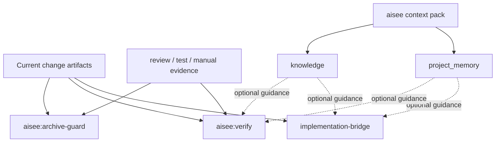
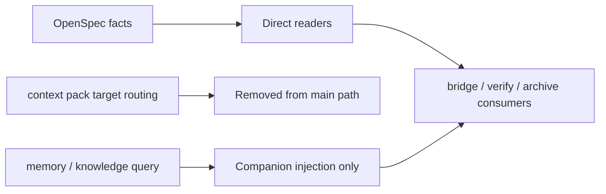

# refactor: Narrow context pack to memory companion

## Summary

将 `aisee context pack` 从“实现阶段 JSON 投影器”收缩为“显式记忆注入 companion”：默认不再承担 `ce-work` / `verify` / `archive` 的执行路由、gaps 裁决、路径投影和 review 建议，只保留 `project_memory` / `knowledge` 的受控注入价值。`implementation-bridge`、`aisee:verify` 和 `aisee:archive-guard` 改为直接读取当前 change artifacts、schema 和 evidence。

---

## Problem Frame

当前 `context pack` 的价值和成本已经失衡。它理论上提供统一 JSON 输入，但在实际主链路里反复承担了 OpenSpec facts 的二次投影、执行路径猜测、gaps/blocker 分层、`requires_ce_plan` 路由和 review 建议。这让它越来越像第二流程控制器，而不是 knowledge-first bridge。

从当前仓库的产品方向看，真正稳定且有独立价值的部分是受控记忆注入：

- `project_memory` 只能显式通过 `--project-memory` 进入会话上下文；
- `knowledge` 只能显式通过 `--knowledge` 进入会话上下文；
- OpenSpec artifacts、`source-map.md`、`tasks.md`、review/test evidence 仍然是实现与验证的事实源。

继续修补 `ce-work` 的 execution projection，只会持续扩大 schema/path/gap 的兼容面。更合适的方向是把 `context pack` 收回到“记忆 companion”，让消费方重新直接读取当前 change。

---

## Requirements

- R1. `aisee context pack` 的核心职责收缩为显式 `project_memory` / `knowledge` 注入，不再承载执行路由、实现路径判定或 archive readiness 判断。
- R2. `implementation-bridge` 必须只为 `ce-work` 提供“需要读什么”的读取策略与范围提示；不得再把 `context pack` 当作进入 `ce-work` 的前置裁决器，也不负责搬运 artifact 正文。
- R3. `implementation-bridge` 仍必须明确提示 `ce-work` 在实现完成后回写 `tasks.md` 或当前 schema 的 apply tracks，并记录验证/证据入口。
- R4. `aisee:verify` 和 `aisee:archive-guard` 必须直接读取当前 change artifacts、schema 和 evidence；不得再依赖 `context pack` 提供 schema-aware gate judgment。
- R5. OpenSpec artifacts、`source-map.md`、`tasks.md`、review/test/manual evidence 继续是实现与验证事实源；memory/knowledge 只能作为 guidance，不得污染 OpenSpec facts。
- R6. 当前公开 JSON 契约必须明确重排：`ce-work` target 中与 execution routing 强绑定的字段要删除、降级或迁移；兼容策略、README、workflow 和 skill 文案必须同步。
- R7. `context pack` 若继续保留 `--for` target，target 只能影响 memory/knowledge 检索边界，不再驱动不同的 execution gate 语义。
- R8. `ce-work`、`aisee:verify`、`aisee:archive-guard` 相关实现必须补回归测试，覆盖“无 context pack 也能从当前 change 正常推导”的主路径。
- R9. 这次属于 Public Contract 收缩，版本需要按 `MINOR` 升级，并写入 changelog / release notes。

---

## Key Technical Decisions

- KTD1. **`context pack` 退回 companion。** 它只负责把显式请求的 `project_memory` 和 `knowledge` 注入独立字段；不再承担 OpenSpec execution projection。
- KTD2. **Bridge 只给读取策略，不搬运正文。** `implementation-bridge` 只告诉 `ce-work` 当前 change 下必须先读哪些 artifacts、哪些 supporting files 是 Required、哪些 evidence 入口需要关注。实际原文读取和代码文件读取由 `ce-work` 自行处理。
- KTD2.1. **Bridge 保留完成门禁提示。** 虽然 bridge 不再搬运正文或裁决执行路径，但仍必须显式提示 `ce-work`：完成当前批次后先回写 `tasks.md` 或当前 schema 的 apply tracks，再声明完成，并把验证证据写回约定入口。
- KTD3. **`--for` 只保留检索作用域。** 若保留 `--for ce-work|aisee-verify|...`，其作用仅限于 memory/knowledge query 的 phase/surface 过滤，不再定义不同 target 的 execution envelope。
- KTD4. **不保留“双轨语义”。** 不做“字段还在，但推荐忽略”的长期兼容层；要么删除字段，要么把含义明确降级成 metadata/diagnostic，避免继续误导消费者。
- KTD5. **`verify` / `archive-guard` 直接读事实源。** 它们若仍需要少量结构化辅助，优先在各自实现内构建只读 helper，而不是继续让 `context pack` 充当跨阶段总线。
- KTD6. **保持记忆边界独立。** `project_memory` 与 `knowledge` 仍放在独立顶层字段，不混入 `facts.parsed`、`facts.derived` 或 OpenSpec diagnostics。
- KTD7. **版本按 `0.12.0` 规划。** 当前仓库版本为 `0.11.3`，这次删除/重排已文档化的 context-pack JSON 语义，按兼容策略应做 `MINOR` 升级。

---

## High-Level Technical Design

---

## Scope Boundaries

In scope:

- 收缩 `context pack` 到 memory/knowledge companion。
- 调整 `implementation-bridge`、`aisee:verify`、`aisee:archive-guard` 的读取路径。
- 删除或迁移 `ce-work` execution projection 的公开字段和相关文案。
- 更新 README、workflow、best-practices、compatibility policy、references 和 tests。
- 升级版本并补 changelog / release notes。

Out of scope:

- 重写 `project_memory` 或 `knowledge` 的检索算法。
- 新增 vector search、semantic rerank 或远程 memory service。
- 重新设计 OpenSpec schema、artifact DAG 或 `source-map.md` 模板。
- 改造 `ce-work`、`ce-doc-review`、`ce-code-review` 的外部技能实现。

### Deferred to Follow-Up Work

- 若后续仍需要“verify 专用只读 JSON 投影”，单独设计更窄 helper，而不是把 `context pack` 再扩回通用总线。
- 若后续需要统一 memory/knowledge query API，可评估让 `context pack` 命令面进一步并回 memory/knowledge CLI。

---

## System-Wide Impact

- `context pack` 是公开 CLI JSON 合同，任何字段重排都会影响 README、compatibility policy、skill 文案和测试。
- `implementation-bridge`、`verify`、`archive-guard` 三个主链路 skill 当前都以 `context pack` 作为推荐读取入口，文案和评估用例必须一起改。
- `implementation-bridge` 收缩后，`ce-work` 会成为当前 change 原文读取的唯一执行消费者；bridge 只负责范围提示与读取顺序。
- `implementation-bridge` 仍保留 apply tracks / evidence 写回提醒，因此 `ce-work` 的完成语义不会因为收缩 `context pack` 而丢失。
- `aisee:memory`、`aisee:knowledge` 里关于 “实现时带记忆/团队知识” 的指导要保留，但要从“通过 execution projection”改成“通过 companion injection”。

---

## Risks & Dependencies

- 风险 1：已有消费者可能仍依赖 `facts.derived.execution`、`checks` 或 `review` 字段。
  - 缓解：先盘点仓库内直接依赖，再同步更新 references、README 和 tests；对外文档明确这是 Public Contract 重排。
- 风险 2：移除 `context pack` 后，`verify` / `archive-guard` 可能重复实现 schema/evidence 读取。
  - 缓解：优先抽出共享只读 helper，而不是继续复用当前 target-specific envelope。
- 风险 3：若 `--for` 继续存在但含义模糊，容易留下半残兼容层。
  - 缓解：在 contract 和 CLI help 中明确它只影响 memory/knowledge 检索边界。
- 风险 4：文档收缩不完整，会继续把 `context pack` 描述成 execution router。
  - 缓解：README、workflow、best-practices、skill references 同批改。

---

## Sources & Research

- `docs/plans/2026-06-10-004-refactor-knowledge-first-cli-plan.md`
- `docs/plans/2026-06-10-005-feat-project-memory-cli-plan.md`
- `src/aisee_cli/context_pack.py`
- `plugins/aisee-plugin/skills/aisee-implementation-bridge/SKILL.md`
- `plugins/aisee-plugin/skills/aisee-verify/SKILL.md`
- `plugins/aisee-plugin/skills/aisee-archive-guard/SKILL.md`
- `plugins/aisee-plugin/skills/aisee-memory/SKILL.md`
- `plugins/aisee-plugin/skills/aisee-knowledge/SKILL.md`
- `docs/compatibility-policy.md`
- `README.md`

外部研究未运行。当前仓库对 knowledge-first、project memory、context pack contract 已有清晰本地事实与历史计划，足以支撑本轮收缩规划。

---

## Implementation Units

### U1. Redefine context pack as memory companion

- **Goal:** 收紧 `aisee context pack` 的产品定义、CLI help 和 JSON 合同，让它只承担 memory/knowledge companion 角色。
- **Requirements:** R1, R4, R5, R6
- **Dependencies:** none
- **Files:**
  - `src/aisee_cli/context_pack.py`
  - `src/aisee_cli/__main__.py`
  - `plugins/aisee-plugin/references/context-pack-contract.md`
  - `plugins/aisee-plugin/references/context-pack-targets.md`
  - `tests/test_context_pack.py`
- **Approach:** 删除或迁移 `ce-work` target 下与 execution routing 强绑定的公开字段和解释，例如 `allowed_paths`、`requires_ce_plan`、`ce_plan_reason`、`reusable_workflow_candidates`、`execution.brief`。保留 `change`、基础 parsed metadata，以及显式请求的 `project_memory` / `knowledge` 注入。若 `--for` 仍保留，只让它影响 memory/knowledge 查询范围。
- **Patterns to follow:** 复用 `project_memory` 与 `knowledge` 独立字段的现有边界，不把 guidance 混入 `facts.parsed` 或 `facts.derived`。
- **Test scenarios:**
  - `aisee context pack --change <change> --for ce-work --json` 不再输出 execution routing 字段。
  - 不带 `--project-memory` / `--knowledge` 时，输出不包含注入内容。
  - 带 `--project-memory` 时，只新增独立 `project_memory` 字段。
  - 带 `--knowledge` 时，只新增独立 `knowledge` 字段。
  - 无 memory/knowledge 配置时，命令返回合法 JSON，不把缺失升级成 OpenSpec blocker。
- **Verification:** `context pack` 合同测试通过，且输出语义与文档一致。

### U2. Refactor implementation-bridge to emit read strategy only

- **Goal:** 让 `aisee:implementation-bridge` 不再依赖 `context pack` 的 execution projection，只输出 `ce-work` 应该优先读取的 change artifacts、supporting artifacts 和 evidence 入口，同时保留 apply tracks / evidence 回写提醒。
- **Requirements:** R2, R3, R5, R8
- **Dependencies:** U1
- **Files:**
  - `plugins/aisee-plugin/skills/aisee-implementation-bridge/SKILL.md`
  - `plugins/aisee-plugin/references/compound-bridge.md`
  - `README.md`
  - `docs/workflow.md`
  - `docs/workflow.en.md`
  - `docs/best-practices.md`
  - `docs/best-practices.en.md`
  - `tests/test_skill_cli_preflight.py`
- **Approach:** 把 bridge 的主输出改成读取策略：当前 change、schema、必读 artifact 顺序、Required supporting artifacts、apply tracks、evidence 入口，以及可选的 memory/knowledge companion 注入入口。bridge 不再转发 artifact 正文，也不代替 `ce-work` 读取代码或原始 markdown，但继续明确“完成实现后先更新 `tasks.md` / apply tracks，再记录验证证据”的完成规则。
- **Execution note:** 先做文案与合同收口，再改任何残留的 helper 依赖，避免半途留下“双入口”。
- **Patterns to follow:** 沿用现有 “当前 change 是唯一入口” 规则，不回到全仓库搜索或重建第二事实源。
- **Test scenarios:**
  - skill preflight 文案不再要求默认先读 `context pack --for ce-work --json`。
  - bridge 输出明确列出必读 artifact 和 evidence 入口，但不包含 artifact 正文摘要。
  - 仅在显式 memory/knowledge 场景下，文案提到 `context pack --project-memory` 或 `--knowledge`。
  - bridge 合同仍明确当前 change 是唯一 scope 入口，且代码/原文读取由 `ce-work` 负责。
  - bridge 文案仍明确要求 `ce-work` 完成后回写 `tasks.md` 或 apply tracks，并补验证证据入口。
- **Verification:** skill contract 测试通过，README/workflow 与 skill 文案一致。

### U3. Refactor verify and archive-guard to consume artifacts and evidence directly

- **Goal:** 把 `aisee:verify`、`aisee:archive-guard` 从 `context pack` target projection 解耦，改为直接读取 change artifacts 与 evidence。
- **Requirements:** R3, R4, R7
- **Dependencies:** U1
- **Files:**
  - `plugins/aisee-plugin/skills/aisee-verify/SKILL.md`
  - `plugins/aisee-plugin/skills/aisee-archive-guard/SKILL.md`
  - `README.md`
  - `docs/workflow.md`
  - `docs/workflow.en.md`
  - `tests/test_skill_cli_preflight.py`
- **Approach:** 保留 schema-aware consistency / archive gate 的职责，但去掉“自动读取 `context pack --for aisee-verify`”作为默认主路径。若实现层仍需要少量结构化辅助，只在内部 helper 层做只读聚合，不把它重新暴露成 `context pack` 总线。
- **Patterns to follow:** 事实源仍按当前 skill 已定义的层级优先级：OpenSpec validate、当前 change artifacts、tasks、review/test/manual evidence。
- **Test scenarios:**
  - verify 文案不再把 `context pack --for aisee-verify` 作为默认入口。
  - archive-guard 文案不再要求 `context pack` 作为 archive readiness 前置。
  - 现有 “轻量 schema 不强制伪 source-map” 规则保持不变。
- **Verification:** 相关 skill 合同测试通过，且不再把 `context pack` 当作默认 gate。

### U4. Re-scope memory and knowledge guidance around companion injection

- **Goal:** 保留 memory/knowledge 的价值，但把它们从 execution projection 改成 companion injection。
- **Requirements:** R1, R4, R6
- **Dependencies:** U1
- **Files:**
  - `plugins/aisee-plugin/skills/aisee-memory/SKILL.md`
  - `plugins/aisee-plugin/skills/aisee-memory/references/workflow.md`
  - `plugins/aisee-plugin/skills/aisee-knowledge/SKILL.md`
  - `plugins/aisee-plugin/skills/aisee-knowledge/references/workflow.md`
  - `README.md`
- **Approach:** 文案统一改成“实现时如需带项目记忆/团队知识，显式使用 `aisee context pack --project-memory` / `--knowledge` 或直接 query”，不再暗示 `context pack` 本身还负责 execution routing。
- **Patterns to follow:** 保持 memory/knowledge 是 guidance、独立字段、受控注入、不可污染 OpenSpec facts 的现有契约。
- **Test scenarios:**
  - memory skill 仍保留 “实现时带项目记忆” 指引，但不再引用 execution projection。
  - knowledge skill 仍保留 “实现时带团队知识” 指引，但不再把 context pack 当作主流程 gate。
  - README 对 memory/knowledge 的示例命令仍可运行且语义一致。
- **Verification:** 相关 skill 文案与 README 示例一致，不引入新的双重心智。

### U5. Update compatibility, release, and regression coverage

- **Goal:** 把这次收缩作为 Public Contract 变更完整落档，并补齐回归测试与版本信息。
- **Requirements:** R5, R7, R8
- **Dependencies:** U1, U2, U3, U4
- **Files:**
  - `docs/compatibility-policy.md`
  - `docs/compatibility-policy.en.md`
  - `CHANGELOG.md`
  - `pyproject.toml`
  - `plugins/aisee-plugin/.codex-plugin/plugin.json`
  - `README.en.md`
  - `tests/test_plugin_packaging.py`
  - `tests/test_doctor_flow_schema.py`
  - `tests/test_skill_cli_preflight.py`
- **Approach:** 明确标注 `context pack` 的字段重排和职责收缩，记录迁移影响，版本从 `0.11.3` 升到 `0.12.0`，并确保 packaging / smoke / skill contract 测试覆盖新的命令语义。
- **Patterns to follow:** 复用当前 compatibility policy 对 Public Contract 的定义，以及现有版本一致性检查流程。
- **Test scenarios:**
  - 版本一致性检查覆盖 CLI、plugin metadata 和文档。
  - compatibility 文档不再把 `ce-work` context pack 描述成执行路由器。
  - regression tests 能发现 execution projection 字段回流。
  - packaging tests 仍确认公开 CLI 面与 skill content 的分发边界。
- **Verification:** 版本和文档一致性检查通过，contract tests 反映新的收缩语义。
