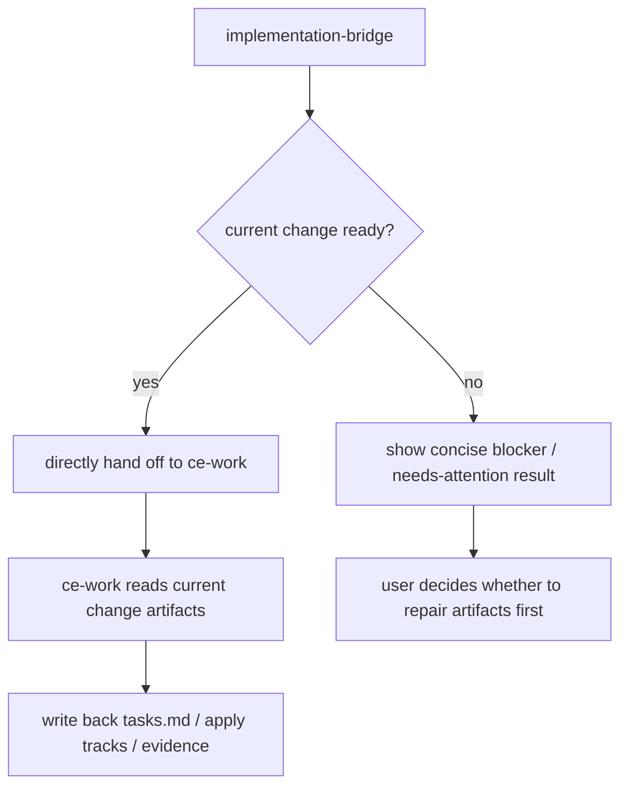
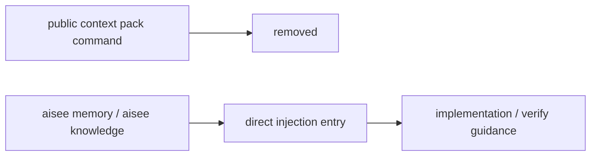

# refactor: Remove bridge JSON and public context pack surface

## Summary

删除 `aisee:implementation-bridge` 的默认 JSON 产品输出，并把 `context pack` 从公开产品面移除。正常情况下，`implementation-bridge` 直接进入 `ce-work`；异常情况下只输出简短阻塞说明。项目记忆与团队知识注入改为通过更直接的 memory / knowledge 入口完成，不再保留 `context pack` 这层公开产品能力。

---

## Problem Frame

上一轮收缩已经把 `context pack` 收薄，把 `implementation-bridge` 改成“读取策略 + `tasks.md` / apply tracks / evidence 回写提醒”。但当前仍有两层无效复杂度：

1. 当 change 已经 `ready` 时，bridge 还会把结构化 JSON 暴露给用户。
2. `context pack` 作为公开命令仍然存在，即使它已经不再承担 execution / verify / review 投影职责。

这会带来几个明确问题：

- 用户被迫理解不该由自己处理的中间产物。
- `ce-work` 如果不显式消费 bridge JSON，这段 JSON 就不是实际 handoff 协议。
- `context pack` 如果除了 memory / knowledge 注入以外不再有独立价值，就不应该继续作为公开产品能力保留。
- 产品看起来还存在一层 machine contract 和一层 context bus，但默认 happy path 没有真实消费者，复杂度大于价值。

因此，本轮不再停留在“继续弱化”的中间态，而是直接删除：

- `implementation-bridge` 的默认 JSON 产品面；
- `context pack` 的公开产品面。

---

## Requirements

- R1. 当当前 change 满足进入实现的最低条件时，`aisee:implementation-bridge` 默认不再展示完整 JSON，而是直接进入或明确交给 `ce-work`。
- R2. `aisee:implementation-bridge` 必须继续保留完成提醒：`ce-work` 完成当前批次前，必须回写 `tasks.md` 或当前 schema 的 apply tracks，并补验证证据入口。
- R3. 当当前 change 存在 blocker、关键缺口或读取入口失效时，`aisee:implementation-bridge` 应输出简短、面向人的阻塞结果，而不是默认大段 JSON。
- R4. `context pack` 从公开产品面删除；默认工作流、README、workflow、best-practices 和 CLI 参考中不再出现它。
- R5. 项目记忆与团队知识的 change-scoped 注入改为通过更直接的 memory / knowledge 查询入口完成，不再依赖 `context pack` 这层公开命令。
- R6. README、workflow、best-practices、skill eval 和 bridge references 必须同步更新，不再宣称默认输出是 JSON 判定结果，也不再把 `context pack` 当成主流程能力。
- R7. 本轮不要求 `ce-work` 新增对 bridge JSON 的显式消费；这正是本轮要避免的方向。

---

## Key Technical Decisions

- KTD1. **Happy path 直接路由。** `implementation-bridge` 在 `status=ready` 时默认直接进入 `ce-work`，而不是向用户展示 bridge JSON。
- KTD2. **异常时给短结果，不给大 JSON。** 只有 `blocked`、`needs_attention` 或关键 artifact / schema 读取失败时，才输出简短结构化说明。
- KTD3. **桥接 JSON 直接退出产品面。** 不再为默认交互保留公开 bridge JSON；本轮也不新增 `ce-work` 对其的消费逻辑。
- KTD4. **完成提醒保留。** 即使去掉默认 JSON，bridge 仍然必须向 `ce-work` 强调 apply tracks / evidence 写回规则。
- KTD5. **`context pack` 退出公开命令面。** 既然它只剩 memory / knowledge 注入价值，就不再以独立公开产品能力存在；相关注入改由 memory / knowledge 能力直接承担。
- KTD6. **不把新目标误做成“教 ce-work 消费 JSON”。** 本轮目标是删掉无默认消费者的产品输出和无独立价值的公开命令，不是把它们升级成正式 machine handoff 协议。

---

## High-Level Technical Design

---

## Scope Boundaries

In scope:

- 收掉 `implementation-bridge` 默认 JSON 产品输出。
- 删除 `context pack` 的公开产品面。
- 保留并强化默认进入 `ce-work` 的 happy path。
- 保留 `tasks.md` / apply tracks / evidence 完成提醒。
- 同步更新 skill、eval、README、workflow、best-practices、CLI 参考和 bridge references。

Out of scope:

- 让 `ce-work` 新增 bridge JSON 消费逻辑。
- 重写 verify/archive-guard 主流程。
- 新建跨 skill 的 machine handoff 协议。

### Deferred to Follow-Up Work

- 如果未来明确需要 machine handoff 协议，再单独设计 debug / machine mode 的 JSON 合同，而不是复用默认产品输出。
- 如果 memory / knowledge 需要新的 change-scoped 便捷入口，再单独规划更直接的 query 命令或 skill 路由。

---

## Risks & Dependencies

- 风险 1：仓库文案已经改了，但实际宿主运行时仍可能因为缓存而展示旧 JSON。
  - 缓解：在计划中明确区分 repo 合同与宿主缓存问题；本轮只修 repo 默认行为。
- 风险 2：如果默认直接进入 `ce-work`，但桥接阶段没有保留 `tasks.md` / apply tracks 回写提醒，执行收口会退化。
  - 缓解：把完成提醒视为不可删除的 happy-path guardrail。
- 风险 3：README / skill eval 若继续写“默认输出 JSON 判定结果”或仍把 `context pack` 当公开能力，会让产品心智反复回流。
  - 缓解：所有默认输出和 `context pack` 公开面相关文案一次性收口。

---

## Sources & Research

- `docs/plans/2026-06-13-001-refactor-context-pack-memory-companion-plan.md`
- `plugins/aisee-plugin/skills/aisee-implementation-bridge/SKILL.md`
- `plugins/aisee-plugin/references/compound-bridge.md`
- `docs/workflow.md`
- `docs/best-practices.md`
- `/Users/fengliang/.codex/plugins/cache/compound-engineering-plugin/compound-engineering/3.12.0/skills/ce-work/SKILL.md`

外部研究未运行。本轮问题是当前 repo 内的交互职责与公开产品面收口，不依赖外部资料。

---

## Implementation Units

### U1. Remove default JSON from implementation-bridge happy path

- **Goal:** 让 `implementation-bridge` 在 `ready` 时默认不展示大段 JSON，而是直接交给 `ce-work`。
- **Requirements:** R1, R3, R7
- **Dependencies:** none
- **Files:**
  - `plugins/aisee-plugin/skills/aisee-implementation-bridge/SKILL.md`
  - `plugins/aisee-plugin/skills/aisee-implementation-bridge/evals/evals.json`
  - `plugins/aisee-plugin/skills/aisee-implementation-bridge/agents/openai.yaml`
  - `tests/test_skill_cli_preflight.py`
- **Approach:** 把 skill 合同从“默认输出 JSON 判定结果”改成“ready 时直接进入 `ce-work`；只有异常时输出简短阻塞说明”。同步收口 eval 与 agent prompt，避免默认输出行为和文案脱节。
- **Patterns to follow:** 沿用当前 bridge 已经收好的“当前 change facts 优先”与“不替代 `ce-work`”边界。
- **Test scenarios:**
  - happy path 文案不再要求默认输出 JSON。
  - eval 不再把任何 JSON 字段当默认输出要求。
  - skill preflight 仍保留 apply tracks 回写提醒。
- **Verification:** skill 合同测试通过，默认 happy path 语义明确指向 `ce-work`。

### U2. Remove context pack from the public product surface

- **Goal:** 让 `context pack` 从公开产品面退出，不再作为 README、workflow、CLI 参考或默认流程的一部分。
- **Requirements:** R4, R5, R6
- **Dependencies:** U1
- **Files:**
  - `src/aisee_cli/__main__.py`
  - `README.md`
  - `README.en.md`
  - `docs/workflow.md`
  - `docs/workflow.en.md`
  - `docs/best-practices.md`
  - `docs/best-practices.en.md`
  - `docs/compatibility-policy.md`
  - `docs/compatibility-policy.en.md`
- **Approach:** 从公开 CLI 参考与默认流程中移除 `context pack`。项目记忆与团队知识注入改为通过更直接的 memory / knowledge 能力完成；bridge / verify / archive 文案不再把 `context pack` 视为主路径。
- **Patterns to follow:** 复用上一轮已经建立的 “OpenSpec facts 直接读取 + 可选 guidance” 边界。
- **Test scenarios:**
  - README / workflow / best-practices 中不再把 `context pack` 当默认产品能力。
  - CLI 参考不再列出 `context pack` 作为主流程命令。
  - compatibility 文档说明其退出公开产品面。
- **Verification:** 文档全文搜索不再把 `context pack` 作为主流程默认入口。

### U3. Preserve concise blocker mode and completion reminders

- **Goal:** 去掉默认 JSON 与 `context pack` 后，保留 bridge 在异常路径下的最小可用提示，以及 `tasks.md` / apply tracks / evidence 完成提醒。
- **Requirements:** R2, R3
- **Dependencies:** U1, U2
- **Files:**
  - `plugins/aisee-plugin/skills/aisee-implementation-bridge/SKILL.md`
  - `plugins/aisee-plugin/skills/aisee-implementation-bridge/references/brief-template.md`
  - `plugins/aisee-plugin/skills/aisee-implementation-bridge/references/brief-index-template.md`
  - `plugins/aisee-plugin/references/compound-bridge.md`
- **Approach:** 将异常路径收口成简短的人类可读结果：缺什么、为什么不能继续、要先修哪里。保留当前 bridge 对 `tasks.md` / apply tracks / evidence 的强提醒，但不要求这些提醒必须通过公开 JSON 或 `context pack` 传达。
- **Patterns to follow:** 继续沿用现有 “完成前必须先回写 apply tracks” 的严格规则。
- **Test scenarios:**
  - blocker 路径仍能明确指出读取入口失效或关键 artifact 缺失。
  - brief 模板仍强调 apply tracks 与 evidence 回写。
  - compound bridge 引用不再把 JSON 或 `context pack` 当主 handoff 形态。
- **Verification:** bridge 文案在 happy path 与异常路径下都清晰，不再混杂默认 JSON 心智。

