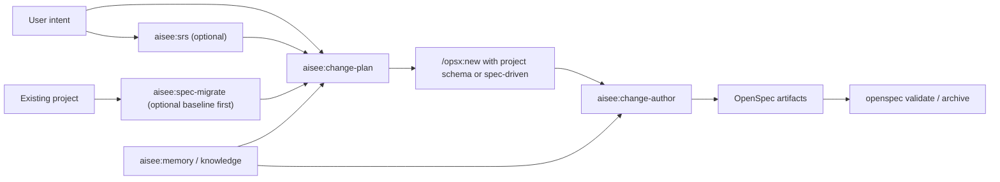

# refactor: slim Aisee to OpenSpec companion

## Summary

本计划把 Aisee 从“覆盖需求规划、schema pack、实现交接、验证归档的大工作流插件”收缩为“OpenSpec companion + memory/knowledge core”。保留的主能力有四类：OpenSpec 基础接入、已有项目 baseline 迁移、围绕用户意图的 `SRS / change-plan / change-author` 增强，以及 project memory / team knowledge。

实现上不再主推 `aisee-app-spec-driven` 或其它 Aisee 自带 schema，也不再把 UI/架构/bridge/verify/archive/hardware/design 作为默认产品面。Aisee 的 OpenSpec 增强将回到两件事：更好理解用户意图，以及把 `proposal / specs / design / tasks` 写得更详细、更可实现。

---

## Problem Frame

当前仓库的公开形态仍然是重型 workflow：README、taxonomy、默认 prompt、`aisee:init` 模板、CLI 辅助和大量测试都围绕 `SRS -> UI Content -> Architecture -> change-plan -> app schema -> implementation-bridge -> verify -> archive-guard` 展开。这个产品面过宽，且已经偏离你当前要保留的核心。

与此同时，仓库里真正稳定且已经相对独立成块的能力，是 `openspec ensure`、`memory`、`knowledge`，以及可以继续演化的 `SRS / change-plan / change-author`。之前的 [docs/plans/2026-06-10-004-refactor-knowledge-first-cli-plan.md](docs/plans/2026-06-10-004-refactor-knowledge-first-cli-plan.md) 把方向收得过窄，只保留 knowledge-first，不符合你现在明确保留 OpenSpec 基础能力和 change authoring 增强的目标。

这次重构的关键，不是“删几个 skill”，而是重定义产品中心，并同步收掉 CLI、skill、schema、模板、文档、hook、知识卡 seed 和测试里的隐性耦合。

---

## Requirements

- R1. 必须保留 `aisee openspec ensure` 作为 OpenSpec 基础接入 CLI，继续负责最小初始化与 profile/tool 选择。
- R2. 必须保留 `aisee:init`，但它只能服务 OpenSpec 基础接入、项目规则、memory 和最少量 Aisee 目录，不再铺设重型 Aisee workflow。
- R3. 必须保留 `aisee:srs`，但它的定位要收敛为“理解用户意图并产出 change planning 所需需求”，不再默认依赖后续 `ui-content` / `architecture` 长链路。
- R4. 必须保留 `aisee:change-plan`，但它要收敛为“change 边界判断与 `/opsx:new` 入口增强”，默认围绕项目当前 schema 或官方 `spec-driven` 工作，不再主推 Aisee 自带 app schema。
- R5. 必须保留 `aisee:change-author`，并把它重构为“详细编写 OpenSpec change 内容”的核心增强能力，优先服务官方 `spec-driven` 的 `proposal.md`、`specs/**/*.md`、`design.md`、`tasks.md`。
- R6. 必须保留 `aisee:spec-migrate`，并把它明确定位为已有项目 / 存量系统二次开发前建立 baseline specs 的专用工具，而不是新功能默认 happy path。
- R7. 必须保留 `aisee:memory`、`aisee:knowledge`、`aisee:knowledge-curate`；若 `aisee:reflect` 继续保留，它只能作为 memory/knowledge 候选沉淀辅助，不进入 OpenSpec 主路径。
- R8. 必须删除或退出公开主面的 skill 包括 `aisee:ui-content`、`aisee:architecture`、`aisee:design-spec`、`aisee:design-assets`、`aisee:svg-assets`、`aisee:image-object`、`aisee:implementation-bridge`、`aisee:verify`、`aisee:archive-guard`、`aisee:orient` 以及全部 `hw:*`。
- R9. 必须删除 repo 自带的 `aisee-schema-pack` 及其 schema 资产，并停止主推 `aisee-app-spec-driven`、`aisee-device-spec-driven` 等 Aisee 自带 schema。
- R10. `README.md`、`plugin.json`、skill taxonomy、workflow/best-practices/compatibility 文档、默认 prompt 和初始化模板必须改写为新的产品叙事，不能再宣称“9 个核心迭代 skill”或默认 app schema 主路径。
- R11. 现有 `memory` / `knowledge` 能力必须继续保持与 OpenSpec 事实源解耦；它们不能因为收缩 workflow 而退化。
- R12. `knowledge query --from-change`、当前 change 解析和类似 helper 必须继续对标准 OpenSpec change 可用，不能依赖 Aisee 自带 schema pack 才工作。
- R13. 所有公开测试、fixtures、packaging 断言和 marketplace 断言必须同步收敛到新的保留面；删除的 skill、schema 和文档入口不能继续出现在公开 contract 测试里。

---

## Key Technical Decisions

- KTD1. **产品中心重定为 OpenSpec companion，而不是 knowledge-only。** Aisee 仍然保留 OpenSpec 相关增强，但增强点只剩接入、意图理解和详细 authoring。
- KTD2. **保留面固定为四层。** 第一层是 `openspec ensure` / `init`，第二层是 `spec-migrate`，第三层是 `srs / change-plan / change-author`，第四层是 `memory / knowledge`。
- KTD3. **官方 `spec-driven` 成为主 authoring 目标。** 详细 change 内容不再通过 Aisee 自带 app schema 扩展实现，而通过 skill 规则和模板写作约束落到官方 artifacts。
- KTD4. **Aisee 自带 schema pack 直接退出产品面。** 不是“保留但不推荐”，而是从 repo 和公开叙事中删除，避免留下半残心智。
- KTD5. **删除比降级更干净。** 对于与新产品中心明显无关的 workflow/design/hardware skills，不保留 deprecation 壳，不继续在 taxonomy 中挂名。
- KTD6. **保留最小的 current-change 解析能力。** `knowledge query --from-change`、authoring 辅助和必要的 change 读取逻辑可以保留，但语义是“读取当前 OpenSpec change”，不是“作为桥接/验证/归档 authority”。
- KTD7. **初始化 CLI 先保留现有 contract。** 第一轮不重写 `aisee openspec ensure` 的 profile/tool 语义，只收缩它的文档定位和依赖面，避免把收缩计划和 OpenSpec profile 设计耦在一起。
- KTD8. **`reflect` 视为 memory-adjacent optional helper。** 若保留，它不再服务旧 workflow，只服务“从当前项目沉淀 memory/knowledge 候选”。
- KTD9. **这是一次公开产品面重排。** 需要同步更新 plugin manifest、文档、默认 prompt、公开测试和版本说明，不做“代码先变、文档后补”的两阶段漂移。

---

## High-Level Technical Design

```mermaid
flowchart TB
  A["OpenSpec core"] --> A1["openspec init / update / validate / archive"]
  B["Aisee retained surface"] --> B1["aisee openspec ensure"]
  B --> B2["aisee:init"]
  B --> B3["aisee:spec-migrate"]
  B --> B4["aisee:srs"]
  B --> B5["aisee:change-plan"]
  B --> B6["aisee:change-author"]
  B --> B7["aisee:memory"]
  B --> B8["aisee:knowledge"]
  B --> B9["aisee:knowledge-curate"]
  C["Removed surface"] --> C1["ui-content / architecture / design*"]
  C --> C2["implementation-bridge / verify / archive-guard"]
  C --> C3["aisee-schema-pack / app-spec / device-spec"]
  C --> C4["orient / hw:* / asset skills"]
```

---

## Scope Boundaries

In scope:

- 收缩公开产品面、CLI、skill taxonomy 和默认 prompt。
- 保留并重写 `openspec ensure`、`init`、`spec-migrate`、`srs`、`change-plan`、`change-author`、`memory`、`knowledge` 的职责边界。
- 删除 `aisee-schema-pack` 和 Aisee 自带 app/device schema 资产。
- 删除与新产品面无关的 skill、模板、eval、fixtures 和文档。
- 让 change authoring 回到官方 `spec-driven` 主路径，同时强化内容详细度。
- 收缩 `doctor`、change 解析和初始化模板中对旧 workflow 的依赖。

Out of scope:

- 不重新设计 OpenSpec 官方 schema 结构。
- 不在本计划里发明新的 Aisee 私有 change artifact 体系。
- 不实现新的向量检索、远程知识同步协议或复杂排序算法。
- 不把 `memory` 或 `knowledge` 提升为 OpenSpec 事实源。
- 不保留任何“只是为了兼容旧心智”的 workflow 壳。

### Deferred to Follow-Up Work

- 如果收缩完成后仍然需要“轻量 intent router”，再单独评估是否保留一个极简 `aisee:orient` 替代物，而不是在本轮保留当前版本。
- 如果未来仍需要自定义 schema，应重新以独立插件或独立仓库维护，而不是回到当前 monolithic `aisee-plugin` 仓库。

---

## Alternative Approaches Considered

### 方案 A：保留当前 skill 全量暴露，只在 README 里淡化重 workflow

不采纳。这样只会形成“文档变轻、代码和测试仍然很重”的双轨语义；用户和维护者都会继续被旧产品面拖住。

### 方案 B：继续沿旧 `knowledge-first` 计划推进，只保留 memory/knowledge

不采纳。它忽略了你明确保留的 OpenSpec 基础接入、`SRS`、`change-plan` 和详细 change authoring 增强，收缩过度。

### 方案 C：保留 OpenSpec companion 核心，其余全部退出产品面

采纳。它既能保住 Aisee 还真正有价值的 OpenSpec 增强，又能显著降低产品复杂度和维护面。

---

## System-Wide Impact

- `plugins/aisee-plugin/.codex-plugin/plugin.json` 的默认提示、描述和关键词会变化，影响 marketplace 心智和首次使用路径。
- `README.md`、`README.en.md`、`docs/workflow.md`、`docs/best-practices.md`、`docs/compatibility-policy.md`、`docs/schema-packs.md` 等文档需要大幅收缩或删除，其中 existing-project baseline 迁移路径要继续保留。
- `aisee:init` 的模板、hook 注入提示、目录布局说明会从“多 planning-doc 体系”改成“OpenSpec + minimal Aisee docs/memory”。
- `knowledge.py` 的内置 seed cards 目前仍包含 `aisee-app-spec-driven` / `aisee-device-spec-driven` 语义，必须同步收口。
- `tests/test_skill_cli_preflight.py`、`tests/test_cli_command_surface.py`、`tests/test_context_pack.py`、`tests/test_setup_schemas.py`、`tests/test_schema_pack_examples.py` 等公开 contract 测试会被明显重写或删除。
- 任何现有项目里已经安装好的自定义 schema、本地旧 change 或 archived change，仍然是 OpenSpec 自己的事实；本次只改变 Aisee 产品面，不试图迁移用户仓库里的历史事实。

---

## Risks & Dependencies

- 风险 1：删除 skill 和 schema 目录会触发大量 packaging/test/doc 断裂。
  - 缓解：先定义保留矩阵，再按“manifest / taxonomy / tests / docs / code”顺序收缩。
- 风险 2：`change-author` 如果切回官方 `spec-driven` 后没有足够强的写作规则，详细度可能反而下降。
  - 缓解：把 detailed authoring 作为独立实施单元，先补规则、模板约束和 fixtures，再删除 app schema 资产。
- 风险 3：`knowledge query --from-change` 仍依赖当前 `context_pack.py` 的 schema 解析心智。
  - 缓解：保留最小 current-change 解析，删除 authority/gating 语义，不让 knowledge query 依赖 Aisee 自带 schema 资产。
- 风险 4：`aisee:init` 和 hooks 还在写入旧目录或提示旧 workflow。
  - 缓解：把 init/template/hook 改造放进前半段实施，而不是等 skill 删除后再修。
- 风险 5：已有用户会把 skill 删除视为破坏性变化，尤其是已有项目接入场景可能仍依赖 baseline 迁移。
  - 缓解：保留 `spec-migrate` 作为 brownfield baseline 工具，并通过版本升级、CHANGELOG 和 compatibility 文档明确区分“保留但按需”与“已移除”。
- 依赖 1：OpenSpec CLI 和当前 `openspec ensure` 行为继续可用。
- 依赖 2：现有 `memory` / `knowledge` contract 测试能作为收缩后的稳定核心。

---

## Sources & Research

- `README.md`
- `plugins/aisee-plugin/.codex-plugin/plugin.json`
- `plugins/aisee-plugin/references/skill-taxonomy.md`
- `src/aisee_cli/__main__.py`
- `src/aisee_cli/openspec_init.py`
- `src/aisee_cli/doctor.py`
- `src/aisee_cli/bootstrap.py`
- `src/aisee_cli/memory.py`
- `src/aisee_cli/knowledge.py`
- `plugins/aisee-plugin/skills/aisee-init/SKILL.md`
- `plugins/aisee-plugin/skills/aisee-spec-migrate/SKILL.md`
- `plugins/aisee-plugin/skills/aisee-srs/SKILL.md`
- `plugins/aisee-plugin/skills/aisee-change-plan/SKILL.md`
- `plugins/aisee-plugin/skills/aisee-change-author/SKILL.md`
- `tests/test_cli_command_surface.py`
- `tests/test_skill_cli_preflight.py`
- `tests/test_context_pack.py`
- `docs/plans/2026-06-10-004-refactor-knowledge-first-cli-plan.md`

---

## Implementation Units

### U1. Reframe the public product surface

- **Goal:** 把公开产品叙事收缩为 “OpenSpec companion + memory/knowledge core”，并同步修改 manifest、taxonomy 和主文档。
- **Requirements:** R1, R2, R3, R4, R5, R6, R7, R8, R9, R12
- **Dependencies:** none
- **Files:**
  - `plugins/aisee-plugin/.codex-plugin/plugin.json`
  - `plugins/aisee-plugin/references/skill-taxonomy.md`
  - `README.md`
  - `README.en.md`
  - `docs/workflow.md`
  - `docs/workflow.en.md`
  - `docs/best-practices.md`
  - `docs/best-practices.en.md`
  - `docs/compatibility-policy.md`
  - `docs/compatibility-policy.en.md`
  - `CHANGELOG.md`
  - `tests/test_skill_cli_preflight.py`
- **Approach:** 先定义新的保留面：`openspec ensure`、`init`、`spec-migrate`、`srs`、`change-plan`、`change-author`、`memory`、`knowledge`、`knowledge-curate`，以及可选 `reflect`。然后重写主文档、taxonomy、plugin 描述和默认 prompt，删除“9 个核心迭代 skill”“app schema 主路径”“UI/architecture 长链路”叙事，同时保留 existing-project baseline 迁移入口。
- **Patterns to follow:** 延续当前 repo 对公开 contract 的约束方式：manifest、README、taxonomy 和测试必须同步收敛，不允许只改其中一层。
- **Test scenarios:**
  - `tests/test_skill_cli_preflight.py` 验证新的 taxonomy section 和 skill 集合，不再要求旧的 9-skill core workflow。
  - README 中不再出现 `aisee-app-spec-driven` 主推、`aisee-schema-pack` 主能力、或 UI/architecture/verify/archive 主链路。
  - `plugin.json` 的 `defaultPrompt` 和 `longDescription` 只提保留能力，不再把重 workflow 当主入口。
- **Verification:** 首次阅读 plugin manifest 和 README 时，用户能直接识别 Aisee 的新核心，而不需要从删除项里反推。

### U2. Slim the CLI to bootstrap plus memory and knowledge

- **Goal:** 收缩公开 CLI 命令面，保留 OpenSpec 基础接入、memory/knowledge、plugin 和最小 doctor，移除不再需要的 workflow/schema 辅助命令。
- **Requirements:** R1, R2, R8, R9, R10, R11, R12
- **Dependencies:** U1
- **Files:**
  - `src/aisee_cli/__main__.py`
  - `src/aisee_cli/openspec_init.py`
  - `src/aisee_cli/doctor.py`
  - `src/aisee_cli/bootstrap.py`
  - `src/aisee_cli/schema_pack.py`
  - `src/aisee_cli/planning_docs.py`
  - `src/aisee_cli/paths.py`
  - `tests/test_cli_command_surface.py`
  - `tests/test_doctor_flow_schema.py`
  - `tests/test_plugin_packaging.py`
- **Approach:** CLI 保留 `openspec`、`doctor`、`plugin`、`memory`、`knowledge`。评估 `bootstrap` 是否直接删除或合并进 `doctor`/`init`。删除 `schemas` 命令组及其支持模块，`doctor` 不再把 schema pack 和旧 planning-doc 体系当核心健康项。`openspec ensure` 的现有 contract 优先保持稳定。
- **Patterns to follow:** 复用当前 `tests/test_cli_command_surface.py` 对“已删除命令必须从公开命令面消失”的断言模式。
- **Test scenarios:**
  - 顶层 `--help` 只显示保留的主命令组，不再公开 `schemas` 或其它已退出能力。
  - 已删除命令返回稳定的 `invalid choice` 或等价不可用信号，且测试覆盖这些入口。
  - `aisee doctor --json` 在没有 schema pack/planning docs 的项目中仍返回可用的基础诊断，不把其视为主 blocker。
  - `aisee openspec ensure --json` 继续解析 tools/profile/force 语义，现有基础初始化 contract 不回退。
- **Verification:** CLI 顶层帮助和 doctor 输出能体现新的核心收缩，同时不会损坏 OpenSpec 接入和 memory/knowledge 主能力。

### U3. Rationalize the public skill inventory

- **Goal:** 只保留与 OpenSpec companion 或 memory/knowledge 直接相关的 skill，并删除 repo 中大量无关扩展。
- **Requirements:** R2, R3, R4, R5, R6, R7, R8, R9, R13
- **Dependencies:** U1
- **Files:**
  - `plugins/aisee-plugin/skills/aisee-init/`
  - `plugins/aisee-plugin/skills/aisee-spec-migrate/`
  - `plugins/aisee-plugin/skills/aisee-srs/`
  - `plugins/aisee-plugin/skills/aisee-change-plan/`
  - `plugins/aisee-plugin/skills/aisee-change-author/`
  - `plugins/aisee-plugin/skills/aisee-memory/`
  - `plugins/aisee-plugin/skills/aisee-knowledge/`
  - `plugins/aisee-plugin/skills/aisee-knowledge-curate/`
  - `plugins/aisee-plugin/skills/aisee-reflect/`
  - `plugins/aisee-plugin/skills/aisee-ui-content/`
  - `plugins/aisee-plugin/skills/aisee-architecture/`
  - `plugins/aisee-plugin/skills/aisee-design-spec/`
  - `plugins/aisee-plugin/skills/aisee-design-assets/`
  - `plugins/aisee-plugin/skills/aisee-svg-assets/`
  - `plugins/aisee-plugin/skills/aisee-image-object/`
  - `plugins/aisee-plugin/skills/aisee-implementation-bridge/`
  - `plugins/aisee-plugin/skills/aisee-verify/`
  - `plugins/aisee-plugin/skills/aisee-archive-guard/`
  - `plugins/aisee-plugin/skills/aisee-orient/`
  - `plugins/aisee-plugin/skills/hw-architecture/`
  - `plugins/aisee-plugin/skills/hw-change-plan/`
  - `plugins/aisee-plugin/skills/hw-init/`
  - `plugins/aisee-plugin/skills/hw-srs/`
  - `tests/test_skill_cli_preflight.py`
  - `tests/test_plugin_packaging.py`
- **Approach:** 定义保留 skill 清单后，直接删除不再属于产品面的 skill 目录、相关 eval、引用和 taxonomy 断言。`spec-migrate` 保留并重标为 existing-project baseline 工具；`reflect` 如果保留，明确标记为 memory/knowledge 辅助，而不是旧 workflow 节点。
- **Patterns to follow:** 使用 `tests/skill_contract_helpers.py` 当前的 public-skill 枚举方式，确保删除后测试从 skill 目录本身推导新集合。
- **Test scenarios:**
  - `public_skill_names()` 只返回保留 skill；`spec-migrate` 继续存在，删除的 skill 名不再出现在 taxonomy 或 README 断言中。
  - plugin packaging 测试不会再要求已删除 skill 的 assets/evals/reference 文件存在。
  - 若 `reflect` 保留，其文案只引用 memory/knowledge 候选沉淀，不再引用旧 change lifecycle。
- **Verification:** `plugins/aisee-plugin/skills/` 的目录形态和公开 taxonomy 一致，不再存在“代码已删但文档仍公开”或“目录还在但产品面说已退出”的漂移。

### U4. Reframe init and scaffolding around the slimmed product

- **Goal:** 让 `aisee:init`、模板、目录布局和 hooks 只服务新的 OpenSpec companion 核心，而不是旧 planning-doc 体系。
- **Requirements:** R1, R2, R3, R4, R6, R9, R10, R12
- **Dependencies:** U1, U2, U3
- **Files:**
  - `plugins/aisee-plugin/skills/aisee-init/SKILL.md`
  - `plugins/aisee-plugin/skills/aisee-init/assets/codex-agents-template.md`
  - `plugins/aisee-plugin/skills/aisee-init/assets/openspec-project-template.md`
  - `plugins/aisee-plugin/skills/aisee-init/assets/memory-index-template.md`
  - `plugins/aisee-plugin/skills/aisee-init/assets/memory-rules-template.md`
  - `plugins/aisee-plugin/skills/aisee-init/references/layout-migration.md`
  - `plugins/aisee-plugin/skills/aisee-init/scripts/hooks/session-inject.js`
  - `plugins/aisee-plugin/skills/aisee-init/scripts/hooks/spec-drift.js`
  - `plugins/aisee-plugin/skills/aisee-init/scripts/hooks/prompt-scan.js`
  - `tests/test_skill_cli_preflight.py`
  - `tests/test_memory_cli.py`
- **Approach:** `aisee:init` 继续保留，但只创建和维护 OpenSpec 基础接入、`aisee/memory/`、必要的规则文件，以及最少量与 `SRS` / `change-plan` 对应的目录提示。移除 `ui-content`、`architecture`、schema-pack、bridge/verify/archive 等旧链路在模板和 hook 注入里的默认存在感。
- **Patterns to follow:** 维持当前“OpenSpec facts 不写进 AGENTS.md，技术事实落在 `openspec/project.md`，memory 独立为 guidance”这条边界，不要在收缩时反向合并。
- **Test scenarios:**
  - `aisee:init` 模板不再写入或推荐旧的 UI/architecture/change-lifecycle 主链路。
  - `session-inject.js` 和 `spec-drift.js` 只提示当前保留的目录和当前 change 入口，不再把已删除能力注入为常规入口。
  - memory 模板、rules 和 index 的 canonical path 保持稳定，不受 workflow 收缩影响。
- **Verification:** 新初始化出来的项目规则能直接反映新的最小产品面，不再需要后续人工删除一堆默认但无关的 Aisee 说明。

### U5. Keep spec-migrate as the brownfield baseline path

- **Goal:** 保留 `aisee:spec-migrate`，但把它明确限定为已有项目 / 现有系统二次开发前建立 baseline specs 的专用工具。
- **Requirements:** R6, R10, R13
- **Dependencies:** U1, U3, U4
- **Files:**
  - `plugins/aisee-plugin/skills/aisee-spec-migrate/SKILL.md`
  - `plugins/aisee-plugin/skills/aisee-spec-migrate/references/workflow.md`
  - `plugins/aisee-plugin/skills/aisee-spec-migrate/references/question-bank.md`
  - `plugins/aisee-plugin/skills/aisee-spec-migrate/assets/migration-index-template.md`
  - `plugins/aisee-plugin/skills/aisee-spec-migrate/evals/evals.json`
  - `README.md`
  - `docs/workflow.md`
  - `docs/workflow.en.md`
  - `tests/test_skill_cli_preflight.py`
- **Approach:** 保留 skill 的 baseline 迁移本质，不把它合并进 `SRS` 或 `change-plan`。同时删掉它在旧主链路里的附属定位，只保留“已有项目接入 / baseline 补齐 / 二开前先固化现状”这条用途。必要时收紧文案，避免它继续引用已退出的 UI/architecture 长链路。
- **Patterns to follow:** 沿用当前 skill 已经明确的事实源边界：只写现有行为、低可信推断不入 baseline、active changes 不当 baseline。
- **Test scenarios:**
  - skill 文案明确区分 baseline migration 与新需求/change planning，不再把它挂到已删除 workflow 下游。
  - README 和 workflow 文档继续保留 existing-project adoption 路径：`init -> spec-migrate -> baseline -> new change`。
  - eval 继续验证它只产出 baseline specs 和 migration index，不输出 change artifacts。
- **Verification:** `spec-migrate` 被保留为一个明确、窄而有价值的 brownfield 工具，而不是旧产品面的残留孤岛。

### U6. Make SRS and change-plan intent-first

- **Goal:** 把 `aisee:srs` 和 `aisee:change-plan` 明确收敛为“理解用户意图、形成 change 输入”的增强，而不是重 planning workflow 的前半段。
- **Requirements:** R3, R4, R10, R12
- **Dependencies:** U1, U3, U4, U5
- **Files:**
  - `plugins/aisee-plugin/skills/aisee-srs/SKILL.md`
  - `plugins/aisee-plugin/skills/aisee-srs/references/workflow.md`
  - `plugins/aisee-plugin/skills/aisee-srs/references/writing-rules.md`
  - `plugins/aisee-plugin/skills/aisee-srs/assets/srs-template-standard.md`
  - `plugins/aisee-plugin/skills/aisee-change-plan/SKILL.md`
  - `plugins/aisee-plugin/skills/aisee-change-plan/references/schema-selection-rules.md`
  - `plugins/aisee-plugin/skills/aisee-change-plan/references/output-template.md`
  - `plugins/aisee-plugin/skills/aisee-change-plan/evals/evals.json`
  - `tests/test_skill_cli_preflight.py`
- **Approach:** `aisee:srs` 不再默认把用户导向 `ui-content` / `architecture`，而是产出足够支持 change authoring 的需求说明。`aisee:change-plan` 不再围绕 `aisee-app-spec-driven` 选择逻辑展开，而是优先根据项目当前 schema 或 `spec-driven` 给出边界、规模和 `/opsx:new` 建议；保留对“是否需要拆成多个 changes”的判断，但停止主推 Aisee 自带 schema。
- **Patterns to follow:** 延续当前“不要机械按 frontend/backend/database 拆 change”的边界判断规则，只把 schema 部分改成 OpenSpec-first。
- **Test scenarios:**
  - `aisee:srs` 的模板和规则不再引用 `ui-content` / `architecture` 作为默认下一步，只在必要时作为已删除能力的历史背景移除。
  - `aisee:change-plan` 的 schema rationale 不再把 `aisee-app-spec-driven` 作为默认优先路径。
  - change-plan 输出的 `/opsx:new` 示例围绕项目 schema 或 `spec-driven`，不再引用已删除 schema-pack 命令。
- **Verification:** 用户用 `srs` 和 `change-plan` 时，会得到更直接的 intent-to-change 路由，而不是被拉进旧的 planning 链条。

### U7. Rewrite change-author for detailed spec-driven authoring and remove schema assets

- **Goal:** 让 `aisee:change-author` 成为新的核心增强点：围绕官方 `spec-driven` 详细编写 change 内容，并清理掉对 Aisee 自带 schema 的产品依赖。
- **Requirements:** R5, R9, R10, R11, R12, R13
- **Dependencies:** U2, U3, U6
- **Files:**
  - `plugins/aisee-plugin/skills/aisee-change-author/SKILL.md`
  - `plugins/aisee-plugin/skills/aisee-change-author/references/authoring-rules.md`
  - `src/aisee_cli/context_pack.py`
  - `src/aisee_cli/knowledge.py`
  - `plugins/aisee-plugin/skills/aisee-schema-pack/`
  - `docs/schema-packs.md`
  - `docs/architecture/openspec-multi-schema-best-practices.md`
  - `tests/test_context_pack.py`
  - `tests/test_setup_schemas.py`
  - `tests/test_schema_pack_examples.py`
  - `tests/test_knowledge_config.py`
- **Approach:** 把 `change-author` 的主路径重写为官方 `spec-driven`：详细写 `proposal.md` 的背景/非目标/成功标准，详细写 `specs/**/*.md` 的用户可观察行为和边界场景，详细写 `design.md` 的关键实现约束与兼容性考虑，详细写 `tasks.md` 的实现与验证清单。保留最小 generic schema 读取能力，以支持当前项目已有 schema metadata，但不再维护 repo 自带 schema pack、sample changes 和 app/device contract 资产。同步收紧 `context_pack.py` 与 `knowledge.py` 中对已删除 schema 名称的耦合。
- **Patterns to follow:** 复用 `tests/test_context_pack.py` 里已经存在的 `spec-driven` 最小兼容 fixture，把它扩成新的主 authoring 事实，而不是继续围绕 app schema fixtures 加例外。
- **Test scenarios:**
  - `change-author` 在官方 `spec-driven` change 上能生成详细且一致的 `proposal / specs / design / tasks` 草稿，不依赖 `source-map.md` 或 Aisee contract artifacts。
  - `build_context_pack()` 和 `knowledge query --from-change` 在 `spec-driven` change 上继续可用，不要求 schema pack 已安装。
  - 删除 `aisee-schema-pack` 后，相关 schema example/setup 测试一并移除或替换，不再残留对 `aisee-app-spec-driven` 的公开断言。
  - 内置 team knowledge seed 不再把 `aisee-app-spec-driven` / `aisee-device-spec-driven` 写成活跃 schema 维度。
- **Verification:** Aisee 对 OpenSpec 的主要增值点从“提供自己的 schema 体系”切换为“帮助用户把官方 change 写得更好”，且 memory/knowledge 的 from-change 能力继续成立。
