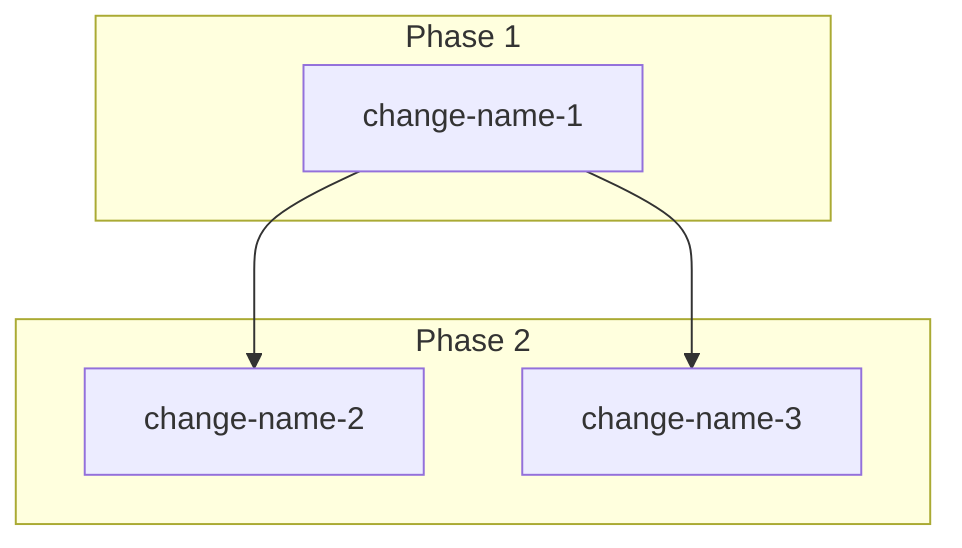

# aisee:change-plan — Output Template

输出必须保存到 `aisee/docs/change-plan/`，并向用户返回保存路径和 `/opsx:new` 命令。

## 输出顺序

1. 摘要
2. Mermaid 依赖图
3. Change 详情
4. 全部命令
5. 整体理由

如果任何 change 的 schema 选择仍处于低置信度竞争状态，不输出正常 change plan，改为输出 `Schema Selection Blocker` 报告并停止在 planning。

## 摘要

```text
N 个 changes · M 个 phases · 预计总计 X 周 · Y 个可并行
```

任何估计为 XL（>14 天）的 change 都要标记风险。

## Mermaid 依赖图

依赖顺序和并行关系统一使用 Mermaid 语法块表达：



规则：

- 节点标签使用 change 名称。
- phase 使用 `subgraph "Phase N"` 标记。
- 并行 change 放在同一个 phase subgraph 中，不额外用表格重复表达。
- 如果只有单个 change，仍保留 Mermaid 语法块，并只画一个节点。
- Phase 编号必须连续，从 `Phase 1` 开始，不得跳号。

## Change 详情模板

```text
─────────────────────────────────────────────────
change N/total

Name:         change-name-kebab-case
Title:        可读标题
Schema:       aisee-app-spec-driven | quick-fix | quick-research | aisee-device-spec-driven | aisee-docsite-driven | infra-change | security-audit | spec-driven | opsx-collab-pr-loop
Complexity:   S | M | L

Description:
  用一句话说明该 change 交付什么。

Schema decision:
  - Selected schema: <selected-schema>
  - Alternative schemas considered:
      - <schema-a> — reject because ...
      - <schema-b> — reject because ... / No credible alternative
  - Confidence: high | medium
  - Decisive signals:
      - 交付意图: ...
      - 契约足迹: ...
      - 上游追踪: ...
      - 风险/不确定性: ...

Schema rationale:
  - 为什么选择该 schema。
  - 为什么不是上面的替代 schema。
  - 如果不是 aisee-app-spec-driven，说明为什么不需要 SRS / UI Content / Architecture 追踪。
  - Required upstream docs: SRS / UI Content / Design Spec / Design Assets / Architecture / Issue / PR / none

In Scope:
  - 具体范围 1 (<scope>:FR-001)
  - 具体范围 2 (<scope>:PAGE-001 / N/A)

Out of Scope:
  - 明确排除事项 1
  - 明确排除事项 2

Source-map seed:
  - If schema does not generate source-map.md: N/A — schema does not generate source-map.md
  - If schema generates source-map.md:
      Intake sources:
        - Type / ref / summary / artifact when no SRS / UI / Architecture doc exists
        - Keep only condensed intake summary; never paste the raw long prompt
      Upstream:
        FR:          <scope>:FR-001, <scope>:FR-002 (or "N/A — no SRS planning doc")
        NFR/RULE:    <scope>:NFR-001, <scope>:RULE-001 (or "N/A — no SRS planning doc")
        PAGE/FLOW:   <scope>:PAGE-001, <scope>:FLOW-001 (or "N/A")
        DESIGN:      Design Spec / Design Assets / dev-visual-brief refs (or "N/A")
        ARCH/DEC:    <scope>:ARCH-001, <scope>:DEC-001 (or "N/A")
        CONSTRAINT:  <scope>:CONSTRAINT-001 (or "N/A")
        RISK:        <scope>:RISK-001 (or "N/A")
      Change impact:
        Existing / Changed / New / Deprecated / Unknown objects and N/A reasons
      APP schema fields:
        SPEC: TBD in change-author
        API:  TBD in service-contract
        DATA: TBD in data-model
        TASK: TBD in tasks
        TEST: TBD in tasks / verification evidence
      DEVICE schema fields:
        HW:  expected HW IDs or "TBD in hardware-contract"
        FW:  expected FW IDs or "TBD in firmware-contract"
        RT:  expected RT IDs or "TBD in runtime-contract"
        VER: expected VER IDs or "TBD in verification-contract"
      Artifact applicability:
        - change-context.md: yes/no — 原因
        - ui-contract.md: yes/no — 原因
        - data-model.md: yes/no — 原因
        - service-contract.md: yes/no — 原因
        - hardware-contract.md: yes/no — 原因
        - firmware-contract.md: yes/no — 原因
        - runtime-contract.md: yes/no — 原因
        - verification-contract.md: yes/no — 原因

Depends on:    change-name（或 none）
Parallel with: change-name, change-name（或 none）

Change rationale:
  说明为什么这是自然边界，以及它为什么可以独立交付。

Schema availability:
  - Installed in project: yes/no
  - Plugin source visible: yes/no
  - If not installed: transfer to aisee-schema-pack and stop before authoring/execution

Metadata gate:
  - /opsx:new must use: /opsx:new "change-name-kebab-case" --schema <selected-schema>
  - 后续 author / implementation 只读取 change metadata 中固化的 schema，不根据 artifacts 猜测或重选

Command:
  /opsx:new "change-name-kebab-case" --schema <selected-schema>
─────────────────────────────────────────────────
```

## Schema Selection Blocker 模板

当 schema 仍有决定性歧义时，输出以下阻断报告，替代正常 change plan：

```text
[SCHEMA-SELECTION-BLOCKED]
Change: <candidate-change-name-or-scope>
Why blocked:
  - 说明为什么当前事实不足以稳定选择 schema。
Candidate schemas still in contention:
  - <schema-a> — why plausible
  - <schema-b> — why plausible
Decisive question:
  - 只问 1 个能改变 schema 选择的问题；若用户未答，停止，不输出 /opsx:new
Impact:
  - 说明如果误选 schema，会导致哪些错误 artifact 或错误流程
```

规则：

- 出现 `[SCHEMA-SELECTION-BLOCKED]` 时，不输出 `全部命令`。
- 出现 `[SCHEMA-SELECTION-BLOCKED]` 时，不提示进入 `aisee:change-author`。
- 不要一边声明 blocked，一边继续给可执行 `/opsx:new` 命令。

## 全部命令

```bash
# Phase 1
/opsx:new "change-name-1" --schema <selected-schema>

# Phase 2 — 可并行运行
/opsx:new "change-name-2" --schema <selected-schema>
/opsx:new "change-name-3" --schema <selected-schema>
```

## 整体理由

用 2-4 句话说明：

- 为什么选择这些边界。
- 主要顺序约束是什么。
- 需求中最不确定的部分是什么。
- Phase 2 中记录的 `[ASSUMPTION]`。

Assumption 格式：

```text
[ASSUMPTION] {假设内容} — 影响 {change 列表} — 开始实现前请确认。
```

## 输出前自检

生成最终文本前，逐项检查：

- 摘要中的 `{N}` 必须等于 change 详情块数量。
- 摘要中的 `{M}` 必须等于 Mermaid 图中的 phase 数量。
- `全部命令` 中的 `/opsx:new` 数量必须等于 change 数量。
- Mermaid 图中的每个 change 都必须有对应详情块和对应命令。
- 每个 change 都必须有 `Schema decision`，且至少写出 1 个被拒绝的替代 schema；若没有可信替代，明确写 `No credible alternative`。
- `Schema decision` 中的 `Confidence` 只允许 `high` 或 `medium`；若只能给 `low`，必须改为 `[SCHEMA-SELECTION-BLOCKED]`。
- 选择 `quick-fix` 时，不得同时要求完整 app/device source-map 字段或 Required=yes 的 app 契约 artifacts。
- 选择 `quick-research` 时，不得输出生产实现任务、上线步骤或生产代码承诺。
- 选择 `aisee-device-spec-driven` 时，不得输出以 Web/API/DB 为主体的 source-map seed。
- 每个 change 的 `Metadata gate` 都必须同时包含：
  - `/opsx:new must use: /opsx:new "<change>" --schema <selected-schema>`
  - `后续 author / implementation 只读取 change metadata 中固化的 schema，不根据 artifacts 猜测或重选`
- 若正文声明存在 `Phase 2` 及以后阶段，Mermaid 图与 `全部命令` 分段都必须一致出现。

## 保存输出

保存到：

```text
aisee/docs/change-plan/<YYYY-MM-DD>-<requirement-slug>.md
```

保存后输出：

```text
Change plan 已保存：aisee/docs/change-plan/{filename}.md
{N} 个 changes · {M} 个 phases · {Y} 个可并行
```

然后提示先运行 Phase 1 的 `/opsx:new` 命令，再使用 `aisee:change-author`（必要时配合 `/opsx:continue`）按 schema 补齐 artifacts。
